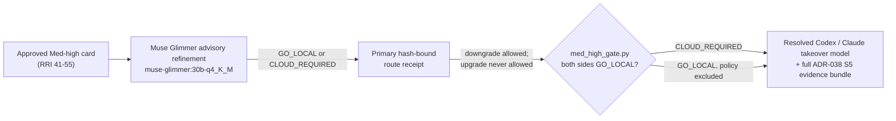
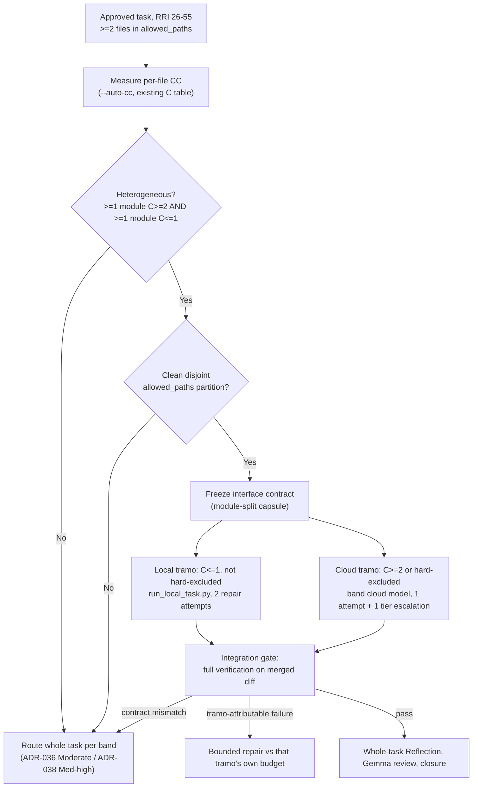

# AGENTS.md

## Purpose

This file defines the default task-presentation contract for agents working in the `dubbridge` repository.

It works together with the canonical agent guides that govern implementation in
this repository. Read them before executing work:

- `README_AGENT_ORDER.md` — orientation and reading order for agents.
- `docs/playbooks/AGENT_WORKFLOW_GUIDE.md` — the mandatory plan → tasks → approval →
  implement workflow.
- `docs/policies/HITL_AUTONOMY_POLICY.md` — human-in-the-loop approval rules.
- `docs/adr/` — architecture decisions that constrain implementation.
- `docs/plan/roadmap.md` — the general plan: slice sequence, dependencies, and where
  each slice/task sits.

For workflow topics, `docs/playbooks/AGENT_WORKFLOW_GUIDE.md` is authoritative.
`CLAUDE.md` (project and the user's global) remains authoritative only for
topics not overridden there.

## Task Presentation Rule

When a user asks an agent to execute a staged task or a task from a task file, the agent must present the next task before execution when the active workflow requires approval.

The presentation must be concise but operationally complete.

Before presenting or executing any staged task, the agent must verify the
current requirements in `docs/playbooks/AGENT_WORKFLOW_GUIDE.md`. This file is a
presentation contract summary, not a replacement for the workflow guide.
Task-type-specific requirements defined there are mandatory even when they are
not restated verbatim below.

When answering questions about development-task completion or before marking a
development task done, the agent must explicitly determine whether the task is
exempt (docs-only, config-only, migration-only, planning, ADR, task-ledger, or
policy-only) or whether the workflow requires the band-resolved independent
review before citing unit coverage certification or owner final verification.

## Required Task Presentation Format

For RRI 26+ approval presentations, use the six-block **Compact Approval Task
Card v2** defined by `docs/playbooks/AGENT_WORKFLOW_GUIDE.md` and instantiated at
`docs/templates/compact-approval-task-card.md`:

1. `Decision header` — task identity/status, RRI/band, Effort, approval gate,
   Codex/Claude recommendations, resolved primary implementation route, cloud
   takeover trigger/model, penalties, dominant RRI drivers, and link to the
   full RRI evidence.
2. `Scope and acceptance` — objective, in scope, out of scope, primary `HP-#` /
   `EC-#` behaviors for development tasks, evidence, and status sync.
3. `Agent workflow` — the resolved orchestrator, phase-1 reviewer, human gate,
   implementer, Reflection/verifier, phase-2 reviewer, and closure owner. State
   each responsibility, gate, and fallback.
4. `Diagrams` — one agent-workflow diagram; development tasks add one technical
   scope diagram. Never exceed two diagrams.
5. `References` — task, plan, and only materially governing documents.
6. `Approval checkpoint` — required wording or explicit bounded user waiver.

Do not copy the full task definition or RRI variable table into the approval
card. Those remain in the linked task ledger/RRI artifact. RRI 0–25 tasks still
skip the full approval card under the Low-band route.

`Evidence to emit` and `Status artifacts to sync` remain part of the execution
contract; summarize them in the card and keep their full paths in the task ledger.

## Live per-task todo list (Claude Code and Codex)

Block 3 (`Agent workflow`) is a frozen snapshot taken at presentation time.
Every orchestrator — Claude Code and Codex alike — must additionally keep a
**live, per-task todo/checklist** that mirrors block 3's rows and stays
current as the task actually moves through phases: seed it before
implementation starts, keep normally one entry `in_progress` at a time, flip
an entry to `completed` only once that phase's own gate has passed, and keep
a `BLOCKED` or escalated entry visible (never silently dropped) until it is
resolved, user-waived, or reported blocked. If a phase reroutes mid-task
(local implementer escalates to cloud, a reviewer falls back down its chain),
update that entry's named responsible agent/model to the actual participant.

Use whichever native mechanism the orchestrator has — Claude Code's
`TodoWrite` tool, Codex's own plan/task tracking — as long as it renders an
equivalent visible list naming the resolved responsible agent per phase, not
a generic role label. This list is a transparency/tracking artifact, not an
approval or review gate: an entry marked `completed` still requires that
phase's own evidence to exist. RRI 0–25 and docs/config/migration/ADR/plan/
task-ledger/policy-only tasks use the reduced phase set defined in
`docs/playbooks/AGENT_WORKFLOW_GUIDE.md § Live per-task phase todo list`,
which is authoritative for the full contract.

For any task that will invoke an Ollama-backed local role, prepend the explicit
`Restart Ollama + local-stack precheck — <resolved orchestrator>` item before
the first local-model call. This restart is mandatory once per task even when
the server is healthy; retries and later local phases of the same task reuse the
restarted server unless it becomes unavailable or wedged. The authoritative
sequence and task-boundary rules are in
`docs/playbooks/AGENT_WORKFLOW_GUIDE.md § Mandatory workflow before
implementing`, Step 0.

## Complexity And Model Guidance

**When RRI has been computed**, the `Complexity` field in the task presentation must
use the RRI band name — not the Effort-based mapping below:

| RRI range | Complexity to present |
|---|---|
| 0–25 | Low |
| 26–40 | Moderate |
| 41–55 | Med-high |
| 56–70 | Complex |

The Effort → Complexity mapping is a **fallback** used only when no RRI is available:

- `Effort: S` -> `Complexity: Low`
- `Effort: M` -> `Complexity: Medium`
- `Effort: L` -> `Complexity: High`

Codex cloud-takeover defaults and Claude Code capability resolution both
resolve via the dated tables in `docs/playbooks/AGENT_WORKFLOW_GUIDE.md`
(§ "Current Codex cloud-takeover resolution" and § "Current Claude Code
capability resolution") — this file does not carry its own copy of the
concrete model names, so there is exactly one place to re-verify against
official vendor guidance at task-presentation time. Task-local model pins
override those defaults until explicitly updated.

Escalation guidance summary: use `claude-opus-5` only when the task is
long-context heavy, synthesis-heavy, or repeatedly stalls under
`claude-sonnet-5`; if a task is primarily code editing, repo navigation,
shell execution, or deterministic implementation work, keep the band's
default model.

If a task file already defines explicit complexity or model guidance, that task-local guidance overrides this file.

## Human-selected fallback checkpoint

Before any terminal local fallback can invoke D14 or a cloud implementer, emit the
ADR-039 `fallback-selection-v1` artifact bound to the exact fallback packet.
`human-select` is the default: without a complete human model, reasoning-effort,
and selector choice, stop as `awaiting_fallback_selection`. `preauthorized` is
allowed only when those exact fields were frozen in the approved task card or
preflight; validate the receipt against the current packet, then use exactly its
selected model and effort. This bounded checkpoint neither waives HITL nor changes
RRI, reviewer independence, D14's read-only Balanced role, repair budgets, or task
scope. See ADR-039 and `docs/playbooks/AGENT_WORKFLOW_GUIDE.md` for the full
protocol.

## Pseudocode Rule

Include pseudocode only when at least one is true:

- the task has branching logic
- the task transforms data across multiple stages
- the task defines a reusable workflow that benefits from an execution sketch
- the implementation risk is easier to evaluate through a structured outline

Do not add pseudocode for trivial file creation, simple edits, or direct command execution.

## Diagram Rule

Every approval card includes a compact agent-workflow Mermaid diagram. For
development tasks, also include a technical-scope diagram showing the relevant
flow, boundary, dependency direction, state transition, or ownership split.

For non-development tasks, add no second diagram unless at least one is true:

- the task changes architecture boundaries
- the task spans multiple services, crates, workers or repositories
- the task introduces a pipeline, state machine or dependency flow
- the task is easier to approve when shown as a compact technical flow

Never exceed two diagrams. Simple documentation-only tasks normally use only the
agent-workflow diagram.

## Related Documents Rule

The agent must list only the documents that materially constrain the task. Avoid dumping broad reading lists when only a few files are directly relevant.

Priority order:

1. task file
2. linked plan
3. workflow/policy files
4. ADRs
5. prompt files
6. configs/templates

For mobile UI / presentation tasks under `mobile/`, include root `DESIGN.md` in
`Related documents` when it materially constrains the visual work. Treat it as the
mobile design-intent contract, while plan/task files remain authoritative for
behavior, acceptance criteria, and verification.

## Approval Boundary

If the current workflow says the agent must wait for approval before executing a task, the presentation must end with a direct approval checkpoint.

Recommended wording:

`Execution has not started. Approve this task to proceed.`

If no approval is required under the active workflow, the agent may continue under
the gate defined by `docs/playbooks/AGENT_WORKFLOW_GUIDE.md` and
`docs/policies/RRI_POLICY.md`.

Under the canonical RRI mapping in `docs/playbooks/AGENT_WORKFLOW_GUIDE.md` and
`docs/policies/RRI_POLICY.md`, `Effort: S` normally corresponds to the **RRI 0–25**
Low band. Those tasks skip the full approval presentation; use bounded local
Qwen Developer delegation through Ollama only for eligible simple code patches, and
otherwise handle them directly as the primary agent while still following the
low-band gate.

## Band-routed peer review report lines

Every task card must include a phase-1 line, and every development closure report
must include a phase-2 line. The reviewer token is resolved by RRI band at report
time. Docs-only, config-only, migration-only, ADR, plan, task-ledger, and
policy-only tasks record `n/a` with the exemption stated for phase 2.

```
Task-analysis review: <gemma|muse-glimmer|codex|claude|d14> <artifact path> - <PASS|BLOCKED>
Code-solution review: <gemma|muse-glimmer|codex|claude|d14> <artifact path> - <PASS|BLOCKED>
```

- `muse-glimmer` — primary reviewer for RRI 0–25; intermediate fallback for RRI 26–55.
- `gemma` — primary reviewer for RRI 26–55; intermediate fallback for RRI 0–25.
- `codex | claude` — RRI 56+, resolved from caller identity
  (`claude-code → codex`, `codex → claude`, others → `claude`).
- `d14` — final fallback when the preceding reviewer chain is unusable.
- `BLOCKED` — non-pass verdict or the band's full reviewer/fallback chain is
  unavailable. Stops presentation (phase 1) or closure (phase 2) until revised,
  user-waived, or reported blocked.

See `docs/playbooks/AGENT_WORKFLOW_GUIDE.md § Band-routed peer review` for the
full contract.

For every band, D14 must first use a responsive provider different from the
primary orchestrator's provider. Same-provider D14 is allowed only as a
recorded degraded fallback after the cross-provider attempt is unusable; see
the authoritative guide's `Context-isolated adjudicator (D14)` section.

## Development Closure Rule

For development-task closure, do not describe certification, final verification,
or status flips as the first completion step. First determine whether the task
must pass the mandatory code-solution review gate resolved by the canonical RRI
band table under `docs/playbooks/AGENT_WORKFLOW_GUIDE.md`
and `docs/policies/HITL_AUTONOMY_POLICY.md`, then describe the remaining closure
blocks in order.

## Language

Agent-facing repository instructions must be written in English.

User-facing presentation may be adapted to the user's language, but task metadata, filenames and model identifiers should remain exact.
---
type: Playbook
title: "Agent Workflow Guide"
governs: "all agent-facing workflow decisions in the repository"
---

# Agent Workflow Guide

> **Status:** Authoritative. This guide is the highest-authority source for **all**
> agent-facing decisions: workflow, process, implementation discipline, task
> presentation structure, model selection, complexity scoring, testing rules, commit
> rules, handoff format, ADR propagation, and language policy.
> It overrides `CLAUDE.md` (project and global) and `AGENTS.md` without exception.
> `CLAUDE.md` applies only for topics not covered here.

> **Directives only.** This guide states the rules in force. Superseded
> bindings, retired overrides, and the dated lineage behind a rule are
> recorded in `docs/audit/agent-workflow-binding-history.md` and the relevant
> ADRs — never here.

## Local-model role bindings

| Role | Binding |
|---|---|
| Local implementer, RRI 0–40 | `qwen3.8:27b-mlx` |
| RRI 0–25 reviewer chain (phases 1 and 2) | `muse-glimmer:30b-q4_K_M` → `gemma4:26b-a4b-it-qat` → D14 |
| RRI 26–55 reviewer chain (phases 1 and 2) | `gemma4:26b-a4b-it-qat` → `muse-glimmer:30b-q4_K_M` → D14 |
| Local Architect / Complex Analyst | `muse-glimmer:30b-q4_K_M` — advisory-only (ADR-037), never a phase-1/phase-2 reviewer in any band |

RRI 41–55, Complex, and XL are cloud-only for implementation: the ADR-038
refinement and receipt run as routing evidence, but a `GO_LOCAL` result never
starts a local developer.

## Mandatory workflow before implementing

0. **Per-task Ollama restart and local-stack precheck** — before the first
   Ollama-backed action of every task that will invoke a local model, restart
   Ollama even when the current server appears healthy, then verify that the
   local stack and the models the task will actually invoke respond correctly
   under production
   generation parameters (`think=false` where applicable, the repo's default
   `num_predict`/`num_ctx` from `gemma_local.py`). A silent `done_reason:
   "length"` with empty `content` (thinking-mode exhausting the token budget
   before any visible output) is a known failure mode. Empty `content` with any
   terminal reason is also a possible local-memory or context-capacity failure;
   it must enter the resource-recovery protocol below rather than be retried
   unchanged. Catching either condition here avoids discovering it mid-review,
   where it forces an avoidable hop down the band's reviewer chain that a
   healthy stack would not have needed.
   - Treat the repository task ID as the restart boundary: perform exactly one
     mandatory restart before that task's first local-model call. Retries,
     repair attempts, and later local phases within the same task reuse the
     restarted server unless it becomes unavailable or wedged. A new task ID
     requires a new restart.
   - Before restarting, confirm that no local-model runner for another task is
     still active. If one is active, wait for its bounded run to finish or stop
     it under that task's own timeout/termination contract; never kill an
     unrelated in-flight task merely to satisfy this bootstrap step.
   - Record the current `ollama serve` PID, terminate that server process
     (`kill <pid>`; the macOS app relaunches it), and wait for the old listener
     to disappear. Then confirm both a new server PID and a listening endpoint
     with `pgrep -fl ollama` and `lsof -iTCP:11434 -sTCP:LISTEN`. A surviving
     old PID, absent replacement PID, or missing listener leaves the restart
     item blocked; do not issue the task's first local-model request.
   - Warm and re-test each model this task's band will use — at minimum both
     local models in the band's reviewer chain (§ Band-routed peer review),
     plus for RRI 26–55 the implementer binding `qwen3.8:27b-mlx` and, for
     Med-high ADR-038 routes, the Local Architect binding
     `muse-glimmer:30b-q4_K_M` — with a review-style prompt at production
     `num_predict`/`num_ctx`, e.g.:
     ```bash
     curl -s http://127.0.0.1:11434/api/chat -d '{
       "model": "<model>",
       "messages": [{"role": "user", "content": "You are a code reviewer. Reply with ONLY a JSON object: {\"verdict\": \"PASS\", \"findings\": []}"}],
       "stream": false,
       "think": false,
       "options": {"num_predict": 4096, "num_ctx": <role production context>}
     }' -m 180
     ```
     Use the role's effective production context: `65536` for the Low/S
     Qwen Developer delegation wrapper, `65536` for the Moderate/M local-agent
     runner, and the configured reviewer context for review roles. Confirm
     `done_reason: "stop"` with non-empty `content`. A `"length"`
     result with empty content on a small ping (e.g. `num_predict: 16`) is
     usually just an undersized budget, not the real failure — retry at the
     production `num_predict` before concluding the model is unhealthy.
   - **Local resource-recovery protocol** — when an otherwise valid Ollama
     response has empty `content`, do **not** repeat the same request with the
     same or larger model/context budget. Treat it as a capacity symptom until
     disproved. In this exact order:
     1. unload the affected model (`ollama stop <model>`); inspect
        `GET /api/ps`, `pgrep -fl ollama`, and host memory pressure (on macOS,
        `memory_pressure` or `vm_stat`) so the observation is recorded;
     2. set `think=false`, `temperature=0`, `num_ctx` at or below `16384`, and
        `num_predict` to `512`–`1024`; then issue one bounded JSON-only probe;
     3. if that probe is usable, rebuild the actual review/delegation packet so
        it fits the reduced context (split source excerpts or the task when
        necessary) and make one bounded retry using that profile; and
     4. if the reduced retry is still empty or invalid, unload it and proceed to
        the band's normal reviewer/fallback route. Do not burn additional
        retries on the same high-memory profile.

     A smaller local model may be used only for a separate local D14 review
     after the normal chain has failed and the ADR-039 fallback-selection
     receipt authorizes that exact model, effort, and same-provider-degraded
     route. It is not a silent substitute for the band-resolved reviewer.
     Record the model, `num_ctx`, `num_predict`, `think`, terminal reason,
     content length, loaded-model state, and the recovery decision in the
     precheck or review artifact. A reduced-profile success does not certify
     the original high-memory production profile as healthy.
   - Track this operation as `Restart Ollama + local-stack precheck —
     <orchestrator>` in the live per-task checklist. It is an operational
     prerequisite, not a review or approval gate, and completes only after the
     PID/listener checks and required model warm-ups pass.
   - This restart/precheck is infrastructure verification, not a
   review gate: it does not replace, skip, or pre-decide the Band-routed
     peer review outcome for this task, and a healthy precheck does not
     retroactively change a prior phase's recorded result (e.g. a historical
     D14 fallback stays as recorded even if a later precheck shows the
     primary chain healthy again).
   - Applies to any task type that will invoke an Ollama-backed local role,
     including implementation, phase-1/phase-2 review, Local Architect,
     Antares, or push-review work. Skip it only when the task will make no
     local-model call; docs-only, config-only, migration-only, ADR, plan,
     task-ledger, and policy-only tasks normally fall into that exemption.
1. **Analyze** — read context, dependencies, and affected files.
   - For **mobile UI / presentation tasks** under `mobile/`, also read the root
     `DESIGN.md` before planning or implementation. `DESIGN.md` governs visual
     intent and component-usage expectations for the mobile surface. It does not
     replace task files, runtime tokens in `mobile/src/theme/tokens.ts`, or the
     workflow authority of this guide.
   - **Antares refinement touchpoint** — for any RRI 26+ development task that
     carries a task-relevant CWE hypothesis already on the T3a watchlist
     (`scripts/antares/cwe_watchlist.py`), invoke Antares against the existing
     baseline snapshot before implementation starts (see § Antares
     Security-Specialist Advisor below). If no such CWE hypothesis exists,
     record a typed skip instead — never invoke Antares as a generic sweep.
     Does not apply to docs-only, config-only, migration-only, ADR, plan,
     task-ledger, or policy-only tasks. This step is strictly advisory: it
     never gates or delays approval, the band-routed reviewer, or RRI
     computation.
2. **Plan** — create `docs/plan/<plan-name>.md` with: objective, affected files,
   design decisions, and module dependencies.
3. **Tasks** — create `docs/tasks/<tasks-name>.md` with: an ordered task list,
   inter-task dependencies, acceptance criteria per task, an **Effort** field
   (S/M/L/XL), a short agent handoff prompt, and for each development task a
   small behavioral example set covering both:
   - at least one **happy path example** with a stable `HP-#` ID — a concrete
     success flow the task must implement or preserve;
   - at least one **edge case example** with a stable `EC-#` ID — a concrete
     boundary, invalid-input, or failure flow the task must handle or reject.
   - when a task can produce benchmark/evaluation/review evidence, metrics, or
     a blocker/promotion-state change, the task definition must also name:
     - **Evidence to emit** — the concrete artifacts expected during execution
       (for example transcripts, screenshots, audit rows, benchmark outputs,
       review packets, or report sections);
     - **Status artifacts affected** — the exact ledgers, plans, reports, ADR
       indexes, or downstream blocker docs that must be synchronized before the
       task can be reported complete.
4. **Gate by RRI** — compute RRI with `scripts/rri.py`, then apply the band's
   approval gate and implementation route:
   - **0–25 Low** — skip the full human approval presentation. Use local Qwen
     Developer delegation through Ollama only for eligible simple code
     patches; otherwise execute directly as the primary agent.
   - **26–40 Moderate** — show the plan and tasks, wait for explicit approval,
     then implement local-first via `scripts/local-agent/run_local_task.py` in
     a disposable worktree (`DUBBRIDGE_LOCAL_AGENT_MODEL`, default
     `qwen3.8:27b-mlx`), at most 2 evidence-backed local repair attempts before
     escalating to the cloud-takeover model resolved in Step 2.
   - **41–55 Med-high** — show the plan and tasks, wait for explicit approval,
     then route through the **ADR-038 Architect-refined single-attempt gate**:
     Muse Glimmer advisory refinement (`GO_LOCAL` | `CLOUD_REQUIRED`) → primary
     hash-bound route receipt (may downgrade, never upgrade) → every result,
     including `GO_LOCAL`, produces the concrete Codex/Claude cloud-takeover
     packet from Step 2 with the full evidence bundle.
   - **56+** — show the plan and tasks and wait for explicit approval before
     starting implementation, even if a plan was approved in a prior session;
     implementation stays on the cloud path (Premium tier) and decomposition
     remains mandatory before implementation.

   Full routing contract and diagrams: § Local-first and Architect-refined
   implementation routing (RRI 26–55). In every band the primary agent stays
   orchestrator of record, and the human approval gate, band-resolved
   independent review, and Reflection pass count are fixed by the band — never
   by where the code was authored.
5. **Implement** — one task at a time, in the defined order.
6. **Mark progress** — update the tasks document after each completed task (it is
   the crash-safe progress ledger).
7. **Sync status artifacts before reporting completion** — before telling the user
   a task is done, update every materially affected status document in the same
   workflow pass. Completion is not valid until those documents are consistent.

## Task definition requirements

- For development tasks, the `docs/tasks/*.md` entry is not complete unless it
  includes explicit examples for both the intended happy path and the relevant
  edge cases.
- These examples do not need to be long. One or two bullets per category is
  enough if they are concrete and testable.
- Every development-task example must have a stable case ID:
  - happy path examples use `HP-1`, `HP-2`, etc.;
  - edge case examples use `EC-1`, `EC-2`, etc.
- Write the examples in behavioral terms, not implementation terms. Prefer
  statements such as `HP-1: valid ingest token + owned blob -> artifact finalized`
  over `call finalize_ingestion()`.
- The pre-task sections `Happy paths considered` and `Edge cases considered`
  should be derived from these task-definition examples, then refined if new
  constraints are discovered during analysis.
- Skip this requirement for docs-only, config-only, migration-only, or planning
  tasks unless the task's main risk is behavioral correctness.
- When a task can produce metrics, benchmark outputs, evaluation evidence, or a
  blocker/promotion-state change, its task definition is not complete unless it
  also names:
  - **Evidence to emit** — the concrete artifacts the task is expected to
    create while it runs; and
  - **Status artifacts affected** — the exact status-bearing docs that must be
    updated in the same workflow pass.
- Treat these as execution-time outputs, not as optional closure notes. If they
  are known at planning time, they belong in the task definition up front.
- A task ledger can opt into automated enforcement by declaring
  `Behavioral coverage contract: unit-v1`. For ledgers with that marker, `make
  qa-docs` rejects completed development tasks whose `HP-#` / `EC-#` cases are not
  certified with unit test evidence. Legacy completed tasks without the marker are
  grandfathered until they are migrated into the contract.

## Per-task discipline

- **Phase 1 — Task-analysis review** (before presenting or delegating any task):
  run the reviewer resolved by the canonical `Band-routed peer review` table on
  the task card/plan. Record the phase-1 report line with the actual reviewer,
  artifact, and verdict. Do not maintain a second band mapping here.
  A `BLOCKED` verdict stops presentation or delegation until revised, explicitly
  waived by the user, or reported as blocked. Docs-only, config-only,
  migration-only, ADR, plan, task-ledger, and policy-only tasks are exempt from
  phase 1 and record `n/a` with the exemption stated.
- **Every local-developer delegation packet requires its own phase-1 pass
  before it is sent — not only the task as a whole.** A phase-1 `PASS`
  obtained on an earlier version of the packet does not carry forward to a
  materially revised packet (a corrected interface contract, a fixed
  constraint, a re-scoped acceptance criterion, etc.). Any packet the
  orchestrator changes before a repair/re-delegation attempt must go back
  through the band's phase-1 reviewer and receive its own `PASS` (or a
  recorded, resolved `BLOCKED`) before it is sent to the local developer
  (`qwen3.8:27b-mlx` or the band's equivalent). This applies within a single
  task's repair-attempt budget, not only across separate tasks — a second or
  later delegation attempt is a new phase-1 event, and its own artifact and
  verdict must be recorded distinctly from the first attempt's (do not
  overwrite or merge them). If the reviewer flags something in the revised
  packet that the orchestrator believes is incorrect, verify the claim
  directly (a reproducible test, not assertion) before accepting or
  overriding it, and record both the original verdict and the resolution —
  see the worked example in `docs/tasks/s-230-poc-v1-digitalocean.md`
  § S-230-T4a for the full pattern (a `declare -A` bash-3.2 incompatibility
  triggered a revised packet, whose own phase-1 re-review then flagged and
  the orchestrator disproved a second, unrelated claim before re-delegating).
- Present the next task using the `AGENTS.md` presentation contract before executing
  it when approval is required. For RRI 0–25, do not present the full task for
  approval. If the task is an eligible simple code patch, prepare a local
  delegation packet for Gemma and report after review and verification; otherwise
  execute directly and report normally.
- Before implementation starts, derive an explicit execution-time documentation set
  from the task definition: what evidence/metrics must be emitted and which status
  artifacts must be synchronized. For tasks that affect benchmarks, reports, audit
  trails, blockers, or promotion state, that set is part of the task's working
  surface from the start, not a post-hoc cleanup list.
- **Pre-task summary for development tasks:** the compact card's `Scope and
  acceptance` block must name the primary `HP-#` and `EC-#` behaviors, and its
  workflow table must name the required Reflection pass count and pass focuses
  for RRI 26+. A compact technical-scope Mermaid diagram is mandatory. These
  items do not require separate prose sections in the approval card; their full
  definitions remain in the linked task ledger. Skip development-only content
  for docs-only, config, migration-only, or planning tasks unless requested.
- After each task: verify the relevant tests/checks, update the status docs,
  document deviations or evidence, and state unresolved risks or blockers.
- When a task's evidence or metrics become available mid-execution, update the
  named report/ledger artifacts in the same workflow pass instead of deferring
  them until an end-of-task memory sweep. A task that changes the measured state
  of the project should update that measured state as part of the task itself.
- Treat status-document synchronization as part of the task itself, not follow-up
  cleanup. Do not report a task complete while any governing status document still
  shows stale state.
- When a task completion changes the status of a slice, dependency, ADR, or blocked
  downstream task, update all materially affected status documents in the same
  workflow before reporting completion. This includes, as applicable:
  `docs/tasks/*`, `docs/plan/roadmap.md`, linked slice plans, dependent task files,
  and ADR status/implementation references.
- At minimum, check whether the completed task changes any of:
  `docs/tasks/*`, `docs/plan/roadmap.md`, the linked `docs/plan/*` slice file,
  dependent task ledgers, ADR status/implementation references, and any handoff
  prompt or blocking-gate language that names the completed work.
- When an ADR is created, amended, or deleted as part of a task, apply the
  **ADR change propagation** contract below in the same workflow pass.
- Work on the approved or delegated task only; show a summary before switching to
  the next.
- **Post-task summary for development tasks:** when the completed task involves writing
  or modifying code, the summary must include two explicit sections:
  - **Happy paths covered** — the primary success flows exercised by the implementation
    and tests (e.g., "valid command → session created in Requested state").
  - **Edge cases covered** — the boundary and failure conditions explicitly handled in
    logic and tests (e.g., "None credential_ref → MissingCredentialRef before any IO").
  For both sections, include **code evidence**: point to the concrete files,
  functions, and tests that prove the claimed coverage, using file references and
  concise explanations of what each reference demonstrates.
  This section is required only for development tasks. Skip it for docs-only,
  config, migration-only, or planning tasks.
- **Unit coverage certification for development tasks:** before marking a
  development task `[x] Done`, add a `Unit coverage certification` section that
  maps every approved `HP-#` and `EC-#` case to at least one unit test reference in
  the form `` `path/to/file.rs::test_name` ``. The referenced test must replicate
  the behavior described by that case and the recorded result must be `passed`.
  `N/A` is not allowed for development-task happy paths or edge cases. If a case
  cannot be unit-tested, refactor the implementation until it can be unit-tested
  or revise the task definition before closure.
- The same completion record must include `Owner final verification` with owner,
  date, verification statement, and exact commands run. The owner is responsible
  for certifying that each referenced unit test genuinely covers the claimed
  behavior; the automated gate verifies the structure and referenced test
  existence.

Required completion format for development tasks:

```md
### Unit coverage certification

| Case ID | Type | Behavior | Unit test evidence | Result |
|---|---|---|---|---|
| HP-1 | Happy path | valid input creates session | `apps/gateway/src/auth/login.rs::valid_login_creates_session` | passed |
| EC-1 | Edge case | unknown state fails closed | `apps/gateway/src/auth/login.rs::unknown_state_returns_unauthorized` | passed |

### Owner final verification

- Owner: `<name-or-handle>`
- Date: `YYYY-MM-DD`
- Statement: I verified every happy path and edge case defined for this task has unit test evidence that replicates the expected behavior.
- Commands run: `<exact test commands>`
```

## Live per-task phase todo list

Every orchestrator (Claude Code, Codex, or any other primary agent acting as
orchestrator of record) must keep a **live, per-task todo/checklist** that
mirrors the Compact Approval Task Card's `Agent workflow` block (block 3) and
stays current as the task actually moves through phases. Block 3 is a frozen
snapshot taken at presentation time; this checklist is the running tracker
during execution — it is not satisfied by showing the card once and moving on.

**Mechanism (tool-agnostic).** Use whichever native checklist/plan mechanism
the orchestrator has — Claude Code uses its `TodoWrite` tool; Codex uses its
own plan/task-tracking mechanism. Both must render an equivalent visible list:
one entry per applicable phase, each entry naming the **resolved responsible
agent/model** for that phase (not a generic role label such as "reviewer"),
and a status of `pending`, `in_progress`, `blocked`, or `completed`.

**Phase set by band:**

- **Any task invoking an Ollama-backed local role:** prepend `Restart Ollama +
  local-stack precheck — <resolved orchestrator>` to the applicable phase set.
  Seed this entry immediately before the task's first local-model invocation,
  even when that invocation is the phase-1 reviewer and therefore precedes the
  approval card. Add the remaining phase entries when their route is resolved.
  This operational entry does not add a human gate or replace any review phase.

- **RRI 26+ (Moderate through Complex+):** one entry per row of the approval
  card's `Agent workflow` table — Analyze/scope, Phase 1 review, Approval,
  Implement, Reflect and verify, Phase 2 review, Close.
- **RRI 0–25 (Low):** a reduced list matching the phases that actually apply —
  e.g. Analyze, Gemma/D14 review, Implement (primary agent or Gemma
  Developer), Close.
- **Docs-only, config-only, migration-only, ADR, plan, task-ledger, or
  policy-only tasks:** a minimal list (1–3 entries) is sufficient; a
  genuinely single-step task may skip the list entirely, matching the
  existing phase-1-review and Reflection exemptions for this task class.

**Update discipline:**

- Seed the list before implementation starts — immediately after the task is
  presented and approved (RRI 26+), or immediately before direct execution
  (RRI 0–25). For a task whose first local-model call occurs earlier, seed the
  mandatory Ollama restart/precheck entry before that call as specified above.
- Normally exactly one phase entry is `in_progress` at a time.
- Flip an entry to `completed` only when that phase's own gate has actually
  passed (for example, do not mark "Phase 1 review" `completed` before the
  reviewer's verdict is `PASS`).
- A `BLOCKED` review verdict, a failed acceptance run, or an escalation keeps
  the corresponding entry `blocked` — never silently `completed` or dropped —
  until it is resolved, explicitly user-waived, or reported blocked.
- When a task reroutes mid-flight (a local implementer fails and escalates to
  cloud, a Med-high gate resolves `CLOUD_REQUIRED`, a reviewer falls back down
  its chain), update the affected entry's responsible agent/model to the
  actual resolved participant. Do not leave a pre-escalation name in place.

**Authority boundary.** The live todo list is a transparency and tracking
artifact, not a new approval or review gate. It does not replace the HITL
approval checkpoint, the band-routed review chain, the Reflection log, or any
other closure gate defined elsewhere in this guide. An entry marked
`completed` still requires that phase's own evidence (review artifact,
Reflection log, unit coverage certification, owner verification, etc.) — the
checklist records that the step happened, it does not certify that it
happened correctly.

## ADR change propagation

An ADR change that occurs outside a task ledger (e.g. a replan, a hotfix, or a
cross-cutting amendment) is still subject to this contract. Apply the matching row
in the same change — not as a follow-up.

| ADR change | Must review and update in the same change |
|---|---|
| **New ADR** | `docs/adr/README.md` index row; ADR frontmatter block (`type: ADR`, `title:`, `status:`); `docs/architecture.md` if it adds or alters a runtime/crate boundary; `docs/plan/roadmap.md` if it changes slice scope or dependencies; the affected `docs/plan/*` and `docs/tasks/*` files |
| **Status change** (`Proposed` → `Accepted` → `Superseded` / `Deprecated`) | ADR frontmatter `status:` field (must mirror the prose `- **Status:**` token); index `Status` column; every canonical doc (`architecture.md`, `roadmap.md`, plan/tasks) that cites the ADR as authority for a decision |
| **Scope narrowed or broadened** | index scope annotation; `docs/architecture.md`; `docs/plan/roadmap.md`; affected plan/tasks; `README.md` if the change is outward-facing |
| **Content / decision change** (the decision itself, not just status or scope) | every canonical doc whose prose describes that decision — **this is semantic and not machine-verifiable**; Layer 2/3 confirm references still resolve, but human review owns whether the prose is still accurate |
| **Superseded by ADR-YYY** | both ADRs' frontmatter (`status:` / `supersedes:` / `superseded_by:`); both ADRs' prose `Status` field; the index row for each; every doc citing the superseded ADR |
| **Deletion or renumbering** | see the deletion rule below; update the index, every doc citation, **and every code/migration comment** (`.rs`, `.sql`) in the same change |

**Deletion rule.** An `Accepted` ADR is part of the auditable decision record and
must **not be deleted** — mark it `Superseded by ADR-YYY` or `Deprecated` instead.
A `Proposed` ADR that was never adopted may be deleted only after every reference
(docs *and* code/migration comments) is removed in the same change. Renumbering is
a delete + create and must update all references atomically.

**Definition of done for any ADR change:**
- [ ] The ADR file's prose `- **Status:**` line is updated.
- [ ] The ADR file's frontmatter `status:` mirrors the prose token; `supersedes:` /
      `superseded_by:` are set where applicable (frontmatter parity).
- [ ] `docs/adr/README.md` index row matches (status token + title).
- [ ] Every doc in the matching propagation row above has been reviewed and updated
      if its content describes the changed decision.
- [ ] No code or migration comment cites a missing ADR number.
- [ ] `make qa-docs` passes (index parity, completeness, dangling refs in docs and
      code/migrations, superseded-successor existence, OKF frontmatter parity).

### What this contract does and does not guarantee

**Guaranteed by `make qa-docs` (deterministic, Layers 2/3):**
- Every cited ADR file exists.
- Index↔file status tokens agree.
- The index is complete (no file without a row, no row without a file).
- A `Superseded` ADR names an existing successor.
- No code or migration comment cites a missing ADR.

**Not guaranteed (Layer 1 + human review only):**
- That the *prose* of a canonical doc still accurately describes an ADR whose
  decision changed. Referential integrity is automatable; semantic consistency is
  not. The propagation table tells the author *which prose to re-read*; it does not
  prove the update was made correctly.

## Effort scale

| Level | Agent reasoning | Example |
|-------|-----------------|---------|
| S  | Mechanical — transcription, copy, merge | Config files from an explicit spec |
| M  | Moderate — contracts, logic, edge cases | Boundary tests; small services |
| L  | High — multiple subsystems, architecture | Process supervisor with replay tests |
| XL | Very high — RRI-driven reasoning, risk, and verification burden | Cross-boundary redesign with explicit risk analysis |

**Canonical effort mapping (required):** `Effort` must reflect the computed **RRI
band**, not a separate subjective estimate of likely elapsed time or annoyance. See
`docs/policies/RRI_POLICY.md` §Bands, autonomy gates, and model tiers for the
canonical crosswalk.

The S/M/L/XL descriptions above are illustrative; the RRI band is authoritative for
assignment.

Effort, capability tier, and autonomy gate are each derived in parallel from the RRI
band; never derive capability or gate from Effort.

Rules:
- Do not use `Effort` to encode toolchain pain, waiting time, or expected operator
  frustration when the computed RRI is lower.
- If a task is operationally tedious but its RRI remains in a lower band, keep the
  lower `Effort` and explain the operational caveat in prose.
- If an existing task ledger has `Effort` that disagrees with the computed RRI band,
  update the ledger so `Effort`, complexity presentation, and model guidance are
  internally consistent in the same documentation change.

## Model and thinking-mode selection

This section is the canonical source for complexity scoring, model-tier
selection, and thinking-mode guidance. `AGENTS.md` defines the presentation
fields, but agents must derive the values from this guide rather than from
agent-specific defaults.

Concrete vendor model IDs change over time. Agents must therefore separate:

1. the **capability decision** (`Economy`, `Balanced`, `Premium`) derived from
   the formulas in this guide, from
2. the **concrete model resolution** (the current OpenAI / Anthropic model ID
   that best fits that capability at the time of presentation).

Do not collapse these into one undocumented guess.

The **RRI 0–25 Low band** is the exception to vendor model resolution: eligible
simple patches may use local Qwen Developer delegation through Ollama. Resolve the
local model from `DUBBRIDGE_LOW_RRI_MODEL`, defaulting to
`qwen3.8:27b-mlx`, and the Ollama endpoint from `OLLAMA_HOST`,
defaulting to `http://localhost:11434`.

### Local-first and Architect-refined implementation routing (RRI 26–55)

The **RRI 26–40 Moderate band** is a routing exception for implementation:
task cards still present Codex/Claude recommendations for the orchestrator and
escalation environment, but the default code-authoring surface moves local.

**Moderate (26–40):** the code-authoring surface is the local agentic runner
(`scripts/local-agent/run_local_task.py`) using `DUBBRIDGE_LOCAL_AGENT_MODEL`
(default `qwen3.8:27b-mlx`) inside a disposable worktree, with at most 2
evidence-backed local repair attempts before escalating to cloud.

**Med-high (41–55):** ADR-038 is its fail-closed,
evidence-bearing refinement/receipt gate, and implementation is cloud-only
**for the whole task** except for individual modules that independently
qualify for ADR-040 per-module split routing (§ Per-module complexity-split
routing below):



Implementation surfaces: `scripts/local-architect/run_analysis.py`
(`med-high-refinement-v1` profile) for the Muse Glimmer artifact,
`scripts/local-agent/med_high_gate.py` for the fail-closed route decision, and
`scripts/local-agent/run_med_high_task.py` for automatic cloud-evidence-bundle
emission on every Med-high result. There is no whole-task local attempt or
repair at this band; the only local authoring surface Med-high permits is a
module independently qualified under ADR-040 (see below).

Both sub-bands keep the band-resolved independent reviewer, 3 Reflection
passes, and the RRI 26+/41+ human approval gate.

#### Post-repair-budget Low-band decomposition

**Once the whole-task local-agent repair budget above is exhausted**
(Moderate's 2/2 attempts, or the Med-high ADR-038 gate's `GO_LOCAL`/module
tramo budget), the default next step is **not cloud escalation**. The
default is to decompose the remaining implementation into Low-band
(RRI 0–25) subtasks and keep authoring local, via `scripts/delegate-low-rri.py`
(`--mode full-file` for new files, `--mode before-after` for small edits),
with the primary agent acting as orchestrator only — diagnosing the exact
signatures needed, splitting scope, dispatching, reviewing returned patches,
and assembling the result, never authoring substantive logic directly.
Cloud escalation remains available as the fallback of last resort, not the
default, at this step.

A direct edit by the orchestrator is permitted only in two narrow,
explicitly-recorded cases: (1) a **documented tooling-failure exception** —
the local model already correctly diagnosed and proposed a fix, but the
delegation wrapper itself failed to construct or apply a usable diff; or
(2) a **mechanical lint-driven refactor** of already-verified logic (e.g.
extracting helpers to satisfy a cognitive-complexity gate) with no behavior
change. Both must be recorded as such, distinct from any fix the
orchestrator diagnosed and authored itself, which this route does not
permit.

This does not change the task's RRI, band, band-resolved reviewer,
Reflection pass count, or the RRI 26+ human-approval gate — it changes only
who authors the remaining code once the whole-task local route's budget is
spent. It requires no additional per-subtask approval once the containing
task is already HITL-approved. A `### Implementation routing evidence`
block is required in the closure record — see
`docs/policies/HITL_AUTONOMY_POLICY.md § Post-repair-budget Low-band
decomposition` for the full route, evidence-block contract, and the
validated `S-150-T2c-iv-c` worked example.

#### Per-module complexity-split routing (RRI 26–55, ADR-040)

For an **approved** task (26–40 or 41–55) whose `allowed_paths` span two or
more files, the orchestrator may split implementation authorship by
per-module cyclomatic complexity instead of the whole-task routes above.
This is a routing refinement that fires after HITL approval and phase-1
review — it changes only which files each implementer authors, never the
task's RRI, band, phase-1/phase-2 reviewer, Reflection pass count, or
closure gates.



Mechanics, in short — full contract in
`docs/policies/RRI_POLICY.md` § Per-module complexity-split routing and
`docs/adr/ADR-040-per-module-complexity-split-implementation-routing.md`:

- **Trigger:** split only when per-module CC is genuinely heterogeneous
  (≥1 module C≥2 and ≥1 module C≤1, using the existing RRI `C` table); a
  uniform-tier task is never split.
- **Hard domain exclusion:** a module matching the ADR-038 §6 exclusion list
  (auth, security, rights/consent/governance, migrations, unresolved ADR
  decisions, unbounded scope) is always cloud-eligible regardless of its own
  CC — this is what keeps Med-high's ADR-038 §6 rationale intact under this
  exception.
- **Disjoint paths:** the two tramos' `allowed_paths` must partition with no
  overlap, or the task is not split.
- **Repair budgets:** local tramo gets 2 evidence-backed attempts
  (uniformly, whether the task's band is Moderate or Med-high); the cloud
  tramo gets 1 attempt, then one escalation to the band's higher cloud tier,
  then stops and reports blocked for that module.
- **Integration gate (mandatory):** run the task's full verification against
  the merged diff before Reflection. A tramo-attributable failure is a
  bounded repair against that tramo's budget; a failure attributable to the
  frozen interface contract itself abandons the split and escalates the
  whole task to its normal band route — it is not retried as a split.
- **Tooling status:** `scripts/local-agent/module_split_gate.py` is built and
  tested (`evaluate_split()` / `next_cloud_action()`, 29 cases in
  `module_split_gate_test.py`) and enforces the trigger, hard-exclusion, and
  partition checks. The module-split capsule format (§6 interface freeze)
  and the `run_local_task.py` / `run_med_high_task.py` dispatch integration
  are not yet built; until they land, an orchestrator invokes the gate for
  the split decision itself but still records the interface-freeze capsule
  and dispatches both tramos manually — say so in the evidence block rather
  than claiming full automated-gate enforcement end-to-end.

Record a `### Module-split routing evidence` block in the task closure
record whenever this route is evaluated (including a `no split` result and
its reason) — see ADR-040 § Evidence for the required fields.

When preparing a task for presentation or local delegation, the agent must compute
a complexity score and derive the recommended model tier or local delegation
target from it. Do not guess; use the procedure below.

### RRI — canonical scoring method

The **Required Reasoning Index (RRI)** is the canonical method for deriving
complexity, risk, model tier, and autonomy gates. The full procedure
(formula, scoring rubric, repo-specific anchor rubric, penalty table, bands, and
decomposition triggers) lives in `docs/policies/RRI_POLICY.md`. `AGENTS.md` and
`CLAUDE.md` are summaries of this guide and must be synchronized whenever its
presentation or routing contract changes.

**How Steps 1 and 2 below relate to RRI:**
- The cyclomatic-complexity formula in Step 1 maps directly to the **`C` variable**
  of the RRI formula. Step 1 is the procedure for computing `C`.
- The tier mapping in Step 2 is driven by the **RRI band**, not the raw CC label.
- Step 3 includes the compact RRI summary in the task presentation for RRI 26+,
  or in the local delegation packet and final report for RRI 0–25.

Before presenting or delegating any task: **run `scripts/rri.py`** — do not compute the RRI by hand.
The script measures F automatically and maps raw CC to the C score via the policy
table. Store its full markdown output in the task ledger or a linked RRI artifact.
For RRI 26+, project the required compact summary into the approval card; for RRI
0–25, include the full output in the local delegation packet and final report.

```bash
# Task-presentation time (before code is written — diff is empty):
python3 scripts/rri.py \
  --touches <path1> --touches <path2> \
  --cc <raw-cyclomatic-complexity> \
  --D <0-5> --K <0-5> --P <0-5> \
  --T <0-5> --A <0-5> --X <0-5> \
  [--penalty refactor_and_behavior] [--penalty arch_decision] [--penalty no_verification]

# Post-implementation (diff available; omit --touches):
python3 scripts/rri.py --cc <raw> --D <0-5> --K <0-5> --P <0-5> \
  --T <0-5> --A <0-5> --X <0-5>
```

Measure C and T before invoking: use `radon`/`mccabe` (Python) or
`clippy::cognitive_complexity` (Rust) for C; use `cargo llvm-cov` for T.
The script applies D/P/K floors from the anchor rubric and auto-detects four
penalties — agent supplies only the three intent-based ones. See
`docs/policies/RRI_POLICY.md § Script automation` for the full agent-vs-script
split and `--json` output for tooling use.

### Step 1 — Compute complexity

**For development tasks (code to write or modify):**

Compute the **cyclomatic complexity** (McCabe, 1976) of the functions that will be
created or materially changed:

```
CC = E − N + 2P
```

where E = edges, N = nodes, P = connected components in the control-flow graph.
Practically: start at 1 and add 1 for each `if`, `else if`, `match` arm, `while`,
`for`, `loop`, `?` propagation that branches, `&&`, `||` in a condition.

| CC range | Cyclomatic (C) label | RRI `C` variable score |
|---|---|---|
| 1–5 | Low | 0–1 |
| 6–10 | Medium | 1–2 |
| 11–20 | High | 2–3 |
| > 20 | Very High | 4–5 |

> **Subsumed by RRI:** the CC range above is the `C` variable of the RRI formula.
> Use the full RRI score (not just `C`) to determine the model tier and autonomy
> gates. See `docs/policies/RRI_POLICY.md` for the complete scoring procedure.

**For non-development tasks (analysis, planning, research, config, docs):**

Use the **decision-weight heuristic** — count the number of irreversible decisions
plus external dependencies the task requires:

| Score | Complexity label |
|---|---|
| 0–2 | Low |
| 3–5 | Medium |
| 6–9 | High |
| ≥ 10 | Very High |

Irreversible decisions include: schema changes, public API changes, CI gate changes,
deletion of authoritative files, policy changes. External dependencies include: live
DB, external APIs, CLI tools with version-sensitive behavior, network-bound ops.

### Step 2 — Map to model tier (cost / capability balance)

Prefer capability tiers over pinned model IDs in this guide. Model names change
over time; the workflow should stay stable across agents and providers.

| Tier | Best for |
|---|---|
| Economy | Low-complexity, mechanical tasks |
| Balanced | Medium-complexity, standard implementation work |
| Premium | High / Very High complexity, architecture, synthesis, deep debugging |

Mapping: the **RRI band** — which incorporates `C`, `F`, `D`, `T`, `A`, `K`,
`P`, `X`, and penalties — selects the tier via the canonical crosswalk in
`docs/policies/RRI_POLICY.md` §Bands, autonomy gates, and model tiers. The
complexity label alone never determines the tier.

Agent-specific resolution rules:

- For normal RRI 0–25 handling, use the primary-agent or local Ollama/Gemma
  protocol in `docs/policies/RRI_POLICY.md § Low RRI local delegation`; a cloud
  vendor model recommendation is unnecessary unless that bounded local path
  actually escalates. For the step-by-step handoff discipline for local-model
  work, see `docs/playbooks/LOW_RRI_LOCAL_MODEL_HANDOFF.md`.
- Resolve each capability label to the best currently available model in the
  active agent environment.
- When naming a concrete vendor model ID, verify the current vendor guidance
  first if there is any reasonable chance the recommendation has changed. Do not
  rely on stale memory for "latest", "best", "recommended", or similar claims.
- For OpenAI recommendations, prefer official OpenAI documentation. For Claude /
  Claude Code recommendations, prefer official Anthropic documentation.
- The final recommendation must be produced in this order:
  1. compute complexity with the formula in Step 1
  2. map complexity to capability tier with Step 2
  3. resolve that tier to the best current vendor model
  4. present the resolved model and note any task-local override
- `Effort` must be derived from the computed RRI band using the canonical effort
  mapping above; it does not replace the complexity formula. If an existing task's
  recorded `Effort` disagrees with the computed RRI band, fix the task metadata
  instead of carrying the inconsistency forward into the presentation.
- If a task file explicitly pins a model, that task-local guidance overrides the
  default tier mapping.
- If a task file pins a model that appears stale relative to current vendor
  guidance, do not silently swap it during task presentation. Either:
  - present the pinned model as the task-local override, or
  - update the task metadata explicitly in an approved documentation change.
- If the user asks for the latest or most recent model, verify against official
  provider documentation before naming a specific model.
- Do not silently replace a task-local pinned model with a newer one. Either use
  the pinned model or update the task metadata explicitly.

#### Current Codex cloud-takeover resolution

The table below is the current OpenAI/Codex resolution baseline, verified against
official OpenAI documentation on 2026-08-09. It is a presentation-time default,
not a permanent model pin: re-check the official guidance whenever preparing a
new task card, and preserve any explicit task-local pin until an approved
documentation change replaces it.

| RRI / capability | Local-first position | When cloud takes control | Codex model to present | Starting reasoning effort |
|---|---|---|---|---|
| **0–25 / Low** | Primary-agent direct by default; Qwen Developer only for an eligible simple patch | Qwen Developer is unavailable/unusable or its bounded repair fails and the Low-band escalation gate is followed | `gpt-5.6-luna`; use `gpt-5.6-terra` at `low` only when Luna is unavailable in the active environment | `low` |
| **26–40 / Balanced** | `qwen3.8:27b-mlx` local-first, up to 2 evidence-backed repairs | Local runner/model is unavailable, scope enforcement fails, or the repair budget is exhausted | `gpt-5.6-terra` | `medium` |
| **41–55 / Balanced -> Premium** | ADR-038 evidence gate, then cloud-only | Operational-only cloud route | `gpt-5.6-terra` | `high` |
| **41–55 / Balanced -> Premium** | ADR-038 evidence gate, then cloud-only | `CLOUD_REQUIRED` or capability/risk boundary | `gpt-5.6-sol` | `high` |
| **56–70 / Premium** | Cloud is the primary route after mandatory decomposition | Approved decomposed subtask proceeds on Codex | `gpt-5.6-sol` | `high`; use `xhigh` only when eval evidence shows a gain |
| **71–85 / Premium** | Cloud is the primary route after mandatory decomposition | Approved subtask proceeds on Codex with human diff review | `gpt-5.6-sol` | `xhigh`; compare `max` only for the hardest quality-first case |
| **86–100 / Premium** | No direct implementation | Cloud performs ADR/risk analysis and decomposition only | `gpt-5.6-sol` | `max` |
| **>100 / Premium** | No direct implementation before re-scope | Cloud performs architecture/design and re-scoping only | `gpt-5.6-sol` | `max` |

Classify the takeover cause before choosing the model:

- **Operational-only fallback** means the local service, model binding, process,
  or machine is unavailable, without evidence that the approved task itself is
  more ambiguous, coupled, risky, or difficult than scored. Do not spend Premium
  capacity merely because Ollama is down.
- **Capability/risk takeover** means cloud won before local execution because of
  an ADR-038 hard exclusion or `CLOUD_REQUIRED`, or the local attempt produced
  evidence of an acceptance, scope, organization, ambiguity, or reasoning gap.
  Use the Premium resolution and carry the full escalation evidence.
- In Moderate, two capability-related local failures are evidence that the
  original RRI or task decomposition may be incomplete. Re-run `scripts/rri.py`
  and re-apply the resulting gate before promoting from Terra to Sol; an
  infrastructure-only failure does not change the RRI.

The approval card must show the local route and the cloud takeover separately.
For a conditional Med-high route, write both branches, for example:
`operational-only -> gpt-5.6-terra/high; capability-or-risk ->
gpt-5.6-sol/high`. If cloud is already the winning route, name the concrete cloud
model as the implementer instead of leaving `Codex` as an unresolved provider.

Current official basis:

- OpenAI describes `gpt-5.6-sol` as the flagship for complex coding and
  `gpt-5.6-terra` as the intelligence/cost balance; `gpt-5.6-luna` is the
  cost-sensitive option: <https://developers.openai.com/api/docs/models>.
- Codex guidance positions Sol for complex/open-ended work, Terra as the everyday
  workhorse, and Luna for clear/repeatable work; it also recommends the lowest
  reasoning effort that meets the quality bar:
  <https://learn.chatgpt.com/docs/models>.
- `gpt-5.5` and `gpt-5.4` remain task-local compatibility choices, not new
  defaults. OpenAI classifies GPT-5.5 as previous-generation; GPT-5.4 and
  GPT-5.4 mini retire from Codex with ChatGPT sign-in on 2026-08-31, while API-key
  usage is unaffected. Do not silently rewrite historical task pins.

#### Current Claude Code capability resolution

The table below is the current Anthropic resolution baseline, verified against
the active Claude Code runtime's model roster on 2026-08-09. Like the Codex
table above, it is a presentation-time default, not a permanent pin: re-check
current guidance whenever preparing a new task card, and preserve any
explicit task-local pin until an approved documentation change replaces it.
This table is the canonical source `docs/policies/RRI_POLICY.md § Model tier
resolution` points to for the `Capability (Claude Code)` column; `CLAUDE.md`
and `AGENTS.md` must not carry their own copy of the concrete model names —
they summarize this table and link to it, so the fact lives in exactly one
place.

| RRI band | Capability | Claude model to present | Thinking | Escalation within band |
|---|---|---|---|---|
| **0–25 / Low** | n/a — primary agent direct or local Qwen Developer | Whichever model is already running the session; no Claude-cloud resolution needed | Off | n/a |
| **26–40 / Balanced** | Balanced | `claude-sonnet-5` | Off | none — stays on Sonnet 5 |
| **41–55 / Balanced → Premium** | Balanced → Premium | `claude-sonnet-5`; escalate to `claude-opus-5` only if the bounded attempt stalls or repeatedly fails | On | Sonnet 5 → Opus 5 on stall/failure |
| **56–70 / Premium** | Premium | `claude-opus-5` | On | n/a |
| **71–85 / Premium** | Premium | `claude-opus-5` | On | n/a |
| **86–100 / Premium** | Premium (analysis/decomposition only) | `claude-opus-5` | On | n/a |
| **>100 / Premium** | Premium (re-scope only) | `claude-opus-5` | On | n/a |

Escalation guidance: escalate to `claude-opus-5` only when the task is
long-context heavy, synthesis-heavy, or repeatedly stalls under
`claude-sonnet-5`. If a task is primarily code editing, repo navigation,
shell execution, or deterministic implementation work, keep `claude-sonnet-5`
as the default — do not escalate to Opus merely because Codex escalated to
`gpt-5.6-sol` in the same row; the two vendor resolutions are independent.

Current official basis: the active Claude Code runtime environment reports
the current lineup as the Claude 5 family (`claude-opus-5`, `claude-sonnet-5`,
`claude-fable-5`) plus `claude-haiku-4-5-20251001`. If the active runtime's
model roster is unavailable or the recommendation is more than roughly two
months old, re-verify against official Anthropic documentation
(<https://docs.anthropic.com>) before presenting a concrete model ID. Do not
silently replace a task-local pinned model with a newer one — see the Codex
rule above, which applies identically here.

**Thinking mode** for the selected balanced/premium reasoning model:
activate when the task requires multi-step reasoning that cannot be validated
incrementally — e.g., architecture trade-offs with more than two interacting
constraints, novel algorithmic design, or diagnosis of non-deterministic failures.
Do **not** activate for: writing tests for already-specified logic, config edits,
doc updates, or any task where the strategy is fully pre-defined.

### Step 3 — State it in the task presentation or delegation packet

For RRI 26+, use the **Compact Approval Task Card v2**. It is a projection of the
linked task ledger and full RRI evidence, not a second task definition. Keep the
card to no more than six content blocks:

1. **Decision header** — task ID/title, status, final RRI/band, Effort, and the
   approval gate. Include a small routing table with the orchestrator, concrete
   Codex/Claude recommendations, resolved primary implementation route, the
   cloud-takeover trigger and model, penalties, two or three dominant RRI
   drivers, and a link to full RRI evidence. For RRI 26–55, the cloud-takeover
   field must name the § Post-repair-budget Low-band decomposition default
   (decompose into Low-band subtasks, orchestrator-only authorship) before the
   last-resort cloud trigger — never show repair-budget exhaustion escalating
   straight to cloud.
2. **Scope and acceptance** — one-sentence objective, in-scope paths/behaviors,
   explicit out-of-scope boundary, the primary acceptance criteria (`HP-#` and
   `EC-#` for development), evidence to emit, and status artifacts to sync.
3. **Agent workflow** — a table naming the actual responsible participant for
   analysis, phase-1 review, human approval, implementation, Reflection/testing,
   phase-2 review, and closure. Each row states its gate/output and any fallback.
   Show the route resolved for this task, not every possible band route. For RRI
   26–55, the `Implement` row's fallback must name the same Low-band
   decomposition default before cloud, consistent with the decision header.
4. **Diagrams** — one compact agent-workflow Mermaid diagram. Development tasks
   add one compact technical-scope diagram; never exceed two diagrams.
5. **References** — task, plan, and only materially governing policies/ADRs.
6. **Approval checkpoint** — the required HITL wording, or an explicit record of
   the bounded user waiver.

The reusable projection lives at
`docs/templates/compact-approval-task-card.md`. The linked task ledger must still
contain the full task definition and the unmodified `scripts/rri.py` markdown
report. The approval card itself shows only the final score, band, gates,
penalties, dominant drivers, and evidence link.

For RRI 0–25, do not present a full approval card. Put the full RRI report in the
local delegation packet and final report as required by the Low-band route.

The recommendation is **not** a competition between vendors. Every presentation
must provide:

- one concrete current recommendation for OpenAI / Codex
- one concrete current recommendation for Claude Code / Anthropic

Both recommendations must be derived from the same computed complexity and the
same tier-mapping rules in this guide. Do not present only one vendor unless the
task file explicitly scopes the task to a single vendor environment.

For RRI 0–25, use the resolved primary-agent or eligible local-Gemma route and
note that the active agent remains the reviewer/orchestrator.
For RRI 26–55, keep the Codex/Claude recommendations for orchestration and
escalation, and name both the local implementer and the conditional cloud
takeover model/trigger in the decision-header routing table.

Compact-card rules:

- Always show the computed `Complexity score`, even if the task file already
  declares `Complexity:`.
- Every approval card includes the agent-workflow diagram. Development tasks also
  include the smallest technical diagram that makes the implementation boundary
  obvious.
- Keep acceptance to the decision-relevant behaviors; link to the full task
  definition instead of copying its inputs, outputs, context, or long case lists.
- Keep the workflow table to seven phase rows and make every involved agent/model
  visible with its responsibility, gate, and fallback.
- If the task file provides explicit complexity or model guidance, state that it
  is a task-local override when presenting the task.
- If the presentation uses a resolved model from the current agent environment,
  prefer the actual resolved model identifier over a generic tier label.
- When a concrete model identifier is presented as "recommended", it must be
  traceable either to:
  - current official vendor guidance, or
  - a task-local explicit pin documented in the task file.
- Add a one-line rationale if the mapping is non-obvious (e.g., a Medium CC task
  escalated to High because of a Very High external-dependency count).

### Human-selected fallback checkpoint (ADR-039)

Before a terminal local-review or local-implementation failure can invoke D14 or
a cloud implementer, the responsible script must emit a
`fallback-selection-v1` artifact bound by SHA-256 to the exact fallback packet.
The artifact authorizes a later invocation; it never invokes a model itself.

- `human-select` is the interactive default. If model, reasoning effort, or
  selector is absent, emit `awaiting_fallback_selection`, stop, and do not invoke
  the fallback.
- `preauthorized` is valid only when model, effort, and selector were frozen in
  the approved card or preflight. Missing fields fail closed.
- Before resuming, the orchestrator validates the receipt against the current
  packet and invokes exactly the selected model and effort. A missing, stale,
  role-mismatched, or digest-mismatched receipt remains blocked.
- Preserve role and gate boundaries: D14 is still a read-only, context-isolated
  Balanced-tier adjudicator; cloud implementation is separately selected. Neither
  selection changes RRI, HITL approval, reviewer independence, repair budgets, or
  scope/organization gates.

The approval card records the selection mode and artifact/resume condition when
a fallback is possible. The Low handoff packet records the same requirement for
Gemma-to-cloud escalation. See ADR-039 for the schema and frozen recommendation
matrix.

## Reflection design pattern for development tasks

When a development task has an RRI of 26 or higher, the agent must apply
**Reflection** passes before reporting the task complete. Each pass is a complete
Draft → Critique → Revise loop.

Required pass count by RRI band:

| RRI band | Label | Required Reflection passes |
|---|---|---|
| 26–40 | Moderate | 2 |
| 41–55 | Med-high | 3 |
| 56–70 | Complex | 4 |

MANDATORY:
---------
For RRI 56+, decomposition is mandatory before implementation. Follow the
decomposition and human-review gates in `docs/policies/RRI_POLICY.md`, split the
task to the policy target, and only then implement the approved subtasks. Apply
at least the Complex band minimum of 4 Reflection passes to any 56+ development
subtask that proceeds after decomposition.

Task-presentation requirement for development tasks:

- For RRI 26+, the compact card's `Reflect and verify` workflow row states the
  RRI/band, required pass count, and a terse ordered focus for the passes (for
  example `contract -> failure boundaries -> coverage`). A separate Reflection
  section is not required in the approval card.
- The workflow row must still make clear that every pass is a complete Draft ->
  Critique -> Revise loop. Detailed findings and revisions belong in the closure
  `Reflection log`, not in the approval card.

Each Reflection pass consists of:

1. **Draft** — produce the initial implementation following the task's acceptance
   criteria, happy paths, and edge cases. In later passes, treat the current revised
   implementation as the draft.
2. **Critique** — re-read the draft as if reviewing someone else's code. Check for:
   - logical correctness against every `HP-#` and `EC-#` case;
   - missing or incorrect error handling at system boundaries;
   - unintended side effects on adjacent modules or state;
   - whether applicable design patterns or concepts should be used to improve
     execution performance, memory usage, and UX/UI quality when the task has a
     user-facing surface;
   - test coverage gaps against the 90% gate.
3. **Revise** — apply concrete fixes identified in the critique step. If no fixes are
   needed, state that explicitly (one sentence).
4. **Certify** — proceed to unit coverage certification only after at least one
   complete Draft → Critique → Revise loop has been recorded for every required
   Reflection pass.

The passes must be documented in the task completion record as a
`### Reflection log` section placed before `### Unit coverage certification`.
Minimum format:

```md
### Reflection log

Required passes: <N> (`<RRI>` → `<band>`)

#### Pass 1

- **Draft verdict:** <one-line summary of current state>
- **Critique findings:** <bullet list of issues found, or "no issues found">
- **Revisions applied:** <bullet list of changes made, or "none">

#### Pass 2

- **Draft verdict:** <one-line summary of current state>
- **Critique findings:** <bullet list of issues found, or "no issues found">
- **Revisions applied:** <bullet list of changes made, or "none">
```

For RRI 0–25 tasks delegated to local Qwen Developer, the delegating agent applies the
Reflection cycle to Gemma's output during the mandatory review step. Record the
reflection log in the final report, not inside the delegated task.

Skip the Reflection cycle for: docs-only, config-only, migration-only, or planning
tasks. For tasks at the boundary (RRI exactly 25–26), apply judgment: if the task
writes non-trivial logic, apply the cycle.

## Testing and commit rules

- TDD where practical: test first, implement, run tests.
- Target at least **90% line coverage** for the implemented scope. Treat coverage
  as an enforced quality gate, not a reporting-only metric.
- Prefer real backends over mocks; features should talk to the real backend.
- **Do not commit if any test is broken.** Run all tests before commit and push.
- Keep the automated coverage gate aligned with CI configuration. If the required
  threshold changes, update both the workflow guide and `.github/workflows/ci.yml`
  in the same change.
- Mirror critical QA gates locally before changes reach the remote. The repository
  pre-push hook at `.githooks/pre-push` should enforce the fast deterministic Rust
  gates (`fmt`, `clippy`, `test`, `cargo check`) and run dependency-policy checks
  when Cargo manifests change. CI keeps the full blocking baseline, including the
  90% coverage gate. Enable the hook with `git config core.hooksPath .githooks`.
- Ask for confirmation before deleting anything.

## Handoff prompt format

Keep handoff prompts minimal. The task was already presented and approved, or it
is in the RRI 0–25 local-delegation band — do not re-explain it.

A human-agent handoff prompt must contain only:

1. Task ID + one-line goal
2. Governing docs (task file + plan file, paths only)
3. The one file + line range with the logic to change
4. Exact acceptance criteria (bullets only, no prose)
5. Stop condition: what the agent must do last and must NOT start next

For RRI 0–25 local Qwen Developer delegation, build a delegation packet instead of the
human-agent handoff prompt. It must contain only: task excerpt, acceptance
criteria, RRI output, allowed paths, relevant file snippets, and stop conditions.
Send the packet with `scripts/delegate-low-rri.py`, which performs the local
Ollama request with the repository timeout. Qwen Developer must return the tagged-block
contract with complete file contents for each changed file; the delegating agent
must validate the tagged response, let the wrapper build and check the diff,
personally review the solution against the requirements, run verification, and
perform at most one bounded repair cycle before escalating. Qwen Developer must not
evaluate or approve its own delegated work.

For harder but still Low-RRI attempts, the wrapper supports explicit generation
knobs such as `--temperature` / `DUBBRIDGE_LOW_RRI_TEMPERATURE` and `--think` /
`--no-think` / `DUBBRIDGE_LOW_RRI_THINK`. Keep thinking mode off by default; use
it only for a bounded experiment because it can consume the token budget before
the tagged response is completed.

For **RRI 26–40 local-first implementation** (Moderate), use
`scripts/local-agent/run_local_task.py` in a disposable git worktree. The
primary agent remains orchestrator of record: it owns the task card,
`allowed_paths`, verification commands, Reflection passes, closure, and final
accept/reject judgment. The local implementer resolves from
`DUBBRIDGE_LOCAL_AGENT_MODEL` (default `qwen3.8:27b-mlx`).
The model receives the complete authorized file contents up front and cannot
read files or run processes itself.

The runner exposes a deliberately simple, card-bound tool contract —
`write_file` (create or overwrite), `apply_patch` (single-unique-anchor
replacement), and `finish`. Every edit is limited to the card's
`allowed_paths`; any model-issued read, command, or unlisted-path access
terminates immediately as `boundary_violation`. On `finish`, the runner formats
only edited authorized Rust files through isolated temporary copies, then runs
the operator-authored `acceptance_tests` in order. A formatter or acceptance
failure returns its output plus refreshed authorized file contents for a bounded
repair. The final diff scope check remains mandatory as defense in depth.

**Implementation note (local-role prompt canonicalization):** the
`allowed_paths`/`boundary_violation` clause above is the canonical source
for `local_developer`'s authority-boundary text. `scripts/local-agent/cli.py`'s
`TOOL_CALLING_SYSTEM_PROMPT` sources it from
`scripts/local-agent/prompt_anchors.py` via
`scripts/local-agent/prompt_builder.py`'s `build_system_prompt(role=
"local_developer", ...)`, built once at import time — not hand-maintained
inline — mirroring the same mechanism as Gemma Reviewer and Local Architect
above. See `docs/tasks/local-role-prompt-canonicalization.md` § LRPC-4 for
the delivery record. Edits to this boundary description should be mirrored
into `prompt_anchors.py`'s `local_developer` entry in the same change.

At finish, the DEV result is fail-closed on its own responsibilities only: the
final diff must remain in scope and the operator-authored acceptance commands
must pass before the audit may carry the `local-implementer` signature. Code
organization, independent review, coverage, and closure remain later workflow
phases owned by the orchestrator and do not rewrite the DEV result. A success
audit records scope, acceptance/verification results, edit metrics, implementer
model, and the signature. Use at most **2**
evidence-backed local repair attempts for Moderate (26–40). Med-high (41–55)
is cloud-only after its ADR-038 evidence gate. If the local runner/model is
unavailable, the applicable repair budget is exhausted, or the task violates the
scope boundary, escalate with the relevant ADR-036/ADR-038
evidence packet to the concrete cloud-takeover model recorded in the task card
instead of continuing locally. Med-high tasks still go through the
band-resolved independent review route (phases 1 and 2) and 3 Reflection passes
regardless of where the code was authored — local-first routing changes only
the code-authoring surface, not the review or approval controls.

**Rollback triggers for this operative policy:** if the rolling 20-task window
shows escalation rate `> 40%`, any **accepted** out-of-scope diff, any
unintended change escaping the disposable worktree boundary, or sustained
swap/thermal degradation attributable to the local implementer, revert the
affected band (Moderate and/or Med-high) to cloud implementation while
retaining the local review roles.

**Target-file size gate:** before building a
task card for RRI 26–40 local-first delegation, check every file in
`allowed_paths` and every file the local implementer must read in full. If
any exceeds **500 lines**, do not delegate as-is — decompose the task so each
subtask's touched/read files stay under the threshold (preferred; see the
GEG-1a–1e chain in `docs/tasks/gemma-evidence-artifact-gate.md` for the
pattern), refactor the oversized file first as its own preceding task, or
escalate to cloud implementation and record why splitting wasn't practical.
This is the delegation-side counterpart to the reviewability budget gate
below (that gate bounds what Gemma can *review*; this one bounds what the
local implementer can *read/author* in one turn) — both exist because a
large file inflates the per-turn prompt and degrades local-model latency and
attention the same way. See `docs/policies/RRI_POLICY.md` § "Target-file size
gate for local-first delegation" for full detail. Full policy owns this
rule; keep this summary in sync if the policy changes.

## Reviewability budget gate

Local Gemma roles evaluate a change inside a fixed context window
(`DEFAULT_NUM_CTX`) while reserving generation headroom (`DEFAULT_NUM_PREDICT`).
A change larger than that effective window either overflows the context silently
or truncates Gemma's response (`done_reason == "length"`). The before-after mode
and the push-review token-limit handler protect against this *after* it happens;
the **reviewability budget gate** (`make qa-review-budget`,
`scripts/check-review-budget.py`) is the *proactive* counterpart that runs before
delegation.

The gate fails closed when the added/changed code lines of the change exceed a
budget **derived from the context window** — not a fixed constant — so it tracks
`DUBBRIDGE_REVIEW_NUM_CTX` / `DUBBRIDGE_REVIEW_NUM_PREDICT` rather than drifting
from them. `DUBBRIDGE_REVIEW_MAX_DIFF_LINES` overrides the derived value when an
operator needs an explicit ceiling, and `DUBBRIDGE_REVIEW_PACKET_OVERHEAD_TOKENS`
tunes the fixed prompt/contract overhead the derivation reserves. Only code paths
Gemma actually receives are counted; docs, config, and markdown are excluded,
mirroring the `qa-gemma-review` packet filter.

`REVIEW_PATHS` (empty by default — no behavior change) is a shared, opt-in
Makefile variable that scopes the diff itself, applied identically by
`qa-gemma-review`, `qa-peer-workflow-review`, and `qa-review-budget`. Unlike
the line-count budget above, this addresses a different failure mode: a
`git diff`-based gate with no pathspec reviews the *entire working tree*, not
just the task at hand. If another task's uncommitted changes coexist in the
same checkout, the packet mixes both tasks' diffs — a reviewer's findings can
then land entirely on the unrelated task's files while the actual reviewed
change goes unchecked (or vice versa), with nothing in the gate itself
surfacing the mismatch. Set `REVIEW_PATHS` to the task's own touched paths
before invoking any of these three targets whenever the working tree holds
more than one task's uncommitted work.

**Non-Gemma agents are responsible for staying inside this budget.** When a
change is too large, the delivering agent must split it into smaller delegation
units. If the change is genuinely irreducible (mechanical rename, atomic
migration), the agent takes the **documented escape**: record a
`D14-OVERRIDE: <reason>` line in the commit body or task entry, which passes the
gate and routes the change to the non-Gemma context-isolated reviewer (D14)
instead of Gemma. The override reason is captured for the audit log; an override
without a reason does not satisfy the gate. The escape is for reviewability, not
for skipping review — the D14 reviewer still runs and the primary agent records
`disposition_divergence`.

**Closure reporting (RRI 0–25 only):** record the gate result as a
`Reviewability budget: <lines>/<budget> — <within|D14-OVERRIDE>` line in the
task closure record. Omit the line entirely when the change is trivially
within budget (no meaningful margin question) — only include it when the
margin is tight (within ~10% of the derived budget) or when the escape was
used. This band is the only one the gate currently evaluates; 26–55 and 56+
route to Gemma / cross-vendor peer review respectively, neither
of which has a derived budget yet, so no equivalent line applies to them.

## Language

- User-facing communication: Spanish.
- Plans, task documents, prompts, ADRs, and code/comments: precise technical English.

## Communication format

Agent communication must follow a **Socratic doubt model**:

- **Do not consent by default.** Do not affirm, validate, or agree with a user statement unless you have verified it independently. A question is not a position; treat it as a question.
- **Doubt with trusted sources.** Every claim about the codebase, a policy rule, a score, or a fact must be grounded in a source you can cite (a file, a line, a tool output). If you cannot cite a source, say so explicitly rather than asserting.
- **No hallucination.** Do not infer positions from tone or phrasing. Do not attribute intent, agreement, or correctness to a message that does not state them. If a message is ambiguous, ask — do not deduce.
- **Challenge your own output.** Before reporting a result, ask whether it could be wrong and whether the source you used is current. Hand-estimated scores and remembered rules are both untrusted sources; re-derive from the tool or the file.

## Band-routed peer review (two phases)

Every task goes through two independent review checkpoints. The reviewer is
resolved from the task's RRI band and the review phase:

| Review phase | RRI 0–25 (Low) | RRI 26–55 (Moderate + Med-high) | RRI 56+ (Complex+) |
|---|---|---|---|
| **Phase 1 — Task-analysis review** (before task-card presentation or delegation) | **Muse Glimmer** (advisory) | **Gemma** | **Cross-vendor peer** |
| **Phase 2 — Code-solution review** (after implementation, before closure) | **Muse Glimmer Reviewer** (N-pass) | **Gemma Reviewer** (N-pass) | **Cross-vendor peer replaces Gemma** |

These are the canonical chains — every other section names them by band
instead of re-deriving them:

- **RRI 0–25 chain:** `muse-glimmer:30b-q4_K_M` → `gemma4:26b-a4b-it-qat` → D14
- **RRI 26–55 chain:** `gemma4:26b-a4b-it-qat` → `muse-glimmer:30b-q4_K_M` → D14
- **RRI 56+ chain:** cross-vendor peer → D14

D14 is the mandatory final fallback in every band. Both local chains apply
regardless of whether implementation stayed local or escalated to cloud. For
the retry discipline at each hop, see § Gemma Reviewer / Muse Glimmer Reviewer
§ Availability; for binding rationale, `docs/policies/RRI_POLICY.md § Local
pipeline phase-1/phase-2 reviewer bindings`.

### Cross-vendor peer and D14 provider resolution

```
caller = claude-code     -> reviewer = codex
caller = codex           -> reviewer = claude
caller = local-provider  -> reviewer = claude
caller = remote-provider -> reviewer = claude
caller = unknown         -> reviewer = claude
```

The mapping above is the **primary reviewer** route for RRI 56+ only. It does
not limit D14. Whenever D14 is triggered in any RRI band, it MUST first use a
responsive reviewer from a provider different from the primary orchestrator's
provider. A same-provider D14 is permitted only as the final degraded fallback
after the cross-provider D14 is unavailable, unauthenticated, stalled, or
returns invalid/`BLOCKED` output. Record the cross-provider attempt and, when
used, the same-provider fallback reason in the review artifact. Context
isolation is required in both cases.

### Report line contract

Two lines are required per task, one per phase. Both appear in the task-card (phase 1)
and the closure report (phase 2). A docs/policy/config-only task records `n/a` with
the exemption stated for phase 2.

```
Task-analysis review: <gemma|muse-glimmer|codex|claude|d14> <artifact path> - <PASS|BLOCKED>
Code-solution review: <gemma|muse-glimmer|codex|claude|d14> <artifact path> - <PASS|BLOCKED>
```

- `<reviewer>` ∈ `gemma | muse-glimmer | codex | claude | d14` — name whichever
  participant actually produced the verdict: the band's primary, the
  intermediate fallback that took over when the primary was
  unavailable/stalled/invalid, or `d14` when everything above it in the band's
  chain was unusable.
- `PASS` — the phase may proceed (presentation or closure).
- `BLOCKED` — non-pass verdict, or every reviewer in the band's chain
  (D14 included) is unavailable. The caller stops and reports a blocked
  artifact. Clearing it requires revision, an explicit user waiver, or
  reporting the task blocked. Never downgrade silently to self-review.

### Interaction with existing gates

- Peer review **does not replace** the HITL human approval gate required by the
  RRI band. It is a separate, independent check that runs in addition to it.
- Each band's primary reviewer, intermediate fallback, and D14's mandatory
  final position are the chains above; both phases of a band use the same
  chain. In RRI 56+ the cross-vendor peer **replaces** Gemma/Muse Glimmer —
  they do not both run.
- The four existing development-task closure blocks (Step 1 reviewer/D14,
  Step 2 Reflection log, Step 3 coverage cert, Step 4 owner verification) are
  preserved. The band-resolved reviewer occupies the reviewer slot inside
  Step 1; D14 remains the Step 1 fallback path in every band.

### Enforcement note

Until `scripts/peer-workflow-review.py` (PPR-2) and the Makefile target (PPR-3)
are implemented, peer review is a **workflow and reporting contract**: the caller
must perform the review and record the two report lines. Hook enforcement is not
active in PPR-1.

## Gemma Reviewer / Muse Glimmer Reviewer

**Gemma Reviewer** and **Muse Glimmer Reviewer** are read-only local model
roles sharing one mechanism (`scripts/gemma-code-review.py`, N sequential
passes, consolidated findings). Which of the two is primary in a given band,
and the fallback order behind it, is resolved by § Band-routed peer review's
chains. Both roles are distinct from **Gemma Developer**, the patch-delegation
path for eligible simple code patches, which stays bound to Gemma regardless
of the reviewer restructure (see `scripts/gemma_local.py` `DEFAULT_MODEL`,
decoupled from the reviewer-role default).

### Authority boundary

- Gemma Reviewer may report findings (correctness, fail-closed, side-effect, and
  missing-test issues). It may not write files, apply patches, approve tasks,
  certify coverage, or mark tasks complete.
- A finding — including a `BLOCKING` one — never fails the review gate by itself.
  Gemma Reviewer is advisory evidence; the primary agent owns the final judgment.
- Gemma-authored Low-RRI patches require an independent primary-agent review even
  when Gemma Reviewer also runs.

**Implementation note (local-role prompt canonicalization):** the sentence
above is the canonical source for the authority-boundary clause actually
sent to Ollama as part of Gemma Reviewer's system prompt. It is no longer a
hand-paraphrased string maintained independently inside
`scripts/gemma-code-review.py`. `scripts/local-agent/prompt_anchors.py`
holds a verbatim, provenance-tagged extraction of this clause under the
`gemma_reviewer` role key, and `scripts/local-agent/prompt_builder.py`'s
`build_system_prompt(role="gemma_reviewer", ...)` assembles it with the
script's own output-format contract, enforcing a token budget derived from
the invocation's `num_ctx`/`num_predict` and raising before any Ollama call
if the assembled prompt does not fit. `gemma-code-review.py`'s
`build_review_payload()` consumes this builder output directly. This closes
the drift class of bug that previously let the live prompt diverge from
this prose (a missing "certify coverage" and a paraphrased "close tasks" in
place of "mark tasks complete") — see
`docs/plan/local-role-prompt-canonicalization.md` and
`docs/tasks/local-role-prompt-canonicalization.md` (LRPC-1 through LRPC-5)
for the full mechanism and delivery record. Edits to this prose sentence
should be mirrored into `prompt_anchors.py`'s `gemma_reviewer` entry in the
same change, per that plan's provenance discipline.

### When it runs

For Low development tasks, or when the RRI 26–55 reviewer fallback is triggered
after implementation:

1. Implementation completes (primary agent or eligible Gemma Developer).
2. The band's resolved primary reviewer runs N sequential passes (default 3,
   `--passes N`, env `DUBBRIDGE_REVIEW_PASSES`) via
   `scripts/gemma-code-review.py`, which resolves the model from
   `DEFAULT_REVIEW_MODEL` per band.
   - Each parseable pass contributes review comments to one consolidated
     developer-review packet.
   - Duplicate findings are consolidated and source buckets are preserved.
   - Findings are classified as `consensus`, `pass-specific`,
     `severity-inconsistent`, `location-inconsistent`, or
     `likely-false-positive`; these buckets are review metadata, not escalation
     triggers by themselves.
   - **`--passes 1`** → reproduces the previous single-pass behavior exactly.
   - **No usable consolidated result, or Gemma unavailable** → see Availability
     below.
3. The primary agent runs its Reflection cycle, treating Gemma Reviewer findings
   as one input and recording the disposition in `### Reflection log`.

Gemma Reviewer does not add a separate sign-off step; it feeds the existing
Reflection cycle.

### Availability

The review step is mandatory. The primary reviewer, its intermediate fallback,
and D14's final position come from § Band-routed peer review's chains; this
section defines only the retry discipline for moving along them.

- **Primary model available and a usable consolidated result is produced:**
  run `make qa-gemma-review`, read the consolidated developer-review packet,
  and disposition every finding.
- **Primary model unavailable, stalls, returns invalid output, returns
  `BLOCKED`, or no usable consolidated result can be produced:** the agent
  must perform **one immediate retry** with the same review packet against
  the primary model first. If the retry yields a usable consolidated result,
  continue on that path. If the retry fails for the same class of reason or
  still produces no usable consolidated result, retry once against the
  band's intermediate-fallback model with the same packet. If that also
  fails, spawn a context-isolated subagent (D14) as the mandatory final
  fallback reviewer.
  The subagent receives an isolation packet (diff + acceptance criteria + any
  usable partial findings) and its output is advisory, exactly as the
  primary model's. The primary agent reconciles and records
  `disposition_divergence` in the audit log.
- **No path may be skipped.** No additional human approval gate beyond
  what the RRI band already requires is opened by using the fallback.

Docs-only, config-only, migration-only, ADR, plan, task-ledger, and policy-only
work are exempt from this review requirement.

### Context-isolated adjudicator (D14)

When the D14 trigger fires, the disposition of findings is adjudicated by a
fresh subagent or fresh session — fed **only** the final diff, the acceptance
criteria, and the reconciled findings — never the development transcript or
chain-of-thought. D14 first uses a responsive cross-provider reviewer; a
same-provider session is permitted only after that cross-provider attempt is
unusable and must be recorded as a degraded fallback. The
`scripts/adjudicator-packet.py` module implements the trigger gate
(`should_adjudicate()`) and the isolation packet builder
(`build_adjudicator_packet()`).

**Isolated-context profile.** “Context-isolated” has two separate, mandatory
dimensions; a short prompt alone is not isolation:

- **Minimal packet:** include only the task ID, final diff (or task scope for
  phase 1), acceptance criteria, independently verified command output, and
  reconciled findings. Exclude the implementation transcript, source files not
  needed to assess the diff, prior model output, and chain-of-thought.
- **Window:** use `num_ctx=65536` as the normal local isolated-review ceiling,
  with `think=false`, a JSON-only response contract, and an output allowance
  sized to the review. The configured window is a memory allocation budget,
  not a target prompt size: do not pad a minimal packet to fill it.
- **Capacity override:** if the local resource-recovery protocol is triggered,
  reduce both packet and window to its `16384` maximum before the one bounded
  retry. Record that the D14/reviewer ran under the reduced profile; do not
  silently retain `65536` after an empty-content capacity symptom.

**Trigger conditions (any one fires):**

| Condition | Detail |
|---|---|
| Gemma unavailable or unusable | `gemma_blocked=True`, missing aggregate, empty aggregate, `BLOCKED`, invalid output, stall, or no usable consolidated result |

**Model:** the subagent must be spawned at the **Balanced** tier — a capable
but token-efficient model, not Premium. Prefer a responsive model from a
provider other than the primary orchestrator's provider in every band. Only
after that provider is demonstrably unusable may D14 use a same-provider
Balanced model, with the reason recorded in the artifact. The adjudicator role
is read-only and analytical (diff + criteria + findings), not generative or
synthesis-heavy; a Premium model is wasteful and must not be used unless the
primary agent explicitly overrides with a documented reason recorded in the
audit log. Resolve the concrete Balanced-tier model from the active environment
per `docs/policies/RRI_POLICY.md` §Model tier resolution; do not pin a model ID
in this guide.

**Authority:** the adjudicator is advisory — it never closes the task. The
primary agent reconciles its disposition against the adjudicator's and records
`disposition_divergence` (`"none"`, `"partial"`, or `"full"`) in the audit log.
Gemma findings of any severity, inter-pass disagreement, and Med-high/Complex
band alone stay in the primary agent's normal disposition path when the local
packet is usable.

### Scope

Does not apply to docs-only, config-only, migration-only, ADR, plan,
task-ledger, or policy-only work.

### Completion evidence block

Task completion records for Low/Moderate development tasks must include:

```md
### Gemma Reviewer evidence

- Model: `<resolved DUBBRIDGE_REVIEW_MODEL, else DUBBRIDGE_LOW_RRI_MODEL>`
- Command: `<exact command, e.g. make qa-gemma-review>`
- Passes run / usable: `<N>/<M>` (e.g. `3/3`, `3/1`; zero usable passes triggers fallback)
- Aggregate status: `PASS | FINDINGS | BLOCKED`
- Consensus findings: `<count>` | Pass-specific: `<count>` | Disagreement: `<count>`
- Artifacts: `<path to result.json and per-pass result.passK.json, if persisted>`
- Isolated adjudicator: `spawned | not triggered` — trigger: `<condition or n/a>`
- D14 provider route: `cross-provider | same-provider-degraded | n/a` — reason: `<provider and failed cross-provider attempt, or n/a>`
- disposition_divergence: `none | partial | full | null`
- Primary-agent disposition: `<accepted findings / rejected false positives / repaired>`
```

`--passes 1` collapses to the single-pass form (no reconciliation fields, no
per-pass artifacts). Run the reviewer with `make qa-gemma-review` (local only;
not required in GitHub-hosted CI until an Ollama-capable runner is available).
For task ledgers that declare `Behavioral coverage contract: unit-v1`, `make
qa-docs` rejects completed development sections that omit the `Reflection
log` required for RRI 26+, and — per the review evidence gate below — omit
both a `Review artifact:` line and a `REVIEW-OVERRIDE:` line at **every**
RRI band, not only 0–40.

### Review artifact receipt and REVIEW-OVERRIDE lines (GEG-1)

`make qa-gemma-review` and `make
qa-peer-workflow-review` write a committed JSON receipt when invoked with
`GEMMA_REVIEW_TASK_ID=<task_id>`, at
`docs/audit/gemma-evidence/<task_id>.json`:

```json
{"task_id": "<task_id>", "commit_sha": "<sha>", "reviewer": "gemma|muse-glimmer|d14", "verdict": "PASS|FINDINGS-ACKED|...", "timestamp": "<ISO 8601>"}
```

The completed section in the task file must reference it:

```md
- Review artifact: docs/audit/gemma-evidence/<task_id>.json
```

`scripts/check-task-unit-coverage.sh` checks the file exists, is valid JSON,
its `task_id` matches the section, and its `commit_sha` is reachable from
the reviewed history.

If no review ran (or none is applicable), use a typed override line instead
of the artifact line — never both, never neither:

```md
- REVIEW-OVERRIDE: <urgency|pipeline-failure|not-applicable> — <reason>
- Waiver-by: <human name>            # urgency only
- Failed-attempt: <evidence>          # pipeline-failure only
- Scope-note: <why>                   # not-applicable only
```

Every `REVIEW-OVERRIDE:` line also needs a matching row in the append-only
ledger `docs/audit/gemma-review-overrides.md` — the validator fails a
section whose override has no ledger row, even if the companion field is
present. `urgency` overrides require a human `Waiver-by`; an agent may not
self-issue one (see `docs/policies/HITL_AUTONOMY_POLICY.md`). Full contract:
`docs/policies/RRI_POLICY.md § Review evidence gate (artifact-or-override,
all bands)`.

## Local Architect / Complex Analyst (ADR-037)

**Local Architect / Complex Analyst** (`muse-glimmer:30b-q4_K_M` via Ollama,
per ADR-037) is a bounded, advisory-only role for
architecture synthesis and complex causal analysis on a real work item,
invoked before the primary agent authors the target ADR/plan/tasks. It is
not an implementer, not a technical judge, and does not replace D14 or human
approval — see ADR-037 §1 for the full may/may-not boundary and §3 for the
eight invocation triggers (e.g. a likely ADR decision, multi-module failure
analysis, or a high-RRI problem needing decomposition before execution).

The ADR-037 boundary applies without exception in every band: this role is
**not** a phase-1/phase-2 reviewer anywhere (see § Band-routed peer review
above), may not author the target document itself, and does not satisfy the
human-approval gate.

Its advisory-analysis output carries no approval authority of its own; the
primary agent must independently verify every claim against repository
evidence before authoring any canonical document. Full procedure, task
cards, and operational evidence:
`docs/tasks/adr037-local-architect-direct-project.md`;
`docs/evaluations/adr037-direct-project-report.md`.

**Implementation note (local-role prompt canonicalization):** the ADR-037
§1 may/may-not boundary this section summarizes is the canonical source for
the authority-boundary clause `scripts/local-architect/run_analysis.py`
sends to Ollama for both `DEFAULT_PROFILE` (`local_architect_default`) and
`MED_HIGH_REFINEMENT_PROFILE` (`local_architect_med_high`). As with Gemma
Reviewer above, that clause is a verbatim, provenance-tagged extraction in
`scripts/local-agent/prompt_anchors.py`, assembled at call time by
`scripts/local-agent/prompt_builder.py`'s `build_system_prompt()` rather
than hand-maintained inline in `run_analysis.py`. A live-production defect
found during this canonicalization (`prompt_anchors.py`'s original
extraction omitted ADR-037 line 70's governing header, "The role may not:",
before its prohibition list — both `gemma4` and `muse-glimmer` then read
the assembled prompt as *permitting* what the full ADR-037 prose correctly
prohibits) was corrected by prepending that verbatim header substring; see
`docs/tasks/local-role-prompt-canonicalization.md` § LRPC-6 for the full
defect record and fix. Edits to ADR-037's authority-boundary prose should
be mirrored into `prompt_anchors.py`'s `local_architect_default` /
`local_architect_med_high` entries in the same change.

## Antares Security-Specialist Advisor

The **Antares Security-Specialist Advisor workflow** is a bounded, read-only,
advisory-only security aid. The primary agent or human security specialist owns
the security judgment; Antares is only a CWE-directed repository-level
vulnerability-localization sub-tool inside that workflow.

Antares requires a justified **CWE identifier plus its generic category
description** and an existing repository snapshot. Its output is limited to a
ranked list of candidate source files and the terminal exploration trace. It does
not choose the CWE, threat-model the task, explain why a candidate is vulnerable,
recommend tests or remediation, or produce an RRI proposal.

The role is active for every RRI 26+ task that carries a task-relevant CWE
hypothesis already on the watchlist (`scripts/antares/cwe_watchlist.py`). That
watchlist membership is the whole eligibility rule — there is no per-slice
flag. The primary security advisor invokes it at three touchpoints under that
condition:

- **refinement** — a mandatory step inside § "Mandatory workflow before
  implementing" (step 1, Analyze) for any eligible task, against the existing
  baseline snapshot, after the advisor or human has documented the CWE
  hypothesis;
- **post-implementation** — a mandatory step inside § "Development task closure
  checklist" for any eligible task, against the candidate snapshot, as
  supplemental triage separate from the reviewer-of-record verdict and closure
  gate;
- **post-CI** — wired as CI automation in `.github/workflows/push-review.yml`,
  observe-only, against the exact completed revision.

If no justified CWE exists for a task, the touchpoint is skipped and the reason
is recorded; Antares must never invent a generic sweep merely to satisfy
workflow ceremony. Docs-only, config-only, migration-only, ADR, plan,
task-ledger, and policy-only tasks are exempt from all three touchpoints.

### Authority boundary

- Antares may emit ranked candidate files and exploration evidence only. The
  primary agent or human specialist independently verifies repository claims and
  owns threat surfaces, security rationale, tests, remediation, and follow-up.
- Antares-1B's reported File F1 `0.209` is a macro-average of task-level benchmark
  scores and signals substantial localization uncertainty; it is not a verdict or
  a per-output correctness probability.
- Antares may not compute the canonical RRI, approve or block a task, satisfy
  the HITL approval gate, replace the band-routed reviewer of record, merge,
  close, or autonomously remediate a change.
- Every material Antares candidate requires a durable human disposition recorded
  by the primary agent or named owner (`accepted-now`, `accepted-follow-up`,
  `rejected`, or `needs-human-security-review`).
- The primary agent must independently verify any repository claim cited from
  Antares output before propagating it into a canonical plan, task, policy, or
  closure record.
- **The three production touchpoints are active**, but the role's calibration
  thresholds (File F1 >= 0.30 macro-averaged per watchlisted CWE, true-negative
  rate >= 0.70) have never been measured against it. Treat a calibration or
  pilot result that contradicts those thresholds as grounds to narrow or retire
  the role, not as a standing blocker on the touchpoints already in effect.
  Provenance: `docs/tasks/antares-security-specialist-advisor.md` § T5 Decision
  record.

## Push Reviewer

**Gemma Push Reviewer** is a separate post-pipeline audit role. It is not a
code-review replacement, not a patch approver, and not a final RRI authority.

### Authority boundary

- Push Reviewer starts only from completed GitHub pipeline evidence (`workflow_run`
  or local replay against a completed run).
- It may collect run metadata, job status, failed-step summaries, annotations,
  and available logs/artifacts before model analysis.
- It may normalize findings into candidate tasks, pass them through
  `scripts/rri.py`, and dispatch only pure Low eligible incidents to Gemma Developer.
- It may not compute the final RRI itself, accept a delegated patch, certify
  coverage, or close the work item.
- Post-development review of any delegated patch remains a non-Gemma-agent responsibility.

### Daily consumption

- Daily opening and close should inspect the newest push-review summary when one
  exists.
- Non-pure-Low or Moderate+ findings must be carried into the daily ledger as
  non-Gemma review work or HITL decisions.
- Delegated pure Low patches must remain visible as `in_review` until their
  post-development review is completed and recorded.

## Development task closure checklist

A development task is not done until the closure gates for its band have been
checked **in order**. Evaluate the review gate first; do not start the closure
summary with unit coverage certification or owner final verification.

**This checklist applies to every development task regardless of RRI band.**
The steps that apply per band are marked below. Skipping any applicable step is
not permitted — including for Low (0–25) tasks.

### Pre-closure — Antares post-implementation touchpoint (conditional)

Runs before Step 1 below, not as a replacement or renumbering of it. This is
the **post-implementation** touchpoint of § Antares Security-Specialist
Advisor — same eligibility rule and same exemptions as its refinement
touchpoint, invoked against the candidate (post-implementation) snapshot as
supplemental triage, with every candidate recorded and dispositioned in the
disposition ledger (`scripts/antares/disposition_ledger.py`) per that
section's authority boundary. If no eligible CWE hypothesis exists, record a
typed skip instead of invoking Antares.

Strictly advisory: it never blocks, delays, or substitutes for Step 1's
code-solution review, never satisfies the band-routed reviewer or the HITL
approval gate, and its absence, failure, or a degraded run never blocks
closure — record the degraded result and proceed.

### Step 1 — Code-solution review (all development tasks, mandatory)

Applies to: **all development tasks** regardless of RRI band.
Exempt only: `docs-only`, `config-only`, `migration-only`, `ADR`, `plan`,
`task-ledger`, or `policy-only` tasks.

**Reviewer is determined by RRI band** (see `Band-routed peer review` above):

#### Step 1-A — RRI 0–25 (Low): Muse Glimmer Reviewer / Gemma / D14

```
[ ] 1a. Run `make qa-gemma-review`
        - Muse Glimmer runs N sequential passes (default 3, env DUBBRIDGE_REVIEW_PASSES).
        - Every parseable pass contributes to one consolidated developer-review
          packet; there is no quorum gate.
        - Wrapper classifies findings: consensus | pass-specific |
          severity-inconsistent | location-inconsistent | likely-false-positive.
        - One or more parseable passes produce a usable aggregate. Zero parseable
          passes, invalid output, stall, or unavailable model retries once against
          Muse Glimmer, then falls back to Gemma with the same packet; `BLOCKED`
          status on Gemma too routes to D14 fallback.
        - `make qa-gemma-review` automatically runs `parse-review-findings.py`
          after writing the result. If findings exist in ANY bucket (findings[],
          consensus, pass_specific, location_inconsistent, severity_inconsistent,
          or likely_false_positive), the script exits non-zero and the agent MUST
          read every finding and record disposition before proceeding to step 1b.
          Do NOT report "0 findings" without verifying the script exit code.

[ ] 1b. Evaluate D14 trigger — spawn context-isolated subagent if ANY of:
        - Muse Glimmer unavailable, stalled, returned invalid output, or
          returned `BLOCKED`, **and** the Gemma fallback also failed the same
          way  ← mandatory
        Spawn per § Context-isolated adjudicator (D14). Output is advisory;
        record disposition_divergence.

[ ] 1c. Record `### Gemma Reviewer evidence` block in the task entry
        (`Model:` names whichever of Muse Glimmer/Gemma/D14 actually ran).
        For RRI 0–25 primary-agent tasks: record in the task entry.
        For RRI 0–25 delegated Gemma Developer tasks: record in the final report.
        Neither path may be skipped.
```

#### Step 1-B — RRI 26–55 (Moderate + Med-high): Gemma / Muse Glimmer / D14

```
[ ] 1d. Send the diff, task acceptance criteria, and any independently-
        verified facts (verification/test output already produced) to
        Gemma (`gemma4:26b-a4b-it-qat`) via the Ollama `/api/chat` endpoint
        (`OLLAMA_HOST`, default `http://localhost:11434`). No tagged-block
        contract required — request a structured PASS/FINDINGS verdict with
        findings by severity.

[ ] 1e. Evaluate Muse Glimmer fallback — route to Muse Glimmer
        (`muse-glimmer:30b-q4_K_M`) if Gemma is unavailable, stalled, or
        returns invalid/`BLOCKED` output. One retry against Gemma with the
        same packet first; if the retry also fails, send the same review
        packet to Muse Glimmer instead.

[ ] 1f. Evaluate D14 fallback — spawn context-isolated subagent if:
        - Gemma unavailable/stalled/invalid **and** Muse Glimmer also
          unavailable, stalled, or returns invalid/`BLOCKED` output.
        - If D14 is also unavailable: write a blocked-artifact record and stop.
          Never self-review. Report the task as blocked.
        Spawn per § Context-isolated adjudicator (D14). Output is advisory.

[ ] 1g. Record `### Peer Reviewer evidence` block in the task entry:
        - Reviewer: `<gemma|muse-glimmer|d14>`
        - Command: `<exact command or manual invocation>`
        - Artifact: `<path to review artifact>`
        - Verdict: `PASS | BLOCKED`
        - Findings: `<summary or "none">`
        - Muse Glimmer fallback: `triggered | not triggered` — reason: `<condition or n/a>`
        - D14 fallback: `triggered | not triggered` — reason: `<condition or n/a>`
        - D14 provider route: `cross-provider | same-provider-degraded | n/a` — reason: `<provider and failed cross-provider attempt, or n/a>`
        - disposition_divergence: `none | partial | full | null`
        - Primary-agent disposition: `<accepted / rejected false positives / repaired>`
```

#### Step 1-C — RRI 56+ (Complex and above): cross-vendor peer / D14

The cross-vendor peer **replaces Gemma** as the code-solution reviewer for
this band (the Gemma/Muse Glimmer routing in Step 1-B above applies only to
26–55). Do not run Gemma Reviewer or Muse Glimmer Reviewer for RRI 56+
tasks; the peer is the mandatory path and D14 is the mandatory fallback.

```
[ ] 1d. Resolve the cross-vendor peer from the caller identity:
        claude-code → codex | codex → claude | any other → claude

[ ] 1e. Invoke the peer reviewer via `scripts/peer-workflow-review.py --phase code`
        (once PPR-2 lands). Until then, invoke the peer manually and write the
        review artifact to `.agent/peer-code-review-<task-id>.json`.

[ ] 1f. Evaluate D14 fallback — spawn context-isolated subagent if:
        - Peer CLI unavailable, unauthenticated, or returns invalid output.
        - If D14 is also unavailable: write a blocked-artifact record and stop.
          Never self-review. Report the task as blocked.
        Spawn per § Context-isolated adjudicator (D14). Output is advisory.

[ ] 1g. Record `### Peer Reviewer evidence` block in the task entry — same
        fields as Step 1-B's 1g, with `Reviewer: <codex|claude|d14>` and no
        Muse Glimmer fallback line.
```

Record the phase-2 report line in the closure report:

```
Code-solution review: <gemma|muse-glimmer|codex|claude|d14> <artifact path> - <PASS|BLOCKED>
```

### Step 2 — Reflection log (RRI 26+)

Applies to: **development tasks with RRI 26 or higher** (Moderate, Med-high, Complex).
Not required for RRI 0–25 tasks; for those, the Reflection cycle is applied to
Gemma's output during the mandatory Step 1 review and recorded there.

```
[ ] 2. Record `### Reflection log` block in the task entry.
       - Moderate (26–40): 2 passes (Draft → Critique → Revise each)
       - Med-high (41–55): 3 passes
       - Complex  (56–70): 4 passes
       Gemma Reviewer findings must be treated as one input to the Reflection
       cycle; record the disposition of each finding in the log.
```

### Step 3 — Unit coverage certification (all development tasks)

```
[ ] 3. Record `### Unit coverage certification` block in the task entry.
       - Table: Case ID | Type | Behavior | Unit test evidence | Result
       - Every HP-# and EC-# must map to at least one passing test.
       - `N/A` is not permitted for development-task happy paths or edge cases.
```

### Step 4 — Owner final verification (all development tasks)

```
[ ] 4. Record `### Owner final verification` block in the task entry.
       - Owner, date, statement, exact commands run.
```

Only after all applicable steps above are checked may the task status be
flipped to `[x] Done` and the completion reported to the user.

### Step 5 — Context compaction reminder (all tasks, after `[x] Done`)

```
[ ] 5. In the closure report to the user, append a one-line reminder to run
       `/compact` (or `/clear` if the task's context is no longer needed).
       This is advisory text only — no agent or hook can invoke context
       compaction on its own; only the user (or the harness automatically,
       near the context limit) can trigger it.
```

## Related

- `CLAUDE.md`, `AGENTS.md`, `README_AGENT_ORDER.md`
- `DEVELOPMENT_REFERENCE.md` — developer entry point: architecture, ADR index, roadmap, BDD, setup, and QA gates
- `docs/policies/HITL_AUTONOMY_POLICY.md`
- `docs/policies/RRI_POLICY.md` — RRI formula, anchor rubric, bands, and gates
- `docs/adr/ADR-040-per-module-complexity-split-implementation-routing.md` — per-module complexity-split routing (RRI 26–55)
- `docs/playbooks/LOW_RRI_LOCAL_MODEL_HANDOFF.md` — patch delegation vs. review delegation
- `docs/gemma-local-improve.md` — active local Gemma contract summary
---
type: Policy
title: "Human-in-the-Loop (HITL) Autonomy Policy"
governs: "when explicit human approval is required and what autonomy is permitted"
---

# Human-in-the-Loop (HITL) Autonomy Policy

> **Status:** Scaffold. This policy states the approval/autonomy boundary.
> `docs/playbooks/AGENT_WORKFLOW_GUIDE.md` is highest authority and owns the
> full procedure for every route named below; this file states *when approval
> is required* and *what autonomy is granted*, and points to the guide for
> *how* each route executes. `CLAUDE.md` is authoritative on conflict.

## Principle

The agent plans and proposes; a human approves before implementation. The platform
processes authorized media and enforces fail-closed governance (see
`docs/adr/ADR-008-...md`), so irreversible or outward-facing actions require explicit
human sign-off.

Two advisory-only roles never satisfy this gate on their own behalf: the
Local Architect / Complex Analyst (ADR-037) and the Antares
Security-Specialist Advisor. Both may inform a decision; neither approves,
blocks, computes RRI, or replaces the band-routed review chain. See
`docs/playbooks/AGENT_WORKFLOW_GUIDE.md § Local Architect / Complex Analyst
(ADR-037)` and `§ Antares Security-Specialist Advisor` for their full
authority boundary.

## Always requires explicit approval

- Starting any implementation task with **RRI > 25**, even if a plan was approved
  in a prior session. Approval does not carry across sessions or across tasks.
- Deleting or overwriting files or data.
- Committing, pushing, or any outward-facing action (PRs, external calls).
- Schema migrations and changes to governance-critical invariants.

The only exception to the approval gate is when the user explicitly says "proceed
without asking" (or equivalent) for a clearly bounded scope, or when the
computed RRI is 0–25 and the task stays within the low-band handling rules below.

## Per-task local-stack restart

Every task that will invoke an Ollama-backed local role must restart Ollama
once before its first local-model request, even when the current server
appears healthy, and pass the warm-up probe for every model that task's band
will use. A new repository task ID creates a new restart boundary; retries,
repairs, and later local phases of the same task reuse the restarted server
unless it becomes unavailable or wedged. This is an operational precondition
only — it does not waive or replace HITL approval, independent review,
fallback selection, or any RRI gate. Full sequence, PID/listener checks, and
the resource-recovery protocol for empty-content responses:
`docs/playbooks/AGENT_WORKFLOW_GUIDE.md § Mandatory workflow before
implementing`, Step 0.

## Local delegation (RRI 0–25)

When the computed RRI falls in the **0–25 Low band**, the agent must not present
the full task for human approval. The default low-band path is **direct execution
by the primary agent**. Local Qwen Developer delegation through Ollama is reserved only for
**simple code patching**: narrow, mechanical code or test edits with a small
allowed path set and low editorial risk. Docs, plans, task ledgers, ADRs,
policies, workflow scripts, and other structure-heavy or interpretation-heavy work
must stay with the primary agent even when the RRI is Low.

The current Low/S developer binding, the full 10-step delegation procedure
(packet construction, `scripts/delegate-low-rri.py` invocation, validation,
personal review, repair-cycle rule, and reporting format), and the tagged-block
response contract are defined in `docs/policies/RRI_POLICY.md § Low RRI
handling` and `docs/playbooks/LOW_RRI_LOCAL_MODEL_HANDOFF.md`. This section's
scope is only the approval boundary: Qwen Developer delegation never
evaluates, approves, or marks its own delegated work complete — only the
delegating agent decides whether the task satisfies requirements — and a
missed requirement or failed check permits at most one bounded repair cycle
before escalating to the normal approval workflow.

If penalties are present and the final RRI is still ≤ 25, the low-band handling
still applies. When delegation is used, state all active penalties explicitly in
the delegation packet and final report so the score is transparent.

## Local-first implementation (RRI 26–40 Moderate)

For the **26–40 Moderate** band, the approval gate is the standard one: the
agent must present the task and wait for explicit human approval before
implementation. The band's exception is only its default implementation route.

The **41–55 Med-high** band does **not** use this direct local-first route —
see § Med-high Architect-refined single-attempt gate (RRI 41–55) below for
its own routing.

The default path for Moderate development tasks runs the implementation
through `scripts/local-agent/run_local_task.py` in a disposable git
worktree, with the primary agent as orchestrator of record and a maximum of
**2** evidence-backed local repair attempts before escalating to the
cloud-takeover model recorded in the approved task card. Full route (tool
contract, scope enforcement, DEV success-audit signature, escalation
trigger) and rollback triggers:
`docs/playbooks/AGENT_WORKFLOW_GUIDE.md § Local-first and Architect-refined
implementation routing (RRI 26–55)` and `§ Handoff prompt format`.

Med-high uses no whole-task repair attempt, **except** for a
module independently qualified under ADR-040 per-module split routing (§
Per-module complexity-split routing (RRI 26–55) below), whose local tramo
uses this Moderate section's 2-attempt budget regardless of the containing
task's band.

## Post-repair-budget Low-band decomposition

Once the whole-task local-agent route above
exhausts its repair budget (2/2 for Moderate; the ADR-038 gate's `GO_LOCAL`
exhausted, or a module's local tramo exhausted, for Med-high), cloud
escalation is **not** the default next step. The default is to
**decompose the remaining work into Low-band (RRI 0–25) subtasks and keep it
local**, maximizing local-model usage; the primary agent's role becomes
orchestration — diagnosing, splitting, dispatching, reviewing, and
assembling — not authoring code directly, even for small, fully-diagnosed
mechanical fixes. Cloud escalation stays available as the fallback
of last resort for this step, never the default.

The full 9-step route (confirm budget exhaustion, diagnose real signatures,
decompose into scored Low-band subtasks, delegate via
`scripts/delegate-low-rri.py`, review every returned patch, the two narrow
direct-edit exceptions — documented tooling-failure and mechanical
lint-driven refactor — resume normal band-appropriate closure, and record
the `### Implementation routing evidence` block) is defined in
`docs/playbooks/AGENT_WORKFLOW_GUIDE.md § Post-repair-budget Low-band
decomposition`, validated end-to-end on
`S-150-T2c-iv-c` (see `docs/tasks/s-150-translation-dubbing.md` §
S-150-T2c-iv-c "Implementation routing evidence").

**No additional approval checkpoint per subtask.** Re-confirmation is waived
for this decomposition/dispatch/assembly
loop once the containing task is already HITL-approved and has reached this
post-repair-budget point — a bounded waiver for an already-approved
task's implementation mechanics, not a waiver of the RRI 26+ human approval
gate itself, which still fires once, at task presentation, as normal. This
route changes only how the remaining implementation is produced after
the repair budget is exhausted — never the task's RRI, band, review chain,
Reflection pass count, or approval gate.

## Med-high Architect-refined single-attempt gate (RRI 41–55)

ADR-038 governs implementation routing for final **RRI 41–55**.
The approval gate is the standard one: the agent must present the task and wait
for explicit human approval before implementation. Band-resolved independent
review (phases 1 and 2), 3 Reflection passes, and the "Plan + explicit
acceptance criteria" gate all apply.

Route summary: Muse Glimmer advisory refinement (`GO_LOCAL` |
`CLOUD_REQUIRED`) → primary agent's own hash-bound route receipt (may
downgrade `GO_LOCAL` to cloud; may never upgrade `CLOUD_REQUIRED` to local)
→ every result (including `GO_LOCAL`) escalates to the concrete cloud
takeover model with the full ADR-038 §5 evidence bundle — **except** for a
module independently qualified under ADR-040 per-module split routing (§
Per-module complexity-split routing (RRI 26–55) below). Hard exclusions from
`GO_LOCAL` regardless of the Muse Glimmer recommendation: auth/security
work, rights/consent/governance invariants, schema/migrations/release cuts,
unresolved ADR decisions, and unbounded scope (ADR-038 §6). Full route,
implementation surfaces, and evidence-bundle contents:
`docs/playbooks/AGENT_WORKFLOW_GUIDE.md § Local-first and Architect-refined
implementation routing (RRI 26–55)` and ADR-038.

This gate does not weaken the independent review route defined by the
"Band-routed peer review" section below.

## Per-module complexity-split routing (RRI 26–55, ADR-040)

Under `ADR-040`: for an **approved** development task with final RRI
26–55 whose `allowed_paths` span two or more files, the orchestrator may
split implementation authorship by per-module cyclomatic complexity instead
of routing the whole task through the sections above as one unit. This is a
routing refinement, not a new approval gate — it fires after HITL approval
and phase-1 review, and never changes the task's RRI, band, phase-1/phase-2
reviewer, Reflection pass count, or closure gates.

Trigger, hard domain exclusion, repair budgets, interface-freeze
requirement, and the mandatory integration gate are defined in full in
`docs/playbooks/AGENT_WORKFLOW_GUIDE.md § Per-module complexity-split
routing (RRI 26–55, ADR-040)` and
`docs/adr/ADR-040-per-module-complexity-split-implementation-routing.md`.

## Approval checkpoint wording

When approval is required (RRI > 25), end the presentation with:

`Execution has not started. Approve this task to proceed.`

Use the Compact Approval Task Card v2 from the workflow guide. A user may waive
this checkpoint only by explicitly authorizing execution without another
approval for a clearly bounded task; record that waiver in the card or ledger.

## Fallback model-selection checkpoint

ADR-039 adds a bounded authorization checkpoint only when a terminal local review
or implementation route needs D14 or a cloud implementer. It is not a replacement
for the task's HITL approval and it never broadens the approved scope.

`human-select` is the interactive default: a missing model, reasoning
effort, or human selector returns `awaiting_fallback_selection` and the
process stops without invoking the fallback. `preauthorized` is allowed only
when all three fields were frozen in the approved task card or preflight; an
incomplete preauthorization fails closed. The orchestrator must validate the
authorized receipt and packet digest before invoking exactly the selected
model/effort — a missing, stale, or role-mismatched receipt stays blocked.
Full schema and the frozen recommendation matrix: ADR-039 and
`docs/playbooks/AGENT_WORKFLOW_GUIDE.md § Human-selected fallback checkpoint
(ADR-039)`.

D14 remains a read-only, context-isolated Balanced-tier reviewer. Selecting it
does not authorize cloud implementation; selecting a cloud implementer does not
waive independent review, RRI gates, repair budgets, or scope checks.

## Permitted without prior approval

- Read-only analysis, search, and codebase navigation.
- Drafting plans, task lists, ADRs, and proposals (no code execution).
- Non-destructive fixes to documentation and configuration when explicitly
  authorized to "fix inconsistencies".
- Creating and updating the live per-task todo list required by
  `docs/playbooks/AGENT_WORKFLOW_GUIDE.md § Live per-task phase todo list`.
  This list is a transparency/tracking artifact only — it never substitutes
  for the HITL approval checkpoint, the band-routed review chain, or any
  other closure gate in this policy; marking an entry `completed` does not
  by itself certify that the corresponding gate passed.

## Safety rules

- Do not commit with broken tests; run all tests before commit/push.
- Ask before deleting; surface contradictions instead of proceeding.
- Redact secrets/credentials in logs and traces.
- Report outcomes faithfully: failing tests, skipped steps, and assumptions must be
  stated plainly.

## Band-routed peer review

Every development task is reviewed by an independent reviewer at two phases,
resolved from the task's RRI band:

- **RRI 0–25 (Low):** Muse Glimmer primary, Gemma intermediate fallback, D14 final fallback.
- **RRI 26–55 (Moderate + Med-high):** Gemma primary, Muse Glimmer intermediate fallback, D14 final fallback.
- **RRI 56+ (Complex+):** cross-vendor peer (replaces Gemma), D14 fallback.

Both bindings apply regardless of whether implementation stayed local or
escalated to cloud — the binding governs *who reviews*, independently of
*who authored the code*. The full routing table, current model bindings and
their change history, per-band failure-mode sequencing, the cross-vendor and
D14 provider-resolution rules, and the report-line contract are the single
canonical definition in `docs/playbooks/AGENT_WORKFLOW_GUIDE.md § Band-routed
peer review (two phases)` — this policy does not restate them.

Peer review **does not replace** the human approval gate required by the RRI band
(HITL). It is a separate, independent check — the human approval gate still fires
for every RRI 26+ task after the peer review passes.

Phase-1 (task-analysis) exemptions: docs-only, config-only, migration-only, ADR,
plan, task-ledger, and policy-only tasks record `Task-analysis review: n/a`.

## Gemma Reviewer availability

The review step is **mandatory** for every development task regardless of
band; no path may be skipped, and reviewer unavailability never opens a
human approval gate beyond what the RRI band already requires. Full trigger
conditions, the retry-then-escalate discipline, and the current fallback
chains per band are defined once in
`docs/playbooks/AGENT_WORKFLOW_GUIDE.md § Gemma Reviewer / Muse Glimmer
Reviewer § Availability`.

## Reviewability budget escape

The reviewability budget gate (`make qa-review-budget`) fails closed when a
change is too large for Gemma to evaluate in-context. Staying inside the budget
by splitting the change is the default and requires no approval. When a change is
genuinely irreducible, the delivering agent may **autonomously** take the
documented escape — a `D14-OVERRIDE: <reason>` line in the commit body or task
entry — which routes the change to the non-Gemma (D14) reviewer instead. This
escape does **not** open a human approval gate and does **not** skip review: the
D14 reviewer still runs and `disposition_divergence` is still recorded. Using the
escape to avoid review, or recording it without a genuine reason, is a policy
violation.

See `docs/playbooks/AGENT_WORKFLOW_GUIDE.md § Reviewability budget gate` for the
budget derivation and override mechanics.

## Review evidence override (urgency, human-only)

A completed development section may close without a `Review artifact:`
receipt only via a typed `REVIEW-OVERRIDE:` line (see
`docs/policies/RRI_POLICY.md § Review evidence gate` and
`docs/playbooks/AGENT_WORKFLOW_GUIDE.md § Review artifact receipt and
REVIEW-OVERRIDE lines`). Two of the three override types —
`pipeline-failure` and `not-applicable` — are ordinary agent-supplied
evidence, no different in kind from the other autonomous escapes in this
policy. The third, **`urgency`**, is not: it requires a `Waiver-by: <human
name>` companion field naming the person who authorized skipping review, and
an agent **may not self-issue it**. An agent invoking `urgency` without a
prior, explicit human waiver is out of scope of the autonomy this policy
grants — treat it the same as any other unauthorized skip of a mandatory
review gate.

## Related

- `CLAUDE.md`, `AGENTS.md`, `README_AGENT_ORDER.md`
- `docs/playbooks/AGENT_WORKFLOW_GUIDE.md`
- `docs/policies/RRI_POLICY.md`
- `docs/adr/ADR-008-rights-ledger-fail-closed-precondition.md`
- `docs/adr/ADR-036-local-first-agentic-implementation-band.md`
- `docs/adr/ADR-038-med-high-architect-refined-single-attempt.md`
- `docs/adr/ADR-039-human-selected-fallback-model-checkpoint.md`
- `docs/adr/ADR-040-per-module-complexity-split-implementation-routing.md`
---
type: Roadmap
title: "DubBridge Roadmap (General Plan)"
---
# DubBridge Roadmap (General Plan)

## Purpose

This is the canonical sequencing map for the platform. It records delivered
foundations, blocking hardening gates, product phases, and cross-cutting obligations
derived from `docs/architecture.md` and the ADR set. Individual execution plans live
in `docs/plan/<slice>.md`; this file explains how they fit together.

Roadmap phases use a single canonical `S-xxx` identifier. Older `S0`/`P*`/`T*`
labels remain as legacy aliases in source plans and historical task ledgers until
those files are renamed, but new roadmap references should use `S-xxx`.

Last consolidated: 2026-05-31 after the roadmap/ADR/architecture review in
`docs/audit/2026-05-31-roadmap-adr-architecture-consolidation.md` (including the
same-day ADR-traceability follow-up G1–G4 in that file). Updated the same day
after `S-020`/H1 completion. Updated 2026-06-03: scoped `S-030` around environment
separation and fail-closed configuration (see "S-030 Strategy" below, principle
added, and X21), then synchronized after `S-030` Task 2 and Task 3 completion.
Updated 2026-06-03 again: added plan/task ledgers for `S-040` (first-party session
gateway / BFF) and introduced `S-050` (first-party mobile client, React Native + Expo)
as an `S-040`-gated consumer
(ADR-024). Updated 2026-06-03 once more after
`S-030` Task 5 moved local Compose under `infra/local/` and wired the opt-in `app`
profile to fail-closed local config. Updated again on 2026-06-03 after `S-030` Task 6
aligned the local Rust image with `rust-toolchain.toml` and added the committed-config
secret guard. Updated 2026-06-07 after `S-050` T0–T5 completion: the mobile app is now
implemented, tested, and reflected in the architecture/task status documents.
Updated 2026-06-18 to add `S-125` HLS playback delivery and ADR-032 so prepared
`.m3u8` packages are served through an explicit backend boundary instead of being
hidden inside later publication work.

## Status legend
- ✅ Done · 🟡 In progress · ⬜ Not started · 📄 Planned (plan exists, not built)

## Governing principles

- Rust owns API, orchestration, persistence boundaries, governance, and quality
  gates; Python is isolated to ML workers (`docs/architecture.md`).
- PostgreSQL is the system of record for structured metadata; immutable binary
  artifacts live behind `StorageAdapter` with explicit lineage and checksums
  (ADR-006).
- Prepared HLS packages are storage-backed artifacts, not direct client contracts.
  Playback of `.m3u8` manifests and segments must go through the `S-125` backend
  delivery boundary with readiness, authorization, expiry, and publication gates
  enforced fail-closed (ADR-032).
- Rights are a mandatory fail-closed precondition for every intake mode and every
  downstream derivative (ADR-008).
- Runtime configuration is fail-closed and environment-explicit: no environment-
  specific value is compiled into the binary; production refuses to boot on a missing
  required value or a local default (localhost datastore, local-fs storage, absent
  auth). Non-secret environment values live in committed per-environment profiles;
  secrets exist only in injected environment variables. Local Docker Compose is local
  infrastructure only and is never the production deployment descriptor (S-030, ADR-026, X21).
- Governance-significant events require durable audit rows plus correlated
  structured tracing (ADR-018).
- API caller identity is verified at the Axum boundary; first-party browser access
  may add a session gateway without weakening the protected API (ADR-023, ADR-024).
  **Superseded by ADR-031 (2026-06-17, S-200):** the directive adopts FenixCRM
  parity — `apps/api` issues its own HS256 JWT, the gateway becomes a transparent
  relay, and the mobile device holds the bearer token. ADR-023/ADR-024 are
  `Superseded by ADR-031`; the inversion is implemented by slice S-200.
- Every non-upload intake is authorized-only and fail-closed before any bytes move:
  - **Platform download (primary S-090, ADR-025):** the content owner grants scoped
    access to their own platform account; credentials are stored by reference and
    redacted, and a session lacking valid rights or a valid owner credential is
    rejected before any download.
  - **Live capture (deferred S-095, ADR-022):** an RTMP/SRT source must pass a
    validated stream key or SRT passphrase, redacted from logs, before any bytes are
    captured.
  Both are intake-edge twins of the upload rights gate (ADR-008) and converge on the
  same producer-agnostic finalize boundary (ADR-021).

## Product Pipeline

```text
S-000 auth -> S-010 ingestion + rights gate -> S-120 media preparation
       -> S-130 ASR -> S-140 subtitles -> S-150 translation + dubbing
       -> S-170 human review runtime -> S-180 publication

S-120 prepared HLS -> S-125 playback delivery -> S-170/S-180 playback consumers
```

Both intake modes converge on the same ingestion and rights boundary:

```text
API client -> S-000 authenticated principal
                  |
        +-- direct upload ............... S-010 (operational)
intake -+-- platform download ........... S-090 (primary, planned: owner-authorized
        |                                  first supported provider -> download -> same gate, ADR-025)
        +-- live stream recording ....... S-095 (deferred: RTMP/SRT -> recording -> same gate)
```

## Required foundation gates

These are not optional tuning. A downstream slice must not expand a reused path
while its governing invariant remains weaker than the ADR contract.

| Gate | Name | Depends on | Status | Why it blocks |
|------|------|------------|--------|---------------|
| **S-020 / H1** | Governance atomicity + durable audit hardening | S-010, S-090-T0 | ✅ done | Closed on 2026-05-31. Finalize now commits relational writes atomically, cleanup coordination is locked against finalize, durable governance audit emission is centralized, and regression coverage locks rollback + concurrency invariants before S-090 expands the path. |

Plan: `docs/plan/h1-governance-atomicity-hardening.md`

## Canonical Phase Sequence

| Phase | Name | Depends on | Status | Source |
|-------|------|------------|--------|--------|
| **S-000** | API client authentication + principal propagation | — | ✅ done — auth model superseded by ADR-031/S-200 (RS256 resource server → in-house HS256 issuer) | `docs/plan/s0-api-client-authentication.md` |
| **S-010** | Asset ingestion + rights ledger (upload) | S-000-T2 for HTTP endpoints | ✅ done | `docs/plan/s1-asset-ingestion-rights-ledger.md` |
| **S-020** | Ingestion hardening: pending-upload durability, cleanup, coverage, finalize atomicity, durable audit | S-010 | ✅ done | `docs/plan/tuning-hardening.md`, `docs/plan/h1-governance-atomicity-hardening.md` |
| **S-030** | Environment separation + deployment runtime wiring | S-000, S-010 | ✅ done — Phase 0 and Phase 1 complete; later env-driven runtime behavior stays deferred to S-080+ | `docs/plan/s-030-environment-separation.md`, `docs/tasks/s-030-environment-separation.md` |
| **S-040** | First-party session gateway / BFF | S-000, external authorization-server contract | ✅ done — browser/cookie + mobile-safe gateway transport delivered; transport superseded by ADR-031/S-200 (gateway → transparent relay) | `docs/plan/s-040-session-gateway-bff.md`, `docs/tasks/s-040-session-gateway-bff.md`, `docs/tasks/s-040-t7-mobile-session-handoff.md` (ADR-024 → ADR-031) |
| **S-050** | First-party mobile client (React Native + Expo) | S-040-T7; S-070 recommended for production device login | ✅ done — T0–T5 complete as of 2026-06-07; auth transport superseded by ADR-031/S-200 (opaque `session_ref` → backend-issued bearer JWT) | `docs/plan/s-050-mobile-client.md`, `docs/tasks/s-050-mobile-client.md` (ADR-024 → ADR-031) |
| **S-055** | Maestro screenshot / visual-audit suite | S-050 | ✅ done — V1–V8 complete as of 2026-06-12; two-phase Maestro suite captures `01_auth_login` + `02_home`; `npm run screenshots` wired | `docs/plan/s-055-maestro-screenshot-suite.md`, `docs/tasks/s-055-maestro-screenshot-suite.md` |
| **S-060** | First-party mobile asset lifecycle: `GET /assets`, mobile list, upload→rights→finalize, BDD/Maestro, mock `/api/*` | S-050, S-055 infra, S-010 | ✅ done — T0–T6 + X-P3F-1/X-P3F-2 complete as of 2026-06-12; `GET /assets/{id}` ownership-enforced; `postMultipart` uses `expo-file-system/legacy` uploadAsync; SC-INGEST-1/SC-INGEST-2 Maestro flows complete (6 phases in runner) | `docs/plan/s-060-mobile-asset-lifecycle.md`, `docs/tasks/s-060-mobile-asset-lifecycle.md` |
| **S-070** | Production identity hardening (JWKS discovery, automatic key rotation, subject mapping if needed) | S-000 | ⬜ no plan yet | ADR-023 |
| **S-080** | Object storage switchover (MinIO/S3 behind `StorageAdapter`) | S-010-T4 | ✅ done 2026-06-18 — T0–T6 complete; S3-compatible adapter, bounded-memory upload path, orphan reconciliation, and drift-gate false-positive fix delivered | `docs/plan/s-080-object-storage-switchover.md`, `docs/tasks/s-080-object-storage-switchover.md` |
| **S-090** | Platform ingest (owner-authorized download: first supported provider) | S-000-T2, S-010, S-020; S-080 prudent before heavy writes | 🟡 REPLANNED 2026-05-31 — foundation T0/T0c/T1/T2 done; S-040/S-070/S-050 done; later connector work deferred | `docs/plan/stream-recording-ingest.md` |
| **S-095** | Stream recording ingest (RTMP/SRT live capture) | S-090 foundation | ⬜ deferred — built only for live-broadcast clients | `docs/plan/stream-recording-ingest.md` |
| **S-100** | Collaborative localization workspace: orgs, roles, projects, target languages, org authz, historical web prototype, mobile project surfaces | S-000, S-010, S-040, S-050; coordinates with S-055/S-060 | ✅ done — T0–T7 complete as of 2026-06-12; workspace API, authz, mobile projects, and a historical web prototype delivered. The web artifacts were retired by S-105. | `docs/plan/s-100-collaborative-workspace.md`, `docs/tasks/s-100-collaborative-workspace.md` |
| **S-105** | Mobile workspace parity and authenticated web-console retirement | S-100, S-050, S-060 | ✅ done — T0–T3 complete 2026-06-13; organization selection, members, target languages, compliance navigation, mobile-only BDD evidence, and web removal delivered | `docs/plan/s-105-mobile-workspace-parity.md`, `docs/tasks/s-105-mobile-workspace-parity.md` |
| **S-110** | Mobile compliance & consent center: audit/rights viewer, voice-consent ledger, fail-closed TTS precondition | S-105, S-010 audit/rights data | ✅ done — T0–T3, T5, and T6 complete 2026-06-13; T4 web dashboard cancelled and superseded by the complete mobile center; X11 closed at contract level | `docs/plan/s-110-compliance-consent-center.md`, `docs/tasks/s-110-compliance-consent-center.md` |
| **S-115** | Mobile UX foundation & design-system adoption: theme tokens + primitives, single "ink + teal" palette (ADR-029 mobile surface), safe-area correctness, consistent state/touch/accessibility, behavior- and testID-preserving migration | S-105, S-110 | ✅ done — T0–T5 complete 2026-06-13; design-system (tokens + 7 primitives) + SafeAreaProvider + all 13 screens migrated; a11y pass + Maestro syntax valid; 10 suites / 117 tests green | `docs/plan/s-115-mobile-ux-foundation.md`, `docs/tasks/s-115-mobile-ux-foundation.md` |
| **S-120** | Media preparation (ffprobe metadata + HLS transcode) | S-010, S-080 | ✅ done 2026-06-19 — T1–T5c complete; preparation schema/lineage, probe persistence, HLS persistence, finalize enqueue, worker execution, and evidence-driven readiness gating delivered | `docs/plan/s-120-media-preparation.md`, `docs/tasks/s-120-media-preparation.md` |
| **S-125** | HLS playback delivery (authorized `.m3u8` + segment serving) | S-120, S-080, S-160 review/publication gate contract | ✅ done 2026-06-22 — T0–T5c complete; playback grants, rewritten manifests, short-lived scoped segment references, and ADR-032 acceptance are delivered and the canonical docs/status artifacts are synchronized | `docs/plan/s-125-hls-playback-delivery.md`, `docs/tasks/s-125-hls-playback-delivery.md` (ADR-032) |
| **S-127** | Mobile review player surface: playback API client, `<VideoPlayer>` primitive (expo-video), `ReviewDetailScreen` v2 with embedded HLS player, `AssetDetailScreen` Play entry | S-125, S-115, S-190 | ✅ done 2026-06-24 — T0/T0b/T1/T2b/T2a/T3/T4/T5 complete; 159 tests green; typecheck clean; Maestro playback.yaml authored; BDD mapping synchronized; Maestro runtime execution pending Java-capable environment | `docs/plan/s-127-mobile-review-player.md`, `docs/tasks/s-127-mobile-review-player.md` (ADR-032, ADR-029) |
| **S-130** | Processing / ASR (transcription) | S-100 target-language intent, S-120 | ✅ done 2026-07-19 — T1–T5 complete; domain/migration/repository, preparation-ready enqueue, ASR worker dispatch + readiness gating, Python `faster-whisper` worker, and canonical BDD/docs sync are delivered; plan/task evidence committed and `check-roadmap-drift` passes | `docs/plan/s-130-asr-transcription.md`, `docs/tasks/s-130-asr-transcription.md` |
| **S-140** | Subtitle generation | S-130 | ✅ done 2026-07-30 — T0/T1a/T1b-i/T1b-ii/T1c/T1d/T2a/T2b-i/T2b-ii/T3a/T3b/T3c-i/T3c-ii/T3c-iii/T5a/T5b-a/T6 complete; canonical BDD + roadmap/plan/task sync landed 2026-07-30. `T3c-ii` closed via owner-waived phase-2 review; `T3c-iii` added explicit Redis CI gating + review evidence; `T3c-iv` and the remaining `X-S-160-3` / `T5b` wiring-version follow-up were explicitly deferred beyond slice closeout and require future re-scoping | `docs/plan/s-140-subtitle-generation.md`, `docs/tasks/s-140-subtitle-generation.md` |
| **S-150** | Translation + dubbing (TTS / voice cloning) | S-140, S-110 consent precondition | 🟡 planned 2026-08-16 — T0, T1a, T1b, T1c-i, T1c-ii, the T2a seam extraction, T2b-i, all three T2b-ii delivery-repository children, `T2c-i`, `T2c-ii`, `T2c-iii`, `T2c-iv-a0`, `T2c-iv-b`, and `T2c-iv-c` are complete; `T2c-iv-a` has its contract cutover implemented and reviewed but stays `[~]` pending the still-open `T2c-vi-a` runtime cut. The slice now has product-code domain types, four artifact kinds, per-localization statuses, exact current-generation pointer/claim storage, fail-closed repositories, durable per-target dispatch identities, atomic claim/outbox persistence, guarded pending-to-enqueue-failed and pending-to-acknowledged transitions, versioned subtitle/translation job contracts with deterministic initial UUIDv5 identity, exact persisted Subtitle replay resolution, a local-sized 286-line job-contract module, a subtitle producer that builds `SubtitleJob` with only the route-free asset/project constructor (`T2c-iv-b`, RRI 32, zero-diff formal closure of the 2026-08-15 workspace-compile compatibility patch, local-first `qwen3.6:35b-a3b` run + Gemma phase-1/phase-2 review), and a durable localization fan-out service that resolves the exact persisted subtitle and independently persists/dispatches one `TranslationJob` per eligible configured target without letting one target's persistence failure corrupt another's (`T2c-iv-c`, RRI 39 Moderate, corrected from a provisional RRI 49/Med-high estimate; whole-task local-agent route exhausted its 2-attempt budget — attempt 1 missed module registration/an import path, repair 1 degraded into a non-functional stub, repair 2 hit `budget_exhausted` — after which, per an owner directive to maximize local-model usage and keep the cloud role orchestration-only, the remaining work was decomposed into three Low-band (RRI 0-25) subtasks delegated to local Nemotron via `scripts/delegate-low-rri.py`, with a handful of individually-diagnosed one/two-line type fixes applied directly only after the delegation tooling itself failed to produce a usable before-after diff twice; Gemma phase-2 review PASS, 0 findings). On 2026-08-13 the owner rejected the unused legacy-review compatibility path; the resulting T2c-iv surface scored RRI 63 and is decomposed into `T2c-iv-a0/a/b/c`, followed by the narrowed `T2c-v` Redis adapter and decomposed `T2c-vi` runtime/cleanup cutover. `T2c-v` (Redis translation queue adapter) is next — still carries its own separate, unresolved "Redis-topic decision" parking note, independent of the S-230 scope question below — followed by the `T2c-vi-a/b` runtime cutover. Queue, worker, and TTS/runtime work remain pending; T8 tracks non-blocking future voice-consent hardening. **Partially reopened 2026-08-16 (second pass) for the S-230 POC window**, reversing the same-day initial parking: `T2c-v`(50), `T2c-vi-a`(51), `T2c-vi-b`(31), `T3a`(42), `T3b`(44), `T3c`(53) are back in scope, tracked and sequenced as `S-230-T3b` (`docs/tasks/s-230-poc-v1-digitalocean.md`), after the owner reviewed and explicitly overrode the S-230 plan's own recommendation against reopening them (`docs/plan/s-230-poc-v1-digitalocean.md` §"The market-audience gap, examined"). `T4`(26), `T5`(68–70, mandatory decomposition), `T6`(71, mandatory decomposition), and `T7` — the TTS/dubbed-audio surface — remain parked/out of scope, blocked on the ADR-028 consent seam. `S-230-T3b` runs as a parallel track outside S-230's original ten-day critical path, not a hard gate on `S-230-T6`. | `docs/plan/s-150-translation-dubbing.md`, `docs/tasks/s-150-translation-dubbing.md`, `docs/plan/s-230-poc-v1-digitalocean.md`, `docs/tasks/s-230-poc-v1-digitalocean.md`, `workers/translation-worker-py`, `workers/tts-worker-py` |
| **S-160** | Human review & publication workspace: review tasks, decisions, publication gate, notifications, complete mobile surface | S-105, S-115; forward-integrates S-140/S-150 derived artifacts | ✅ done 2026-06-13 — T0–T8 complete; review state machine, publication gate, notifications, complete mobile reviewer surface, Maestro fixtures, and docs sync are delivered | `docs/plan/s-160-review-publication-workspace.md`, `docs/tasks/s-160-review-publication-workspace.md` |
| **S-170** | Human review runtime (HITL execution over generated artifacts) | S-125, S-140, S-150, S-160 | ⬜ no plan yet | — |
| **S-180** | Publication runtime | S-125, S-170, S-160 publication gate | ⬜ no plan yet | — |
| **S-200** | Mobile credential login with backend-issued JWT (FenixCRM parity) | S-000, S-040, S-050 (re-architects their auth) | ✅ done 2026-06-18 — T0–T7 complete; ADR-031 Accepted; HS256 issuer + alg pinning (T1), user_account migration + repo (T2), bcrypt + AuthService (T3), apps/api auth handlers (T4), gateway relay (T5), mobile bearer auth runtime (T6), BDD + Maestro + docs sync (T7) | `docs/plan/s-200-mobile-jwt-credential-auth.md`, `docs/tasks/s-200-mobile-jwt-credential-auth.md` (ADR-031) |
| **S-205** | Mobile DESIGN.md adoption: agent-readable mobile design-intent contract, lint command, workflow integration, and playback-surface audit | S-115, S-190, S-127 | ✅ done 2026-06-25 — root `DESIGN.md` authored; `make qa-design` added as an opt-in alpha gate; mobile UI workflow now reads `DESIGN.md`; playback audit completed with two narrow follow-up patches delivered as separate tasks | `docs/plan/mobile-design-md-adoption.md`, `docs/tasks/mobile-design-md-adoption.md` |
| **S-210** | Mobile product experience (dashboard, ergonomics, media-first) | S-115, S-190, S-160, S-127 | ✅ done 2026-06-28 — T0–T9 complete; Home became a live dashboard, bottom action bars landed, technical ids were demoted, and screenshot-backed polish closed the post-S-190 audit | `docs/plan/s-210-mobile-product-experience.md`, `docs/tasks/s-210-mobile-product-experience.md` |
| **S-215** | Mobile streaming-style organization & continuity pass | S-210, S-125, S-160 | ✅ done 2026-06-29 — T1–T8 complete; continuity-led Home, library IA, media-first detail/review context, playback/publication reliability, palette recalibration, screenshot evidence, and docs sync are delivered | `docs/plan/s-215-mobile-streaming-organization-pass.md`, `docs/tasks/s-215-mobile-streaming-organization-pass.md` |
| **S-220** | Mobile dark theme — Netflix-style dark canvas | S-215 | ✅ done 2026-06-29 — T0–T5 complete; dark canvas `#141414` + Netflix-red `#E50914` accent shipped; WCAG AA certified; component and screen audit clean; Maestro screenshot baseline refreshed; follow-ups X-S-220-1–3 deferred | `docs/plan/s-220-mobile-dark-theme.md`, `docs/tasks/s-220-mobile-dark-theme.md` |
| **S-230** | POC v1 deployment (Digital Ocean): production images, migration runner, S3/Spaces credential wiring, real readiness probes, production deployment descriptor, first deploy + end-to-end smoke | S-010, S-030 Phase 3, S-080, S-120, S-125, S-130, S-140, S-160, S-200 | 🟡 planned 2026-08-17 — T0, T1, T1b, T2, and T3 done. T4 was decomposed before implementation from one RRI 47 Med-high cloud task into 17 independently-scored Low/S children (`T4a`–`T4q`, RRI 10–25) by owner direction because Codex cloud tokens are unavailable; eligible one-path development patches route to local `qwen3.8:27b-mlx`, with Muse Glimmer independent review, while T4p/T4q remain primary-orchestrator operational/docs work. T3b, the T4 child chain, T5–T7, T7b, T7c, T8, and T9 remain pending. Deployment-enablement slice, not a product slice: it takes the already-closed upload → rights → HLS → ASR → subtitles → review → publication → playback path and makes it publicly runnable on a Digital Ocean droplet. Owner-scoped 2026-08-16, amended same day (second pass): `S-150-T2c-v` through `T3c` (text-only cross-language subtitle translation) is reopened and tracked as `T3b`, after the owner reviewed and explicitly overrode this plan's own recorded recommendation against doing so; `S-150-T4`–`T7` (TTS/dubbed audio) remain parked/out of scope, blocked on ADR-028. Deployment target is droplet + production Compose (not App Platform); `apps/gateway` ships as-is with its request/response buffering accepted as recorded debt and bounded by a lowered POC upload ceiling. Adds no new application technology beyond what `T3b`'s S-150 children already depend on (Redis, already in use for 3 other queues). A 2026-08-16 owner-requested coverage review confirmed that **nothing from `S-070`, `S-090`, `S-095` or `S-150` needs to move into this slice** — none of the four mounts a route or registers a worker on the POC path — but it added two blocking gaps that the first pass missed: **G10**, `apps/api` formerly enqueued preparation jobs into an in-process `Mutex<Vec<_>>` while the worker-runner consumed from Redis (closed by `T1b`); and **G11**, `config/production.toml` carries no `[auth]` block while `AppConfig::validate()` requires one in production-like environments, so all three binaries fail closed at boot until five `DUBBRIDGE_AUTH__*` variables are injected (assigned to `T5`). On 2026-08-16 the owner promoted two secondary findings into planned work: **G12**, the mobile app has no registration surface although the backend route exists (now `T7b`, droppable, with T6's direct API fallback); and **G13**, tokens default to 24h with no refresh path and stored sessions need an expiry check (now `T7c`). | `docs/plan/s-230-poc-v1-digitalocean.md`, `docs/tasks/s-230-poc-v1-digitalocean.md` |

`S-040` must be planned before building a first-party browser, operator-console, or
mobile auth flow. It does not block S-080 or S-090.

**Product-layer phases.** `S-100`, `S-105`, `S-110`, and `S-160` turn the governed pipeline
into a team-usable product. `S-100` is the collaboration foundation: orgs, roles,
projects, and target languages. `S-105` establishes mobile as the only authenticated
product UI (ADR-029) and retires the historical web prototype. `S-110` is intentionally
placed before `S-150` because TTS/dubbing must fail closed without voice consent.
`S-160` can be built against fixtures before `S-140/S-150` land, but its canonical
runtime role is to supply the review/publication gate that `S-170/S-180` adopt.
`S-125` supplies the shared HLS playback-delivery boundary those runtime slices use
for review preview and publication playback; it is not a public web/player UI.
These product-layer phases introduced architecture decisions that are now captured
by ADR-027, ADR-028, ADR-029, ADR-030, and ADR-032.

`S-050` (mobile) is a first-party interactive client and therefore a hard consumer of
the `S-040` gateway (ADR-024): the device must terminate in the same session-gateway
trust boundary as the web app and must not hold long-lived tokens. `S-040` was
completed for the browser/cookie transport on 2026-06-04; `S-050-T0` verified the
delivered surface was browser-oriented only. `S-040-T7` is the unblock, decomposed in
`docs/tasks/s-040-t7-mobile-session-handoff.md`. T7.1 (contract definition) is
complete as of 2026-06-04: five gateway surfaces are specified (`GET
/auth/login?return_uri`, mobile callback redirect with one-time handoff code,
`POST /auth/mobile/session` redemption, `ANY /api/*` and `POST /auth/logout`
with `X-Dubbridge-Session` header), ADR-024 invariants (no access or refresh
token on device, no parallel auth path) are enumerated, and implementation notes
for T7.2–T7.4 are recorded. T7.2 is now complete: the gateway validates
registered mobile `return_uri` values, carries the mobile intent through pending
OAuth state, and branches callback completion between the browser cookie path and
the mobile `handoff_code` redirect with no cookies set. T7.3 is now complete:
the gateway exposes `POST /auth/mobile/session`, redeems handoff codes into
opaque `session_ref` values, accepts `X-Dubbridge-Session` on `/api/*`, and
rejects mismatched cookie/header transports fail-closed. T7.4 is now complete:
mobile refresh returns the rotated opaque session reference in
`X-Dubbridge-Session`, mobile logout accepts the same transport, and a
deterministic end-to-end mobile lifecycle is covered by tests. Session renewal and
rotation are gateway-owned: mobile carries only the current opaque reference and
persists a rotated replacement when the gateway returns one. Stack decision
(2026-06-03): React Native + Expo. The mobile
app is now implemented in `mobile/` with gateway-backed auth, navigation, asset
list/detail surfaces, and deterministic Jest coverage. A planned
mobile-hardening sub-slice, **S-055** (Maestro screenshot / visual-audit suite,
`docs/plan/s-055-maestro-screenshot-suite.md` + `docs/tasks/s-055-maestro-screenshot-suite.md`)**,
was gated on **S-050-T4** and approved with Option A (ADR-024 handoff-code bootstrap,
no JWT on device) + sequencing S-080 (defer until after T4). That gate is satisfied.
The sub-slice is complete: test IDs, screenshot env, mock OAuth fixture,
handoff-code seed, dev-gated E2E bootstrap, both Maestro flow files, the
`seed-and-run.sh` runner with report sanitization, and the `npm run screenshots`
alias are all delivered. Both phases capture their screenshots (`01_auth_login.png`,
`02_home.png`). S-055 is done as of 2026-06-12.

## S-030 Strategy: environment separation & fail-closed configuration

`S-030` makes the local ↔ production boundary explicit and hard to confuse. Today
`crates/config` compiles local defaults into the binary (`AppConfig::from_env` falls
back to `localhost` Postgres/Redis and `/tmp` storage), so a misconfigured production
process boots silently against development resources. `S-030` inverts this to the same
fail-closed posture as the rights gate (ADR-008): wrong configuration must abort
startup, not degrade silently.

Design (recommended: typed layered config; no Kubernetes assumed at this stage):

- One explicit discriminator `DUBBRIDGE_ENV ∈ {local, staging, production}` with no
  compiled default; an unknown or missing value fails closed at startup.
- Resolution layers: code defaults (universal only) ← `config/default.toml` ←
  `config/<env>.toml` (committed, non-secret) ← `DUBBRIDGE_*` env vars (secrets and
  per-deploy overrides). The former in-code `localhost`/`/tmp` fallbacks move into
  `config/local.toml`; they never live in the binary again.
- A single typed schema + `validate()` is read by `apps/api` and `apps/worker-runner`
  alike and, in production-like environments, rejects localhost datastores, the
  local-fs storage backend, absent auth (ADR-023), and human-pretty log format
  (must be JSON, ADR-018).
- Storage backend selection becomes env-driven (`build_adapter` switches on a backend
  selector). The selector boundary is `S-030`; the MinIO/S3 adapter itself is `S-080` (X9).
- Observability format/exporter become env-driven (`init_tracing` parameterized):
  local pretty, production JSON + exporter (ADR-018).
- `infra/` is split so Compose is local infrastructure only (a banner states it is
  not the production descriptor); the production deployment descriptor is a separate
  artifact added when a first deploy target exists.

Phasing (now vs later):

- Phase 0 (now): `DUBBRIDGE_ENV` + a typed `load()` + `validate()`; move local
  defaults to `config/local.toml`; add `config/default.toml` and `.env.example`;
  api/worker switch to fail-closed load. This portion is complete and closes the
  compiled-default leak (core of X18).
- Phase 1 (now): reorganize to `infra/local/`; Compose = infra + app under a profile
  with a non-production banner. The file move, app-profile env wiring, and Rust image
  alignment to `rust-toolchain.toml` are complete.
- Phase 2 (couples with `S-080`): env-driven storage backend selector (X9) and env-driven
  observability format/exporter (ADR-018).
- Phase 3 (later): production deployment descriptor + secret-manager injection
  boundary; owner-credential secret-store decision (X20).
- Phase 4 (deferred): orchestration (k8s/Helm or Nomad), telemetry collector, config
  service — only if multiple live environments or teams justify it. Not assumed now.

The layered fail-closed configuration & environment-separation decision is recorded
in ADR-026. The owner-credential secret-store mechanism (X20) remains an open decision
and warrants its own ADR when authored (X3).

## Why Platform Ingest Is S-090 (And Live Recording Is S-095)

**Replan 2026-05-31 (ADR-025).** The real `S-090` intake use case is owner-authorized
**platform download**: the content owner provides scoped credentials to their own
platform account and DubBridge downloads the owner's content on their behalf. This
is the primary `S-090` path. RTMP/SRT live capture
is demoted to a deferred sub-slice (**S-095**) for the minority of clients who produce
live broadcasts.

Intake (in either mode) widens the funnel and has no dependency on media preparation
or ML stages, so it belongs before `S-120`–`S-180`. Hard dependencies of the **primary
platform-download path**:

- `S-000` verified principals for Axum ingest endpoints (ADR-023).
- `S-010`'s reusable finalize path (`finalize_ingestion_core`) and `StorageAdapter`
  boundary (ADR-006, ADR-021) — reused producer-agnostically.
- A per-connector engine behind `crates/connectors` (`PlatformConnector` trait),
  mirroring the `crates/media` pure-builder / IO-executor boundary (ADR-025).
- Owner-credential handling stored by reference and redacted (ADR-025, ADR-018).
- H1 atomicity and durable-audit hardening before the reused finalize path expands.
- The completed YouTube spike (`S-090-C2`), which ruled out YouTube as the pinned
  backend-download v1 provider, and a new provider-capability spike (`S-090-C4`) before
  the first connector is built.

The **deferred `S-095` live-recording path** additionally needs the FFmpeg-subprocess
recorder (ADR-019), the segment/lifecycle model and T0c output contract (ADR-020),
and RTMP/SRT capture-edge authentication (ADR-022). Its domain + migration foundation
(T1/T2) is already built and shared with the primary path.

`S-080` remains a prudent predecessor because intake is the first sustained, high-volume
writer. The trait boundaries make `S-090` technically possible without `S-080`, but building
retention and upload against the production-like MinIO/S3 adapter avoids rework.

## S-090 Internal Task Map (REPLANNED 2026-05-31, ADR-025)

The `S-090` ledger is `docs/tasks/stream-recording-ingest.md`. The primary intake use
case is owner-authorized **platform download**, not RTMP/SRT live capture. The
FFmpeg recorder (ex-T3–T8) is deferred to **S-095**.

```text
Shared foundation (DONE, reused by both paths):
  T0  reusable S-010 finalize core
  T0b duplicate audit type removed (via T1-T5)
  H1  atomicity + durable-audit gate closed
  T0c (S-095 only) HLS fMP4 staging + assembled MP4 contract fixed
  T1  domain: recording aggregate, ArtifactKind, audit generalization
  T2  migrations: recording_sessions + audit generalization

PRIMARY S-090 — platform ingest (internal S-090-C1 -> S-090-C7):
  S-090-C1 connector trait boundary (crates/connectors) + PlatformIngestSession domain
  S-090-C2 YouTube retrieval-mechanism spike (gate) -> DONE 2026-06-03
  S-090-C3 provider-path replan after YouTube spike -> DONE 2026-06-03
  S-090-C4 first supported-provider capability spike (gate) -> DEFERRED for this phase
  S-090-C5 first supported-provider connector v1 -> DEFERRED for this phase
  S-090-C6 PlatformIngestJob + download->bridge wiring + platform_ingest_sessions migration -> DEFERRED for this phase
  S-090-C7 API endpoints (/ingests/platform) -> DEFERRED for this phase

S-095 — live recorder (DEFERRED): ex-T3 recorder crate, ex-T4 jobs/storage,
  ex-T5 bridge, ex-T6 API, ex-T7 worker, ex-T8 tests. Marked [~] REPLANNED.
```

`T9` (docker-compose Rust pin) is independent low-priority housekeeping.

## Cross-cutting obligations

| Item | Obligation | Owner / next action |
|------|------------|---------------------|
| **X1** | Reconcile `crates/audit` duplicate type | ✅ closed by T1 Task 5; H1 now owns central audit emission semantics |
| **X2** | Align docker-compose Rust pin with toolchain policy | ✅ closed by `S-030` Task 6 on 2026-06-03 (`infra/local/docker-compose.yml` now tracks `rust-toolchain.toml` = `stable`) |
| **X3** | Backfill remaining open ADR numbers only when real decisions are identified | layered fail-closed configuration & environment separation now recorded as ADR-026; owner-credential secret-store (X20) still open, ADR to be authored |
| **X4** | Persist pending upload sessions across API restarts | ✅ closed by T1 Task 1 |
| **X5** | Add TTL/cleanup for abandoned pending uploads | ✅ closed by T1 Task 2 |
| **X6** | Enforce the 90% coverage gate | ✅ closed by T1 Task 3 |
| **X7** | Prevent partial relational finalization and cleanup-vs-finalize blob loss | ✅ closed by H1 on 2026-05-31 |
| **X8** | Centralize durable audit + tracing emission; do not use fire-and-forget governance audit | ✅ closed by H1 on 2026-05-31 |
| **X9** | Add production object-store adapter, canonical storage-owned key construction, orphan reconciliation, and a streaming/presigned strategy that avoids buffering large uploads in API memory | `S-080` |
| **X10** | Resolve recording segment/upload/asset cardinality before recorder implementation | ✅ closed by `S-090` Task 0c on 2026-05-31 |
| **X11** | Enforce consent and voice-cloning permissions before TTS derivatives | `S-110` defines the gate; `S-150` T0 ratified enqueue-time + dispatch-time enforcement but runtime implementation remains pending; `S-180` observes it at publication |
| **X12** | Preserve lineage and quality-gate transitions for every derived artifact | `S-120`–`S-180` |
| **X13** | Plan first-party browser auth through a session gateway / BFF | ✅ closed by `S-040` |
| **X14** | Plan JWKS rotation and production identity-provider integration | `S-070` |
| **X15** | Keep RTSP, HLS pull, WebRTC, and per-segment publication as explicit live-recording follow-ups | post-`S-095` backlog |
| **X16** | Move reusable finalize logic from `apps/api` into an app-neutral shared boundary | ✅ closed by H1 on 2026-05-31 |
| **X17** | Enforce append-only rights rows and strict decoding of stored governance states | ✅ closed by H1 on 2026-05-31 |
| **X18** | Wire container service DNS, database/Redis URLs, auth bootstrap, health checks, and version policy so documented local startup is reproducible | ✅ closed by `S-030` Tasks 2-6 on 2026-06-03 for the documented local startup path |
| **X19** | Enforce fail-closed source authentication (RTMP stream key / SRT passphrase, credential redaction, `rtmp`/`srt` scheme allow-list) before any capture begins | `S-095` (domain T1 done, migration T2 done, recorder ex-T3, API ex-T6); ADR-022 |
| **X20** | Decide the secrets-store mechanism for owner-provided platform credentials (storage by reference, scope minimization, redaction); no dedicated ADR yet | `S-090-C1`–`S-090-C6` + `S-030` config/secret split; ADR-025 |
| **X21** | Make runtime configuration fail-closed and environment-explicit: no compiled environment-specific defaults; `DUBBRIDGE_ENV` required; production rejects localhost datastores, local-fs storage, absent auth, and pretty logs; committed non-secret per-env profiles separated from injected secrets; Compose is local-infra-only (ADR-026) | ✅ closed by `S-030` Tasks 1-6 on 2026-06-03 |
| **X22** | Define the org/membership/role authorization model: multi-tenant boundary, RBAC scopes layered over ADR-023 principal, org-scoped API enforcement | ✅ closed by ADR-027 (S-100-T0b, 2026-06-12); org-membership guard + `workspaces:*` scopes delivered in S-100-T2/T3 |
| **X-S-100-3** | Non-hierarchical role extensions: current linear role order (`Viewer < Reviewer < Editor < Admin < Owner`) may not fit all future governance patterns; flat RBAC or per-resource role overrides deferred | open — revisit before S-110 membership model adds consent-specific roles |
| **X-S-100-4** | Configure external authorization server to issue `workspaces:write` and `workspaces:read` scopes; tests currently stub the verifier | open — required before workspace endpoints are usable in production deployment |
| **X23** | Define the review/decision/publication gate model: append-only decision ledger, fail-closed publication precondition (ADR-008 spirit), S-140/S-150 artifact contract | ✅ closed by ADR-030 (S-160-T0b, 2026-06-13); S-160-T1a/T1b/T1c/T2 consume it |
| **X24** | Define the voice-consent ledger and TTS precondition: append-only consent rows, evidence stored by reference (ADR-025 spirit), fail-closed gate before any TTS derivative; closes **X11** at the contract level | ✅ closed by ADR-028 (S-110-T0b, 2026-06-12); S-110-T1/T2 implemented it; `S-150-T0` ratified two-check runtime enforcement, while implementation remains pending behind S-150-T4/T5 |
| **X-S-150-1** | Future voice-consent hardening: consent-proof evidence lifecycle, automated real-stack checks, speaker/voice-profile scope, expiry/revocation effects on existing derivatives, and provider-side material governance | `S-150-T8` future High-RRI parent; coordinate `X-S-110-2`, `X-S-110-3`, X20, and S-180. Non-blocking for S-150 T1-T7 and does not reopen X24/X11 unless an approved future ADR changes the contract. |
| **X25** | Define and implement HLS playback delivery for prepared `.m3u8` manifests and segments without exposing raw object-store keys | ADR-032 created; implement as `S-125` before S-170/S-180 runtime consumers |

## Known planning gaps

- **S-090 replanned 2026-05-31 (ADR-025).** Primary path is owner-authorized platform
  download. `S-090-C1`/`S-090-C2`/`S-090-C3` are complete; the remaining `S-090-C4`–`S-090-C7` work is intentionally
  deferred for this phase. RTMP/SRT live recording (ex-T3–T8) is the deferred `S-095`
  sub-case.
- The shared foundation (T0/T0b/T0c/H1/T1/T2) is complete and reused by both paths.
  T0c only governs `S-095` (it fixed the live-recording output contract).
- The YouTube retrieval mechanism for the platform path was spiked on 2026-06-03.
  Result: official docs validate `resolve()` but not an API-driven backend
  `download()` path. YouTube is therefore deferred for backend-download in this
  slice; `S-090-C4` is the next gate for selecting the first officially
  supported provider.
- The owner-credential secrets-store mechanism (X20) has no dedicated ADR yet and
  must be decided during `S-090-C1`–`S-090-C6`; `S-030` establishes the config/secret
  split it plugs into.
- `S-070` still needs plan/task ledgers before execution. `S-120` is now complete
  with `docs/plan/s-120-media-preparation.md` + `docs/tasks/s-120-media-preparation.md`
  synchronized through `T5c`.
  `S-125` is now complete: `docs/plan/s-125-hls-playback-delivery.md` +
  `docs/tasks/s-125-hls-playback-delivery.md` record the delivered grant contract,
  schema/repo, pure rewriter, issuance API, rewritten manifests, short-lived scoped
  segment references, and ADR/docs propagation. ADR-032 is `Accepted`.
  `S-030` now has `docs/plan/s-030-environment-separation.md` +
  `docs/tasks/s-030-environment-separation.md` with its current Phase 0 / Phase 1
  scope complete. `S-040` now has
  `docs/plan/s-040-session-gateway-bff.md` + `docs/tasks/s-040-session-gateway-bff.md`
  (complete). `S-080` must include the object-store adapter, storage-key
  ownership, orphan reconciliation, and upload memory-safety strategy.
- **Mobile is phase S-050, introduced 2026-06-03 and completed 2026-06-07.** The
  repository now contains the first-party React Native + Expo app in `mobile/`.
  `S-050` has `docs/plan/s-050-mobile-client.md` + `docs/tasks/s-050-mobile-client.md` and
  is a hard consumer of the `S-040` gateway (ADR-024): a first-party device must
  terminate in the session-gateway trust boundary and must not hold long-lived
  tokens. `S-070` (JWKS) remains recommended before production device login. Stack:
  React Native + Expo.
- `S-xxx` numbering is canonical. Update this map whenever a phase, dependency, or
  ADR materially changes; do not introduce new active `P*` or bare `S0`–`S9` phase IDs.
- ADR-021 is generalized to all non-upload intake; ADR-019/020/022 are scoped to the
  deferred `S-095` live-recording sub-case (their technical decisions are unchanged).
- **ADR candidates for product-layer phases (X22/X23/X24).** These are now all closed:
  - **X22 → X-S-100-1:** ✅ closed by ADR-027 (S-100-T0b). Org-membership guard + `workspaces:*` scopes delivered in S-100. Open follow-ups: X-S-100-3 (role extensions), X-S-100-4 (auth server scope config).
  - **X23 → X-S-160-1:** ✅ closed by ADR-030 (S-160-T0b). Review/publication gate model fixed before S-160 schema/runtime work.
  - **X-S-160-2:** ✅ closed 2026-06-13 (S-160-T8). E2E mock-gateway review/notification fixtures and Maestro review flow (`mobile/maestro/review.yaml`) authored and passing. BDD mapping rows (SC-REVIEW-1/2/3, SC-PUBLISH-1/2, SC-NOTIFY-1) closed with executable evidence.
  - **X-S-160-3:** open, now owned by `S-150-T6` — S-140 creates review tasks from real subtitle readiness and `S-140-T5b-a` added nullable `review_tasks.subtitle_artifact_id`, but it still enqueues `None` and cannot bind decisions to a regenerated translation/dub set. `S-150-T0` ratified a normalized exact-artifact/version binding; T6 must be decomposed (provisional RRI 71) and implemented before this item can close.
  - **X24 → X-S-110-1:** ✅ closed by ADR-028 (S-110-T0b). Voice-consent ledger + TTS fail-closed precondition fixed before S-110 implementation.
- **S-200 mobile auth re-architecture (planned 2026-06-17, ADR-031 Proposed).** A
  platform directive adapts mobile auth to the FenixCRM reference flow at full
  fidelity: `apps/api` issues its own HS256 JWT, the gateway becomes a transparent
  relay, and the device stores the token directly. This **inverts** ADR-023
  (resource-server-only, RS256) and ADR-024 (no token on device, opaque session) and
  amends ADR-029 (transport only). It is a deliberate, directive-driven security
  downgrade with the accepted regressions recorded in ADR-031 §Risk analysis. The
  initiative RRI is 109 (Excessive), so only the ADR + risk + decomposition package
  exists today; ADR-031 acceptance (S-200-T0) and every code task require explicit
  approval. Recommended hardening X-S-200-1 (RS256) and X-S-200-2 (revocation) remain
  open.
---
type: Architecture
title: "Architecture Overview"
---

# Architecture Overview

DubBridge is a Rust-first platform for processing authorized audiovisual media into
localized outputs. This overview describes stable boundaries and distinguishes
operational surfaces from planned ones. Delivery sequence lives in
`docs/plan/roadmap.md`.

## Core principles

- Rust owns API surfaces, orchestration, persistence boundaries, governance rules,
  and quality gates.
- Python is isolated to ML worker implementations where the ecosystem justifies an
  exception (`docs/python-exceptions.md`).
- PostgreSQL is authoritative for structured metadata. Binary artifacts are
  immutable object-store records referenced by storage key and SHA-256 checksum
  (ADR-006).
- No asset reaches processing without a valid rights basis (ADR-008).
- Publication remains blocked until rights, consent, processing, quality, and human
  review gates succeed.
- Governance-significant decisions require a durable audit row plus correlated
  structured tracing (ADR-018).
- Runtime configuration is fail-closed and environment-explicit: no environment-
  specific value is compiled into the binary, and a production-like process refuses to
  start on a missing required value or a local default (localhost datastore, local-fs
  storage, absent auth). Non-secret environment values live in committed per-environment
  profiles; secrets exist only in injected environment variables. Local Docker Compose
  is local infrastructure only, never the production deployment descriptor (ADR-026, P0).

## Delivery status

| Capability | Status | Source |
|------------|--------|--------|
| JWT API principal verification + scopes | Operational (RS256 resource server; superseded-by-decision, ADR-031/S-200 replaces it with in-house HS256 issuance) | S0, ADR-023 → ADR-031 |
| Upload ingestion + rights ledger | Operational | S1, ADR-006/008/018 |
| Pending-upload durability, TTL, cleanup, coverage gate | Operational | T1 |
| Finalize atomicity + centralized durable audit emission | Planned blocking hardening | H1 |
| MinIO/S3 storage adapter | Operational | S-080, ADR-006/018/026 |
| Platform ingest (owner-authorized download) | Planned (primary S3); foundation T0/T0c/T1/T2 done | S3, ADR-025/021/006/008/018 |
| RTMP/SRT live recording ingest | Deferred sub-case (S3b); shares the S3 foundation | S3b, ADR-019/020/022 |
| Media preparation through publication | Planned | S-120..S-180 |
| HLS playback delivery | Operational | S-125, ADR-032 |
| Environment separation + reproducible app-container runtime wiring | Planned supporting surface | P0, ADR-026 |
| First-party session gateway / BFF | Operational supporting surface (opaque-session transport; superseded-by-decision, ADR-031/S-200 reduces it to a transparent relay) | P1, ADR-024 → ADR-031 |
| First-party mobile client (React Native + Expo) | Canonical authenticated product surface (opaque `session_ref` transport; ADR-031/S-200 moves it to a backend-issued bearer JWT) | P3, S-105, ADR-024/029 → ADR-031 |
| Mobile credential login with backend-issued JWT (FenixCRM parity) | Decision accepted (ADR-031); implementation planned (S-200) | S-200, ADR-031 |

## Runtime surfaces

### Operational

- `apps/api` exposes HTTP endpoints and operational health checks.
- `apps/gateway` exposes first-party auth endpoints (`/auth/login`, `/auth/callback`,
  `/auth/logout`) plus the authenticated `/api/*` proxy. It owns first-party session
  validation, renewal, rotation, expiry, logout, and backend token refresh while
  keeping tokens server-side and preserving JWT verification at `apps/api` (P1,
  ADR-024/023). **Superseded-by-decision (ADR-031, 2026-06-17):** S-200 reduces this
  surface to a transparent relay (forward `/auth/*` and `Bearer` `/api/*`); the
  session store, opaque-reference, and rotation behavior described here remain in the
  tree only until the S-200 implementation tasks land.
- `mobile/` is the first-party React Native + Expo client surface. It authenticates
  only through the session gateway, persists only the gateway-owned opaque
  `session_ref` in secure storage, and uses the authenticated gateway `/api/*`
  proxy for product requests (P3, S-105, ADR-024/029). It is the only operational
  first-party authenticated UI. The former `web/` console was retired by S-105;
  any future public website or player is a separate product decision.
  **Superseded-by-decision (ADR-031, 2026-06-17):** S-200 replaces the opaque
  `session_ref` with a backend-issued HS256 bearer JWT stored in secure storage and
  an email/password login form; mobile remains the sole authenticated surface
  (ADR-029 unchanged on that point).
- `apps/worker-runner` is the Rust background-job execution surface; its real queue
  consumption remains to be implemented as slices require it.
- `apps/cli` hosts local operational commands for development and administration.
- `workers/*-py` define AI-workload contracts behind typed JSON schemas.

### Planned

- `crates/connectors` (primary S3, ADR-025) will own per-platform integrations
  behind a `PlatformConnector` trait. For the owner-authorized download use case
  (the content owner grants scoped access to their own YouTube/Vimeo account),
  it resolves ownership + metadata and downloads the owner's media to local
  staging, which is then bridged into the same fail-closed finalize path as an
  upload (ADR-021). The request builder is a pure function; only the executor
  performs network IO. No DB dependency.
- `crates/recorder` (deferred sub-case S3b, ADR-019) will supervise FFmpeg
  subprocess capture for RTMP/SRT **live** recording, driving a fail-closed
  recording-session lifecycle and segment model (ADR-020) with capture-edge source
  authentication (ADR-022). Its v1 output contract was fixed by S3 Task 0c (local
  HLS fMP4 staging + one assembled MP4). It is built only when a real
  live-broadcast client need exists; it is not on the primary S3 critical path.
- `S-125` HLS playback delivery (ADR-032) exposes prepared HLS manifests and
  segments through a backend-owned grant boundary. It consumes S-120 HLS artifacts,
  validates readiness and caller/publication policy, and returns rewritten manifests
  plus short-lived scoped segment references without exposing raw object-store keys.
  It is a delivery API boundary, not a public website or revived authenticated web
  console.

## Shared crates

- `domain`: Core entities and invariants.
- `db`: SQLx persistence wiring and repositories.
- `storage`: Object-storage abstractions and path conventions.
- `jobs`: Background job types and scheduling adapters.
- `media`: Media probing and process-orchestration boundaries.
- `providers`: Worker and provider-facing contracts.
- `qc`: Deterministic quality checks.
- `auth`: Authentication and authorization policy boundaries.
- `audit`: Reserved shared namespace for the centralized audit-emission boundary;
  domain event types remain in `domain` and PostgreSQL writes remain in `db`.
- `ingestion` (H1 boundary): Transport-neutral finalize workflow reusable by API
  uploads, platform-download bridges, and (S3b) recording bridges.
- `connectors` (planned, primary S3): Per-platform `PlatformConnector` integrations
  for owner-authorized downloads (YouTube first). Pure request builder + IO executor;
  depends on `domain` + `config`, no DB (ADR-025).
- `recorder` (planned, deferred S3b): FFmpeg subprocess capture for RTMP/SRT live
  recording (ADR-019/020/022).
- `config`: Typed runtime configuration; layered fail-closed loader with an explicit
  `DUBBRIDGE_ENV` and production validation (ADR-026, P0).
- `observability`: Logging, tracing, and health-reporting helpers.

## Intake boundaries

```text
programmatic client -- JWT bearer token --> apps/api
first-party mobile -- opaque session ref --> session gateway / BFF -- JWT/internal credential --> apps/api

apps/api direct upload ---------------+
platform download (owner creds) ------+--> shared rights-gated finalize --> asset + lineage + audit
RTMP/SRT live recording (S3b) --------+
```

Direct upload and the first-party session gateway are operational. The gateway is
the only authenticated entrypoint for first-party mobile product API calls;
it renews or rotates first-party sessions when allowed and proxies `/api/*` to
`apps/api`. **Platform
download (primary S3, ADR-025)** is planned; **RTMP/SRT live recording is the
deferred S3b sub-case**.
Every intake mode — upload, platform download, and live recording — must use the same
fail-closed ingestion boundary (`finalize_ingestion_core`); none may create a weaker
parallel path (ADR-021, producer-agnostic).

## Persistence boundaries

- PostgreSQL stores assets, rights records, artifact references, audit events, and
  pending-ingestion lifecycle state.
- `StorageAdapter` owns binary access and canonical key layout. Local-fs and
  S3-compatible backends are selected by config, keeping API routes and workers
  storage-agnostic.
- Uploads use a bounded-memory staging path through `StorageAdapter::put_file`
  before metadata is committed.
- Redis is reserved for job coordination.
- Cross-store writes are not atomic. Immediate cleanup attempts repair
  object-write/metadata-write divergence, and periodic reconciliation lists
  canonical `ingests/` keys, compares them against relational references, and deletes
  only planner-approved orphan candidates.

## Prepared media and playback boundaries

S-120 turns a source artifact into prepared media: durable probe metadata plus a
canonical HLS package stored behind `StorageAdapter`. That package is not itself a
client contract. S-125 owns the playback-delivery boundary for `.m3u8` manifests and
segments (ADR-032).

Playback callers receive a backend-issued grant, rewritten manifest, or signed URL
set that is scoped, expiring, and policy-checked. Clients never construct MinIO/S3
keys. Review-time playback is gated by authenticated workspace/reviewer policy;
audience-facing playback is additionally gated by the S-180 publication runtime and
ADR-030's fail-closed approval rule.

## Identity boundaries

`apps/api` is an OAuth 2.0 resource server. Protected routes consume a verified JWT
bearer principal through `crates/auth`; handlers never trust caller-supplied uploader
identity (ADR-023).

The session gateway / BFF changes first-party client ergonomics, not the core API
trust boundary (ADR-024). It owns browser/mobile session lifecycle behavior:
login, session validation, renewal, rotation, expiry, logout, backend token refresh,
and authenticated `/api/*` proxying. First-party clients never renew tokens or
sessions themselves; they carry the current opaque session transport and update it
only when the gateway returns a rotated reference. `apps/api` never receives a
browser/mobile session reference; it receives an authenticated backend request from
the gateway and continues to enforce protected-resource authorization.

> **Superseded-by-decision (ADR-031, 2026-06-17, S-200-T0).** The two paragraphs
> above describe the ADR-023/ADR-024 model that is in the tree today but is now
> superseded by ADR-031. Under the accepted decision (implemented by slice S-200):
> `apps/api` becomes its own credential issuer — it validates email/password and
> issues a backend-signed **HS256** JWT — and the gateway is reduced to a transparent
> relay. The mobile device holds the bearer JWT directly (no opaque session). The
> uploader-identity invariant is preserved (the actor is still the verified token
> subject, never request-body input). The accepted security regressions (long-lived
> device token, symmetric signing secret, no pre-expiry revocation) are recorded in
> ADR-031 §Risk analysis; RS256 hardening is the recommended follow-up X-S-200-1.

Intake-source credentials are a separate concern from the API principal and from
each other: owner platform credentials for downloads are stored by reference and
redacted (primary S3, ADR-025); live RTMP/SRT source credentials are a capture-edge
concern (deferred S3b, ADR-022). Neither is ever conflated with the verified API
bearer principal.

## Audit boundary

Today, audit event types live in `crates/domain/src/audit.rs` and PostgreSQL writes
live in `crates/db/src/audit_repo.rs`. H1 must add one shared emission contract that
coordinates durable writes with tracing and removes fire-and-forget governance audit
paths. Recording lifecycle events must reuse that contract.

## Local development topology

Local development uses PostgreSQL for primary state, Redis for job coordination, and
MinIO for object storage. The default app profile still uses local-fs storage, and
`DUBBRIDGE_STORAGE_BACKEND=s3` exercises the S3-compatible adapter against MinIO.

The infrastructure containers are usable today with
`docker compose -f infra/local/docker-compose.yml up -d postgres redis minio`. That Compose
file is **local infrastructure only**; it is never the production deployment
descriptor (ADR-026).

Environment separation is governed by ADR-026 and delivered in P0. `crates/config`
now uses a fail-closed layered model: an explicit `DUBBRIDGE_ENV`, committed
non-secret `config/<env>.toml` profiles, secrets only in injected environment
variables, and a `validate()` that rejects local defaults in production-like
environments. The opt-in `app` profile wires container service DNS URLs and
config-path resolution for `api` / `worker-runner`, and the local Rust container image
tracks the repo toolchain policy (`rust-toolchain.toml` = `stable`).
