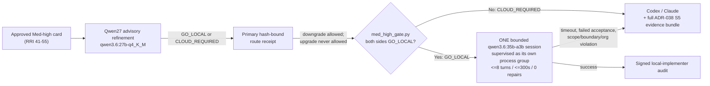

# AGENTS.md

## Purpose

This file defines the default task-presentation contract for agents working in the `dubbridge` repository.

It works together with the canonical agent guides that govern implementation in
this repository. Read them before executing work:

- `README_AGENT_ORDER.md` — orientation and reading order for agents.
- `docs/playbooks/AGENT_WORKFLOW_GUIDE.md` — the mandatory plan → tasks → approval →
  implement workflow.
- `docs/policies/HITL_AUTONOMY_POLICY.md` — human-in-the-loop approval rules.
- `docs/adr/` — architecture decisions that constrain implementation.
- `docs/plan/roadmap.md` — the general plan: slice sequence, dependencies, and where
  each slice/task sits.

For workflow topics, `docs/playbooks/AGENT_WORKFLOW_GUIDE.md` is authoritative.
`CLAUDE.md` (project and the user's global) remains authoritative only for
topics not overridden there.

## Task Presentation Rule

When a user asks an agent to execute a staged task or a task from a task file, the agent must present the next task before execution when the active workflow requires approval.

The presentation must be concise but operationally complete.

Before presenting or executing any staged task, the agent must verify the
current requirements in `docs/playbooks/AGENT_WORKFLOW_GUIDE.md`. This file is a
presentation contract summary, not a replacement for the workflow guide.
Task-type-specific requirements defined there are mandatory even when they are
not restated verbatim below.

When answering questions about development-task completion or before marking a
development task done, the agent must explicitly determine whether the task is
exempt (docs-only, config-only, migration-only, planning, ADR, task-ledger, or
policy-only) or whether the workflow requires the band-resolved independent
review before citing unit coverage certification or owner final verification.

## Required Task Presentation Format

For RRI 26+ approval presentations, use the six-block **Compact Approval Task
Card v2** defined by `docs/playbooks/AGENT_WORKFLOW_GUIDE.md` and instantiated at
`docs/templates/compact-approval-task-card.md`:

1. `Decision header` — task identity/status, RRI/band, Effort, approval gate,
   Codex/Claude recommendations, resolved implementation route, penalties,
   dominant RRI drivers, and link to the full RRI evidence.
2. `Scope and acceptance` — objective, in scope, out of scope, primary `HP-#` /
   `EC-#` behaviors for development tasks, evidence, and status sync.
3. `Agent workflow` — the resolved orchestrator, phase-1 reviewer, human gate,
   implementer, Reflection/verifier, phase-2 reviewer, and closure owner. State
   each responsibility, gate, and fallback.
4. `Diagrams` — one agent-workflow diagram; development tasks add one technical
   scope diagram. Never exceed two diagrams.
5. `References` — task, plan, and only materially governing documents.
6. `Approval checkpoint` — required wording or explicit bounded user waiver.

Do not copy the full task definition or RRI variable table into the approval
card. Those remain in the linked task ledger/RRI artifact. RRI 0–25 tasks still
skip the full approval card under the Low-band route.

`Evidence to emit` and `Status artifacts to sync` remain part of the execution
contract; summarize them in the card and keep their full paths in the task ledger.

## Complexity And Model Guidance

**When RRI has been computed**, the `Complexity` field in the task presentation must
use the RRI band name — not the Effort-based mapping below:

| RRI range | Complexity to present |
|---|---|
| 0–25 | Low |
| 26–40 | Moderate |
| 41–55 | Med-high |
| 56–70 | Complex |

The Effort → Complexity mapping is a **fallback** used only when no RRI is available:

- `Effort: S` -> `Complexity: Low`
- `Effort: M` -> `Complexity: Medium`
- `Effort: L` -> `Complexity: High`

Default recommended models:

- Codex: `GPT-5.2-Codex`
- Claude Code: `Claude Sonnet 4`

Escalation guidance:

- use `Claude Opus 4.1` only when the task is long-context heavy, synthesis-heavy, or repeatedly stalls under Sonnet 4
- if a task is primarily code editing, repo navigation, shell execution or deterministic implementation work, keep Codex as the default

If a task file already defines explicit complexity or model guidance, that task-local guidance overrides this file.

## Pseudocode Rule

Include pseudocode only when at least one is true:

- the task has branching logic
- the task transforms data across multiple stages
- the task defines a reusable workflow that benefits from an execution sketch
- the implementation risk is easier to evaluate through a structured outline

Do not add pseudocode for trivial file creation, simple edits, or direct command execution.

## Diagram Rule

Every approval card includes a compact agent-workflow Mermaid diagram. For
development tasks, also include a technical-scope diagram showing the relevant
flow, boundary, dependency direction, state transition, or ownership split.

For non-development tasks, add no second diagram unless at least one is true:

- the task changes architecture boundaries
- the task spans multiple services, crates, workers or repositories
- the task introduces a pipeline, state machine or dependency flow
- the task is easier to approve when shown as a compact technical flow

Never exceed two diagrams. Simple documentation-only tasks normally use only the
agent-workflow diagram.

## Related Documents Rule

The agent must list only the documents that materially constrain the task. Avoid dumping broad reading lists when only a few files are directly relevant.

Priority order:

1. task file
2. linked plan
3. workflow/policy files
4. ADRs
5. prompt files
6. configs/templates

For mobile UI / presentation tasks under `mobile/`, include root `DESIGN.md` in
`Related documents` when it materially constrains the visual work. Treat it as the
mobile design-intent contract, while plan/task files remain authoritative for
behavior, acceptance criteria, and verification.

## Approval Boundary

If the current workflow says the agent must wait for approval before executing a task, the presentation must end with a direct approval checkpoint.

Recommended wording:

`Execution has not started. Approve this task to proceed.`

If no approval is required under the active workflow, the agent may continue under
the gate defined by `docs/playbooks/AGENT_WORKFLOW_GUIDE.md` and
`docs/policies/RRI_POLICY.md`.

Under the canonical RRI mapping in `docs/playbooks/AGENT_WORKFLOW_GUIDE.md` and
`docs/policies/RRI_POLICY.md`, `Effort: S` normally corresponds to the **RRI 0–25**
Low band. Those tasks skip the full approval presentation; use local Gemma
delegation through Ollama only for eligible simple code patches, and otherwise
handle them directly as the primary agent while still following the low-band gate.

## Band-routed peer review report lines

Every task card must include a phase-1 line, and every development closure report
must include a phase-2 line. The reviewer token is resolved by RRI band at report
time. Docs-only, config-only, migration-only, ADR, plan, task-ledger, and
policy-only tasks record `n/a` with the exemption stated for phase 2.

```
Task-analysis review: <gemma|qwen3.6:27b-q4_K_M|codex|claude|d14> <artifact path> - <PASS|BLOCKED>
Code-solution review: <gemma|qwen3.6:27b-q4_K_M|codex|claude|d14> <artifact path> - <PASS|BLOCKED>
```

- `gemma` — primary reviewer for RRI 0–25; intermediate fallback for RRI 26–55.
- `qwen3.6:27b-q4_K_M` — primary reviewer for both phases in RRI 26–55.
- `codex | claude` — RRI 56+, resolved from caller identity
  (`claude-code → codex`, `codex → claude`, others → `claude`).
- `d14` — final fallback when the preceding reviewer chain is unusable.
- `BLOCKED` — non-pass verdict or the band's full reviewer/fallback chain is
  unavailable. Stops presentation (phase 1) or closure (phase 2) until revised,
  user-waived, or reported blocked.

See `docs/playbooks/AGENT_WORKFLOW_GUIDE.md § Band-routed peer review` for the
full contract.

## Development Closure Rule

For development-task closure, do not describe certification, final verification,
or status flips as the first completion step. First determine whether the task
must pass the mandatory code-solution review gate resolved by the canonical RRI
band table under `docs/playbooks/AGENT_WORKFLOW_GUIDE.md`
and `docs/policies/HITL_AUTONOMY_POLICY.md`, then describe the remaining closure
blocks in order.

## Language

Agent-facing repository instructions must be written in English.

User-facing presentation may be adapted to the user's language, but task metadata, filenames and model identifiers should remain exact.
---
type: Playbook
title: "Agent Workflow Guide"
governs: "all agent-facing workflow decisions in the repository"
---

# Agent Workflow Guide

> **Status:** Authoritative. This guide is the highest-authority source for **all**
> agent-facing decisions: workflow, process, implementation discipline, task
> presentation structure, model selection, complexity scoring, testing rules, commit
> rules, handoff format, ADR propagation, and language policy.
> It overrides `CLAUDE.md` (project and global) and `AGENTS.md` without exception.
> `CLAUDE.md` applies only for topics not covered here.

## Mandatory workflow before implementing

1. **Analyze** — read context, dependencies, and affected files.
   - For **mobile UI / presentation tasks** under `mobile/`, also read the root
     `DESIGN.md` before planning or implementation. `DESIGN.md` governs visual
     intent and component-usage expectations for the mobile surface. It does not
     replace task files, runtime tokens in `mobile/src/theme/tokens.ts`, or the
     workflow authority of this guide.
2. **Plan** — create `docs/plan/<plan-name>.md` with: objective, affected files,
   design decisions, and module dependencies.
3. **Tasks** — create `docs/tasks/<tasks-name>.md` with: an ordered task list,
   inter-task dependencies, acceptance criteria per task, an **Effort** field
   (S/M/L/XL), a short agent handoff prompt, and for each development task a
   small behavioral example set covering both:
   - at least one **happy path example** with a stable `HP-#` ID — a concrete
     success flow the task must implement or preserve;
   - at least one **edge case example** with a stable `EC-#` ID — a concrete
     boundary, invalid-input, or failure flow the task must handle or reject.
   - when a task can produce benchmark/evaluation/review evidence, metrics, or
     a blocker/promotion-state change, the task definition must also name:
     - **Evidence to emit** — the concrete artifacts expected during execution
       (for example transcripts, screenshots, audit rows, benchmark outputs,
       review packets, or report sections);
     - **Status artifacts affected** — the exact ledgers, plans, reports, ADR
       indexes, or downstream blocker docs that must be synchronized before the
       task can be reported complete.
4. **Gate by RRI** — compute RRI with `scripts/rri.py`. For RRI 0–25, skip the
   full human approval presentation. Use local Gemma delegation through Ollama
   only for eligible simple code patches; otherwise execute directly as the
   primary agent. For **RRI 26–40 Moderate**, show the plan and tasks, wait
   for explicit approval, then use the **local-first implementation path** by
   default: `scripts/local-agent/run_local_task.py` in a disposable worktree,
   resolving the implementer from `DUBBRIDGE_LOCAL_AGENT_MODEL` (default
   `qwen3.6:35b-a3b`), with at most 2 evidence-backed local repair attempts
   before escalating to cloud. The primary agent remains the orchestrator of
   record and cloud implementation is the escalation/fallback path, not the
   default. For **RRI 41–55 Med-high**, show the plan and tasks, wait for
   explicit approval, then route through the **ADR-038 Architect-refined
   single-attempt gate**: Qwen27 advisory refinement (`GO_LOCAL` |
   `CLOUD_REQUIRED`) → primary hash-bound route receipt (may downgrade, never
   upgrade) → if `GO_LOCAL`, exactly one bounded `qwen3.6:35b-a3b` session
   (≤8 turns, ≤300 seconds, **0** repair attempts, supervised as its own
   process group by `scripts/local-agent/run_med_high_task.py`) → otherwise
   Codex/Claude with the full evidence bundle. Med-high keeps the
   band-resolved independent review route, 3 Reflection passes, and the human
   approval gate unchanged — the routing change affects only who authors the
   code, not who reviews or approves it. See § Local-first and
   Architect-refined implementation routing (RRI 26–55) below for the full
   diagram and contract. For **RRI 56+**, show the plan and tasks and wait for
   explicit approval before starting implementation, even if a plan was
   approved in a prior session; implementation stays on the cloud path
   (Premium tier) and decomposition remains mandatory before implementation.
5. **Implement** — one task at a time, in the defined order.
6. **Mark progress** — update the tasks document after each completed task (it is
   the crash-safe progress ledger).
7. **Sync status artifacts before reporting completion** — before telling the user
   a task is done, update every materially affected status document in the same
   workflow pass. Completion is not valid until those documents are consistent.

## Task definition requirements

- For development tasks, the `docs/tasks/*.md` entry is not complete unless it
  includes explicit examples for both the intended happy path and the relevant
  edge cases.
- These examples do not need to be long. One or two bullets per category is
  enough if they are concrete and testable.
- Every development-task example must have a stable case ID:
  - happy path examples use `HP-1`, `HP-2`, etc.;
  - edge case examples use `EC-1`, `EC-2`, etc.
- Write the examples in behavioral terms, not implementation terms. Prefer
  statements such as `HP-1: valid ingest token + owned blob -> artifact finalized`
  over `call finalize_ingestion()`.
- The pre-task sections `Happy paths considered` and `Edge cases considered`
  should be derived from these task-definition examples, then refined if new
  constraints are discovered during analysis.
- Skip this requirement for docs-only, config-only, migration-only, or planning
  tasks unless the task's main risk is behavioral correctness.
- When a task can produce metrics, benchmark outputs, evaluation evidence, or a
  blocker/promotion-state change, its task definition is not complete unless it
  also names:
  - **Evidence to emit** — the concrete artifacts the task is expected to
    create while it runs; and
  - **Status artifacts affected** — the exact status-bearing docs that must be
    updated in the same workflow pass.
- Treat these as execution-time outputs, not as optional closure notes. If they
  are known at planning time, they belong in the task definition up front.
- A task ledger can opt into automated enforcement by declaring
  `Behavioral coverage contract: unit-v1`. For ledgers with that marker, `make
  qa-docs` rejects completed development tasks whose `HP-#` / `EC-#` cases are not
  certified with unit test evidence. Legacy completed tasks without the marker are
  grandfathered until they are migrated into the contract.

## Per-task discipline

- **Phase 1 — Task-analysis review** (before presenting or delegating any task):
  run the reviewer resolved by the canonical `Band-routed peer review` table on
  the task card/plan. Record the phase-1 report line with the actual reviewer,
  artifact, and verdict. Do not maintain a second band mapping here.
  A `BLOCKED` verdict stops presentation or delegation until revised, explicitly
  waived by the user, or reported as blocked. Docs-only, config-only,
  migration-only, ADR, plan, task-ledger, and policy-only tasks are exempt from
  phase 1 and record `n/a` with the exemption stated.
- Present the next task using the `AGENTS.md` presentation contract before executing
  it when approval is required. For RRI 0–25, do not present the full task for
  approval. If the task is an eligible simple code patch, prepare a local
  delegation packet for Gemma and report after review and verification; otherwise
  execute directly and report normally.
- Before implementation starts, derive an explicit execution-time documentation set
  from the task definition: what evidence/metrics must be emitted and which status
  artifacts must be synchronized. For tasks that affect benchmarks, reports, audit
  trails, blockers, or promotion state, that set is part of the task's working
  surface from the start, not a post-hoc cleanup list.
- **Pre-task summary for development tasks:** the compact card's `Scope and
  acceptance` block must name the primary `HP-#` and `EC-#` behaviors, and its
  workflow table must name the required Reflection pass count and pass focuses
  for RRI 26+. A compact technical-scope Mermaid diagram is mandatory. These
  items do not require separate prose sections in the approval card; their full
  definitions remain in the linked task ledger. Skip development-only content
  for docs-only, config, migration-only, or planning tasks unless requested.
- After each task: verify the relevant tests/checks, update the status docs,
  document deviations or evidence, and state unresolved risks or blockers.
- When a task's evidence or metrics become available mid-execution, update the
  named report/ledger artifacts in the same workflow pass instead of deferring
  them until an end-of-task memory sweep. A task that changes the measured state
  of the project should update that measured state as part of the task itself.
- Treat status-document synchronization as part of the task itself, not follow-up
  cleanup. Do not report a task complete while any governing status document still
  shows stale state.
- When a task completion changes the status of a slice, dependency, ADR, or blocked
  downstream task, update all materially affected status documents in the same
  workflow before reporting completion. This includes, as applicable:
  `docs/tasks/*`, `docs/plan/roadmap.md`, linked slice plans, dependent task files,
  and ADR status/implementation references.
- At minimum, check whether the completed task changes any of:
  `docs/tasks/*`, `docs/plan/roadmap.md`, the linked `docs/plan/*` slice file,
  dependent task ledgers, ADR status/implementation references, and any handoff
  prompt or blocking-gate language that names the completed work.
- When an ADR is created, amended, or deleted as part of a task, apply the
  **ADR change propagation** contract below in the same workflow pass.
- Work on the approved or delegated task only; show a summary before switching to
  the next.
- **Post-task summary for development tasks:** when the completed task involves writing
  or modifying code, the summary must include two explicit sections:
  - **Happy paths covered** — the primary success flows exercised by the implementation
    and tests (e.g., "valid command → session created in Requested state").
  - **Edge cases covered** — the boundary and failure conditions explicitly handled in
    logic and tests (e.g., "None credential_ref → MissingCredentialRef before any IO").
  For both sections, include **code evidence**: point to the concrete files,
  functions, and tests that prove the claimed coverage, using file references and
  concise explanations of what each reference demonstrates.
  This section is required only for development tasks. Skip it for docs-only,
  config, migration-only, or planning tasks.
- **Unit coverage certification for development tasks:** before marking a
  development task `[x] Done`, add a `Unit coverage certification` section that
  maps every approved `HP-#` and `EC-#` case to at least one unit test reference in
  the form `` `path/to/file.rs::test_name` ``. The referenced test must replicate
  the behavior described by that case and the recorded result must be `passed`.
  `N/A` is not allowed for development-task happy paths or edge cases. If a case
  cannot be unit-tested, refactor the implementation until it can be unit-tested
  or revise the task definition before closure.
- The same completion record must include `Owner final verification` with owner,
  date, verification statement, and exact commands run. The owner is responsible
  for certifying that each referenced unit test genuinely covers the claimed
  behavior; the automated gate verifies the structure and referenced test
  existence.

Required completion format for development tasks:

```md
### Unit coverage certification

| Case ID | Type | Behavior | Unit test evidence | Result |
|---|---|---|---|---|
| HP-1 | Happy path | valid input creates session | `apps/gateway/src/auth/login.rs::valid_login_creates_session` | passed |
| EC-1 | Edge case | unknown state fails closed | `apps/gateway/src/auth/login.rs::unknown_state_returns_unauthorized` | passed |

### Owner final verification

- Owner: `<name-or-handle>`
- Date: `YYYY-MM-DD`
- Statement: I verified every happy path and edge case defined for this task has unit test evidence that replicates the expected behavior.
- Commands run: `<exact test commands>`
```

## ADR change propagation

An ADR change that occurs outside a task ledger (e.g. a replan, a hotfix, or a
cross-cutting amendment) is still subject to this contract. Apply the matching row
in the same change — not as a follow-up.

| ADR change | Must review and update in the same change |
|---|---|
| **New ADR** | `docs/adr/README.md` index row; ADR frontmatter block (`type: ADR`, `title:`, `status:`); `docs/architecture.md` if it adds or alters a runtime/crate boundary; `docs/plan/roadmap.md` if it changes slice scope or dependencies; the affected `docs/plan/*` and `docs/tasks/*` files |
| **Status change** (`Proposed` → `Accepted` → `Superseded` / `Deprecated`) | ADR frontmatter `status:` field (must mirror the prose `- **Status:**` token); index `Status` column; every canonical doc (`architecture.md`, `roadmap.md`, plan/tasks) that cites the ADR as authority for a decision |
| **Scope narrowed or broadened** | index scope annotation; `docs/architecture.md`; `docs/plan/roadmap.md`; affected plan/tasks; `README.md` if the change is outward-facing |
| **Content / decision change** (the decision itself, not just status or scope) | every canonical doc whose prose describes that decision — **this is semantic and not machine-verifiable**; Layer 2/3 confirm references still resolve, but human review owns whether the prose is still accurate |
| **Superseded by ADR-YYY** | both ADRs' frontmatter (`status:` / `supersedes:` / `superseded_by:`); both ADRs' prose `Status` field; the index row for each; every doc citing the superseded ADR |
| **Deletion or renumbering** | see the deletion rule below; update the index, every doc citation, **and every code/migration comment** (`.rs`, `.sql`) in the same change |

**Deletion rule.** An `Accepted` ADR is part of the auditable decision record and
must **not be deleted** — mark it `Superseded by ADR-YYY` or `Deprecated` instead.
A `Proposed` ADR that was never adopted may be deleted only after every reference
(docs *and* code/migration comments) is removed in the same change. Renumbering is
a delete + create and must update all references atomically.

**Definition of done for any ADR change:**
- [ ] The ADR file's prose `- **Status:**` line is updated.
- [ ] The ADR file's frontmatter `status:` mirrors the prose token; `supersedes:` /
      `superseded_by:` are set where applicable (frontmatter parity).
- [ ] `docs/adr/README.md` index row matches (status token + title).
- [ ] Every doc in the matching propagation row above has been reviewed and updated
      if its content describes the changed decision.
- [ ] No code or migration comment cites a missing ADR number.
- [ ] `make qa-docs` passes (index parity, completeness, dangling refs in docs and
      code/migrations, superseded-successor existence, OKF frontmatter parity).

### What this contract does and does not guarantee

**Guaranteed by `make qa-docs` (deterministic, Layers 2/3):**
- Every cited ADR file exists.
- Index↔file status tokens agree.
- The index is complete (no file without a row, no row without a file).
- A `Superseded` ADR names an existing successor.
- No code or migration comment cites a missing ADR.

**Not guaranteed (Layer 1 + human review only):**
- That the *prose* of a canonical doc still accurately describes an ADR whose
  decision changed. Referential integrity is automatable; semantic consistency is
  not. The propagation table tells the author *which prose to re-read*; it does not
  prove the update was made correctly.

## Effort scale

| Level | Agent reasoning | Example |
|-------|-----------------|---------|
| S  | Mechanical — transcription, copy, merge | Config files from an explicit spec |
| M  | Moderate — contracts, logic, edge cases | Boundary tests; small services |
| L  | High — multiple subsystems, architecture | Process supervisor with replay tests |
| XL | Very high — RRI-driven reasoning, risk, and verification burden | Cross-boundary redesign with explicit risk analysis |

**Canonical effort mapping (required):** `Effort` must reflect the computed **RRI
band**, not a separate subjective estimate of likely elapsed time or annoyance. See
`docs/policies/RRI_POLICY.md` §Bands, autonomy gates, and model tiers for the
canonical crosswalk.

The S/M/L/XL descriptions above are illustrative; the RRI band is authoritative for
assignment.

Effort, capability tier, and autonomy gate are each derived in parallel from the RRI
band; never derive capability or gate from Effort.

Rules:
- Do not use `Effort` to encode toolchain pain, waiting time, or expected operator
  frustration when the computed RRI is lower.
- If a task is operationally tedious but its RRI remains in a lower band, keep the
  lower `Effort` and explain the operational caveat in prose.
- If an existing task ledger has `Effort` that disagrees with the computed RRI band,
  update the ledger so `Effort`, complexity presentation, and model guidance are
  internally consistent in the same documentation change.

## Model and thinking-mode selection

This section is the canonical source for complexity scoring, model-tier
selection, and thinking-mode guidance. `AGENTS.md` defines the presentation
fields, but agents must derive the values from this guide rather than from
agent-specific defaults.

Concrete vendor model IDs change over time. Agents must therefore separate:

1. the **capability decision** (`Economy`, `Balanced`, `Premium`) derived from
   the formulas in this guide, from
2. the **concrete model resolution** (the current OpenAI / Anthropic model ID
   that best fits that capability at the time of presentation).

Do not collapse these into one undocumented guess.

The **RRI 0–25 Low band** is the exception to vendor model resolution: it uses
local Gemma delegation through Ollama. Resolve the local model from
`DUBBRIDGE_LOW_RRI_MODEL`, defaulting to `gemma4:26b-a4b-it-qat` (the former
`gemma4:12b-mlx` fast lane was retired — ADR-036 Amendment 1 — so there is no
separate fallback tier), and the Ollama endpoint from `OLLAMA_HOST`,
defaulting to `http://localhost:11434`.

### Local-first and Architect-refined implementation routing (RRI 26–55)

The **RRI 26–55 band (Moderate + Med-high)** is a routing exception for
implementation: task cards still present Codex/Claude recommendations for the
orchestrator and escalation environment, but the default code-authoring
surface moves local. The two sub-bands now use different routes.

**Moderate (26–40):** the code-authoring surface is the local agentic runner
(`scripts/local-agent/run_local_task.py`) using `DUBBRIDGE_LOCAL_AGENT_MODEL`
(default `qwen3.6:35b-a3b`) inside a disposable worktree, with at most 2
evidence-backed local repair attempts before escalating to cloud. This
routing became operative by owner override on 2026-07-15, ahead of the
original ADR-036 pilot promotion gate.

**Med-high (41–55):** ADR-038 (2026-07-26) governs this band. It replaces the
Moderate-style direct local-first route (and this band's own earlier
1-repair-attempt variant, adopted 2026-07-21 and now retired) with a
fail-closed, evidence-bearing gate:



Implementation surfaces: `scripts/local-architect/run_analysis.py`
(`med-high-refinement-v1` profile) for the Qwen27 artifact,
`scripts/local-agent/med_high_gate.py` for the fail-closed route decision,
`scripts/local-agent/run_local_task.py`'s `resolve_effective_limits()` for
the tightened 8-turn/0-repair/exact-model budget, and
`scripts/local-agent/run_med_high_task.py` for the process-group-supervised
300-second cutoff and automatic evidence-bundle emission on every
non-success route. There is no repair attempt at this band — a failed
acceptance run, timeout, or violation routes directly to cloud, never
retries locally.

Both sub-bands keep the independent reviewer resolved by the canonical band
table (currently `qwen3.6:27b-q4_K_M`, then Gemma, then D14), 3 Reflection
passes, and the RRI 26+/41+ human approval gate exactly as before — the
routing change affects only who authors the code, not who reviews or
approves it.

When preparing a task for presentation or local delegation, the agent must compute
a complexity score and derive the recommended model tier or local delegation
target from it. Do not guess; use the procedure below.

### RRI — canonical scoring method (adopted 2026-06-04)

This guide adopts the **Required Reasoning Index (RRI)** as the canonical method
for deriving complexity, risk, model tier, and autonomy gates. The full procedure
(formula, scoring rubric, repo-specific anchor rubric, penalty table, bands, and
decomposition triggers) lives in `docs/policies/RRI_POLICY.md`.

**Adoption note:** RRI supersedes the single-axis cyclomatic-complexity scoring
that previously drove the tier mapping. No ADR is required — RRI is a workflow
policy, not a runtime architecture decision. `AGENTS.md` and `CLAUDE.md` are
summaries of this guide and must be synchronized whenever its presentation or
routing contract changes.

**How Steps 1 and 2 below relate to RRI:**
- The cyclomatic-complexity formula in Step 1 maps directly to the **`C` variable**
  of the RRI formula. Step 1 remains the procedure for computing `C`.
- The tier mapping in Step 2 is now driven by the **RRI band** (not the raw CC
  label). The tier names (Economy / Balanced / Premium) and thinking-mode rules
  are unchanged; only the input that selects the tier changes.
- Step 3 includes the compact RRI summary in the task presentation for RRI 26+,
  or in the local delegation packet and final report for RRI 0–25.

Before presenting or delegating any task: **run `scripts/rri.py`** — do not compute the RRI by hand.
The script measures F automatically and maps raw CC to the C score via the policy
table. Store its full markdown output in the task ledger or a linked RRI artifact.
For RRI 26+, project the required compact summary into the approval card; for RRI
0–25, include the full output in the local delegation packet and final report.

```bash
# Task-presentation time (before code is written — diff is empty):
python3 scripts/rri.py \
  --touches <path1> --touches <path2> \
  --cc <raw-cyclomatic-complexity> \
  --D <0-5> --K <0-5> --P <0-5> \
  --T <0-5> --A <0-5> --X <0-5> \
  [--penalty refactor_and_behavior] [--penalty arch_decision] [--penalty no_verification]

# Post-implementation (diff available; omit --touches):
python3 scripts/rri.py --cc <raw> --D <0-5> --K <0-5> --P <0-5> \
  --T <0-5> --A <0-5> --X <0-5>
```

Measure C and T before invoking: use `radon`/`mccabe` (Python) or
`clippy::cognitive_complexity` (Rust) for C; use `cargo llvm-cov` for T.
The script applies D/P/K floors from the anchor rubric and auto-detects four
penalties — agent supplies only the three intent-based ones. See
`docs/policies/RRI_POLICY.md § Script automation` for the full agent-vs-script
split and `--json` output for tooling use.

### Step 1 — Compute complexity

**For development tasks (code to write or modify):**

Compute the **cyclomatic complexity** (McCabe, 1976) of the functions that will be
created or materially changed:

```
CC = E − N + 2P
```

where E = edges, N = nodes, P = connected components in the control-flow graph.
Practically: start at 1 and add 1 for each `if`, `else if`, `match` arm, `while`,
`for`, `loop`, `?` propagation that branches, `&&`, `||` in a condition.

| CC range | Cyclomatic (C) label | RRI `C` variable score |
|---|---|---|
| 1–5 | Low | 0–1 |
| 6–10 | Medium | 1–2 |
| 11–20 | High | 2–3 |
| > 20 | Very High | 4–5 |

> **Subsumed by RRI:** the CC range above is the `C` variable of the RRI formula.
> Use the full RRI score (not just `C`) to determine the model tier and autonomy
> gates. See `docs/policies/RRI_POLICY.md` for the complete scoring procedure.

**For non-development tasks (analysis, planning, research, config, docs):**

Use the **decision-weight heuristic** — count the number of irreversible decisions
plus external dependencies the task requires:

| Score | Complexity label |
|---|---|
| 0–2 | Low |
| 3–5 | Medium |
| 6–9 | High |
| ≥ 10 | Very High |

Irreversible decisions include: schema changes, public API changes, CI gate changes,
deletion of authoritative files, policy changes. External dependencies include: live
DB, external APIs, CLI tools with version-sensitive behavior, network-bound ops.

### Step 2 — Map to model tier (cost / capability balance)

Prefer capability tiers over pinned model IDs in this guide. Model names change
over time; the workflow should stay stable across agents and providers.

| Tier | Best for |
|---|---|
| Economy | Low-complexity, mechanical tasks |
| Balanced | Medium-complexity, standard implementation work |
| Premium | High / Very High complexity, architecture, synthesis, deep debugging |

Mapping (now driven by RRI band — see the canonical crosswalk in
`docs/policies/RRI_POLICY.md` §Bands, autonomy gates, and model tiers):

> **Subsumed by RRI:** the complexity label alone no longer determines the tier.
> The RRI band (which incorporates `C`, `F`, `D`, `T`, `A`, `K`, `P`, `X`, and
> penalties) selects the canonical crosswalk row. The tier names and thinking-mode
> rules are unchanged; only the input that selects the tier has changed.

Agent-specific resolution rules:

- For RRI 0–25, use the local Ollama/Gemma delegation protocol in
  `docs/policies/RRI_POLICY.md § Low RRI local delegation`; do not resolve to a
  cloud vendor model. For the step-by-step handoff discipline for local-model
  work, see `docs/playbooks/LOW_RRI_LOCAL_MODEL_HANDOFF.md`.
- Resolve each capability label to the best currently available model in the
  active agent environment.
- When naming a concrete vendor model ID, verify the current vendor guidance
  first if there is any reasonable chance the recommendation has changed. Do not
  rely on stale memory for "latest", "best", "recommended", or similar claims.
- For OpenAI recommendations, prefer official OpenAI documentation. For Claude /
  Claude Code recommendations, prefer official Anthropic documentation.
- The final recommendation must be produced in this order:
  1. compute complexity with the formula in Step 1
  2. map complexity to capability tier with Step 2
  3. resolve that tier to the best current vendor model
  4. present the resolved model and note any task-local override
- `Effort` must be derived from the computed RRI band using the canonical effort
  mapping above; it does not replace the complexity formula. If an existing task's
  recorded `Effort` disagrees with the computed RRI band, fix the task metadata
  instead of carrying the inconsistency forward into the presentation.
- If a task file explicitly pins a model, that task-local guidance overrides the
  default tier mapping.
- If a task file pins a model that appears stale relative to current vendor
  guidance, do not silently swap it during task presentation. Either:
  - present the pinned model as the task-local override, or
  - update the task metadata explicitly in an approved documentation change.
- If the user asks for the latest or most recent model, verify against official
  provider documentation before naming a specific model.
- Do not silently replace a task-local pinned model with a newer one. Either use
  the pinned model or update the task metadata explicitly.

**Thinking mode** for the selected balanced/premium reasoning model:
activate when the task requires multi-step reasoning that cannot be validated
incrementally — e.g., architecture trade-offs with more than two interacting
constraints, novel algorithmic design, or diagnosis of non-deterministic failures.
Do **not** activate for: writing tests for already-specified logic, config edits,
doc updates, or any task where the strategy is fully pre-defined.

### Step 3 — State it in the task presentation or delegation packet

For RRI 26+, use the **Compact Approval Task Card v2**. It is a projection of the
linked task ledger and full RRI evidence, not a second task definition. Keep the
card to no more than six content blocks:

1. **Decision header** — task ID/title, status, final RRI/band, Effort, and the
   approval gate. Include a small routing table with the orchestrator, concrete
   Codex/Claude recommendations, resolved implementation route, penalties,
   two or three dominant RRI drivers, and a link to full RRI evidence.
2. **Scope and acceptance** — one-sentence objective, in-scope paths/behaviors,
   explicit out-of-scope boundary, the primary acceptance criteria (`HP-#` and
   `EC-#` for development), evidence to emit, and status artifacts to sync.
3. **Agent workflow** — a table naming the actual responsible participant for
   analysis, phase-1 review, human approval, implementation, Reflection/testing,
   phase-2 review, and closure. Each row states its gate/output and any fallback.
   Show the route resolved for this task, not every possible band route.
4. **Diagrams** — one compact agent-workflow Mermaid diagram. Development tasks
   add one compact technical-scope diagram; never exceed two diagrams.
5. **References** — task, plan, and only materially governing policies/ADRs.
6. **Approval checkpoint** — the required HITL wording, or an explicit record of
   the bounded user waiver.

The reusable projection lives at
`docs/templates/compact-approval-task-card.md`. The linked task ledger must still
contain the full task definition and the unmodified `scripts/rri.py` markdown
report. The approval card itself shows only the final score, band, gates,
penalties, dominant drivers, and evidence link.

For RRI 0–25, do not present a full approval card. Put the full RRI report in the
local delegation packet and final report as required by the Low-band route.

The recommendation is **not** a competition between vendors. Every presentation
must provide:

- one concrete current recommendation for OpenAI / Codex
- one concrete current recommendation for Claude Code / Anthropic

Both recommendations must be derived from the same computed complexity and the
same tier-mapping rules in this guide. Do not present only one vendor unless the
task file explicitly scopes the task to a single vendor environment.

For RRI 0–25, use the resolved primary-agent or eligible local-Gemma route and
note that the active agent remains the reviewer/orchestrator.
For RRI 26–55, keep the Codex/Claude recommendations for orchestration and
escalation, and name the local implementer in the decision-header routing table.

Compact-card rules:

- Always show the computed `Complexity score`, even if the task file already
  declares `Complexity:`.
- Every approval card includes the agent-workflow diagram. Development tasks also
  include the smallest technical diagram that makes the implementation boundary
  obvious.
- Keep acceptance to the decision-relevant behaviors; link to the full task
  definition instead of copying its inputs, outputs, context, or long case lists.
- Keep the workflow table to seven phase rows and make every involved agent/model
  visible with its responsibility, gate, and fallback.
- If the task file provides explicit complexity or model guidance, state that it
  is a task-local override when presenting the task.
- If the presentation uses a resolved model from the current agent environment,
  prefer the actual resolved model identifier over a generic tier label.
- When a concrete model identifier is presented as "recommended", it must be
  traceable either to:
  - current official vendor guidance, or
  - a task-local explicit pin documented in the task file.
- Add a one-line rationale if the mapping is non-obvious (e.g., a Medium CC task
  escalated to High because of a Very High external-dependency count).

## Reflection design pattern for development tasks

When a development task has an RRI of 26 or higher, the agent must apply
**Reflection** passes before reporting the task complete. Each pass is a complete
Draft → Critique → Revise loop.

Required pass count by RRI band:

| RRI band | Label | Required Reflection passes |
|---|---|---|
| 26–40 | Moderate | 2 |
| 41–55 | Med-high | 3 |
| 56–70 | Complex | 4 |

MANDATORY:
---------
For RRI 56+, decomposition is mandatory before implementation. Follow the
decomposition and human-review gates in `docs/policies/RRI_POLICY.md`, split the
task to the policy target, and only then implement the approved subtasks. Apply
at least the Complex band minimum of 4 Reflection passes to any 56+ development
subtask that proceeds after decomposition.

Task-presentation requirement for development tasks:

- For RRI 26+, the compact card's `Reflect and verify` workflow row states the
  RRI/band, required pass count, and a terse ordered focus for the passes (for
  example `contract -> failure boundaries -> coverage`). A separate Reflection
  section is not required in the approval card.
- The workflow row must still make clear that every pass is a complete Draft ->
  Critique -> Revise loop. Detailed findings and revisions belong in the closure
  `Reflection log`, not in the approval card.

Each Reflection pass consists of:

1. **Draft** — produce the initial implementation following the task's acceptance
   criteria, happy paths, and edge cases. In later passes, treat the current revised
   implementation as the draft.
2. **Critique** — re-read the draft as if reviewing someone else's code. Check for:
   - logical correctness against every `HP-#` and `EC-#` case;
   - missing or incorrect error handling at system boundaries;
   - unintended side effects on adjacent modules or state;
   - whether applicable design patterns or concepts should be used to improve
     execution performance, memory usage, and UX/UI quality when the task has a
     user-facing surface;
   - test coverage gaps against the 90% gate.
3. **Revise** — apply concrete fixes identified in the critique step. If no fixes are
   needed, state that explicitly (one sentence).
4. **Certify** — proceed to unit coverage certification only after at least one
   complete Draft → Critique → Revise loop has been recorded for every required
   Reflection pass.

The passes must be documented in the task completion record as a
`### Reflection log` section placed before `### Unit coverage certification`.
Minimum format:

```md
### Reflection log

Required passes: <N> (`<RRI>` → `<band>`)

#### Pass 1

- **Draft verdict:** <one-line summary of current state>
- **Critique findings:** <bullet list of issues found, or "no issues found">
- **Revisions applied:** <bullet list of changes made, or "none">

#### Pass 2

- **Draft verdict:** <one-line summary of current state>
- **Critique findings:** <bullet list of issues found, or "no issues found">
- **Revisions applied:** <bullet list of changes made, or "none">
```

For RRI 0–25 tasks delegated to local Gemma, the delegating agent applies the
Reflection cycle to Gemma's output during the mandatory review step. Record the
reflection log in the final report, not inside the delegated task.

Skip the Reflection cycle for: docs-only, config-only, migration-only, or planning
tasks. For tasks at the boundary (RRI exactly 25–26), apply judgment: if the task
writes non-trivial logic, apply the cycle.

## Testing and commit rules

- TDD where practical: test first, implement, run tests.
- Target at least **90% line coverage** for the implemented scope. Treat coverage
  as an enforced quality gate, not a reporting-only metric.
- Prefer real backends over mocks; features should talk to the real backend.
- **Do not commit if any test is broken.** Run all tests before commit and push.
- Keep the automated coverage gate aligned with CI configuration. If the required
  threshold changes, update both the workflow guide and `.github/workflows/ci.yml`
  in the same change.
- Mirror critical QA gates locally before changes reach the remote. The repository
  pre-push hook at `.githooks/pre-push` should enforce the fast deterministic Rust
  gates (`fmt`, `clippy`, `test`, `cargo check`) and run dependency-policy checks
  when Cargo manifests change. CI keeps the full blocking baseline, including the
  90% coverage gate. Enable the hook with `git config core.hooksPath .githooks`.
- Ask for confirmation before deleting anything.

## Handoff prompt format

Keep handoff prompts minimal. The task was already presented and approved, or it
is in the RRI 0–25 local-delegation band — do not re-explain it.

A human-agent handoff prompt must contain only:

1. Task ID + one-line goal
2. Governing docs (task file + plan file, paths only)
3. The one file + line range with the logic to change
4. Exact acceptance criteria (bullets only, no prose)
5. Stop condition: what the agent must do last and must NOT start next

For RRI 0–25 local Gemma delegation, build a delegation packet instead of the
human-agent handoff prompt. It must contain only: task excerpt, acceptance
criteria, RRI output, allowed paths, relevant file snippets, and stop conditions.
Send the packet with `scripts/delegate-low-rri.py`, which performs the local
Ollama request with the repository timeout. Gemma must return the tagged-block
contract with complete file contents for each changed file; the delegating agent
must validate the tagged response, let the wrapper build and check the diff,
personally review the solution against the requirements, run verification, and
perform at most one bounded repair cycle before escalating. Gemma must not
evaluate or approve its own delegated work.

For harder but still Low-RRI attempts, the wrapper supports explicit generation
knobs such as `--temperature` / `DUBBRIDGE_LOW_RRI_TEMPERATURE` and `--think` /
`--no-think` / `DUBBRIDGE_LOW_RRI_THINK`. Keep thinking mode off by default; use
it only for a bounded experiment because it can consume the token budget before
the tagged response is completed.

For **RRI 26–55 local-first implementation** (Moderate + Med-high), use
`scripts/local-agent/run_local_task.py` in a disposable git worktree. The
primary agent remains orchestrator of record: it owns the task card,
`allowed_paths`, verification commands, Reflection passes, closure, and final
accept/reject judgment. The local implementer resolves from
`DUBBRIDGE_LOCAL_AGENT_MODEL` (default `qwen3.6:35b-a3b`), may run ordinary
development commands inside the disposable worktree, and is constrained by the
existing narrow denylist (`git push`, `docker`, `rm -rf`), stripped
credentials, and post-run diff scope enforcement.

The runner exposes a deliberately simple tool contract — `read_file` (whole
file, no size cap), `write_file` (create or overwrite), `apply_patch`
(single-unique-anchor replacement), `run_command`, and `finish`. There is no
language-server / symbol-server preflight: the local implementer has a large
context window and reads the file it must change directly. (This replaced an
earlier Serena/semantic-tool path that never produced a successful edit — see
`docs/plan/local-agent-simple-editing.md`.)

At finish, success signing is fail-closed: scope, acceptance, and organization
gates must all pass before the audit may carry the `local-implementer`
signature. A success audit must record scope result, acceptance/verification
results, organization result, edit metrics (tool, path, line/byte counts),
implementer model, and the signature itself. Use at most **2**
evidence-backed local repair attempts for Moderate (26–40) and at most **1**
for Med-high (41–55) — the tighter budget reflects the higher-risk
anchor-rubric floors Med-high tasks typically carry. If the local runner/model
is unavailable, the repair budget is exhausted, or the task violates the scope
boundary, escalate to cloud implementation with the ADR-036 escalation packet
instead of continuing locally. Med-high tasks still go through the
band-resolved independent review route (phases 1 and 2) and 3 Reflection passes
regardless of where the code was authored — local-first routing changes only
the code-authoring surface, not the review or approval controls.

**Rollback triggers for this operative policy:** if the rolling 20-task window
shows escalation rate `> 40%`, any **accepted** out-of-scope diff, any
unintended change escaping the disposable worktree boundary, or sustained
swap/thermal degradation attributable to the local implementer, revert the
affected band (Moderate and/or Med-high) to cloud implementation while
retaining the local review roles.

**Target-file size gate (owner directive, 2026-07-22):** before building a
task card for RRI 26–55 local-first delegation, check every file in
`allowed_paths` and every file the local implementer must read in full. If
any exceeds **500 lines**, do not delegate as-is — decompose the task so each
subtask's touched/read files stay under the threshold (preferred; see the
GEG-1a–1e chain in `docs/tasks/gemma-evidence-artifact-gate.md` for the
pattern), refactor the oversized file first as its own preceding task, or
escalate to cloud implementation and record why splitting wasn't practical.
This is the delegation-side counterpart to the reviewability budget gate
below (that gate bounds what Gemma can *review*; this one bounds what the
local implementer can *read/author* in one turn) — both exist because a
large file inflates the per-turn prompt and degrades local-model latency and
attention the same way. See `docs/policies/RRI_POLICY.md` § "Target-file size
gate for local-first delegation" for full detail. Full policy owns this
rule; keep this summary in sync if the policy changes.

## Reviewability budget gate

Local Gemma roles evaluate a change inside a fixed context window
(`DEFAULT_NUM_CTX`) while reserving generation headroom (`DEFAULT_NUM_PREDICT`).
A change larger than that effective window either overflows the context silently
or truncates Gemma's response (`done_reason == "length"`). The before-after mode
and the push-review token-limit handler protect against this *after* it happens;
the **reviewability budget gate** (`make qa-review-budget`,
`scripts/check-review-budget.py`) is the *proactive* counterpart that runs before
delegation.

The gate fails closed when the added/changed code lines of the change exceed a
budget **derived from the context window** — not a fixed constant — so it tracks
`DUBBRIDGE_REVIEW_NUM_CTX` / `DUBBRIDGE_REVIEW_NUM_PREDICT` rather than drifting
from them. `DUBBRIDGE_REVIEW_MAX_DIFF_LINES` overrides the derived value when an
operator needs an explicit ceiling, and `DUBBRIDGE_REVIEW_PACKET_OVERHEAD_TOKENS`
tunes the fixed prompt/contract overhead the derivation reserves. Only code paths
Gemma actually receives are counted; docs, config, and markdown are excluded,
mirroring the `qa-gemma-review` packet filter.

**Non-Gemma agents are responsible for staying inside this budget.** When a
change is too large, the delivering agent must split it into smaller delegation
units. If the change is genuinely irreducible (mechanical rename, atomic
migration), the agent takes the **documented escape**: record a
`D14-OVERRIDE: <reason>` line in the commit body or task entry, which passes the
gate and routes the change to the non-Gemma context-isolated reviewer (D14)
instead of Gemma. The override reason is captured for the audit log; an override
without a reason does not satisfy the gate. The escape is for reviewability, not
for skipping review — the D14 reviewer still runs and the primary agent records
`disposition_divergence`.

**Closure reporting (RRI 0–25 only):** record the gate result as a
`Reviewability budget: <lines>/<budget> — <within|D14-OVERRIDE>` line in the
task closure record. Omit the line entirely when the change is trivially
within budget (no meaningful margin question) — only include it when the
margin is tight (within ~10% of the derived budget) or when the escape was
used. This band is the only one the gate currently evaluates; 26–55 and 56+
route to `qwen3.6:27b-q4_K_M` / cross-vendor peer review respectively, neither
of which has a derived budget yet, so no equivalent line applies to them.

## Language

- User-facing communication: Spanish.
- Plans, task documents, prompts, ADRs, and code/comments: precise technical English.

## Communication format

Agent communication must follow a **Socratic doubt model**:

- **Do not consent by default.** Do not affirm, validate, or agree with a user statement unless you have verified it independently. A question is not a position; treat it as a question.
- **Doubt with trusted sources.** Every claim about the codebase, a policy rule, a score, or a fact must be grounded in a source you can cite (a file, a line, a tool output). If you cannot cite a source, say so explicitly rather than asserting.
- **No hallucination.** Do not infer positions from tone or phrasing. Do not attribute intent, agreement, or correctness to a message that does not state them. If a message is ambiguous, ask — do not deduce.
- **Challenge your own output.** Before reporting a result, ask whether it could be wrong and whether the source you used is current. The RRI self-scoring error in T1 (estimated ~16/28 by hand; script returned 27) is the canonical example of why this matters.

## Band-routed peer review (two phases)

Every task goes through two independent review checkpoints. The reviewer is
resolved from the task's RRI band and the review phase:

| Review phase | RRI 0–25 (Low) | RRI 26–55 (Moderate + Med-high) | RRI 56+ (Complex+) |
|---|---|---|---|
| **Phase 1 — Task-analysis review** (before task-card presentation or delegation) | **Gemma** (advisory) | `qwen3.6:27b-q4_K_M`†; Gemma fallback‡; D14 final fallback | **Cross-vendor peer**; D14 fallback |
| **Phase 2 — Code-solution review** (after implementation, before closure) | **Gemma Reviewer** (existing N-pass) | `qwen3.6:27b-q4_K_M`† replaces Gemma/peer; Gemma fallback‡; D14 final fallback | **Cross-vendor peer replaces Gemma**; D14 fallback |

† **Owner directive, 2026-07-21** — see `docs/policies/RRI_POLICY.md § Local
pipeline phase-1/phase-2 reviewer override`. Applies regardless of whether
implementation stayed local or escalated to cloud.

‡ **Owner directive, 2026-07-21** — when `qwen3.6:27b-q4_K_M` is unavailable,
stalled, or returns invalid/`BLOCKED` output, fall back to **Gemma** (one
retry with the same packet if Gemma itself is unusable) before escalating to
D14. Chain: `qwen3.6:27b-q4_K_M → Gemma → D14`.

### Cross-vendor resolution (RRI 56+ only)

```
caller = claude-code     -> reviewer = codex
caller = codex           -> reviewer = claude
caller = local-provider  -> reviewer = claude
caller = remote-provider -> reviewer = claude
caller = unknown         -> reviewer = claude
```

### Report line contract

Two lines are required per task, one per phase. Both appear in the task-card (phase 1)
and the closure report (phase 2). A docs/policy/config-only task records `n/a` with
the exemption stated for phase 2.

```
Task-analysis review: <gemma|qwen3.6:27b-q4_K_M|codex|claude|d14> <artifact path> - <PASS|BLOCKED>
Code-solution review: <gemma|qwen3.6:27b-q4_K_M|codex|claude|d14> <artifact path> - <PASS|BLOCKED>
```

- `<reviewer>` ∈ `gemma | qwen3.6:27b-q4_K_M | codex | claude | d14`. In the
  26–55 band, use `gemma` when `qwen3.6:27b-q4_K_M` was
  unavailable/stalled/invalid and Gemma handled the review instead; use `d14`
  when both `qwen3.6:27b-q4_K_M` and Gemma were unusable and D14 handled it.
  Outside 26–55, use `d14` when the resolved reviewer (peer CLI or
  `qwen3.6:27b-q4_K_M`) was unavailable/unauthenticated/stalled and D14
  handled the review.
- `PASS` — the phase may proceed (presentation or closure).
- `BLOCKED` — non-pass verdict, or every reviewer in the band's fallback
  chain unavailable (26–55: `qwen3.6:27b-q4_K_M` + Gemma + D14 all
  unavailable; other bands: primary reviewer + D14 both unavailable). The
  caller stops and reports a blocked artifact. Clearing it requires revision,
  an explicit user waiver, or reporting the task blocked. Never downgrade
  silently to self-review.

### Interaction with existing gates

- Peer review **does not replace** the HITL human approval gate required by the
  RRI band. It is a separate, independent check that runs in addition to it.
- In the RRI 26–55 band, `qwen3.6:27b-q4_K_M` **replaces** Gemma (Moderate)
  and the cross-vendor peer (Med-high) as the primary reviewer for both phases.
  If `qwen3.6:27b-q4_K_M` is unavailable/stalled/invalid, **Gemma** is the
  intermediate fallback (owner directive 2026-07-21) before **D14**, which
  remains the mandatory final fallback: `qwen3.6:27b-q4_K_M → Gemma → D14`.
- In the RRI 56+ band the cross-vendor peer **replaces Gemma** as the
  code-solution reviewer (they do not both run). **D14** remains the
  mandatory fallback.
- The four existing development-task closure blocks (Step 1 reviewer/D14,
  Step 2 Reflection log, Step 3 coverage cert, Step 4 owner verification) are
  preserved. The band-resolved reviewer occupies the reviewer slot inside
  Step 1; D14 remains the Step 1 fallback path in every band.

### Enforcement note

Until `scripts/peer-workflow-review.py` (PPR-2) and the Makefile target (PPR-3)
are implemented, peer review is a **workflow and reporting contract**: the caller
must perform the review and record the two report lines. Hook enforcement is not
active in PPR-1.

## Gemma Reviewer

**Gemma Reviewer** is a read-only local model role. It is the primary reviewer
for Low (0–25) development tasks and the intermediate fallback for RRI 26–55
when `qwen3.6:27b-q4_K_M` is unusable. It is distinct from **Gemma Developer**,
which is the patch-delegation path for eligible simple code patches.

### Authority boundary

- Gemma Reviewer may report findings (correctness, fail-closed, side-effect, and
  missing-test issues). It may not write files, apply patches, approve tasks,
  certify coverage, or mark tasks complete.
- A finding — including a `BLOCKING` one — never fails the review gate by itself.
  Gemma Reviewer is advisory evidence; the primary agent owns the final judgment.
- Gemma-authored Low-RRI patches require an independent primary-agent review even
  when Gemma Reviewer also runs.

### When it runs

For Low development tasks, or when the RRI 26–55 reviewer fallback is triggered
after implementation:

1. Implementation completes (primary agent or eligible Gemma Developer).
2. Gemma Reviewer runs N sequential passes (default 3, `--passes N`,
   env `DUBBRIDGE_REVIEW_PASSES`) via `scripts/gemma-code-review.py`.
   - Each parseable pass contributes review comments to one consolidated
     developer-review packet.
   - Duplicate findings are consolidated and source buckets are preserved.
   - Findings are classified as `consensus`, `pass-specific`,
     `severity-inconsistent`, `location-inconsistent`, or
     `likely-false-positive`; these buckets are review metadata, not escalation
     triggers by themselves.
   - **`--passes 1`** → reproduces the previous single-pass behavior exactly.
   - **No usable consolidated result, or Gemma unavailable** → see Availability
     below.
3. The primary agent runs its Reflection cycle, treating Gemma Reviewer findings
   as one input and recording the disposition in `### Reflection log`.

Gemma Reviewer does not add a separate sign-off step; it feeds the existing
Reflection cycle.

### Availability

The review step is mandatory. Gemma is the preferred Low-band reviewer and the
intermediate RRI 26–55 fallback; D14 is the final fallback defined by the
canonical band table.

- **Gemma available and a usable consolidated result is produced:** run
  `make qa-gemma-review`, read the consolidated developer-review packet, and
  disposition every finding.
- **Gemma unavailable, stalls, returns invalid output, returns `BLOCKED`, or no
  usable consolidated result can be produced:** the agent must perform **one
  immediate retry** with the same review packet first. If the retry yields a
  usable consolidated result, continue on the Gemma path. If the retry fails
  for the same class of reason or still produces no usable consolidated result,
  spawn a context-isolated subagent as the mandatory fallback reviewer. The
  subagent receives an isolation packet (diff + acceptance criteria + any
  usable partial findings) and its output is advisory, exactly as Gemma's. The
  primary agent reconciles and records `disposition_divergence` in the audit
  log.
- **Neither path may be skipped.** No additional human approval gate beyond
  what the RRI band already requires is opened by using the fallback.

Docs-only, config-only, migration-only, ADR, plan, task-ledger, and policy-only
work are exempt from this review requirement.

### Context-isolated adjudicator (D14)

When the D14 trigger fires, the disposition of findings is adjudicated by a
fresh subagent or fresh session — fed **only** the final diff, the acceptance
criteria, and the reconciled findings — never the development transcript or
chain-of-thought. The `scripts/adjudicator-packet.py` module implements the
trigger gate (`should_adjudicate()`) and the isolation packet builder
(`build_adjudicator_packet()`).

**Trigger conditions (any one fires):**

| Condition | Detail |
|---|---|
| Gemma unavailable or unusable | `gemma_blocked=True`, missing aggregate, empty aggregate, `BLOCKED`, invalid output, stall, or no usable consolidated result |

**Model:** the subagent must be spawned at the **Balanced** tier — a capable
but token-efficient model, not Premium. The adjudicator role is read-only and
analytical (diff + criteria + findings), not generative or synthesis-heavy;
a Premium model is wasteful and must not be used unless the primary agent
explicitly overrides with a documented reason recorded in the audit log.
Resolve the concrete Balanced-tier model from the active environment per
`docs/policies/RRI_POLICY.md` §Model tier resolution; do not pin a model ID
in this guide.

**Authority:** the adjudicator is advisory — it never closes the task. The
primary agent reconciles its disposition against the adjudicator's and records
`disposition_divergence` (`"none"`, `"partial"`, or `"full"`) in the audit log.
Gemma findings of any severity, inter-pass disagreement, and Med-high/Complex
band alone stay in the primary agent's normal disposition path when the local
packet is usable.

### Scope

Does not apply to docs-only, config-only, migration-only, ADR, plan,
task-ledger, or policy-only work.

### Completion evidence block

Task completion records for Low/Moderate development tasks must include:

```md
### Gemma Reviewer evidence

- Model: `<resolved DUBBRIDGE_REVIEW_MODEL, else DUBBRIDGE_LOW_RRI_MODEL>`
- Command: `<exact command, e.g. make qa-gemma-review>`
- Passes run / usable: `<N>/<M>` (e.g. `3/3`, `3/1`; zero usable passes triggers fallback)
- Aggregate status: `PASS | FINDINGS | BLOCKED`
- Consensus findings: `<count>` | Pass-specific: `<count>` | Disagreement: `<count>`
- Artifacts: `<path to result.json and per-pass result.passK.json, if persisted>`
- Isolated adjudicator: `spawned | not triggered` — trigger: `<condition or n/a>`
- disposition_divergence: `none | partial | full | null`
- Primary-agent disposition: `<accepted findings / rejected false positives / repaired>`
```

`--passes 1` collapses to the single-pass form (no reconciliation fields, no
per-pass artifacts). Run the reviewer with `make qa-gemma-review` (local only;
not required in GitHub-hosted CI until an Ollama-capable runner is available).
For task ledgers that declare `Behavioral coverage contract: unit-v1`, `make
qa-docs` rejects completed development sections that omit the `Reflection
log` required for RRI 26+, and — per the review evidence gate below — omit
both a `Review artifact:` line and a `REVIEW-OVERRIDE:` line at **every**
RRI band, not only 0–40.

### Review artifact receipt and REVIEW-OVERRIDE lines (GEG-1)

Owner directive, 2026-07-22: `make qa-gemma-review` and `make
qa-peer-workflow-review` write a committed JSON receipt when invoked with
`GEMMA_REVIEW_TASK_ID=<task_id>`, at
`docs/audit/gemma-evidence/<task_id>.json`:

```json
{"task_id": "<task_id>", "commit_sha": "<sha>", "reviewer": "gemma|qwen3.6:27b-q4_K_M|d14", "verdict": "PASS|FINDINGS-ACKED|...", "timestamp": "<ISO 8601>"}
```

The completed section in the task file must reference it:

```md
- Review artifact: docs/audit/gemma-evidence/<task_id>.json
```

`scripts/check-task-unit-coverage.sh` checks the file exists, is valid JSON,
its `task_id` matches the section, and its `commit_sha` is reachable from
the reviewed history.

If no review ran (or none is applicable), use a typed override line instead
of the artifact line — never both, never neither:

```md
- REVIEW-OVERRIDE: <urgency|pipeline-failure|not-applicable> — <reason>
- Waiver-by: <human name>            # urgency only
- Failed-attempt: <evidence>          # pipeline-failure only
- Scope-note: <why>                   # not-applicable only
```

Every `REVIEW-OVERRIDE:` line also needs a matching row in the append-only
ledger `docs/audit/gemma-review-overrides.md` — the validator fails a
section whose override has no ledger row, even if the companion field is
present. `urgency` overrides require a human `Waiver-by`; an agent may not
self-issue one (see `docs/policies/HITL_AUTONOMY_POLICY.md`). Full contract:
`docs/policies/RRI_POLICY.md § Review evidence gate (artifact-or-override,
all bands)`.

## Local Architect / Complex Analyst (ADR-037)

**Local Architect / Complex Analyst** (`qwen3.6:27b-q4_K_M` via Ollama) is a
bounded, advisory-only role for architecture synthesis and complex causal
analysis on a real work item, invoked before the primary agent authors the
target ADR/plan/tasks. It is not an implementer, not a technical judge, and
does not replace D14 or human approval — see ADR-037 §1 for the full
may/may-not boundary and §3 for the eight invocation triggers (e.g. a likely
ADR decision, multi-module failure analysis, or a high-RRI problem needing
decomposition before execution).

**Scoped exception (owner directive, 2026-07-21):** for RRI 26–55 non-exempt
phase-1 task-analysis and phase-2 code-solution review, this model *does*
replace Gemma Reviewer and the cross-vendor peer as the default reviewer — see
`docs/policies/RRI_POLICY.md § Local pipeline phase-1/phase-2 reviewer override` and
`§ Band-routed peer review` above. Outside that narrow review role, the
ADR-037 boundary is unchanged: it remains advisory-only for architecture/
analysis synthesis, may not author the target document itself, and does not
satisfy the human-approval gate.

Its advisory-analysis output (the ADR-037 role, not the phase-2 review role)
carries no approval authority of its own; the primary agent must
independently verify every claim against repository evidence before
authoring any canonical document. Full procedure, task cards, and
operational evidence: `docs/tasks/adr037-local-architect-direct-project.md`;
`docs/evaluations/adr037-direct-project-report.md`.

## Push Reviewer

**Gemma Push Reviewer** is a separate post-pipeline audit role. It is not a
code-review replacement, not a patch approver, and not a final RRI authority.

### Authority boundary

- Push Reviewer starts only from completed GitHub pipeline evidence (`workflow_run`
  or local replay against a completed run).
- It may collect run metadata, job status, failed-step summaries, annotations,
  and available logs/artifacts before model analysis.
- It may normalize findings into candidate tasks, pass them through
  `scripts/rri.py`, and dispatch only pure Low eligible incidents to Gemma Developer.
- It may not compute the final RRI itself, accept a delegated patch, certify
  coverage, or close the work item.
- Post-development review of any delegated patch remains a non-Gemma-agent responsibility.

### Daily consumption

- Daily opening and close should inspect the newest push-review summary when one
  exists.
- Non-pure-Low or Moderate+ findings must be carried into the daily ledger as
  non-Gemma review work or HITL decisions.
- Delegated pure Low patches must remain visible as `in_review` until their
  post-development review is completed and recorded.

## Development task closure checklist

A development task is not done until the closure gates for its band have been
checked **in order**. Evaluate the review gate first; do not start the closure
summary with unit coverage certification or owner final verification.

**This checklist applies to every development task regardless of RRI band.**
The steps that apply per band are marked below. Skipping any applicable step is
not permitted — including for Low (0–25) tasks.

### Step 1 — Code-solution review (all development tasks, mandatory)

Applies to: **all development tasks** regardless of RRI band.
Exempt only: `docs-only`, `config-only`, `migration-only`, `ADR`, `plan`,
`task-ledger`, or `policy-only` tasks.

**Reviewer is determined by RRI band** (see `Band-routed peer review` above):

#### Step 1-A — RRI 0–25 (Low): Gemma Reviewer / D14

```
[ ] 1a. Run `make qa-gemma-review`
        - Gemma runs N sequential passes (default 3, env DUBBRIDGE_REVIEW_PASSES).
        - Every parseable pass contributes to one consolidated developer-review
          packet; there is no quorum gate.
        - Wrapper classifies findings: consensus | pass-specific |
          severity-inconsistent | location-inconsistent | likely-false-positive.
        - One or more parseable passes produce a usable aggregate. Zero parseable
          passes, invalid output, stall, unavailable model, or `BLOCKED` status
          routes to D14 fallback.
        - `make qa-gemma-review` automatically runs `parse-review-findings.py`
          after writing the result. If findings exist in ANY bucket (findings[],
          consensus, pass_specific, location_inconsistent, severity_inconsistent,
          or likely_false_positive), the script exits non-zero and the agent MUST
          read every finding and record disposition before proceeding to step 1b.
          Do NOT report "0 findings" without verifying the script exit code.

[ ] 1b. Evaluate D14 trigger — spawn context-isolated subagent if ANY of:
        - Gemma unavailable, stalled, returned invalid output, returned `BLOCKED`,
          or no usable consolidated result was produced  ← mandatory
        The D14 subagent must be spawned at the Balanced model tier.
        Its output is advisory; record disposition_divergence.

[ ] 1c. Record `### Gemma Reviewer evidence` block in the task entry.
        For RRI 0–25 primary-agent tasks: record in the task entry.
        For RRI 0–25 delegated Gemma Developer tasks: record in the final report.
        Neither path may be skipped.
```

#### Step 1-B — RRI 26–55 (Moderate + Med-high): `qwen3.6:27b-q4_K_M` / Gemma / D14

**Owner directive, 2026-07-21:** phase 2, and non-exempt phase 1, defaults to
the **Local Architect / Complex Analyst model** (`qwen3.6:27b-q4_K_M` via
Ollama) throughout RRI 26–55. See `docs/policies/RRI_POLICY.md § Local pipeline
phase-2 reviewer override` for the full contract and ADR-037 scope note.

```
[ ] 1d. Send the diff, task acceptance criteria, and any independently-
        verified facts (verification/test output already produced) to
        `qwen3.6:27b-q4_K_M` via the Ollama `/api/chat` endpoint
        (`OLLAMA_HOST`, default `http://localhost:11434`). No tagged-block
        contract required — request a structured PASS/FINDINGS verdict with
        findings by severity.

[ ] 1e. Evaluate Gemma fallback (owner directive, 2026-07-21) — route to
        Gemma if `qwen3.6:27b-q4_K_M` unavailable, stalled, or returns
        invalid/`BLOCKED` output. One retry against `qwen3.6:27b-q4_K_M`
        with the same packet first; if the retry also fails, send the same
        review packet to Gemma instead.

[ ] 1f. Evaluate D14 fallback — spawn context-isolated subagent if:
        - `qwen3.6:27b-q4_K_M` unavailable/stalled/invalid **and** Gemma
          also unavailable, stalled, or returns invalid/`BLOCKED` output.
        - If D14 is also unavailable: write a blocked-artifact record and stop.
          Never self-review. Report the task as blocked.
        The D14 subagent runs at the Balanced model tier; output is advisory.

[ ] 1g. Record `### Peer Reviewer evidence` block in the task entry:
        - Reviewer: `<qwen3.6:27b-q4_K_M|gemma|d14>`
        - Command: `<exact command or manual invocation>`
        - Artifact: `<path to review artifact>`
        - Verdict: `PASS | BLOCKED`
        - Findings: `<summary or "none">`
        - Gemma fallback: `triggered | not triggered` — reason: `<condition or n/a>`
        - D14 fallback: `triggered | not triggered` — reason: `<condition or n/a>`
        - disposition_divergence: `none | partial | full | null`
        - Primary-agent disposition: `<accepted / rejected false positives / repaired>`
```

#### Step 1-C — RRI 56+ (Complex and above): cross-vendor peer / D14

The cross-vendor peer **replaces Gemma** as the code-solution reviewer for
this band (the `qwen3.6:27b-q4_K_M` override above applies only to 26–55).
Do not run Gemma Reviewer for RRI 56+ tasks; the peer is the mandatory
path and D14 is the mandatory fallback.

```
[ ] 1d. Resolve the cross-vendor peer from the caller identity:
        claude-code → codex | codex → claude | any other → claude

[ ] 1e. Invoke the peer reviewer via `scripts/peer-workflow-review.py --phase code`
        (once PPR-2 lands). Until then, invoke the peer manually and write the
        review artifact to `.agent/peer-code-review-<task-id>.json`.

[ ] 1f. Evaluate D14 fallback — spawn context-isolated subagent if:
        - Peer CLI unavailable, unauthenticated, or returns invalid output.
        - If D14 is also unavailable: write a blocked-artifact record and stop.
          Never self-review. Report the task as blocked.
        The D14 subagent runs at the Balanced model tier; output is advisory.

[ ] 1g. Record `### Peer Reviewer evidence` block in the task entry:
        - Reviewer: `<codex|claude|d14>`
        - Command: `<exact command or manual invocation>`
        - Artifact: `<path to review artifact>`
        - Verdict: `PASS | BLOCKED`
        - Findings: `<summary or "none">`
        - D14 fallback: `triggered | not triggered` — reason: `<condition or n/a>`
        - disposition_divergence: `none | partial | full | null`
        - Primary-agent disposition: `<accepted / rejected false positives / repaired>`
```

Record the phase-2 report line in the closure report:

```
Code-solution review: <gemma|qwen3.6:27b-q4_K_M|codex|claude|d14> <artifact path> - <PASS|BLOCKED>
```

### Step 2 — Reflection log (RRI 26+)

Applies to: **development tasks with RRI 26 or higher** (Moderate, Med-high, Complex).
Not required for RRI 0–25 tasks; for those, the Reflection cycle is applied to
Gemma's output during the mandatory Step 1 review and recorded there.

```
[ ] 2. Record `### Reflection log` block in the task entry.
       - Moderate (26–40): 2 passes (Draft → Critique → Revise each)
       - Med-high (41–55): 3 passes
       - Complex  (56–70): 4 passes
       Gemma Reviewer findings must be treated as one input to the Reflection
       cycle; record the disposition of each finding in the log.
```

### Step 3 — Unit coverage certification (all development tasks)

```
[ ] 3. Record `### Unit coverage certification` block in the task entry.
       - Table: Case ID | Type | Behavior | Unit test evidence | Result
       - Every HP-# and EC-# must map to at least one passing test.
       - `N/A` is not permitted for development-task happy paths or edge cases.
```

### Step 4 — Owner final verification (all development tasks)

```
[ ] 4. Record `### Owner final verification` block in the task entry.
       - Owner, date, statement, exact commands run.
```

Only after all applicable steps above are checked may the task status be
flipped to `[x] Done` and the completion reported to the user.

### Step 5 — Context compaction reminder (all tasks, after `[x] Done`)

```
[ ] 5. In the closure report to the user, append a one-line reminder to run
       `/compact` (or `/clear` if the task's context is no longer needed).
       This is advisory text only — no agent or hook can invoke context
       compaction on its own; only the user (or the harness automatically,
       near the context limit) can trigger it.
```

## Related

- `CLAUDE.md`, `AGENTS.md`, `README_AGENT_ORDER.md`
- `DEVELOPMENT_REFERENCE.md` — developer entry point: architecture, ADR index, roadmap, BDD, setup, and QA gates
- `docs/policies/HITL_AUTONOMY_POLICY.md`
- `docs/policies/RRI_POLICY.md` — RRI formula, anchor rubric, bands, and gates
- `docs/playbooks/LOW_RRI_LOCAL_MODEL_HANDOFF.md` — patch delegation vs. review delegation
- `docs/gemma-local-improve.md` — active local Gemma contract summary
