# DubBridge

DubBridge takes a video filmed in one language and turns it into a version people can watch in another — with new spoken audio and subtitles, the same way localized shows work on streaming platforms.

It's made for creators who want their work seen beyond the language it was filmed in: publish a video, make it watchable for people who speak something else, and share it with their community — all while staying in control of who's allowed to use your content, and with a real person reviewing every version before it goes public.

DubBridge is still being built. Today you can bring videos in, confirm you have the rights to them, and move them through review and publishing from the mobile app. The automatic dubbing and subtitling itself is the piece we're building now.

## Where things stand

| What it does | Status |
|------|--------|
| Bring your videos in | Working today |
| Confirm you have the rights to use them | Working today |
| Mobile app for iPhone and Android | Working today |
| Track consent and keep a compliance record | Working today |
| A person reviews before anything is published | Working today |
| Watch videos right inside the app | Working today |
| Import videos from other platforms you own | Coming |
| Automatic transcription, dubbing and publishing | In progress |

## Mobile app

The mobile app is the main way to use DubBridge: sign in, bring your content in, confirm you have the rights to it, review the result, and publish only once every check has passed. (Built with React Native + Expo.)

**Onboarding**

<table align="center">
  <tr>
    <td align="center">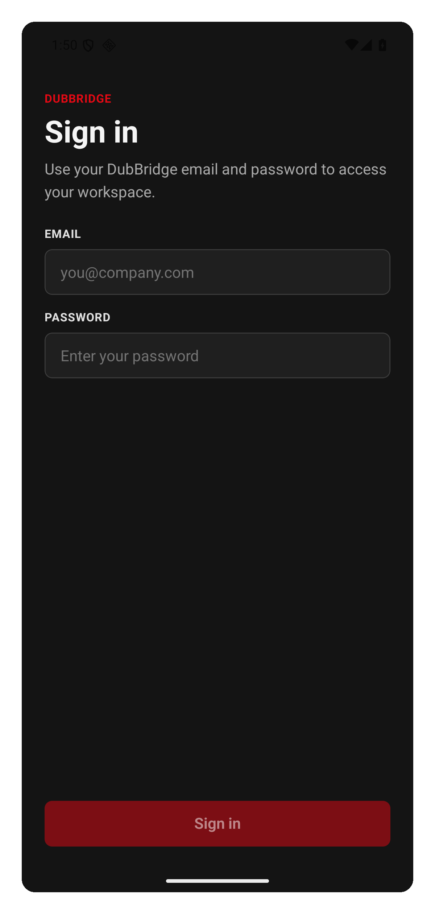<br/><sub>Login</sub></td>
    <td align="center">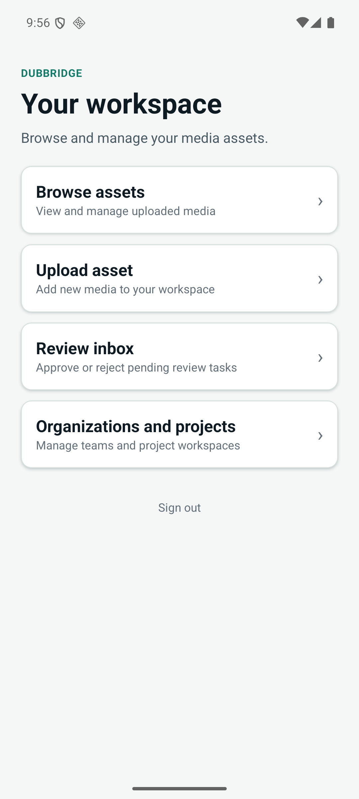<br/><sub>Home — your recent videos and quick actions</sub></td>
  </tr>
</table>

**Your videos**

<table align="center">
  <tr>
    <td align="center">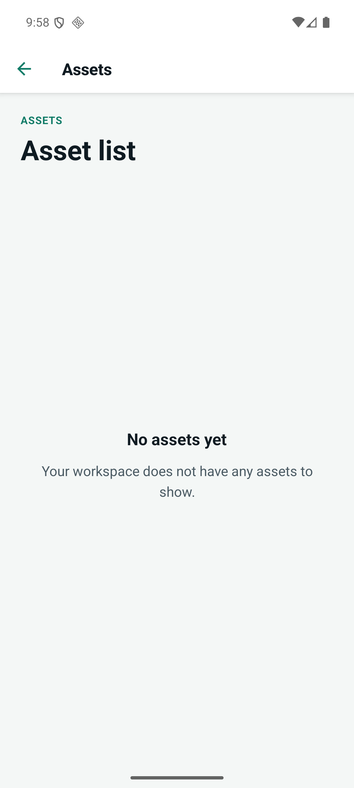<br/><sub>Your video library</sub></td>
    <td align="center">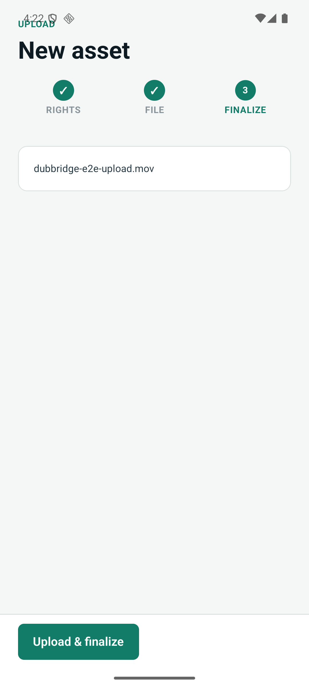<br/><sub>Upload a video</sub></td>
    <td align="center">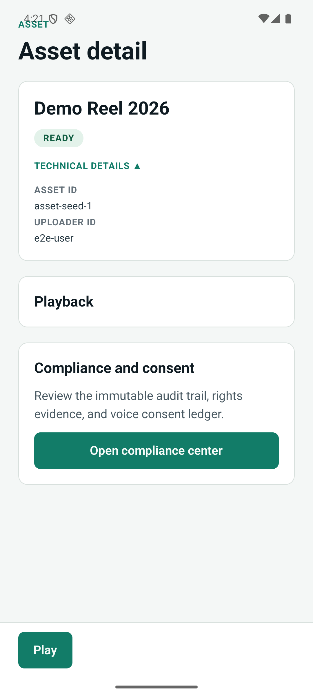<br/><sub>Video details</sub></td>
  </tr>
</table>

**Adding a video**

<table align="center">
  <tr>
    <td align="center">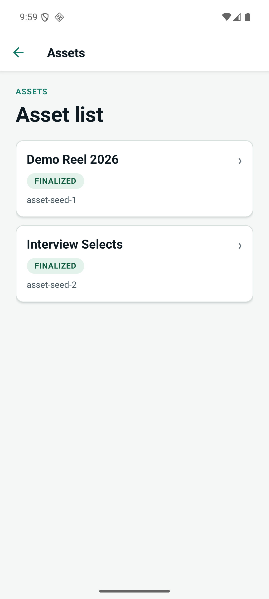<br/><sub>Video added — rights confirmed</sub></td>
    <td align="center">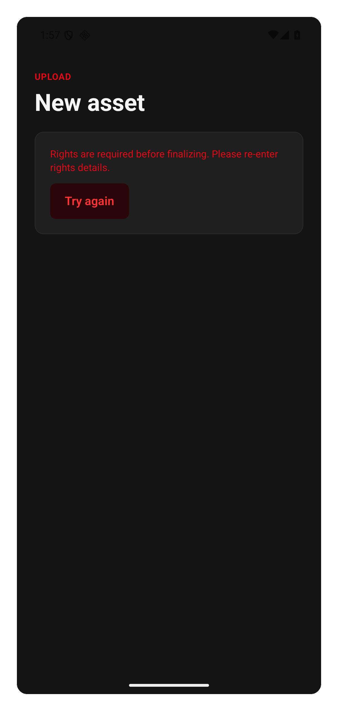<br/><sub>Blocked — rights missing</sub></td>
  </tr>
</table>

**Projects**

<table align="center">
  <tr>
    <td align="center">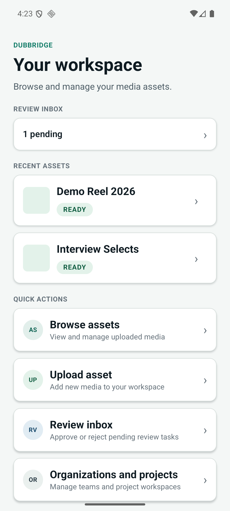<br/><sub>Home with active projects</sub></td>
    <td align="center">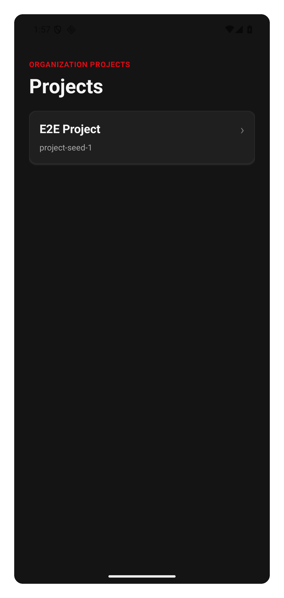<br/><sub>Project list</sub></td>
    <td align="center">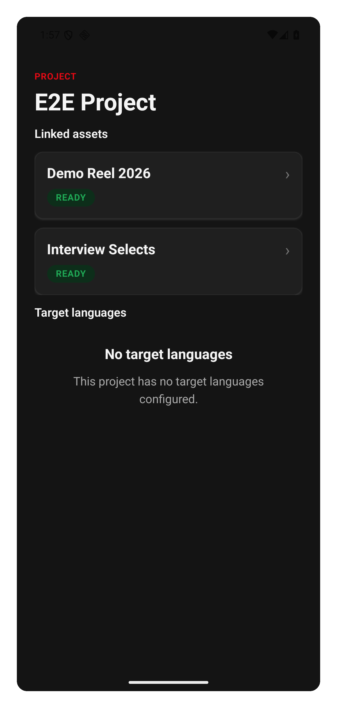<br/><sub>Project detail</sub></td>
  </tr>
</table>

**Watching in the app**

<table align="center">
  <tr>
    <td align="center">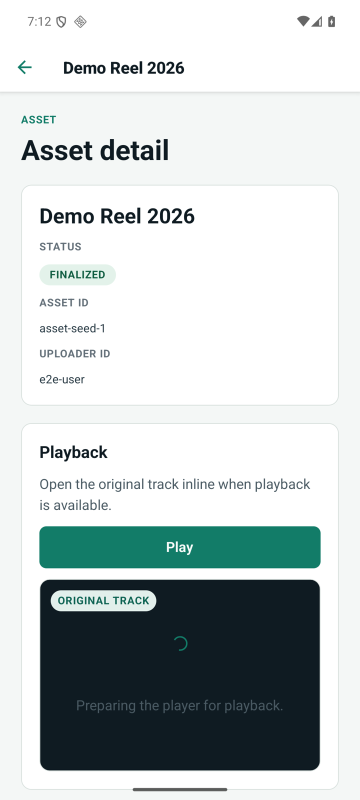<br/><sub>Original audio — playing in the app</sub></td>
    <td align="center">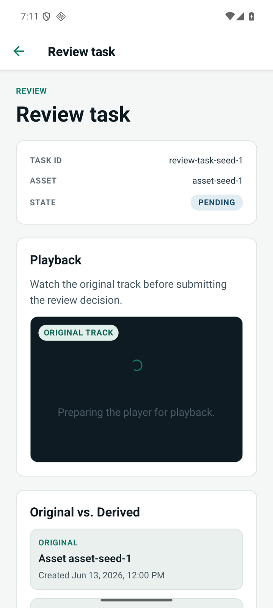<br/><sub>Dubbed audio — playing in the app</sub></td>
  </tr>
</table>

**Compliance and consent**

<table align="center">
  <tr>
    <td align="center">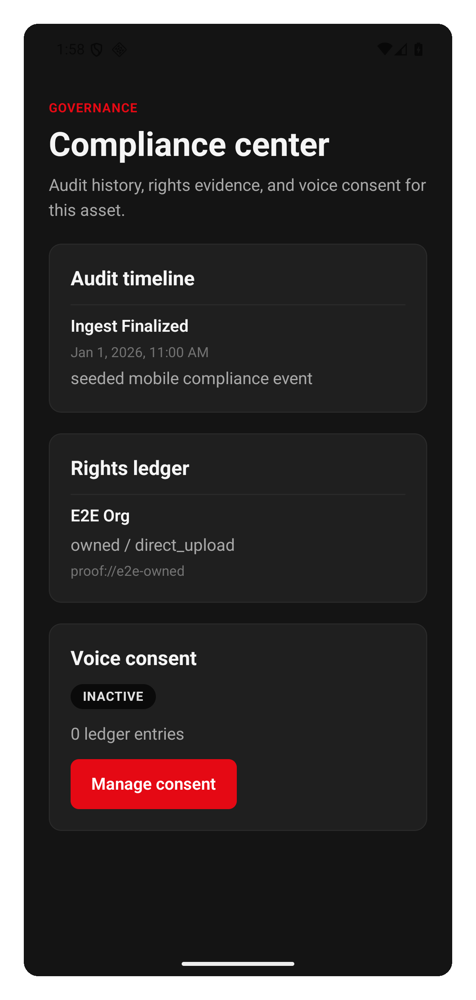<br/><sub>Compliance center</sub></td>
    <td align="center">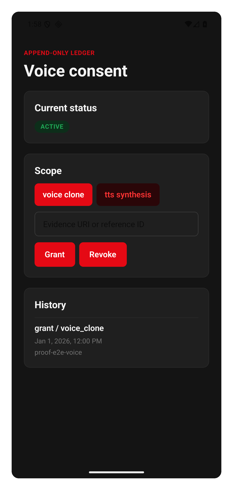<br/><sub>Consent active</sub></td>
    <td align="center">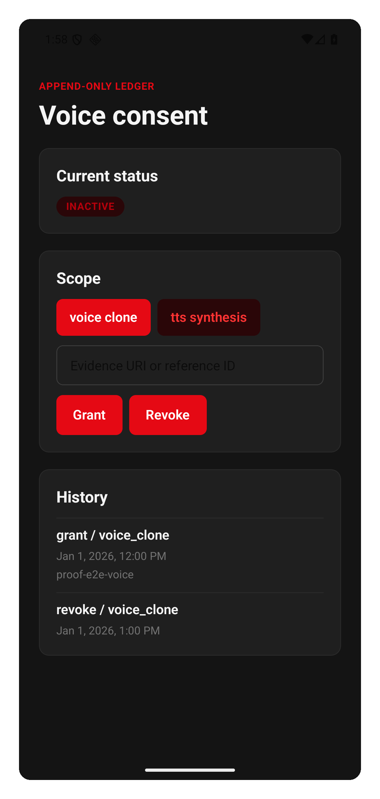<br/><sub>Consent revoked — everything stops</sub></td>
  </tr>
</table>

**Review workflow**

<table align="center">
  <tr>
    <td align="center">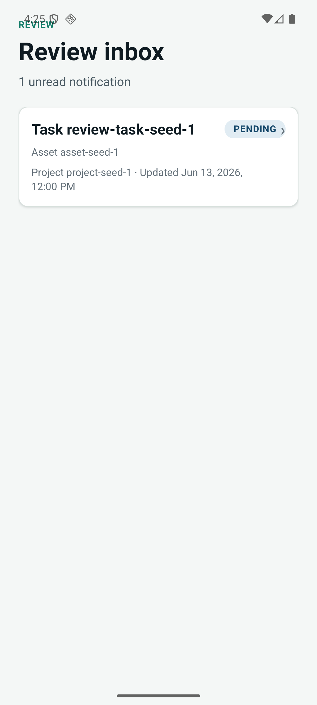<br/><sub>Inbox</sub></td>
    <td align="center">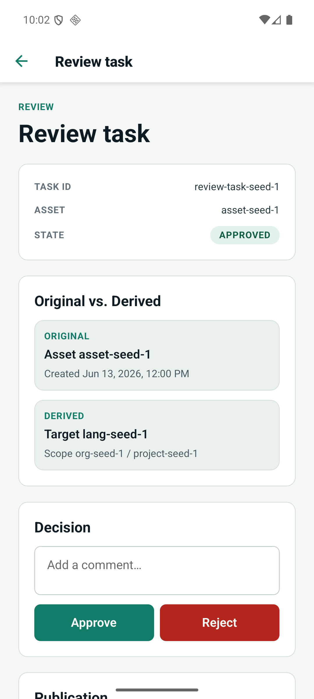<br/><sub>Detail</sub></td>
    <td align="center">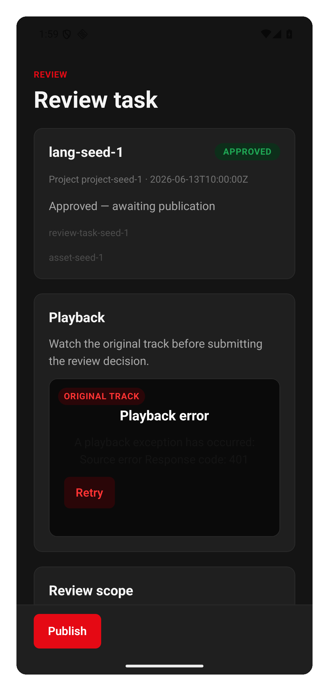<br/><sub>Approved</sub></td>
    <td align="center">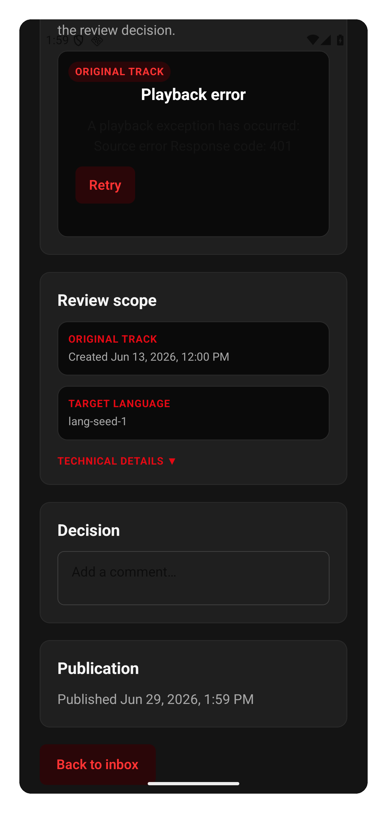<br/><sub>Published</sub></td>
  </tr>
</table>

## How it works

Once a video is in, it moves through a series of steps — each one a checkpoint it has to pass:

1. **Rights check** — nothing moves forward until we've confirmed you're allowed to use the video. No exceptions.
2. **Preparing the file** — the video is cleaned up and made ready to work with.
3. **Transcription** — the spoken words are turned into text automatically.
4. **Subtitles** — that text becomes timed subtitles.
5. **Dubbing** — a new audio track in the target language is created and matched to the original timing.
6. **Human review** — a person checks the result before it goes anywhere.
7. **Publishing** — the finished version is released, once every check has passed.

Every step is recorded, and every version can be traced back to where it came from. Nothing reaches an audience until it has cleared rights, quality, and a human review.

## Who it is for

- **Creators** who want their videos watched in more than the language they were filmed in, and shared with new communities.
- **Localization teams** who want one clear workflow instead of juggling a dozen tools.
- **Platforms** that handle a lot of video and need it available in many languages.

## How content gets in

- **Upload** — add your video directly from the app.
- **Import from another platform (coming)** — connect an account you own on another platform, and DubBridge brings your video over for you.
- **Live recording (coming)** — for live broadcasts, DubBridge can capture an authorized stream and bring it in.

However a video comes in, it goes through the same rights check first. There is no shortcut.

## Design

The orchestration core is Rust. AI workloads — transcription, translation, voice synthesis — run as isolated Python workers behind typed contracts, keeping the ML layer contained and the orchestration layer stable.

Authorization and auditability are structural, not optional. A job cannot proceed past a stage it has not cleared. Once ingested, originals are never modified — only transformed into derived outputs with explicit lineage.

## Development setup

Requires Rust (via `rustup`) and Docker.

```bash
# Start local infrastructure
docker compose -f infra/local/docker-compose.yml up -d postgres redis minio

# Run the API
DUBBRIDGE_ENV=local cargo run -p dubbridge-api
```

Install the repository's Git hooks:

```bash
git config core.hooksPath .githooks
```

Run QA checks before pushing:

```bash
make qa-local   # format + lint + tests
make qa-ci      # full CI mirror
```

For storage backends, environment config, dependency policy, and contributor tooling, see [DEVELOPMENT_REFERENCE.md](DEVELOPMENT_REFERENCE.md).

## Repository layout

```
apps/api            — HTTP API and health endpoints
apps/worker-runner  — background job execution
apps/cli            — operational utilities
crates/             — shared domain, persistence, storage, jobs, quality, auth, audit
workers/*-py        — Python AI worker contracts (ASR, translation, TTS)
infra/              — local infrastructure and database migrations
docs/               — architecture decisions, pipeline design, and development policy
mobile/             — React Native + Expo mobile client
```
