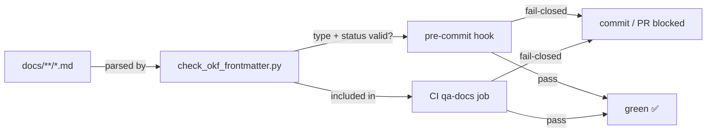

# DubBridge

DubBridge is a platform for localizing audiovisual content — taking a video in one language and producing a dubbed, subtitle-ready version in another, with full traceability from intake to publication.

## What it does

Content enters the target platform as a direct upload or, once the planned intake slice lands, as an owner-authorized download from a content platform (for example, importing content from an account the owner controls). From there, DubBridge takes it through a governed pipeline:

1. **Rights verification** — nothing moves forward without a confirmed authorization basis. This is a hard gate, not a best-effort check.
2. **Media preparation** — the file is analyzed, normalized, and made ready for processing.
3. **Transcription** — speech is converted to text using AI-based recognition.
4. **Subtitle generation** — timed subtitles are produced from the transcript.
5. **Dubbing** — a translated audio track is synthesized and aligned to the original timing.
6. **Human review** — a person verifies the output before anything is published.
7. **Publication** — the localized asset is released once every gate has passed.

Every step is logged. Every artifact has a traceable origin. Nothing reaches an audience without clearing rights, quality, and review.

## Who it is for

- **Content owners** who want to expand reach into new languages without losing control of their rights or their brand.
- **Localization teams** who need a structured workflow instead of a patchwork of tools.
- **Platforms** that handle user-generated or licensed video and need to offer multilingual outputs at scale.

## How content gets in

DubBridge accepts content these ways:

- **Upload (operational)** — send a file through the API. Authenticated clients submit assets directly.
- **Platform download (planned, primary intake)** — the content owner authorizes DubBridge to import content from an account they control; DubBridge downloads it on their behalf and ingests it through the same governed pipeline as an uploaded file. Access requires the owner's explicit, scoped authorization.
- **Live stream recording (planned, deferred sub-case)** — for clients producing live broadcasts, DubBridge can capture an authorized live stream and ingest the result through the same governed pipeline.

All paths converge, once delivered, at the same rights gate. There is no shortcut.

## Design philosophy

The platform is built so that authorization and auditability are structural, not optional. A job cannot proceed past a stage it has not cleared. Artifacts are immutable — once ingested, the original is never modified, only transformed into derived outputs with explicit lineage. Every governance event is recorded.

The processing core is written in Rust. AI workloads (transcription, translation, voice synthesis) run as isolated Python workers behind typed contracts, keeping the ML ecosystem contained and the orchestration layer stable.

## Development setup

Requires Rust (via `rustup`) and Docker.

```
# Local infrastructure only — this Compose file is never the production deployment
# descriptor (ADR-026).
docker compose -f infra/local/docker-compose.yml up -d postgres redis minio
# Start local app containers only when you explicitly opt into the app profile.
# Put auth env vars in .env before starting the protected API container.
docker compose -f infra/local/docker-compose.yml --profile app up api worker-runner
# Configure the auth env required by your local profile before starting the
# protected API outside Compose.
cargo run -p dubbridge-api
```

Enable the shared Git hook path so local `pre-push` uses the repository hook:

```bash
git config core.hooksPath .githooks
```

Local Rust QA commands:

```bash
make qa-local          # fmt + clippy + test + cargo check
make qa-deny           # dependency policy / advisories
make qa-coverage       # 90% coverage gate (existing llvm-cov scope)
make qa-build-release  # release build verification
make qa-ci             # full local mirror of the blocking CI baseline
```

When `Cargo.toml` or `Cargo.lock` changes, install `cargo-deny` locally:

```bash
cargo install cargo-deny --version 0.18.4 --locked
```

Infrastructure: PostgreSQL for state, Redis for job coordination, MinIO for object storage.
Local app-container wiring now lives in the opt-in `app` profile of
`infra/local/docker-compose.yml`; it targets container DNS (`postgres`, `redis`) and
keeps auth secrets in a local `.env`.

The default local app profile still uses `storage.backend = local_fs`. To exercise
the S3-compatible path against local MinIO, start the app profile with:

```bash
DUBBRIDGE_STORAGE_BACKEND=s3 docker compose -f infra/local/docker-compose.yml --profile app up
```

The compose file points the Rust containers at `http://minio:9000`, bucket
`dubbridge-local`, and the local-only MinIO credentials `dubbridge` /
`dubbridge123`. Keep production object-store credentials in deployment secrets, not
committed config.

### Object cleanup and reconciliation

Uploads write the object first, then persist the relational pending-ingestion row.
If the relational write fails, the API attempts immediate cleanup of the just-written
object and logs any cleanup failure with the ingest token and storage key.

The API also runs periodic storage reconciliation from the same cleanup worker. The
reconciliation pass lists canonical `ingests/` keys through `StorageAdapter`, compares
them with `pending_ingestions.storage_key` and `artifact_records.storage_key`, and
deletes only planner-approved orphan candidates. Referenced objects are retained, and
malformed or unexpected keys are skipped and logged. Delete failures keep enough
context for a later run to retry; rerunning reconciliation after successful deletion is
a no-op for already-repaired state.

### Environments (local vs production)

Local and production are separated by a fail-closed layered configuration model
governed by ADR-026 and delivered in slice P0
(`docs/plan/s-030-environment-separation.md`). `crates/config` now requires an explicit
`DUBBRIDGE_ENV`, loads committed non-secret `config/<env>.toml` profiles, accepts
secrets only through injected environment variables, and runs a production
`validate()` that rejects local defaults (localhost datastores, local-fs storage,
absent auth). The Docker Compose file above is local infrastructure only and is never
the production deployment descriptor, and the local Rust app containers track
`rust-toolchain.toml` via `rust:stable`.

### Agent workflow and task complexity (RRI)

All development in this repository follows a mandatory
`analyze → plan → tasks → approval → implement` workflow governed by
`docs/playbooks/AGENT_WORKFLOW_GUIDE.md`.

Before implementing any task, agents compute a **Required Reasoning Index (RRI)**
score that estimates how much reasoning, caution, and verification the task
requires. The RRI combines cyclomatic complexity, files affected, domain risk,
test-coverage risk, ambiguity, coupling, security/data impact, and context size
into a single score with penalties for high-risk combinations.

| RRI band | Label | What it requires |
|---|---|---|
| 0–25 | Low | Auto-execute via local Gemma (Ollama); orchestrator reviews + reports |
| 26–40 | Moderate | Confirm area tests exist |
| 41–55 | Med-high | Plan + explicit acceptance criteria |
| 56–70 | Complex | Plan first; human reviews the plan |
| 71–85 | High | Characterization tests + human reviews the diff |
| 86–100 | Very high | ADR + risk analysis + decompose first |
| > 100 | Excessive | Architecture work required before any implementation |

Low-band tasks (RRI 0–25) are delegated to a local Gemma model running through
Ollama — no cloud call, no approval gate. The orchestrating agent reviews the
output and reports before marking the task done. Full procedure: `docs/policies/RRI_POLICY.md`.

Background and design rationale: `docs/prompts/medium-article-rri-output.md`.

## Knowledge format (OKF)

Every documentation file in `docs/` carries a YAML frontmatter block that declares its type:

```yaml
---
type: ADR        # one of 10 closed values
status: Accepted
---
```

The closed vocabulary and rules live in [`docs/knowledge/README.md`](docs/knowledge/README.md). The validator runs on every commit:



```bash
make qa-okf-frontmatter   # run the validator alone
make qa-docs              # full doc gate (includes OKF)
```

## Repository layout

```
apps/api            — HTTP API and health endpoints
apps/worker-runner  — background job execution
apps/cli            — operational utilities
crates/             — shared domain, persistence, storage, jobs, quality, auth, audit
workers/*-py        — Python AI worker contracts (ASR, translation, TTS)
infra/              — local infrastructure and database migrations
docs/               — architecture decisions, pipeline design, and development policy
```

## Mobile client

The first-party mobile app (React Native + Expo) puts the full content lifecycle in your pocket — from uploading a raw file to approving the final localized output before it goes live.

**Sign in** — Authentication is the entry point. Users log in with their credentials and land on a personalized home screen. ([Login](mobile/artifacts/screenshots/01_auth_login.png))

**Home & projects** — The [home screen](mobile/artifacts/screenshots/02_home.png) surfaces what matters right now. Once you have active projects, it adapts to show them front and center. From there you can drill into the [project list](mobile/artifacts/screenshots/09_project_list.png) and open any [project detail](mobile/artifacts/screenshots/10_project_detail.png) to see its current state, assets, and history.

**My assets** — Your content library is always a tap away. The [asset list](mobile/artifacts/screenshots/03_asset_list.png) gives an overview of everything you own; the [asset detail](mobile/artifacts/screenshots/04_asset_detail.png) shows its full metadata, status, and lineage. To add new content you go through the [upload flow](mobile/artifacts/screenshots/05_upload.png), which hands the file off to the ingestion pipeline. If rights are confirmed, ingestion completes cleanly ([complete](mobile/artifacts/screenshots/06_ingest_complete.png)); if authorization is missing or invalid, the pipeline stops and tells you exactly why ([no rights](mobile/artifacts/screenshots/07_ingest_no_rights.png)). Nothing moves forward without a valid rights basis.

**Compliance** — The [compliance center](mobile/artifacts/screenshots/11_compliance_center.png) is where consent is managed. Every asset carries a consent record that you can inspect at any time — [active](mobile/artifacts/screenshots/12_consent_active.png) when authorization is in place, [revoked](mobile/artifacts/screenshots/13_consent_revoked.png) when it has been withdrawn. A revocation propagates immediately: no further processing is allowed until consent is reinstated.

**Review** — Once the localization pipeline has run, the output lands in a reviewer's [inbox](mobile/artifacts/screenshots/14_review_inbox.png). Opening a job shows the [review detail](mobile/artifacts/screenshots/15_review_detail.png) — the translated audio, subtitles, and any quality flags raised during processing. The reviewer either clears it ([approved](mobile/artifacts/screenshots/16_review_approved.png)) or sends it back. Approved content moves to the final step: [publication](mobile/artifacts/screenshots/17_review_published.png), the point at which the localized asset becomes available to its audience.

---

*DubBridge is under active development. JWT-protected upload ingestion, the rights ledger, the first-party mobile client (React Native + Expo), and the full mobile asset lifecycle — asset list, detail, and upload flow with a Maestro screenshot suite — are operational. Platform-download intake (primary), live stream recording (deferred sub-case), media preparation, transcription, dubbing, and publication remain planned work.*
