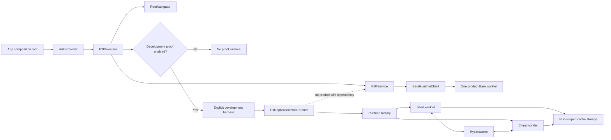

# ADR-043: Mobile P2P runtime ownership and proof isolation

- **Status:** Accepted
- **Date:** 2026-08-27
- **Deciders:** DubBridge owner and mobile/P2P maintainers
- **Scope:** MVP0-P2P mobile composition, Bare runtime ownership, worklet
  packaging/protocol, lifecycle, and isolation of replication proofs
- **Does not decide:** P2P audience authorization, encryption/envelopes,
  publication/outbox semantics, Availability Node deployment, or replacement of
  ADR-032; those remain separate pre-P2 decisions

## Context

P0 proved that the Android Expo/React Native application can start a Bare
worklet, exchange a bounded request/reply, and shut it down. That compatibility
spike deliberately mounted an invisible `AndroidBareRuntimeProbe` next to
`RootNavigator`, embedded worklet source in the React Native bundle, and used a
small custom JSON protocol.

Those choices are acceptable evidence scaffolding but are not a maintainable
product runtime boundary. Extending them directly for P1 would:

- make `App.tsx` and a proof-only React effect responsible for runtime policy;
- tempt navigation code to own non-navigation lifecycle;
- couple product state to a custom request multiplexer and inline worklet source;
- make a two-worklet proof topology look like the future mobile topology;
- omit explicit worklet fatal-error and app suspend/resume handling; and
- incorrectly describe Hyperdrive/Corestore storage as memory-only even though
  the current Hypercore storage contract is path-backed.

The revised P1 program scores RRI 94 (Very high). It therefore requires an ADR,
risk analysis, and decomposition before implementation.

## Decision

This decision took effect when the repository owner approved the revised P1
parent on 2026-08-27. Each implementation child remains separately gated.

### 1. Compose runtime providers above navigation

The mobile composition root owns cross-cutting providers in this dependency
order:

```text
App.tsx
└── SafeAreaProvider
    └── AuthProvider
        └── P2PProvider
            ├── RootNavigator
            └── development-only proof harness (when explicitly enabled)
```

`RootNavigator` owns navigation, route selection, deep links, and
navigation-coupled push behavior. It consumes auth/P2P state but does not create
their providers and does not own a Bare worklet.

### 2. Give the product one stable service/runtime boundary

`P2PProvider` owns one framework-independent `P2PService`; `P2PService` owns one
product `BareRuntimeClient`. The provider exposes a stable service reference and
subscribable snapshots. Status consumers use an external-store subscription
boundary so frequent runtime/progress changes do not rerender the entire
navigation tree.

The product runtime does not start network activity merely because the provider
is mounted. Authentication plus a future explicit product command/feature gate
will control activation. Sign-out cleanup is specified when persistent product
state is introduced, not guessed during P1.

### 3. Package a dedicated Bare backend reproducibly

Bare code lives in a dedicated source module and is packaged reproducibly with
`bare-pack`; React Native imports the generated bundle rather than maintaining a
large inline source string. CI/test tooling detects bundle drift.

Host/worklet request multiplexing uses `bare-rpc`. DubBridge keeps a small,
typed, versioned application protocol over it, with runtime validation, a
handshake (`protocolVersion` plus capabilities/runtime version), bounded
timeouts, and typed/redacted errors.

### 4. Make lifecycle and failure handling explicit

The worklet installs handlers for `uncaughtException` and
`unhandledRejection`, emits a typed fatal receipt when possible, then closes
safely. It responds to Bare `suspend`/`resume` events; network/storage resources
suspend in dependency order and resume in reverse order.

Runtime lifecycle and per-operation progress are separate state machines:

- runtime: `stopped → starting → ready ↔ suspended → stopping → stopped`, with
  `failed` reachable from active states;
- operation: `queued → discovering → replicating → verifying → completed`, with
  `failed` and `cancelled` terminal alternatives.

### 5. Keep proof topology outside the product service API

Normal mobile operation targets one Bare worklet. P1's seed/client topology is a
diagnostic proof only. A `P1ReplicationProofRunner` obtains two isolated runtime
sessions from a factory and is invoked only by an explicit development harness.
It is not exposed through the product `P2PService` API and is never enabled by
default.

The P0 probe is retained only as a characterization oracle until the new runtime
and service reproduce `initialize → ping → shutdown`. P1.F3a.1 implements this
replacement in `P2PDevelopmentHarness` with automated verification pending
owner final verification. It is then retired in
explicit cleanup children: the probe, custom bridge/protocol, inline worklet,
obsolete tests, flag, and script are deleted or replaced. Historical audit
evidence remains. Dependencies and Android build settings survive only with a
documented consumer or a native A/B proof; the Bare Kit runtime itself remains
because it is the selected runtime boundary.

### 6. Use transient filesystem storage with verifiable cleanup

Synthetic fixture bytes may be generated in memory, but Hyperdrive/Corestore
metadata and blocks use a run-scoped directory below the platform cache, for
example `Paths.cache/dubbridge-p2p/proofs/<run-id>`. Every proof:

1. creates only inside its validated run directory;
2. closes drive/store/runtime handles;
3. deletes that directory;
4. verifies it no longer exists; and
5. runs a bounded startup janitor for abandoned proof directories after a crash.

Persistent product cache/identity semantics remain a later explicit decision.

## Functional boundary



## Risk analysis

| Risk | Failure mode | Mitigation |
|---|---|---|
| Navigation/runtime coupling | `RootNavigator` becomes a service locator or owns long-lived worklets | Providers live in the app composition root; navigator only consumes state/actions |
| Global rerender pressure | Replication progress rerenders all navigation | Stable service identity plus external-store snapshots and selector-oriented hooks |
| Bundle drift | Generated worklet no longer matches source/dependencies | Deterministic `bare-pack` command plus checked bundle digest/drift test |
| Protocol drift | Host and worklet accept incompatible messages | Versioned handshake, runtime validators, typed unsupported-version failure |
| Host-process abort | Unhandled worklet failure terminates the host | Global Bare fatal handlers, typed receipt, bounded close/termination tests |
| Suspend corruption | App lifecycle interrupts swarm/store in unsafe order | Explicit Bare suspend/resume handlers and dependency-ordered lifecycle tests |
| Residual proof data | Crash or failed teardown leaves fixture blocks | Validated run-scoped cache path, close-before-delete, nonexistence check, startup janitor |
| Proof becomes product topology | Two mobile worklets and seed commands leak into product API | Proof runner/factory namespace separate from `P2PService`; one product worklet target |
| Accidental network activation | Mounting providers starts discovery | Provider construction is inert; explicit gated command required |
| Premature security claims | Synthetic proof is mistaken for encrypted authorized delivery | P1 excludes assets, keys, invites, audience authorization, and ADR-032 replacement |

## Consequences

### Positive

- Mobile composition, product service ownership, and diagnostic proofs have
  explicit, testable dependency direction.
- The P0 spike can evolve without freezing its temporary probe and protocol as
  permanent architecture.
- Runtime failures, application suspension, protocol drift, and temporary-data
  cleanup become first-class contracts.
- Later UI can consume P2P state without embedding runtime mechanics in screens
  or navigation.

### Negative / cost

- P1 becomes a foundation-plus-proof program rather than a small extension of
  P0 and must be delivered through more independently approved children.
- Reproducible worklet packaging adds a generated artifact and drift gate.
- The proof uses transient disk storage and cleanup machinery even though its
  fixture bytes are synthetic.

### Neutral

- This ADR does not establish that the P2P business model is viable.
- It does not authorize product network activity or change current HTTP HLS
  playback under ADR-032.
- A native Android service/TurboModule is not introduced. That option remains
  available only if later background-execution requirements cannot be satisfied
  by the Bare Kit worklet lifecycle.

## Alternatives considered

### Keep extending `AndroidBareRuntimeProbe`

Rejected as the long-term boundary. It is useful as a P0 compatibility harness,
but a React component returning `null` should not own product runtime policy or
define the service API.

### Put all P2P ownership in `RootNavigator`

Rejected. Navigation lifecycle and runtime lifecycle differ; coupling them
would make route remounts, auth changes, deep-link behavior, and P2P teardown
interdependent and harder to test.

### Give every feature its own Bare worklet

Rejected for the product topology. It multiplies lifecycle, memory, protocol,
and resource ownership. A runtime factory remains available for bounded tests
and the two-session P1 proof only.

### Build a custom Android background service now

Rejected for P1. Bare Kit already supplies the native/worklet boundary needed
for the foreground feasibility proof. Background-service complexity is deferred
until a concrete product requirement demonstrates it is necessary.

## Implementation sequence

1. P1.F1 — reproducible worklet bundle and versioned `bare-rpc` contract.
   Closed PASS after repository-owner verification on 2026-08-27.
2. P1.F2 — `BareRuntimeClient`, `P2PService`, `P2PProvider`, and
   composition-root ownership while the P0 oracle still guards parity.
3. P1.F3a.1 — migrated the diagnostic ping to the new boundary and transferred
   characterization cases while retaining the P0 scaffold as an oracle.
   Automated verification passed on 2026-08-27; owner final verification is
   pending before retirement.
4. P1.F3a.2 — after parity passes, delete the P0 probe/custom RPC/inline
   worklet and prove the retained development harness on Android.
5. P1.F3b — remove obsolete P0 config/script entries and audit every P0-added
   direct dependency/build setting against a live consumer or native A/B proof.
6. P1.A1 — Corestore/Hyperdrive dependency and bundle smoke proof.
7. P1.A2 — run-scoped transient seed storage, cleanup, and janitor proof.
8. P1.B1 — isolated Hyperswarm discovery/replication transport.
9. P1.B2 — SHA-256 verification, bounded reconnect, fail-closed evidence, and
   complete teardown.

Each child receives a current RRI, approval card, and explicit approval before
source edits.

Current implementation evidence:
`docs/audit/mvp0-p2p-p1-f1-implementation.md`,
`docs/audit/mvp0-p2p-p1-f2-implementation.md` (F2 closed PASS after owner
verification on 2026-08-27), and
`docs/audit/mvp0-p2p-p1-f3a1-implementation.md` (F3a.1 owner verification
pending).

## References

- `docs/plan/mvp0-p2p-first.md`
- `docs/plan/mvp0-p2p-p1-replication.md`
- `docs/tasks/mvp0-p2p-p1-replication.md`
- `docs/adr/ADR-029-mobile-as-sole-authenticated-product-surface.md`
- `docs/adr/ADR-032-hls-playback-delivery-boundary.md`
- Pear mobile guide: <https://github.com/holepunchto/pear-docs/blob/main/guide/making-a-bare-mobile-app.md>
- Bare Kit: <https://github.com/holepunchto/bare-kit>
- Bare suspension: <https://docs.pears.com/how-to/run-on-native/handle-app-suspension/>
- `bare-rpc`: <https://github.com/holepunchto/bare-rpc>
- `bare-pack`: <https://github.com/holepunchto/bare-pack>
- Hypercore storage contract: <https://github.com/holepunchto/hypercore>
- Expo filesystem cache: <https://docs.expo.dev/versions/v56.0.0/sdk/filesystem/>
