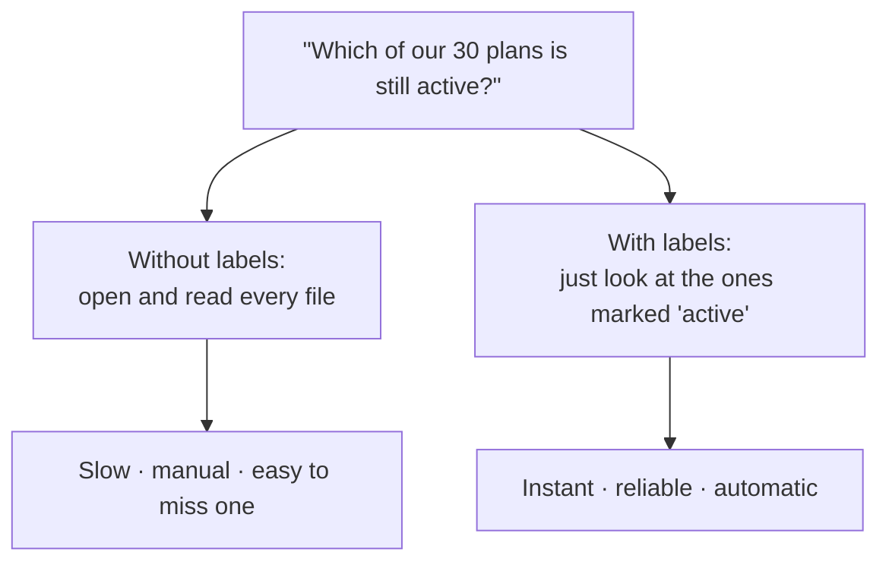
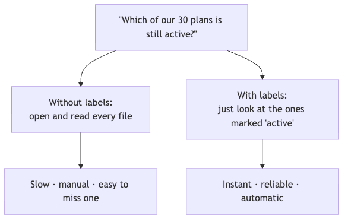
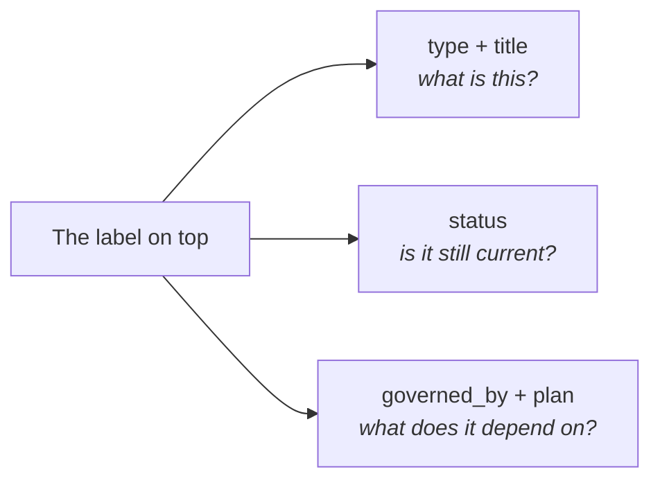
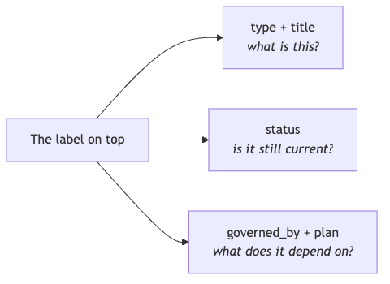
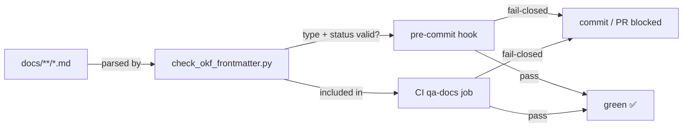
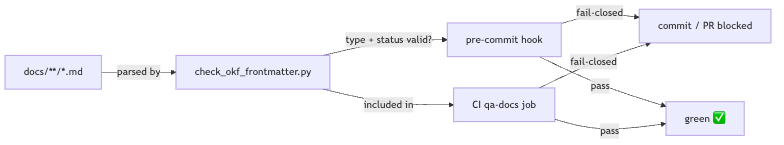
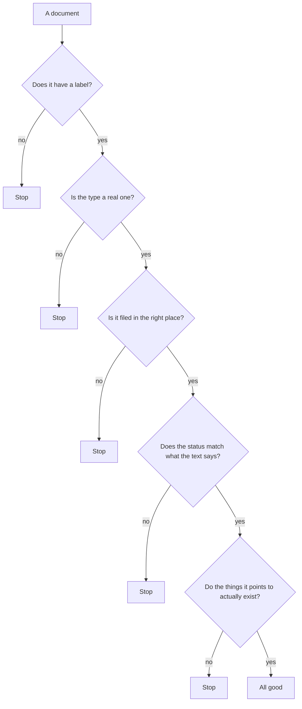
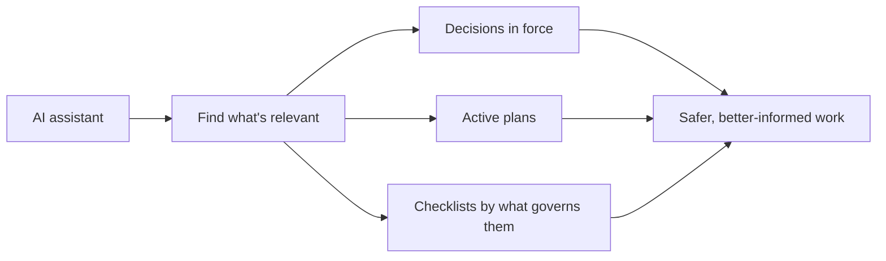
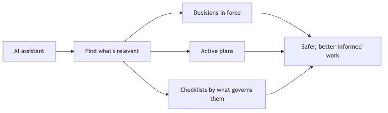

# From Forgotten Decisions to a Living Project Memory

*This article shows how adding a few lines of structured labels to project
documents — using the Open Knowledge Format (OKF) — makes decisions, plans, and
rules searchable and trustworthy for both people and AI assistants. No new tools,
no database: just labels, a fixed vocabulary, and an automatic checker.*

---

Imagine a library where none of the books have a label. No spine sticker, no
index card, nothing on the cover to tell you the subject, whether the book is
still current, or which other books it relates to. Everything you need is *inside*
the books — but to find anything, you have to open each one and read it.

That is roughly what most project documentation looks like to a computer. The
information is all there, written clearly for people. But a machine can't tell at
a glance which documents are still in force, which are outdated, or how they
connect. It has to read every file, every time.

This article is about a small fix for that: add a few lines of labels to the top
of each document — like the index card in a library catalog — and then have an
automatic checker make sure those labels stay honest. The labels follow a simple,
public recipe called the **Open Knowledge Format**, or **OKF**, published by
Google Cloud. You can read the
[specification](https://github.com/GoogleCloudPlatform/knowledge-catalog/blob/main/okf/SPEC.md)
and Google's
[announcement](https://cloud.google.com/blog/products/data-analytics/how-the-open-knowledge-format-can-improve-data-sharing)
if you're curious, but you don't need to.

## A real project to make it concrete

The examples here are not made up. They come from a real, open project called
[**DubBridge**](https://github.com/krukmat/dubbridge): a platform for turning
videos from one language into another. DubBridge checks that the content owner
has the rights, prepares the file, turns the speech into text, adds subtitles,
makes a translated voice track, sends the result to a human reviewer, and only
then publishes. (You can browse the code at
[github.com/krukmat/dubbridge](https://github.com/krukmat/dubbridge).)

One detail matters for this story: a lot of that software is built by **AI
assistants** — programs that help write the code. Those assistants read the
project's own documents to learn the rules before they touch anything.

So the documents aren't just reference material sitting on a shelf. They're
working instructions that something reads, all day, to decide what to do. A few
kinds carry most of that weight:

- **Decisions** — short notes that each record one choice the team made, and
  whether that choice is still in force. (DubBridge calls them ADRs; the name
  doesn't matter here.)
- **Plans** — the roadmap for a chunk of work.
- **Checklists** — lists tracking the tasks inside a plan.
- **Rules** — the policies an assistant must follow.

## Why labels matter here

Here is the real problem DubBridge ran into. Its plans folder holds **about 30
plans**. Some are finished and shipped. Some are being worked on now. Some are
just ideas for later. All of them sit in the same folder, looking identical.
Nothing told a machine — or a new person — which was which. Answering simple
questions meant opening and reading files one by one:

- Which decisions are still in force?
- Which of those 30 plans is still active, and which are done?
- Which checklists have to follow a particular decision?
- Does what a document *says* about itself still match the master list?

The answers were always *in there somewhere* — but getting them meant a person
reading files. Slow, manual, and easy to get wrong.





## The simple move: add a label

The change was small. Each document got a little header — the index card.
Here is a real one from DubBridge, on a plan for a mobile login feature
(its internal code name is "S-200"):

```yaml
---
type: Plan
title: "Plan: S-200 — Mobile credential login with backend-issued JWT"
status: planned
slice: S-200
governed_by: [ADR-031]
---
```

If that looks like dense computer text, skip right over it. All it does is
answer three plain questions about the document. That header is really just
saying: *"I'm a plan. I'm still only planned, not started or finished. I belong
to the work unit called S-200. And I have to follow decision ADR-031."*

Other documents use the same pattern. A task checklist keeps the same identity
and status fields, then adds links to show what plan it belongs to and which
decisions it must follow.





One rule keeps this from turning into chaos: the kind of document (`type`) comes
from a **fixed, short list** — about ten values, like *decision*, *plan*,
*checklist*, *rule*, and *roadmap*. You can't invent a new kind on the fly.
A fixed list is the difference between a tidy catalog and one where every
librarian makes up their own categories.

## Keeping the labels honest

A label is only useful if you can trust it. A book filed under the wrong subject
is worse than no label at all — now you trust it, and it's wrong.

So in DubBridge the labels aren't left on the honor system. A small checker reads
them and confirms they're valid. It runs at two moments: on a contributor's own
machine *before* they save their work, and again as a shared checkpoint *every
time* a change is proposed. This is the actual diagram from the project's README:





In plain terms: the documents are read by a small checker program. It runs as a
check on your own machine before you save, and again as a shared check that
everyone's changes pass through. If the labels are valid, the change goes through
— green. If they aren't, it's blocked. In the project you run it with one
command:

```bash
make qa-okf-frontmatter   # run just the label checker
make qa-docs              # the full documentation check (includes it)
```

The key word in that diagram is **fail-closed**: the checker is cautious by
design. If it *can't confirm* a label is valid, it stops the change. It does not
let it slip through. Better to pause and fix the card than to shelve a mislabeled
book.

The checker walks through a short list of questions:




These checks catch the small mistakes that creep in as documents get edited over
months. The examples below are exactly the kind DubBridge hits:

- a decision whose text says it's been **accepted**, but whose label still says
  "proposed" — the checker insists the two agree;
- a checklist pointing to a decision record — say, `ADR-031` — that doesn't
  actually exist;
- a *plan* saved in the *decisions* folder by mistake;
- a new document that someone forgot to label at all.

Each of these is the kind of slip a busy reviewer might wave through. The checker
catches every one.

## Why this helps the AI assistants

Once the labels are there and trustworthy, the AI assistants building DubBridge
don't have to guess as much. Instead of skimming every file to find what's
relevant, they can ask for exactly the documents that apply to the job at hand:

- *every decision that's still in force,*
- *every plan still marked active* (no more wading through the finished ones),
- *every checklist that must follow decision `ADR-033`.*





It's the difference between a labeled, sorted filing cabinet and a pile of loose
paper. Same information — but one of them you can actually use. And it happened
without buying a new tool, building a database, or moving documents anywhere.
They're still ordinary files in ordinary folders.

## The takeaway

Nothing dramatic changed. Adopting OKF in DubBridge added a header to about **50
documents** and wired one checker into the routine documentation check. It touched
**nothing** about how the video pipeline runs. No new software, no new service, no
separate "knowledge vault."

What it bought, in plain terms:

- documents you can sort and filter at a glance;
- a clear view of which of those 30 plans are alive and which are finished;
- clear links between tasks and the decisions that govern them;
- a way to catch mislabeled or outdated documents before anyone has to notice by
  hand;
- AI assistants that find the right context faster, with less searching.

That is the value of OKF here. It does not replace the documents, and it does not
make them smarter. It simply makes them easier to find, easier to trust, and
easier to check.

In [DubBridge](https://github.com/krukmat/dubbridge) — an open platform for
turning video into other languages — that small change turned documentation from a
pile of files into a working part of the process: something people can navigate
faster, and something machines can use without guessing.
