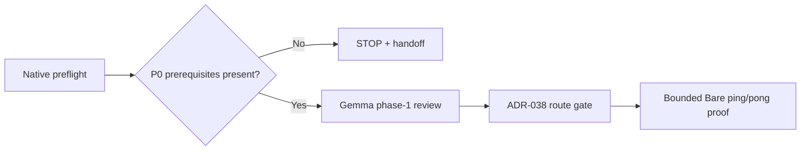
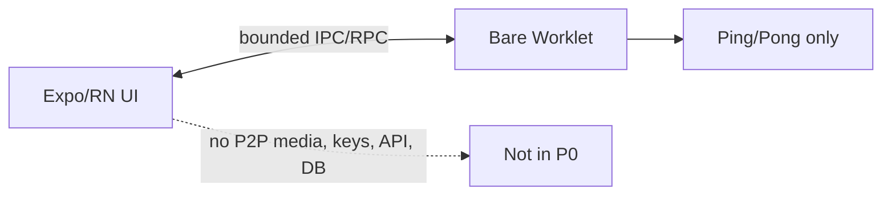

# P0 — Bare / Expo / React Native compatibility spike

## 1. Decision

- **Status:** active, before implementation.
- **RRI / Complexity / Effort:** 54 / Med-high / L. Full evidence:
  `docs/audit/mvp0-p2p-p0-rri.md`.
- **Route:** task-local executor pin `gpt-5.6-terra` at `high`; RRI 46–55 is
  cloud-only after the ADR-038 Architect-refined gate. This task must STOP
  before that gate if the native prerequisite preflight fails.
- **Review:** Gemma `gemma4:26b-a4b-it-qat` phase 1; phase 2 is required only
  if implementation produces a code diff.
- **Authorization:** the user explicitly directed, “pues comienza segun el
  README del folder,” on 2026-08-27. It authorizes this bounded P0 startup;
  it does not authorize P1–P7 or broaden P0's allowed paths.
- **RRI drivers:** platform-native integration (D/K 4), no area-specific tests
  (T 4), and six expected files (F 3). No penalty applies to a stop/go spike.

## 2. Scope and acceptance

Validate current Expo SDK 56 / React Native 0.85 compatibility with a bounded
Bare worklet and ping/pong RPC. In scope: `mobile/package*.json`,
`mobile/app.config.ts`, the minimal `mobile/src/p2p/**` bridge and tests, plus
native generated configuration only when required to prove the build. Out of
scope: P2P networking/media, local HTTP, keys, invites, APIs, databases, and
product UI.

- **HP-1:** native dev build starts the worklet; `initialize → ping` returns
  `pong`.
- **HP-2:** shutdown cleans up and the existing app typechecks/builds.
- **EC-1:** worklet/RPC initialization failure is typed and does not crash the
  host app.
- **EC-2:** timeout, malformed reply, or shutdown-before-ready rejects without
  a stale worklet handle.
- **Evidence:** package/version and native prerequisite evidence; native proof;
  unit tests; typecheck; PASS or STOP handoff.
- **Status sync:** plan, ledger, external P0 handoff/RUN_STATE, and roadmap at
  closure.

## 3. Agent workflow

| Phase | Responsible participant | Gate / output | Fallback |
|---|---|---|---|
| Analyze/scope | Codex | P0 preflight + plan/ledger | STOP on missing native prerequisite |
| Phase 1 review | Gemma `gemma4:26b-a4b-it-qat` | PASS review artifact | Muse Glimmer, then D14 selection checkpoint |
| Approval | User (recorded above) | bounded P0 authorization | no P1–P7 authorization |
| Implement | `gpt-5.6-terra` / high after ADR-038 route only | limited bridge proof | STOP remains valid before code |
| Reflect/verify | Codex, 3 passes if code exists | contract → host-failure → coverage | n/a on documented STOP |
| Phase 2 review | Gemma `gemma4:26b-a4b-it-qat` | code review artifact if diff exists | Muse Glimmer, then D14 |
| Close | Codex | P0 handoff + status synchronization | blocked report |

## 4. Diagrams

## 5. References

- `docs/tasks/mvp0-p2p-first.md`
- `docs/plan/mvp0-p2p-first.md`
- `p2p-mvp/_active_task/{CONTEXT,ACCEPTANCE,REPO_SCOPE}.md`
- `docs/playbooks/AGENT_WORKFLOW_GUIDE.md`
- `docs/policies/RRI_POLICY.md`; `docs/policies/HITL_AUTONOMY_POLICY.md`
- ADR-032

## 6. Approval checkpoint

The user has explicitly authorized the bounded P0 startup. Execution remains
limited to P0 and stops on a concrete native/toolchain blocker.
