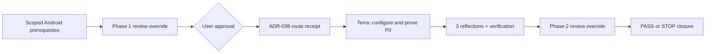
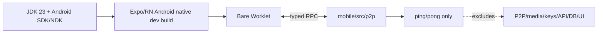

# Compact Approval Task Card v2 — P0 resumption

## 1. Decision header

**P0 — Bare / Expo / React Native compatibility spike (native-toolchain resumption)**
**Status:** active; the approved proof is Android-only until the owner explicitly
extends the platform scope.
**RRI / Complexity / Effort:** **54 / Med-high / L**.
**Approval gate:** explicit current-session HITL approval before any host or repository mutation.

| Routing | Resolved value |
|---|---|
| Orchestrator | Codex |
| Primary implementation | `gpt-5.6-terra` / `high`, the task-local P0 executor pin, after the ADR-038 route receipt; RRI 46–55 is cloud-only for whole-task implementation. |
| Cloud takeover | Not a direct repair escalation: a future qualified local module would first use its bounded local route and Low-band decomposition. This P0's whole task is RRI 54 and routes to its pinned cloud implementation after ADR-038. |
| Fallback selection | `human-select`: only if the reviewer chain reaches D14 or a later local route reaches a terminal cloud fallback; emit a packet-bound receipt and pause for the selected model/effort. |
| RRI | 54 → Med-high; no penalties. |
| Main drivers | Native platform coupling (D/K 4), no bridge-specific tests (T 4), six anticipated mobile files (F 3). |
| Full evidence | `docs/audit/mvp0-p2p-p0-resume-rri.md` and `docs/audit/mvp0-p2p-p0-native-preflight.md`. |

## 2. Scope and acceptance

- **Objective:** unblock and then prove the existing Expo SDK 56 / React Native 0.85 client can run a minimal Bare worklet `initialize → ping → shutdown` lifecycle.
- **In scope:** configure the already-present Android SDK/NDK/emulator through task-local environment variables; obtain a reproducible JDK 23 only if the Android native build cannot use the documented baseline; accept required Android SDK licences; then make only P0's allowed mobile dependency/configuration, environment-gated Android proof bootstrap, bridge, test, and generated-Android changes. The bootstrap adds no UI and runs only when `EXPO_PUBLIC_P0_BARE_PROOF=true`.
- **Out of scope:** iPhone/iOS support, native iOS project generation, Xcode configuration and CocoaPods use; global Gradle installation unless the generated Android project proves it indispensable; any P2P networking/media, Hyperdrive/HyperSwarm, local HTTP, backend/API/database change, keys, identities, invitations, or product UI. No credentials or secrets may be logged.
- **Acceptance:**
  - **HP-1:** an Android native development build starts the worklet and `initialize → ping` returns `pong`.
  - **HP-2:** `shutdown` releases the bridge and the Android mobile app typechecks/builds.
  - **EC-1 / EC-2:** worklet errors are typed and contained; malformed/late replies and shutdown-before-ready leave no stale handle.
- **Evidence / status sync:** exact installed/configured versions and licences; native command output; bridge unit tests and mobile typecheck; ADR-038 route evidence; P0 handoff/RUN_STATE; P0 ledger, plan, and roadmap.

## 3. Agent workflow

| Phase | Responsible | Action, gate, and fallback |
|---|---|---|
| Analyze and scope | Codex | Reconfirmed P0 RRI and host state: Android SDK, NDK, platform tools, emulator, and CocoaPods are available; JDK 23 still requires an Android build-specific decision. iOS is owner-deferred. |
| Phase 1 review | Waived by Matias, repository owner | Owner-directed MVP0-P2P exception: no phase-1 verdict is required; the interrupted reviewer run is recorded in `docs/audit/mvp0-p2p-review-exception.md`. |
| Approval | User | Required before host installation/configuration or repository mutation. |
| Implement | `gpt-5.6-terra` / high | Run ADR-038 refinement/receipt; install/configure only the stated prerequisites, then perform the bounded P0 proof. |
| Reflect and verify | Codex | Three passes: lifecycle contract, native host-failure containment, and HP/EC test coverage; run native proof, typecheck, and tests. |
| Phase 2 review | Waived by Matias, repository owner | Owner-directed MVP0-P2P exception: record the typed `REVIEW-OVERRIDE` at closure; all non-review closure gates remain mandatory. |
| Close | Codex | Record evidence, coverage certification, owner verification, P0 handoff/RUN_STATE, ledger, plan, and roadmap. |

Task-analysis review: REVIEW-OVERRIDE — owner-directed MVP0-P2P exception;
`docs/audit/mvp0-p2p-review-exception.md`.

## 4. Diagrams

## 5. References

`Task: docs/tasks/mvp0-p2p-first.md | Plan: docs/plan/mvp0-p2p-first.md | Preflight: docs/audit/mvp0-p2p-p0-native-preflight.md | RRI: docs/audit/mvp0-p2p-p0-resume-rri.md | Review exception: docs/audit/mvp0-p2p-review-exception.md | Workflow: docs/playbooks/AGENT_WORKFLOW_GUIDE.md | HITL/RRI: docs/policies/HITL_AUTONOMY_POLICY.md, docs/policies/RRI_POLICY.md | ADRs: ADR-038, ADR-039, ADR-032 | External task instruction: p2p-mvp/README.md`

## 6. Approval checkpoint

Execution has not started. Approve this task to proceed.
