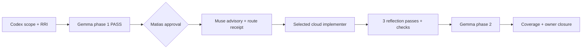
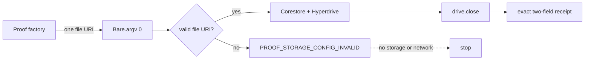

# Compact Approval Task Card v2 — P1.A1b

## 1. Decision header

`P1.A1b — Transient drive open/close logic (HP-A1) | AWAITING APPROVAL | RRI 50 Med-high | Effort L | current-session HITL approval required`

| Routing | Resolved value |
|---|---|
| Orchestrator | Codex; freezes the contract, validates the ADR-038 route receipt, and owns verification and closure. |
| Codex recommendation | Operational-only cloud route: `gpt-5.6-terra` / high. `CLOUD_REQUIRED` or capability/risk: `gpt-5.6-sol` / high. |
| Claude recommendation | `claude-sonnet-5` with thinking enabled; `claude-opus-5` only if the bounded route stalls or repeatedly fails. |
| Primary implementation | After approval: Muse Glimmer advisory refinement → Codex hash-bound ADR-038 route receipt → selected cloud implementer. RRI 50 policy-excludes whole-task local implementation even when the advisory is `GO_LOCAL`. |
| Cloud takeover | Both advisory outcomes yield the card-bound cloud packet at RRI 46–55: operational-only → `gpt-5.6-terra` / high; capability/risk or `CLOUD_REQUIRED` → `gpt-5.6-sol` / high. |
| Fallback selection | `human-select`; before a terminal D14 or an unplanned cloud fallback, an ADR-039 `fallback-selection-v1` receipt must bind the exact packet, model, effort, and selector. |
| RRI | 50 → Med-high; no penalties; three Reflection passes; explicit approval before source edits. |
| Main drivers | Android/Bare storage domain D4, Corestore/Hyperdrive and protocol coupling K4, focused-test gap T4, five-file surface F2, and proof-runtime context X3. |
| Full evidence | `docs/audit/mvp0-p2p-p1-a1b-rri-v2.md` and `docs/tasks/mvp0-p2p-p1-replication.md` § P1.A1b. |

## 2. Scope and acceptance

- **Objective:** use a proof-only factory to pass one host-derived cache URI to
  a worklet, open then deterministically close an empty transient
  Hyperdrive/Corestore drive, and return only the frozen capability receipt.
- **In scope:** `mobile/src/p2p/proof/P1ProofRuntimeFactory.ts` (new),
  `mobile/src/p2p/runtime/protocol.ts`, `mobile/src/p2p/runtime/worklet.ts`,
  `mobile/src/p2p/runtime/worklet.bundle.js`, and
  `mobile/__tests__/p2p/runtime-protocol.test.ts`.
- **Out of scope:** Hyperswarm, discovery, replication, product `P2PService`
  or API changes, persistent product state, direct `bare-fs` dependency,
  storage-path logging/RPC/receipt fields, cleanup/janitor work, granular error
  taxonomy (P1.A1c), iOS, and any other files.
- **Acceptance:**
  - **HP-A1:** a generated valid `runId` creates
    `new Directory(Paths.cache, "dubbridge-p2p", "proofs", runId).uri`; the
    factory passes that one unchanged URI only as worklet startup argument,
    `Bare.argv[0]` is valid, and `OPEN_CLOSE_TRANSIENT_DRIVE` returns exactly
    `{ capability: "transient-hyperdrive-corestore", schema_version: 1 }`
    after `drive.close()`.
  - **EC-A1b:** an invalid `runId` or missing/non-`file:` bootstrap URI fails
    with redacted `PROOF_STORAGE_CONFIG_INVALID` before a storage handle or
    network activity exists.
  - The worklet owns storage through Corestore/Hyperdrive without direct
    application `bare-fs`; `npm run check:bare-worklet` proves the existing
    mapping, and focused Jest, typecheck, and lint remain clean.
- **Evidence / status sync:** exact HP/EC test evidence, redacted proof log,
  resolved package/bundle versions, bundle check output, three Reflection
  records, phase-2 review, coverage certification, and owner verification;
  synchronize this ledger, the P1 plan, roadmap, and P1.A1b audit artifacts.

## 3. Agent workflow

| Phase | Responsible | Action, gate, and fallback |
|---|---|---|
| Analyze and scope | Codex | P1.A1b.0 PASS, frozen storage contract, RRI 50, and typed Antares skip confirmed. |
| Phase 1 review | Local Gemma `gemma4:26b-a4b-it-qat`; Muse fallback | PASS — 3/3 usable passes, no findings; `docs/audit/mvp0-p2p-p1-a1b-phase1-review-v2.md`. |
| Approval | Matias, repository owner | Required in this session; approval authorizes only this frozen five-file scope. |
| Implement | Muse Glimmer advisor → Codex receipt → selected cloud implementer | At RRI 46–55, `GO_LOCAL` still creates the cloud packet. A changed scope reruns RRI, phase 1, card, and approval. |
| Reflect and verify | Codex | Three Draft → Critique → Revise passes: bootstrap/secret boundary → close ownership/fail-closed behavior → bundle/test regression; run focused Jest, worklet check, typecheck, and lint. |
| Phase 2 review | Local Gemma; Muse fallback | Required after implementation and verification; record PASS or stop/revise on BLOCKED. |
| Close | Codex + owner | Emit evidence, certify HP-A1/EC-A1b coverage, obtain owner verification, and synchronize status before P1.A1c. |

Task-analysis review: gemma
`docs/audit/mvp0-p2p-p1-a1b-phase1-review-v2.md` - PASS

## 4. Diagrams

## 5. References

`Task: docs/tasks/mvp0-p2p-p1-replication.md § P1.A1b | Plan: docs/plan/mvp0-p2p-p1-replication.md | Governing: docs/audit/mvp0-p2p-p1-a1b-storage-contract.md, docs/audit/mvp0-p2p-p1-a1b-rri-v2.md, docs/adr/ADR-043-mobile-p2p-runtime-ownership-and-proof-isolation.md, docs/adr/ADR-038-med-high-architect-refined-single-attempt.md, docs/adr/ADR-039-human-selected-fallback-model-checkpoint.md, docs/playbooks/AGENT_WORKFLOW_GUIDE.md, docs/policies/HITL_AUTONOMY_POLICY.md`

## 6. Approval checkpoint

Execution has not started. Approve this task to proceed.
