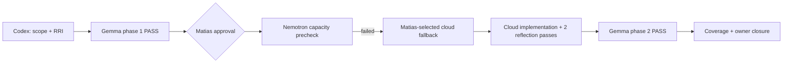
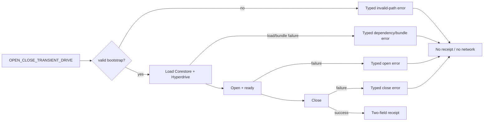

# Compact Approval Task Card v2 — P1.A1c

## 1. Decision header

`P1.A1c — Typed error handling (EC-A1) | PASS — OWNER VERIFIED 2026-08-30 | RRI 28 Moderate | Effort M`

| Routing | Resolved value |
|---|---|
| Orchestrator | Codex — scope, local-route orchestration, verification, and closure. |
| Primary implementation | Cloud `gpt-5.6-terra` / medium, selected by Matias after the task-owned Nemotron capacity precheck failed. |
| Fallback selection | `human-select`; authorized `fallback-selection-v1` receipt: `docs/audit/mvp0-p2p-p1-a1c-fallback-selection.json` (SHA-bound, selected by Matias). |
| RRI | 28 → Moderate; no penalties; explicit approval; two Draft → Critique → Revise Reflection passes. |
| Main drivers | Shared protocol and generated bundle (four-file F2 surface), worklet/filesystem domain D3, and runtime/protocol coupling K2. |
| Full evidence | `docs/audit/mvp0-p2p-p1-a1c-rri.md`; phase-1 packet/review v2 below. |

## 2. Scope and acceptance

- **Objective:** make transient-drive dependency load, bundle resolution,
  invalid bootstrap path, open/ready, and close/cleanup failures typed,
  redacted, and fail-closed.
- **In scope:** `mobile/src/p2p/runtime/worklet.ts`,
  `mobile/src/p2p/runtime/protocol.ts`, generated
  `mobile/src/p2p/runtime/worklet.bundle.js`, and
  `mobile/__tests__/p2p/runtime-protocol.test.ts`.
- **Out of scope:** dependency or lockfile changes; `bare-fs` direct imports;
  proof factory/storage URI design; `P2PService` or product API; discovery,
  Hyperswarm, replication, persistence, Android-native work, iOS, and any
  other files.
- **Acceptance:**
  - **HP-A1 preservation:** successful `drive.ready()` then `drive.close()`
    still returns exactly `{ capability: "transient-hyperdrive-corestore",
    schema_version: 1 }` with no URI, key, raw error, or network detail.
  - **EC-A1:** each dependency-load, bundle, invalid-path, open/ready, and
    close/cleanup failure returns a recognized redacted protocol error and
    can never report drive readiness; invalid-path stubs run no network or
    Hyperswarm code.
  - X28-attributable transport/worklet failures are classified
    `Environment/Blocked`, not source-test failures.
- **Evidence / status sync:** record every EC-A1 branch in the focused Jest
  output; run bundle build/check, typecheck, lint, and focused tests; then
  synchronize the P1 ledger, P1 plan, this audit set, and P1.A1d's evidence
  handoff. This card also corrects the task split: P1.A1c owns its required
  unit tests; P1.A1d owns evidence and closure only.

## 3. Agent workflow

| Phase | Responsible | Action, gate, and fallback |
|---|---|---|
| Analyze and scope | Codex | RRI 28; existing affected-area tests confirmed; Antares typed skip — no task-relevant CWE is on the current watchlist (CWE-22 is restricted to `crates/storage/`). |
| Phase 1 review | Local Gemma `gemma4:26b-a4b-it-qat`; Muse Glimmer fallback | PASS — 3/3 usable passes, no findings; v2 artifact below. |
| Approval | Matias, repository owner | Required in this session; approval authorizes only the four-file scope and the A1d evidence-only correction. |
| Implement | Cloud `gpt-5.6-terra` / medium | Completed under Matias's SHA-bound fallback selection; allowed four-file scope unchanged. |
| Reflect and verify | Codex | Two Draft → Critique → Revise passes: error taxonomy/redaction → cleanup/readiness plus coverage; run focused Jest, bundle build/check, typecheck, and lint. |
| Phase 2 review | Local Gemma `gemma4:26b-a4b-it-qat`; Muse Glimmer fallback | Must PASS after implementation; revise or stop on BLOCKED. |
| Close | Codex + Matias | Certify HP-A1/EC-A1 test coverage, obtain owner verification, and synchronize task/plan/evidence status. |

Task-analysis review: gemma
`docs/audit/mvp0-p2p-p1-a1c-phase1-review-v2.json` - PASS

## 4. Diagrams

## 5. References

`Task: docs/tasks/mvp0-p2p-p1-replication.md § P1.A1c | Plan: docs/plan/mvp0-p2p-p1-replication.md | Evidence: docs/audit/mvp0-p2p-p1-a1c-rri.md, docs/audit/mvp0-p2p-p1-a1c-phase1-packet-v2.md, docs/audit/mvp0-p2p-p1-a1c-phase1-review-v2.json | Governing: docs/audit/mvp0-p2p-p1-a1b-storage-contract.md, docs/adr/ADR-043-mobile-p2p-runtime-ownership-and-proof-isolation.md, docs/playbooks/AGENT_WORKFLOW_GUIDE.md, docs/policies/HITL_AUTONOMY_POLICY.md, docs/policies/RRI_POLICY.md`

## 6. Approval checkpoint

Execution was approved by Matias, completed inside the approved four-file scope,
and closed PASS after Phase 2 and owner verification. See
`docs/audit/mvp0-p2p-p1-a1c-implementation.md`.
