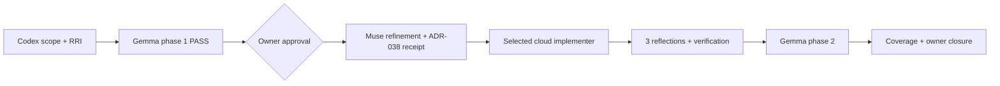
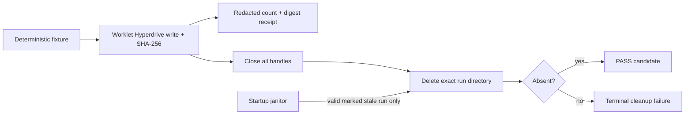

# Compact Approval Task Card v2 — P1.A2

## 1. Decision header

`P1.A2 — Transient seed lifecycle and residue cleanup | AWAITING APPROVAL | RRI 46 Med-high | Effort L | current-session HITL approval required`

| Routing | Resolved value |
|---|---|
| Orchestrator | Codex (`gpt-5.6-terra`); scope, route receipts, verification, and closure owner. |
| Codex recommendation | `gpt-5.6-terra` / high for an operational-only cloud route; `gpt-5.6-sol` / high for capability/risk or `CLOUD_REQUIRED`. OpenAI's current catalog describes Terra as the intelligence/cost-balanced model and Sol as flagship for complex reasoning/coding. |
| Claude Code recommendation | `claude-sonnet-5` with thinking; `claude-opus-5` if the bounded route stalls or repeatedly fails. |
| Primary implementation | After approval: Muse Glimmer advisory refinement -> hash-bound ADR-038 route receipt -> cloud implementer. At RRI 46, `GO_LOCAL` is recorded but cannot start a whole-task local developer. |
| Cloud takeover | No whole-task repair budget applies at RRI 46–55. An operational-only route selects Terra/high; capability/risk or `CLOUD_REQUIRED` selects Sol/high. The required ADR-038 evidence bundle accompanies either. |
| Fallback selection | `human-select` for terminal D14 or unplanned cloud fallback; an ADR-039 `fallback-selection-v1` receipt must bind packet, model, effort, and selector before resumption. |
| RRI | 46 -> Med-high; penalties: none; gates: phase 1, HITL, ADR-038 route receipt, 3 Reflection passes, phase 2, coverage, owner verification. |
| Main drivers | D4 Android/Bare filesystem lifecycle; K4 RPC/handle/cache cleanup coupling; F3 seven-file surface. |
| Full evidence | `docs/audit/mvp0-p2p-p1-a2-rri.md` |

## 2. Scope and acceptance

- **Objective:** create a deterministic synthetic seed in run-scoped cache
  storage, return only count/digest evidence, and fail closed unless cleanup
  and bounded abandoned-run collection are verified.
- **In scope:** `runtime/worklet.ts`, `runtime/protocol.ts`, generated
  `runtime/worklet.bundle.js`, `P1ProofRuntimeFactory.ts`, new
  `transient-storage.ts`, new `P1SeedProofRunner.ts`, one focused
  `transient-seed.test.ts`, and P1.A2 evidence.
- **Out of scope:** Hyperswarm, discovery, replication, client worklet,
  `P2PService`, normal product startup/API, durable identity/storage, user
  media, keys, HTTP, iOS, and logging fixture content, paths, keys, or raw
  errors.
- **Acceptance:**
  - **HP-A2:** a deterministic fixture is written and hashed in the exact
    valid proof directory; its redacted receipt contains byte count and
    SHA-256 only; all handles close before deletion and verified absence.
  - **EC-A2:** traversal or foreign path; write, hash, close, or delete
    failure; and abandoned residue all fail closed or are janitored only when
    the path is a valid, marked, stale proof run below the proof root.
  - No discovery operation occurs; a cleanup failure never returns PASS.
- **Evidence / status sync:** RRI/card/route artifacts; focused Jest,
  bundle build/drift check, typecheck, lint, and full Jest; redacted Android
  seed receipt without claiming X28 is resolved; synchronize this ledger,
  the P1 plan, card, and P1.A2 audit artifacts.

## 3. Agent workflow

| Phase | Responsible | Action, gate, and fallback |
|---|---|---|
| Analyze and scope | Codex (`gpt-5.6-terra`) | RRI 46 and seven-path scope frozen; no task-relevant watchlisted CWE hypothesis, so Antares is typed-skip. |
| Phase 1 review | Gemma `gemma4:26b-a4b-it-qat` | PASS, 3/3 usable, no findings; fallback Muse Glimmer then D14. |
| Approval | Matias, repository owner | Required for this task/session; approval authorizes this scope only. |
| Implement | Muse Glimmer advisor -> Codex ADR-038 receipt -> selected cloud model | RRI 46 policy-excludes a whole-task local attempt. Scope change restarts RRI, phase 1, card, and approval. |
| Reflect and verify | Codex | 3 Draft -> Critique -> Revise passes: path/marker boundary -> handle/error cleanup -> receipt/test/regression; run all listed checks. |
| Phase 2 review | Gemma `gemma4:26b-a4b-it-qat` | Must PASS; one Gemma retry -> Muse Glimmer -> D14 with the selected fallback receipt. |
| Close | Codex + owner | Record review, Reflection, HP/EC unit mapping, owner verification, and status synchronization. |

Task-analysis review: gemma `docs/audit/mvp0-p2p-p1-a2-phase1-review.json` - PASS

## 4. Diagrams

## 5. References

`Task: docs/tasks/mvp0-p2p-p1-replication.md § P1.A2 | Plan: docs/plan/mvp0-p2p-p1-replication.md | Governing: docs/audit/mvp0-p2p-p1-a2-rri.md, docs/audit/mvp0-p2p-p1-a2-phase1-review.json, docs/audit/mvp0-p2p-p1-a1b-storage-contract.md, docs/adr/ADR-043-mobile-p2p-runtime-ownership-and-proof-isolation.md, docs/adr/ADR-038-med-high-architect-refined-single-attempt.md, docs/adr/ADR-039-human-selected-fallback-model-checkpoint.md, docs/playbooks/AGENT_WORKFLOW_GUIDE.md, docs/policies/HITL_AUTONOMY_POLICY.md`

## 6. Approval checkpoint

Execution has not started. Approve this task to proceed.
