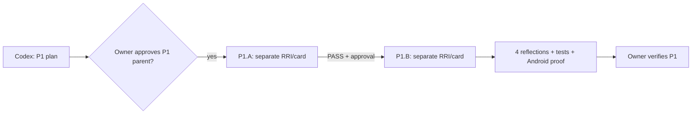
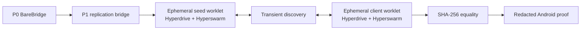

# Compact Approval Task Card v2 — P1

## 1. Decision header

`P1 — P2P core replication spike | awaiting approval | RRI 57 Complex | Effort L | plan approval and mandatory decomposition before implementation`

| Routing | Resolved value |
|---|---|
| Orchestrator | Codex (`gpt-5.6-terra`, current session) prepares and governs the plan; no code route is active. |
| Codex implementation recommendation | Approved RRI 56–70 child: `gpt-5.6-sol` at high reasoning effort. |
| Claude implementation recommendation | Approved RRI 56–70 child: `claude-opus-5` with thinking enabled. |
| Primary implementation | None for the P1 parent. P1.A then P1.B each require their own RRI, card, and approval. |
| Cloud takeover | RRI 56+ cloud-primary applies only to an approved decomposed child; no implementation begins from this parent card. |
| Fallback selection | `human-select` if a future child reaches a D14/cloud fallback; a hash-bound ADR-039 receipt is required before that fallback. |
| RRI | 57 → Complex; plan + human review + decomposition required; no penalties. |
| Main drivers | Distributed seed/discovery/client coupling (K5), Android/native P2P integration (D4), and no existing replication coverage (T4). |
| Full evidence | `docs/audit/mvp0-p2p-p1-rri.md` and `docs/tasks/mvp0-p2p-p1-replication.md`. |

The external P1 taskpack declares `gpt-5.6-terra` / high. It is preserved as
input, but it cannot override the repository's RRI 56+ decomposition gate.

## 2. Scope and acceptance

- **Objective:** on Android, replicate an ephemeral synthetic opaque fixture
  seed → Hyperdrive/Hyperswarm → client and accept it only on SHA-256 equality.
- **In scope:** P1-specific mobile P2P dependencies, an isolated worklet/typed
  bridge, the existing opt-in Android probe, unit tests, and P1 evidence.
- **Out of scope:** user media, keys/encryption, identity/persistence, invites,
  backend/API/database, HLS/HTTP, UI, availability node, and iPhone/iOS.
- **Acceptance:**
  - HP-1: seed/client fixture replication produces the expected digest.
  - HP-2: one bounded reconnect re-verifies only after a complete digest match.
  - EC-1: discovery/connection/worklet failure is typed and cleans resources.
  - EC-2: timeout/mismatch/reconnect exhaustion fails closed with redacted evidence.
- **Evidence / status sync:** child RRI/cards; dependency/bundle evidence; Android
  proof; HP/EC unit coverage; task/plan/roadmap/RUN_STATE/handoff synchronization.

## 3. Agent workflow

| Phase | Responsible | Action, gate, and fallback |
|---|---|---|
| Analyze and scope | Codex (`gpt-5.6-terra`) | P0 dependency confirmed; RRI 57 and P1.A/P1.B decomposition frozen. |
| Phase 1 review | Owner-directed REVIEW-OVERRIDE | Waived only for P1 under `docs/audit/mvp0-p2p-review-exception.md`. |
| Approval | Matias, repository owner | Approves this P1 parent plan only; child implementation still requires its own approval. |
| Implement | Approved child implementer | P1.A then P1.B; RRI and exact route resolved per child; no direct P1-parent code edit. |
| Reflect and verify | Codex | Four parent passes; child tests, Android proof, typecheck, lint, full Jest suite. |
| Phase 2 review | Owner-directed REVIEW-OVERRIDE | Waived only for P1 closure under the documented exception. |
| Close | Codex + owner | Coverage map, owner verification, status sync, P1 handoff; do not start P2. |

Task-analysis review: REVIEW-OVERRIDE — owner-directed MVP0-P2P exception;
`docs/audit/mvp0-p2p-review-exception.md`.

## 4. Diagrams

## 5. References

`Task: docs/tasks/mvp0-p2p-p1-replication.md | Plan: docs/plan/mvp0-p2p-p1-replication.md | Governing: docs/playbooks/AGENT_WORKFLOW_GUIDE.md, docs/policies/HITL_AUTONOMY_POLICY.md, docs/policies/RRI_POLICY.md, docs/adr/ADR-032-hls-playback-delivery-boundary.md, docs/audit/mvp0-p2p-review-exception.md`

## 6. Approval checkpoint

Approving this parent plan authorizes preparation and presentation of P1.A and
P1.B; it does **not** authorize source changes for either child.

Execution has not started. Approve this task to proceed.
