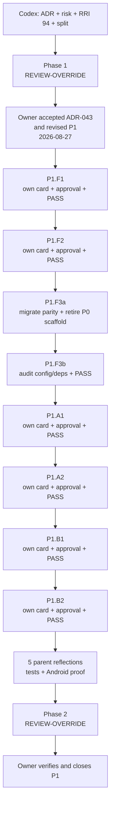
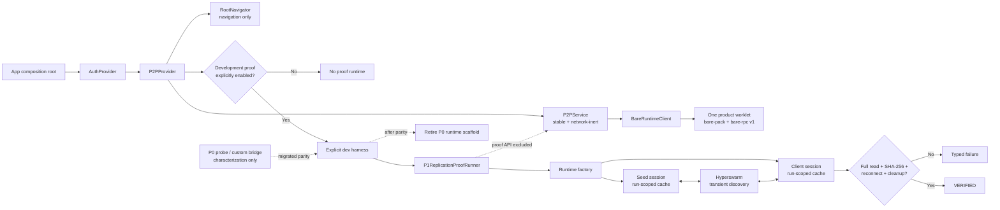

# Compact Approval Task Card v2 — P1

## 1. Decision header

`P1 — Maintainable mobile P2P foundation + replication proof | parent approved 2026-08-27 | RRI 94 Very high | Effort XL | ADR + risk analysis + decomposition; no direct implementation`

| Routing | Resolved value |
|---|---|
| Orchestrator | Codex (`gpt-5.6-sol`, max) governs ADR/risk analysis and decomposition; no P1 parent code route exists. |
| Codex implementation recommendation | Parent: `gpt-5.6-sol`/max for architecture/decomposition only. Child route resolves from each current RRI; official OpenAI guidance still identifies Sol for complex professional work. |
| Claude implementation recommendation | Parent: `claude-fable-5` at high effort (adaptive thinking) for architecture/decomposition only; each child re-resolves independently. |
| Primary implementation | None for P1. Accepted ADR-043 plus children P1.F1 → F2 → F3a → F3b → A1 → A2 → B1 → B2; every child requires current RRI/card/approval. |
| Cloud takeover | n/a for this non-executable parent. Approved children use their own band route and concrete fallback selection. |
| Fallback selection | `human-select` if a future child reaches a D14/cloud fallback; a hash-bound ADR-039 receipt is required before that fallback. |
| RRI | 94 → Very high; ADR + risk analysis + decomposition + human approval. Penalties: architecture +12, >10 files +8, refactor+behavior +8. |
| Main drivers | Architecture decision, 29-file potential surface, distributed/runtime coupling K5, Android/Bare domain D4, no replication coverage T4. |
| Full evidence | `docs/audit/mvp0-p2p-p1-rri.md` and `docs/tasks/mvp0-p2p-p1-replication.md`. |

The original RRI 57 card and its approval are superseded because the owner
requested a maintainable architecture and the scope changed materially before
source execution. The external taskpack's `gpt-5.6-terra`/high declaration
remains input but cannot override the RRI 94 route.

Vendor guidance rechecked 2026-08-27: OpenAI recommends `gpt-5.6-sol` for
complex professional work; Anthropic identifies `claude-fable-5` as its most
capable broadly available model and recommends high effort as the default.

## 2. Scope and acceptance

- **Objective:** establish the ADR-043 mobile/Bare foundation, then replicate a
  synthetic fixture in two isolated proof sessions and accept only complete
  digest, reconnect, teardown, and storage-cleanup evidence.
- **In scope:** app-level provider composition; navigation-only
  `RootNavigator`; `P2PProvider → P2PService → BareRuntimeClient`; one product
  worklet; reproducible `bare-pack` bundle; versioned `bare-rpc`; fatal and
  suspend/resume handling; proof-only runtime factory; transient cache storage;
  Android proof, tests, evidence, and retirement of temporary P0 scaffold only
  after migrated-characterization parity.
- **Mobile connection:** `App.tsx` becomes a composition root, not a runtime
  decision tree. It mounts `AuthProvider` then `P2PProvider` around
  `RootNavigator`; the provider is inert until an explicit command. A separately
  gated development harness may invoke `P1ReplicationProofRunner`, but the
  runner and its two worklets are not part of `P2PService` or normal startup.
- **Out of scope:** user media, keys/encryption, identity/persistence, invites,
  backend/API/database, HLS/HTTP, UI, availability node, and iPhone/iOS.
- **Acceptance:**
  - HP-1: composition owns one inert product runtime and preserves P0 ping.
  - HP-2: seed/client replication matches SHA-256 and removes both run stores.
  - HP-3: one bounded reconnect still requires full verification and teardown.
  - EC-1: protocol/fatal/lifecycle failure is typed, redacted, and releases work.
  - EC-2: discovery/hash/reconnect/cleanup failure can never become VERIFIED.
- **Evidence / status sync:** accepted ADR-043; child RRI/cards; bundle drift,
  protocol/lifecycle, provider ownership, cleanup and Android proof evidence;
  HP/EC coverage; task/plan/architecture/ADR-index/roadmap/RUN_STATE/handoff sync.

Synthetic fixture bytes may originate in memory, but current Hyperdrive/
Corestore blocks are path-backed. P1 therefore uses validated run directories
under Expo cache and treats residual storage as a failed proof.

## 3. Agent workflow

| Phase | Responsible | Action, gate, and fallback |
|---|---|---|
| Analyze and scope | Codex (`gpt-5.6-sol`, max recommendation) | P0 confirmed; maintainability review, RRI 94, ADR-043, risks, and eight-child split frozen. |
| Phase 1 review | Owner-directed REVIEW-OVERRIDE | Waived only for P1 under `docs/audit/mvp0-p2p-review-exception.md`. |
| Approval | Matias, repository owner | Approved 2026-08-27: accepts ADR-043 and the revised P1 decomposition only; child implementation still requires its own approval. |
| Implement | Approved child implementer | F1 → F2 → F3a → F3b → A1 → A2 → B1 → B2; exact route resolves per child. No direct parent code edit. |
| Reflect and verify | Codex | Five parent passes; child tests, bundle/cleanup evidence, Android proof, typecheck, lint, full Jest suite. |
| Phase 2 review | Owner-directed REVIEW-OVERRIDE | Waived only for P1 closure under the documented exception. |
| Close | Codex + owner | Coverage map, owner verification, status sync, P1 handoff; do not start P2. |

Task-analysis review: REVIEW-OVERRIDE — owner-directed MVP0-P2P exception;
`docs/audit/mvp0-p2p-review-exception.md`.

## 4. Diagrams

## 5. References

`Task: docs/tasks/mvp0-p2p-p1-replication.md | Plan: docs/plan/mvp0-p2p-p1-replication.md | Governing: docs/adr/ADR-043-mobile-p2p-runtime-ownership-and-proof-isolation.md, docs/adr/ADR-029-mobile-as-sole-authenticated-product-surface.md, docs/adr/ADR-032-hls-playback-delivery-boundary.md, docs/playbooks/AGENT_WORKFLOW_GUIDE.md, docs/policies/HITL_AUTONOMY_POLICY.md, docs/policies/RRI_POLICY.md, docs/audit/mvp0-p2p-review-exception.md | Model guidance: https://developers.openai.com/api/docs/models, https://platform.claude.com/docs/en/about-claude/models/migration-guide`

## 6. Approval checkpoint

Approval recorded from Matias, repository owner, on 2026-08-27. The decision
accepts ADR-043 and authorizes preparation/presentation of P1.F1 through P1.B2,
including P1.F3a/F3b. It does **not** authorize source changes for any child.
