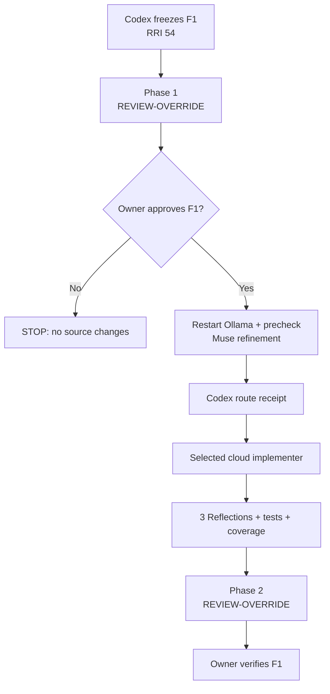
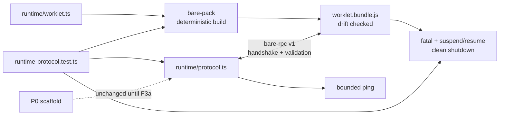

# Compact Approval Task Card v2 — P1.F1

## 1. Decision header

`P1.F1 — Reproducible worklet bundle + versioned RPC contract | awaiting approval | RRI 54 Med-high | Effort L | ADR-038 refinement then cloud implementation`

| Routing | Resolved value |
|---|---|
| Orchestrator | Codex governs the approved capsule, route receipt, verification, and closure. |
| Codex recommendation | `gpt-5.6-terra`/high for an operational-only cloud route; `gpt-5.6-sol`/high when ADR-038 returns `CLOUD_REQUIRED` or identifies capability/risk. |
| Claude recommendation | `claude-sonnet-5` with thinking enabled; escalate within band to `claude-opus-5` only on stall or repeated failure. |
| Primary implementation | After approval: Muse Glimmer advisory refinement → Codex hash-bound route receipt → cloud packet. RRI 54 policy-excludes whole-task local implementation even on `GO_LOCAL`. |
| Cloud takeover | `GO_LOCAL` with no capability concern → `gpt-5.6-terra`/high; `CLOUD_REQUIRED` or capability/risk → `gpt-5.6-sol`/high. The external P1 `gpt-5.6-terra`/high declaration remains input, not an override. |
| Fallback selection | `human-select`; ADR-039 `fallback-selection-v1` is required before any terminal D14/cloud fallback not already approved as the primary route. |
| RRI | 54 → Med-high; no penalties; three Reflection passes. |
| Main drivers | Android/Bare packaging and lifecycle D4, coupled host/worklet boundary K4, absent focused coverage T4, seven-file surface F3. |
| Full evidence | `docs/audit/mvp0-p2p-p1-f1-rri.md` and `docs/tasks/mvp0-p2p-p1-replication.md` § P1.F1. |

## 2. Scope and acceptance

- **Objective:** add a reproducibly packaged Bare backend and a typed/versioned
  DubBridge protocol over `bare-rpc`, while preserving the P0 ping oracle.
- **Allowed paths:** `mobile/package.json`, `mobile/package-lock.json`,
  `mobile/scripts/build-bare-worklet.mjs`, `mobile/src/p2p/runtime/protocol.ts`,
  `mobile/src/p2p/runtime/worklet.ts`,
  `mobile/src/p2p/runtime/worklet.bundle.js`,
  `mobile/__tests__/p2p/runtime-protocol.test.ts`, and F1 evidence/status only.
- **Out of scope:** app/provider composition, P0 scaffold deletion, Hyperdrive,
  Corestore, Hyperswarm, discovery/network, fixture storage, product API/UI,
  backend, HTTP/HLS, and iOS.
- **HP-F1:** deterministic bundle generation plus a compatible handshake returns
  protocol/runtime capabilities and preserves a bounded ping and clean shutdown.
- **EC-F1:** bundle drift, unsupported version, malformed payload, timeout,
  uncaught exception/rejection, or invalid lifecycle message fails typed,
  redacted, and without retained pending work.
- **Acceptance/evidence:** source-to-bundle drift check; dependency/bundle digest;
  handshake, validator, fatal, suspend/resume, timeout, and shutdown tests;
  typecheck, lint, focused/full Jest; three Reflections; coverage certification;
  owner verification; ledger/plan/card/ADR implementation-reference sync.

## 3. Agent workflow

| Phase | Responsible | Action, gate, and fallback |
|---|---|---|
| Analyze and scope | Codex | Parent and ADR gates satisfied; exact seven-file source/test boundary frozen; RRI 54 recorded. |
| Phase 1 review | Owner-directed `REVIEW-OVERRIDE` | Waived only for MVP0-P2P under `docs/audit/mvp0-p2p-review-exception.md`; Antares typed skip recorded. |
| Approval | Matias, repository owner | Approves only F1's frozen packaging/protocol scope and conditional cloud route. |
| Implement | Muse Glimmer advisor → Codex receipt → selected cloud implementer | Restart Ollama + precheck before the advisory. Invalid/stale refinement fails to `CLOUD_REQUIRED`; material scope change returns to RRI/review/approval. |
| Reflect and verify | Codex | Three full Draft → Critique → Revise passes: reproducible bundle → protocol/lifecycle failure boundaries → regression/coverage; run focused/full checks. |
| Phase 2 review | Owner-directed `REVIEW-OVERRIDE` | Waived only at F1 closure; tests, coverage and owner verification remain mandatory. |
| Close | Codex + owner | Close only after evidence/status sync and owner verification; then P1.F2 may be prepared, not implemented. |

Task-analysis review: REVIEW-OVERRIDE — explicit owner-directed MVP0-P2P
exception; `docs/audit/mvp0-p2p-review-exception.md`.

## 4. Diagrams

## 5. References

`Task: docs/tasks/mvp0-p2p-p1-replication.md § P1.F1 | Plan: docs/plan/mvp0-p2p-p1-replication.md | Governing: docs/adr/ADR-043-mobile-p2p-runtime-ownership-and-proof-isolation.md, docs/adr/ADR-038-med-high-architect-refined-single-attempt.md, docs/adr/ADR-039-human-selected-fallback-model-checkpoint.md, docs/playbooks/AGENT_WORKFLOW_GUIDE.md, docs/policies/HITL_AUTONOMY_POLICY.md, docs/policies/RRI_POLICY.md, docs/audit/mvp0-p2p-review-exception.md`

## 6. Approval checkpoint

Approving P1.F1 authorizes only its frozen seven-file source/test scope plus F1
evidence/status updates through the card's ADR-038-selected cloud route. It does
not authorize P1.F2, Hyperdrive, networking, P0 deletion, or P2.

Execution has not started. Approve this task to proceed.
