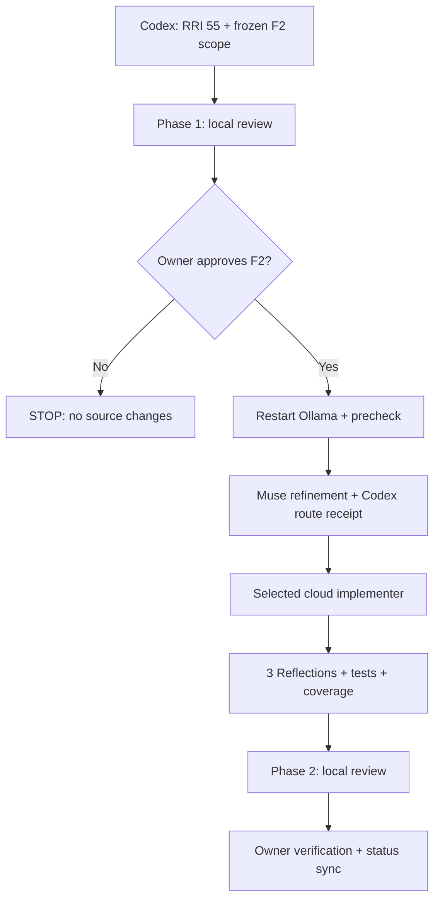
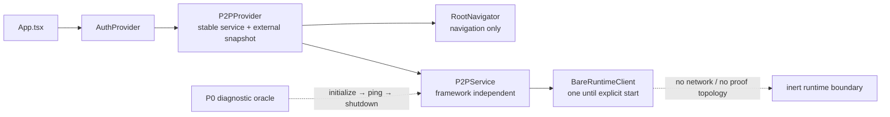

# Compact Approval Task Card v2 — P1.F2

## 1. Decision header

`P1.F2 — Mobile service ownership + composition | AWAITING APPROVAL | RRI 55 Med-high | Effort L | current-session HITL approval required`

| Routing | Resolved value |
|---|---|
| Orchestrator | Codex; freezes scope, verifies the ADR-038 route receipt, and owns verification/closure. |
| Codex recommendation | Operational-only cloud route: `gpt-5.6-terra` / high. `CLOUD_REQUIRED` or capability/risk: `gpt-5.6-sol` / high. |
| Claude recommendation | `claude-sonnet-5` with thinking enabled; `claude-opus-5` only if the bounded route stalls or repeatedly fails. |
| Primary implementation | After approval: restart Ollama + precheck → Muse Glimmer advisory refinement → Codex hash-bound route receipt → selected cloud implementer. RRI 55 policy-excludes whole-task local implementation even when the advisory is `GO_LOCAL`. |
| Cloud takeover | Both advisory outcomes yield the card-bound cloud packet at RRI 46–55: operational-only → `gpt-5.6-terra` / high; capability/risk or `CLOUD_REQUIRED` → `gpt-5.6-sol` / high. |
| Fallback selection | `human-select`; before a terminal D14 or unplanned cloud fallback, an ADR-039 `fallback-selection-v1` receipt must bind the exact packet, model, effort, and selector. |
| RRI | 55 → Med-high; no penalties; three Reflection passes; explicit approval before source edits. |
| Main drivers | Android/Bare and lifecycle domain D4, coupled composition/runtime ownership K4, missing focused tests T4, ten-file surface F3, and multi-module context X4. |
| Full evidence | `docs/audit/mvp0-p2p-p1-f2-rri.md` and `docs/tasks/mvp0-p2p-p1-replication.md` § P1.F2. |

The Codex recommendation was revalidated against [official OpenAI model
guidance](https://developers.openai.com/api/docs/guides/latest-model) on
2026-08-27: Terra is the balance-of-cost-and-capability route and Sol is the
frontier-capability route; both support intentional high reasoning effort.

## 2. Scope and acceptance

- **Objective:** establish ADR-043 composition-root ownership of one inert,
  framework-independent product service/runtime while retaining the P0 probe as
  a parity oracle.
- **In scope:** `mobile/App.tsx`, `mobile/src/navigation/RootNavigator.tsx`,
  `mobile/src/p2p/AndroidBareRuntimeProbe.tsx`, `mobile/src/p2p/bare-bridge.ts`,
  `mobile/src/p2p/runtime/BareRuntimeClient.ts`, `mobile/src/p2p/P2PService.ts`,
  `mobile/src/p2p/P2PProvider.tsx`, the three focused P2P tests named in the
  RRI report, and F2 evidence/status documents only.
- **Out of scope:** P0 source deletion, Hyperdrive/Corestore/Hyperswarm,
  discovery or P2P network activity, fixture storage/proof topology, product UI
  or public API changes, backend/HTTP/HLS, persistence/identity, and iOS.
- **Acceptance:**
  - **HP-F2:** `App.tsx` composes `AuthProvider → P2PProvider → RootNavigator`;
    an explicit P0 diagnostic runs `initialize → ping → shutdown` through the
    single stable service boundary.
  - **EC-F2:** mounting, rerendering, navigation, and auth-route changes never
    start, duplicate, or leak a runtime; invalid lifecycle calls remain typed.
  - `RootNavigator` creates neither auth nor P2P provider; the service remains
    framework-independent; provider identity is stable; runtime status crosses
    a selective external-store subscription; normal mounting is network-inert.
- **Evidence / status sync:** RRI/card/ADR-038 receipt; focused P0, client,
  service, and provider tests; typecheck, lint, full Jest, and three Reflection
  passes; coverage certification and owner verification; synchronize this
  ledger, the P1 plan/card, ADR-043 implementation references, and F2 audit
  evidence.

## 3. Agent workflow

| Phase | Responsible | Action, gate, and fallback |
|---|---|---|
| Analyze and scope | Codex | P1.F1 PASS confirmed; exact ten-file boundary frozen; RRI 55 and Antares skip recorded. |
| Phase 1 review | Local Gemma; Muse Glimmer fallback | PASS — 3/3 usable Gemma passes, no findings; `docs/audit/mvp0-p2p-p1-f2-phase1-review.md`. Muse fallback was not triggered. |
| Approval | Matias, repository owner | Required in this session; approval covers only this F2 card and frozen scope. |
| Implement | Muse Glimmer advisor → Codex receipt → selected cloud implementer | Restart/precheck first. At RRI 46–55, `GO_LOCAL` still yields the cloud packet; a scope change returns to RRI/card/approval. |
| Reflect and verify | Codex | Three Draft → Critique → Revise passes: ownership/no-autostart → P0 parity/lifecycle errors → regression/coverage; run focused tests, typecheck, lint, and full Jest. |
| Phase 2 review | Local Gemma; Muse Glimmer fallback | Required local code-solution review after verification and before owner final verification; record a PASS artifact, or stop/revise on BLOCKED. |
| Close | Codex + owner | Emit evidence, certify HP-F2/EC-F2 coverage, obtain owner verification, and synchronize status before P1.F3a can be presented. |

Task-analysis review: gemma
`docs/audit/mvp0-p2p-p1-f2-phase1-review.md` - PASS

## 4. Diagrams

## 5. References

`Task: docs/tasks/mvp0-p2p-p1-replication.md § P1.F2 | Plan: docs/plan/mvp0-p2p-p1-replication.md | Governing: docs/adr/ADR-043-mobile-p2p-runtime-ownership-and-proof-isolation.md, docs/adr/ADR-038-med-high-architect-refined-single-attempt.md, docs/adr/ADR-039-human-selected-fallback-model-checkpoint.md, docs/playbooks/AGENT_WORKFLOW_GUIDE.md, docs/policies/HITL_AUTONOMY_POLICY.md, docs/policies/RRI_POLICY.md | Phase 1: docs/audit/mvp0-p2p-p1-f2-phase1-review.md`

## 6. Approval checkpoint

`Execution has not started. Approve this task to proceed.`
