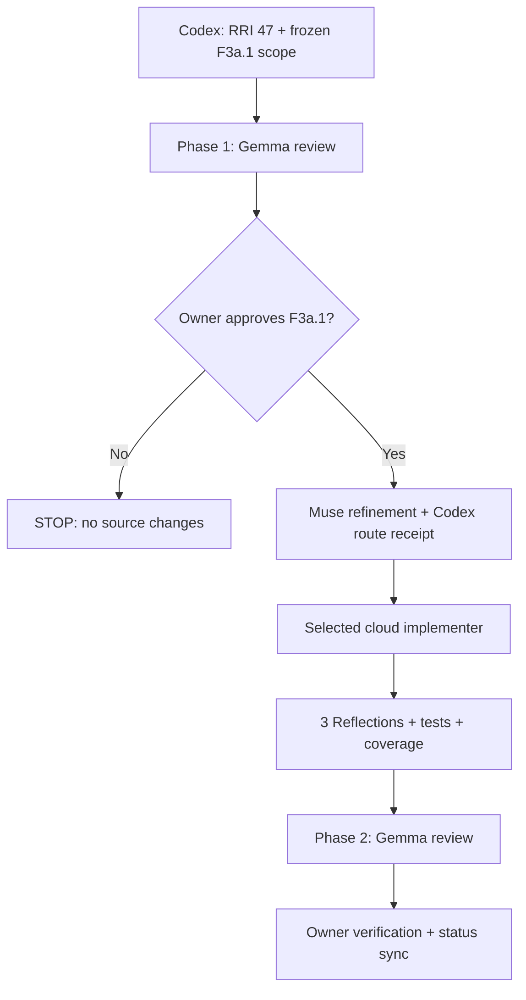
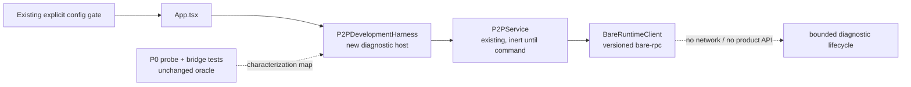

# Compact Approval Task Card v2 — P1.F3a.1

## 1. Decision header

`P1.F3a.1 — P0 characterization migration | IMPLEMENTED, OWNER VERIFICATION PENDING | RRI 47 Med-high | Effort L`

| Routing | Resolved value |
|---|---|
| Orchestrator | Codex; freezes scope, obtains the ADR-038 route receipt, and owns verification/closure. |
| Codex recommendation | Operational-only cloud route: `gpt-5.6-terra` / high. `CLOUD_REQUIRED` or capability/risk: `gpt-5.6-sol` / high. |
| Claude recommendation | `claude-sonnet-5` with thinking enabled; `claude-opus-5` only if the bounded route stalls or repeatedly fails. |
| Primary implementation | Codex implemented the approved frozen scope after the repository owner’s in-session approval on 2026-08-27. No source outside the three allowed paths changed. |
| Cloud takeover | Both advisory outcomes yield the card-bound cloud packet at RRI 46–55: operational-only → `gpt-5.6-terra` / high; capability/risk or `CLOUD_REQUIRED` → `gpt-5.6-sol` / high. |
| Review exception | The existing owner-directed MVP0-P2P review exception applies; it supersedes the stalled local-review fallback for this child only. |
| RRI | 47 → Med-high; no penalties; three Reflection passes; owner final verification remains before PASS. |
| Main drivers | Android/Bare async lifecycle D4/K4, several-module context X4, and a new harness with partial migration coverage T2. |
| Full evidence | `docs/audit/mvp0-p2p-p1-f3a1-rri.md` and `docs/tasks/mvp0-p2p-p1-replication.md` § P1.F3a.1. |

The Codex recommendation was revalidated against [official OpenAI model guidance](https://developers.openai.com/api/docs/guides/latest-model) on 2026-08-27: Terra is the balance-of-cost-and-capability route and Sol is the frontier-capability route; both support intentional high reasoning effort.

## 2. Scope and acceptance

- **Objective:** move the P0 diagnostic characterization into a development-only
  ADR-043 harness through the current service/runtime seam, without retiring P0.
- **In scope:** `mobile/App.tsx`,
  `mobile/src/p2p/development/P2PDevelopmentHarness.tsx`,
  `mobile/__tests__/p2p/p2p-development-harness.test.ts`, and F3a.1 evidence/status
  documents only.
- **Out of scope:** every P0 source/test edit or deletion; config/dependency
  cleanup; Hyperdrive/Corestore/Hyperswarm/discovery; any network or product
  API; persistence/identity; backend/HTTP/HLS; product UI; Android physical
  proof; iOS.
- **Acceptance:**
  - **HP-F3a.1:** only an explicitly enabled Android development harness runs
    `initialize → ping → shutdown` through `P2PService` / `BareRuntimeClient`,
    and the P0 oracle passes unchanged.
  - **EC-F3a.1:** malformed/remote replies, startup release, and late/closed
    operations map to replacement typed/redacted failures; an unmapped P0 case
    or duplicate active owner fails the task.
  - The P0-to-ADR-043 map and unchanged-P0 inventory are recorded; normal
    mounting remains inert, no network/product API is added, and focused tests,
    typecheck, lint, full Jest, and direct-scope coverage pass.
- **Evidence / status sync:** RRI/card/ADR-038 receipt; characterization map,
  P0 inventory, focused/full test output, typecheck, lint, coverage, three
  Reflections, phase-2 review, owner verification; synchronize this ledger,
  the P1 plan, ADR-043 implementation references, and F3a.1 audit artifacts.

## 3. Agent workflow

| Phase | Responsible | Action, gate, and fallback |
|---|---|---|
| Analyze and scope | Codex | P1.F2 PASS confirmed; three-file boundary, RRI 47, and Antares skip recorded. |
| Restart Ollama + local-stack precheck | Codex | Completed before phase 1: server PID changed and Gemma’s reduced profile passed; Muse Glimmer could not produce a usable reduced-profile response, so it remains fallback-only. |
| Phase 1 review | Review override | Owner-directed MVP0-P2P exception; the unavailable local chain has no findings. |
| Approval | Matias, repository owner | In-session approval recorded on 2026-08-27; it covers only this card and frozen scope. |
| Implement | Codex | Completed: App wiring, new development harness, and dedicated migration tests only. |
| Reflect and verify | Codex | Completed: parity/redaction → release/one-owner lifecycle → regression/coverage; focused migration/P0 tests, typecheck, lint, and full Jest pass. |
| Phase 2 review | Review override | Owner-directed MVP0-P2P exception; tests, coverage, scope checks, and final owner verification remain mandatory. |
| Close | Codex + owner | Evidence is synchronized; awaiting owner verification before F3a.2 can be prepared. |

Task-analysis review: REVIEW-OVERRIDE
`docs/audit/mvp0-p2p-review-exception.md` — explicit owner-directed MVP0-P2P
exception; the prior local chain did not produce findings.

## 4. Diagrams

## 5. References

`Task: docs/tasks/mvp0-p2p-p1-replication.md § P1.F3a.1 | Plan: docs/plan/mvp0-p2p-p1-replication.md | Governing: docs/adr/ADR-043-mobile-p2p-runtime-ownership-and-proof-isolation.md, docs/adr/ADR-038-med-high-architect-refined-single-attempt.md, docs/adr/ADR-039-human-selected-fallback-model-checkpoint.md, docs/playbooks/AGENT_WORKFLOW_GUIDE.md, docs/policies/HITL_AUTONOMY_POLICY.md, docs/policies/RRI_POLICY.md | Phase 1: docs/audit/mvp0-p2p-p1-f3a1-phase1-review.md`

## 6. Approval checkpoint

`Source execution was approved and completed on 2026-08-27; owner final verification is pending.`
