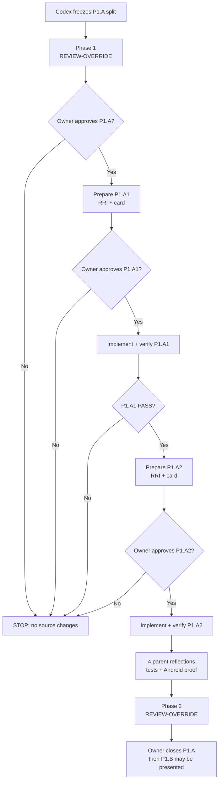
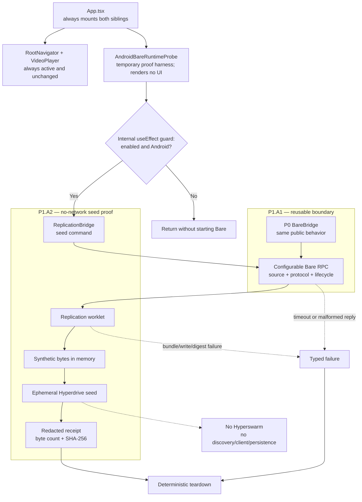

# Compact Approval Task Card v2 — P1.A

> **SUPERSEDED — DO NOT IMPLEMENT.** The maintainability review replaced this
> combined P1.A planning parent with the ADR-043 sequence P1.F1 → P1.F2 →
> P1.A1 → P1.A2 → P1.B1 → P1.B2. This historical card also assumed a
> memory-only Hyperdrive store, which the current Corestore/Hypercore storage
> contract does not support. No approval or executable authority carries from
> this artifact; see `docs/audit/mvp0-p2p-p1-approval-card.md`.

## 1. Decision header

`P1.A legacy — Ephemeral seed fixture and bundle boundary | superseded before execution | RRI 67 historical | no executable route`

| Routing | Resolved value |
|---|---|
| Orchestrator | Codex (`gpt-5.6-terra`, current session) governs the P1.A plan; no code route is active. |
| Codex implementation recommendation | Approved RRI 56–70 child: `gpt-5.6-sol` at high reasoning effort. |
| Claude implementation recommendation | Approved RRI 56–70 child: `claude-opus-5` with thinking enabled. |
| Primary implementation | None for the P1.A parent. P1.A1 then P1.A2 each require their own current RRI, card, and approval. |
| Cloud takeover | RRI 56+ cloud-primary applies only to an approved decomposed child. P1.A1/P1.A2 use the route resolved by their own score; this card launches no implementation. |
| Fallback selection | `human-select`; a hash-bound ADR-039 `fallback-selection-v1` receipt is required before any terminal D14/cloud fallback not already approved as primary. |
| RRI | 67 → Complex; plan approval + decomposition; `refactor_and_behavior` penalty +8. |
| Main drivers | P0/P1 RPC-boundary coupling (K4), Android worklet/bundle domain (D4), and no Hyperdrive/configurable-protocol coverage (T4). |
| Full evidence | `docs/audit/mvp0-p2p-p1a-rri.md` and `docs/tasks/mvp0-p2p-p1-replication.md` § P1.A. |

The combined task is not executable: the repository's implemented P0 bridge
hardcodes its worklet source and result protocol. Generalizing that seam and
adding Hyperdrive behavior together yields RRI 67, so P1.A1 and P1.A2 are the
required safe sequence.

## 2. Scope and acceptance

- **Objective:** preserve P0 through a reusable Bare RPC seam, then prove an
  ephemeral synthetic Hyperdrive seed and deterministic cleanup in the opt-in
  Android mobile path.
- **In scope:** P1.A1 configurable RPC/lifecycle boundary; P1.A2 compatible P1
  dependencies, replication worklet/bridge seed command, headless Android probe,
  tests, and redacted evidence.
- **Mobile connection:** `App.tsx` continues to mount the existing temporary P1
  proof harness, `AndroidBareRuntimeProbe`. Here, "headless" means a React
  component that returns `null` and owns an effect; it is not a background
  service or a separate mobile process. Only Android development builds with
  the probe flag enter P1.A2. `RootNavigator`, visible UI, and `VideoPlayer`
  stay unchanged. Product integration through a UI-facing provider/controller
  is deliberately outside this transport proof.
- **Out of scope:** Hyperswarm, discovery, client/second runtime, replication,
  reconnect, persistence/identity, backend/API/database, HLS/HTTP, UI, and iOS.
- **Acceptance:**
  - HP-A1: P0 `initialize → ping → shutdown` remains behaviorally and physically
    valid through the extracted RPC seam.
  - HP-A2: P1.A2 writes deterministic synthetic bytes to ephemeral Hyperdrive,
    returns only byte count/SHA-256, and tears down cleanly.
  - EC-A1: malformed reply, timeout, or termination rejects pending work and
    releases listeners/handles.
  - EC-A2: dependency/bundle/drive/write/digest/teardown failure is typed,
    redacted, fail-closed, and leaves no network or persistent residue.
- **Evidence / status sync:** child RRI/cards and ADR-038 route evidence; P0
  regression tests; dependency/bundle proof; Android receipt/cleanup log;
  typecheck, lint, full Jest; P1/general plan-task-roadmap synchronization.

## 3. Agent workflow

| Phase | Responsible | Action, gate, and fallback |
|---|---|---|
| Analyze and scope | Codex (`gpt-5.6-terra`) | P1 approval recorded; hardcoded P0 source/protocol seam found; RRI 67 and P1.A1/P1.A2 split frozen. |
| Phase 1 review | Owner-directed `REVIEW-OVERRIDE` | Waived only for MVP0-P2P under `docs/audit/mvp0-p2p-review-exception.md`; Antares typed skip recorded. |
| Approval | Matias, repository owner | Approves this P1.A decomposition only; executable children remain separately gated. |
| Implement | Approved child implementers | P1.A1 then P1.A2; exact ADR-038/local/cloud route comes from each child's card; no direct P1.A-parent source edit. |
| Reflect and verify | Codex | Four P1.A parent Draft → Critique → Revise passes: P0 compatibility → lifecycle cleanup → seed determinism/bundle → no-network/mobile containment; child checks also apply. |
| Phase 2 review | Owner-directed `REVIEW-OVERRIDE` | Waived only at P1.A closure under the documented exception; tests, coverage, and owner verification remain required. |
| Close | Codex + owner | Close only after P1.A1/P1.A2 PASS, Android proof, coverage map, owner verification, and status sync; then present P1.B. |

Task-analysis review: REVIEW-OVERRIDE — urgency; explicit owner-directed
MVP0-P2P exception; `docs/audit/mvp0-p2p-review-exception.md`.

## 4. Diagrams

## 5. References

`Task: docs/tasks/mvp0-p2p-p1-replication.md § P1.A | Plan: docs/plan/mvp0-p2p-p1-replication.md | Governing: docs/playbooks/AGENT_WORKFLOW_GUIDE.md, docs/policies/HITL_AUTONOMY_POLICY.md, docs/policies/RRI_POLICY.md, docs/adr/ADR-038-med-high-architect-refined-single-attempt.md, docs/adr/ADR-039-human-selected-fallback-model-checkpoint.md, docs/audit/mvp0-p2p-review-exception.md`

## 6. Approval checkpoint

No approval checkpoint remains. This card is retained only as superseded
planning history and authorizes no source or child work.
