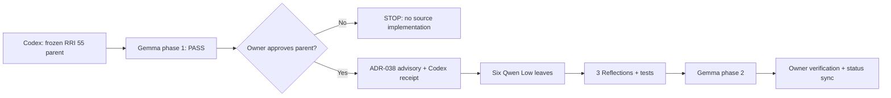
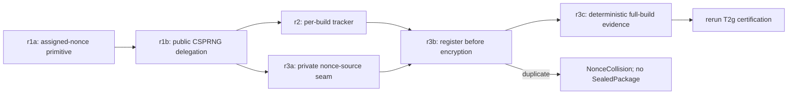

# Compact Approval Task Card v2 — P2.T2c-r

## 1. Decision header

`P2.T2c-r — Fail-closed nonce-collision repair | AWAITING APPROVAL | RRI 55 Med-high | Effort L | current-session parent approval required`

| Routing | Resolved value |
|---|---|
| Orchestrator | Codex (active session); freezes each leaf packet, disposes review findings, integrates the six leaves, and owns verification/status closure. |
| Codex recommendation | No known cloud residue. If a newly discovered inseparable above-Low residue needs cloud: operational-only -> `gpt-5.6-terra` / high; capability/risk -> `gpt-5.6-sol` / high, only after ADR-039 human selection. |
| Claude recommendation | Nominal Med-high mapping: `claude-sonnet-5` with thinking, escalating to `claude-opus-5` only on bounded stall/failure. Claude is not selected and must not be invoked for this task under the owner's recorded capacity constraint. |
| Primary implementation | After approval: ADR-038 advisory refinement + Codex hash-bound receipt, then six already-frozen Low leaves through `scripts/delegate-low-rri.py` using `qwen3.8:27b-mlx`. First leaf: `P2.T2c-r1a`. |
| Cloud takeover | Amendment-4 Low decomposition is already complete and has no known above-Low residue. A leaf failure first uses its one bounded repair; any inseparable above-Low residue is rescored, then the owner selects the exact Codex fallback. No direct or preauthorized cloud escalation. |
| Fallback selection | `human-select`; create `fallback-selection-v1` only for the exact terminal reviewer/cloud packet, and resume only after model, effort, selector, and digest validate. |
| RRI | 55 -> Med-high / Effort L; no penalties; explicit parent approval, independent Med-high reviews, three Reflection passes, and integrated closure. Each executable leaf is separately RRI 25 Low / Effort S. |
| Main drivers | Four-file integrated outcome; internal crypto/build coupling `I=2`; domain/invariant obligation `Q=2`; technical bottleneck maps to the Med-high ceiling. |
| Full evidence | `docs/tasks/mvp0-p2p-p2-encrypted-publication.md` § P2.T2c-r and `docs/audit/mvp0-p2p-p2-t2c-r-phase1-packet.md`. |

Ollama precheck before phase 1: no competing local runner; server PID changed
from `31141` to `78525`; `127.0.0.1:11434` listened; Gemma's production
profile (`num_ctx=131072`, `num_predict=4096`, `think=false`) returned
non-empty content with `done_reason=stop`.

## 2. Scope and acceptance

- **Objective:** fail a new-lineage package build closed when any 96-bit nonce
  repeats under its CK, while preserving the public CSPRNG API and normal
  encryption behavior.
- **In scope:** only `crates/p2p/src/crypto.rs`,
  `crates/p2p/src/nonce_tracker.rs`, `crates/p2p/src/lib.rs`, and
  `crates/p2p/src/package_builder.rs`; ordered leaves `r1a -> r1b -> (r2 +
  r3a) -> r3b -> r3c`.
- **Out of scope:** public API changes, nonce persistence, cross-lineage/retry
  bookkeeping, CK/KEK changes, DB/storage/network behavior, unrelated
  refactors, and editing the existing untracked T2g tests before final rerun.
- **Acceptance:**
  - **HP:** the assigned-nonce primitive round-trips; the public entry retains
    fresh CSPRNG behavior; distinct deterministic nonces produce a decryptable
    multi-file package with distinct manifest nonces.
  - **EC:** tampered AAD fails authentication; duplicate registration is
    typed; a forced duplicate returns `PackageBuildError::NonceCollision`
    before that encryption and returns no `SealedPackage`.
- **Evidence / status sync:** focused RED-GREEN unit/component evidence;
  `cargo fmt --check`, p2p tests and clippy; rerun T2g after `r3c`; retain all
  per-leaf review/delegation artifacts; record three integrated Reflections,
  parent phase-2 review, behavioral coverage, and owner verification; sync
  the P2 ledger/plan, roadmap, C0 dependency status, and T2g record.

## 3. Agent workflow

| Phase | Responsible | Action, gate, and fallback |
|---|---|---|
| Analyze and scope | Codex | Completed: current RRI recomputed, six Low leaves frozen, current source/C0 contract checked, and Antares typed skip recorded because no current watchlist CWE/boundary matches. |
| Phase 1 review | `gemma4:26b-a4b-it-qat` | PASS with no findings. Fallback chain, if needed: `gpt-oss:20b` -> ADR-039-selected D14. |
| Approval | Matias, repository owner | One approval covers only this frozen parent and its six named leaves; changed paths, invariants, or behavior return to RRI/review/approval. |
| Implement | ADR-038 advisor + Codex receipt; `qwen3.8:27b-mlx` per Low leaf | Execute in dependency order via `delegate-low-rri.py`; each exact packet receives its own Low phase-1 review. One bounded leaf repair; then rescore residue, with cloud only as owner-selected last resort. |
| Reflect and verify | Codex | Three full Draft -> Critique -> Revise passes: crypto/API preservation -> fail-closed ordering/no partial result -> integrated regressions/T2g; run all named checks. |
| Phase 2 review | `gemma4:26b-a4b-it-qat` | Parent integrated code-solution review must PASS; fallback `gpt-oss:20b` -> ADR-039-selected D14. |
| Close | Codex + owner | Emit behavioral evidence, obtain owner final verification, synchronize all status artifacts, then unblock/recertify T2g. |

Task-analysis review: gemma
`docs/audit/mvp0-p2p-p2-t2c-r-phase1-review.json` - PASS

## 4. Diagrams

## 5. References

`Task: docs/tasks/mvp0-p2p-p2-encrypted-publication.md § P2.T2c-r | Plan: docs/plan/mvp0-p2p-p2-encrypted-publication.md § P2.T2 | Contract: docs/audit/mvp0-p2p-p2-c0-contract-freeze.md § Nonce allocation/T2 matrix | Governing: docs/playbooks/AGENT_WORKFLOW_GUIDE.md, docs/policies/HITL_AUTONOMY_POLICY.md, docs/policies/RRI_POLICY.md, docs/adr/ADR-038-med-high-architect-refined-single-attempt.md, docs/adr/ADR-039-human-selected-fallback-model-checkpoint.md, docs/adr/ADR-045-rri-v2-authority-replacement.md | Phase 1: docs/audit/mvp0-p2p-p2-t2c-r-phase1-review.json`

## 6. Approval checkpoint

`Execution has not started. Approve this task to proceed.`
