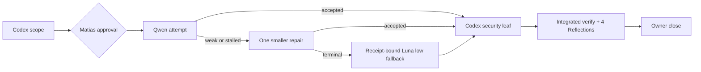
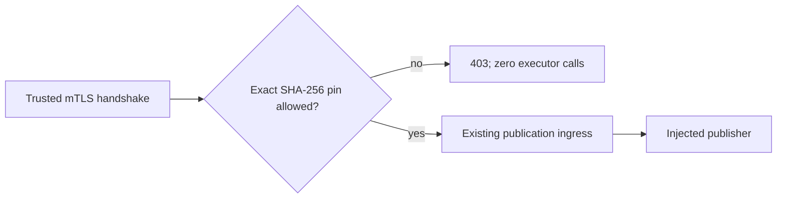

# Compact Approval Task Card v2 — P2.T3b

## 1. Decision header

**P2.T3b — private mTLS listener and client-identity policy | approved and
owner-verified by Matias 2026-09-09; Done | RRI 100 Very high | Effort XL |
decomposed execution covered by one current-session approval**

| Routing | Resolved value |
|---|---|
| Orchestrator | Codex; plan/integration/verification owner |
| Codex recommendation | `gpt-6-astra` / `max` for the security-sensitive Low leaves; verified 2026-09-09 against official OpenAI Codex model guidance |
| Claude recommendation | `claude-opus-5` / thinking on per repository resolution; operationally unavailable and not required under the active review override |
| Primary implementation | Qwen `qwen3.8:27b-mlx` for three contract-first audit-test leaves; Codex for three security-sensitive product leaves |
| Cloud takeover | last resort for a stalled Qwen test leaf only: context-bounded `cloud-implementer` using `gpt-5.6-luna` / `low`; no product/security leaf is transferred implicitly |
| Fallback selection | proposed `preauthorized` by Matias through approval of this card; every terminal handoff must emit and validate an ADR-039 `fallback-selection-v1` receipt bound to the exact unchanged packet |
| RRI | 100 Very high parent; six RRI 25 Low leaves; `auth_security` and `no_tests_high_impact` penalties |
| Main drivers | absent mTLS coverage; HTTPS/certificate integration; authentication impact |
| Full evidence | `docs/audit/mvp0-p2p-p2-t3b-rri.md` |

## 2. Scope and acceptance

- **Objective:** construct an unbound HTTPS server that requires a trusted
  client certificate and authorizes only exact configured SHA-256 certificate
  fingerprints before invoking publication ingress.
- **In scope:** `src/mtls.ts`, the bounded composition change in
  `src/server.ts`, and three linked package-local product tests.
- **Out of scope:** `listen()`/host/port, environment or file credential
  loading, certificate provisioning/rotation, Hyperdrive, T4 client,
  deployment, and `P2P_READY`.
- **Sequential subtasks covered by this approval:**

  | Subtask | Bounded outcome | Exact writable path | Route | Depends on |
  |---|---|---|---|---|
  | `T3b-i` | Policy contract-first evidence (RED) | `apps/availability-node/test/client-fingerprint-policy.test.js` | Qwen Developer | T3a |
  | `T3b-ii` | Exact SHA-256 fingerprint normalization and allow-list decision (GREEN) | `apps/availability-node/src/mtls.ts` | Codex; security-sensitive | T3b-i |
  | `T3b-iii` | Transport contract-first evidence (RED) | `apps/availability-node/test/private-mtls-server.test.js` | Qwen Developer | T3b-ii |
  | `T3b-iv` | Fail-closed TLS options and unbound HTTPS server factory (GREEN) | `apps/availability-node/src/mtls.ts` | Codex; security-sensitive | T3b-iii |
  | `T3b-v` | Ingress-guard contract-first evidence (RED) | `apps/availability-node/test/private-publication-ingress.test.js` | Qwen Developer | T3b-iv |
  | `T3b-vi` | Compose authorized mTLS requests with the existing publication handler (GREEN) | `apps/availability-node/src/server.ts` | Codex; security-sensitive | T3b-v |

  Every leaf is **RRI 25 Low / Effort S**. Execution is strictly ordered;
  failure to obtain the intended RED, any identity ambiguity, TLS weakening,
  or scope expansion stops the sequence.
- **Acceptance:**
  - **HP-1:** trusted certificate plus listed fingerprint reaches the injected
    publication handler exactly once over TLS.
  - **HP-2:** canonical colon-delimited Node fingerprint and lowercase compact
    configured pin normalize to the same exact SHA-256 identity; multiple pins
    support explicit rotation overlap.
  - **EC-1:** missing or untrusted client certificate fails TLS negotiation and
    invokes neither handler nor executor.
  - **EC-2:** CA-trusted but unlisted certificate receives exact `403
    service_identity_rejected` with zero executor calls.
  - **EC-3:** empty/malformed pins or weakened TLS options fail closed; no
    `node:http` listener, implicit bind, CN/SAN fallback, or secret logging.
- **Evidence/status:** typecheck/build, three package-local Node tests, negative
  source scan, four integrated Reflections, task/plan/roadmap sync, and owner
  verification.

## 3. Agent workflow

| Phase | Responsible | Action, gate, and fallback |
|---|---|---|
| Analyze and scope | Codex + Qwen3.6 Local Architect advisory | complete: RRI/decomposition and frozen security boundary |
| Phase 1 review | n/a | active owner-directed MVP0-P2P review override |
| Approval | Matias | complete 2026-09-09; one approval covers `T3b-i` through `T3b-vi`; scope expansion reopens the gate |
| Implement | Qwen3.8 test leaves; Codex product leaves | complete 2026-09-09; sequential RED -> GREEN completed, with the approved packet-bound Luna fallback used only for `T3b-iii` |
| Reflect and verify | Codex | complete 2026-09-09; four Draft -> Critique -> Revise passes and all named checks passed |
| Phase 2 review | n/a | active owner-directed MVP0-P2P review override |
| Close | Codex + Matias | complete 2026-09-09; evidence/status synchronized and owner verified every HP/EC mapping (9/9 integrated tests) |

**Frozen Qwen fallback protocol:**

1. Run the bounded Qwen Developer packet once with the wrapper's explicit
   `180s` idle and `900s` wall limits; no alternate local developer is selected
   silently.
2. On malformed, weak, stalled, or verification-failing output, reject it and
   run at most one repair using a smaller, replacement-oriented packet on the
   same allowed path. Empty output first follows the mandatory reduced-context
   resource-recovery probe; it does not permit an unchanged high-memory retry.
3. If that repair cannot produce acceptable evidence, declare terminal Low
   escalation and emit `fallback-selection-v1` with role
   `cloud-implementer`, RRI 25, exact packet SHA-256, selection mode
   `preauthorized`, model `gpt-5.6-luna`, effort `low`, and selector `Matias
   (P2.T3b approval)`.
4. Codex validates the authorization receipt against the unchanged escalation
   packet before starting a context-bounded Luna implementer. Missing/stale
   evidence, a changed scope, or a receipt mismatch stops fail-closed.
5. If Luna is unavailable, no second model is selected silently: execution
   pauses at `human-select` (current recommendation: `gpt-5.6-terra` / `low`).

This fallback applies only to `T3b-i`, `T3b-iii`, or `T3b-v`. D14 remains a
read-only reviewer mechanism and is never used to author these tests.

Task-analysis review: n/a - REVIEW-OVERRIDE: urgency, see
`docs/audit/mvp0-p2p-review-exception.md`

## 4. Diagrams

## 5. References

Task: `docs/tasks/mvp0-p2p-p2-encrypted-publication.md` | Plan:
`docs/plan/mvp0-p2p-p2-encrypted-publication.md` | Governing:
`docs/audit/mvp0-p2p-p2-c0-contract-freeze.md`,
`docs/audit/mvp0-p2p-p2-t0-decision.md`,
`docs/adr/ADR-044-p2p-audience-delivery-boundary.md`,
`docs/adr/ADR-039-human-selected-fallback-model-checkpoint.md`,
`docs/playbooks/LOW_RRI_LOCAL_MODEL_HANDOFF.md`, `docs/node-exceptions.md`,
`docs/playbooks/AGENT_WORKFLOW_GUIDE.md`

## 6. Approval checkpoint

Approved by Matias on 2026-09-09. Execution started with `T3b-i`; the frozen
scope and fallback selection remained binding. Implementation, Codex
verification, and Owner final verification completed on 2026-09-09; the
parent is `Done`.
