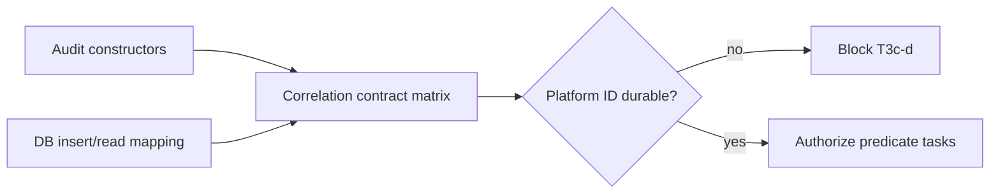

# X26-T3c-a — Record the correlation contract matrix

## 1. Decision header

`X26-T3c-a — Record the correlation contract matrix | complete | RRI 0 Low | Effort S | Low-band direct-execution route`

| Routing | Resolved value |
|---|---|
| Orchestrator | Codex (primary agent) |
| Primary implementation | Codex direct — docs-only work is not eligible for Qwen Developer delegation |
| Cloud takeover | n/a |
| Fallback selection | n/a |
| RRI | 0 → Low; no penalty; full approval card not required |
| Main drivers | One docs artifact; no production behavior change |
| Full evidence | `docs/tasks/tiger-style-adaptation.md#x26-t3c-a-record-the-correlation-contract-matrix` |

## 2. Scope and acceptance

- **Objective:** Record the source-backed correlation and persistence contract
  for every audit-event family before predicate or assertion code is changed.
- **In scope:** `docs/audit/x26-t3c-correlation-contract.md` and status lines
  for `X26-T3c-a` only.
- **Out of scope:** Rust, SQL, migrations, task children `T3c-b1`–`T3c-d`, and
  resolving the detected persistence gap.
- **Acceptance:** cite each relevant constructor, constructor call-site search,
  and `audit_events` insert/read mapping; state the valid combined-shape rule
  for recording events; record the platform-ingest persistence gap as a blocker
  or intentionally out-of-scope defect.
- **Evidence / status sync:** matrix with reproduction searches; update the
  T3c-a ledger status and this card.

## 3. Agent workflow

| Phase | Responsible | Action, gate, and fallback |
|---|---|---|
| Analyze and scope | Codex | RRI computed; source and dependencies read; scope frozen to one docs artifact. |
| Phase 1 review | n/a | Docs-only exemption under the workflow guide. |
| Implement | Codex | Write only the source-backed matrix; do not change production code. |
| Close | Codex | Check source references and run documentation QA; synchronize the ledger/card. |

Task-analysis review: n/a - docs-only task exempt under `AGENT_WORKFLOW_GUIDE.md` § Per-task discipline.

## 4. Diagrams

## 5. References

`Task: docs/tasks/tiger-style-adaptation.md#x26-t3c-a-record-the-correlation-contract-matrix | Plan: docs/plan/tiger-style-adaptation.md | Governing: docs/playbooks/AGENT_WORKFLOW_GUIDE.md, docs/policies/RRI_POLICY.md, docs/policies/HITL_AUTONOMY_POLICY.md, ADR-008, ADR-018`

## 6. Low-band checkpoint

No human-approval presentation is required for RRI 0. The matrix was verified
against its cited constructor, call-site, migration, and DB-adapter sources;
`make qa-docs` remains the closure check. The next T3c child may now be
prepared, but `T3c-d` stays blocked on the recorded platform persistence gap.
