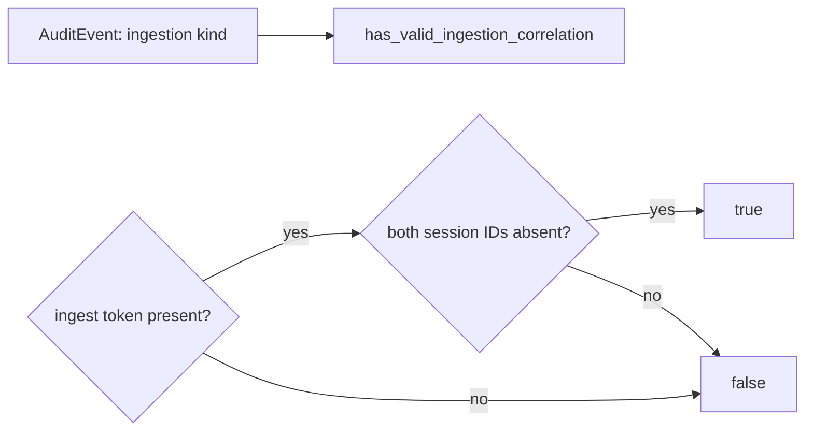
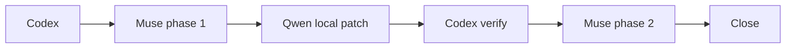

# X26-T3c-b1 — Ingestion correlation predicate

## 1. Decision header

`X26-T3c-b1 — Ingestion correlation predicate | completed with owner review waiver | RRI 20 Low | Effort S | direct primary-agent implementation`

| Routing | Resolved value |
|---|---|
| Orchestrator | Codex (primary agent) |
| Primary implementation | Direct primary-agent implementation after the bounded Qwen route could not produce a usable terminal response and the owner directed completion without further protocol time |
| Cloud takeover | Only after the bounded Low route fails and a packet-bound ADR-039 human-selection receipt authorizes it; not preauthorized |
| Fallback selection | `human-select`; no fallback receipt exists |
| RRI | 20 → Low; no penalties; `C=1,D=2,K=2,P=2,X=1,F/T/A=0` |
| Main drivers | One isolated domain file; internal domain contract; focused unit tests |
| Full evidence | `python3 scripts/rri.py --C 1 --T 0 --A 0 --X 1 --D 2 --K 2 --P 2 --touches crates/domain/src/audit.rs --platform dubbridge` |

## 2. Scope and acceptance

- **Objective:** Add and unit-test only the ingestion-family correlation
  predicate approved by
  `docs/audit/x26-t3c-correlation-contract.md`.
- **In scope:** `crates/domain/src/audit.rs`, only the named method and its
  focused tests; no other repository path is writable by the delegated model.
- **Out of scope:** recording, platform, zero-correlation families, DB mapping,
  migrations, tracing, and `crates/audit/**`.
- **HP-1:** `AuditEvent::new(..., IngestionFinalized, token, ...)` is accepted.
- **EC-1:** the same ingestion event with `ingest_token=None` is rejected.
- **Scope guard:** a non-ingestion event is not accepted by this helper.
- **Acceptance:** expose `pub fn has_valid_ingestion_correlation(&self) -> bool`;
  it returns true only for an ingestion kind with `ingest_token=Some` and both
  session IDs absent; CC ≤5; add focused passing unit tests.
- **Evidence / status sync:** local result JSON, phase-1 and phase-2 review
  artifacts, focused `cargo test -p dubbridge-domain audit`, unit-coverage
  certification, and the T3c ledger/card status lines.

## 3. Agent workflow

| Phase | Responsible | Action, gate, and fallback |
|---|---|---|
| Restart Ollama + local-stack precheck | Codex | Completed for this task; after the interrupted Qwen run, the conflicting runner was persistently disabled and Ollama was unloaded. |
| Analyze and scope | Codex | Matrix and RRI frozen; exact one-region before/after contract prepared. |
| Phase 1 review | `muse-glimmer:30b-q4_K_M` | Must PASS on this exact card before the Qwen packet is sent; fallback `gemma4:26b-a4b-it-qat → D14`. |
| Implement | Codex | Implemented the exact scoped predicate and focused tests directly after the owner directed completion without further local-model protocol time. |
| Reflect and verify | Codex | `cargo fmt --check` and `cargo test -p dubbridge-domain audit` passed (12/12). |
| Phase 2 review | owner waiver | Not run: the owner explicitly directed that protocols stop after the prolonged failed local-model attempts. Recorded as an urgency override, not a PASS. |
| Close | Codex | Ledger, card, roadmap, and review-override ledger synchronized. |

Task-analysis review: muse-glimmer
`docs/audit/local-delegation/x26-t3c-b1-phase1-review-attempt2.json` - PASS

The prior local reviewer evidence remains retained at
`docs/audit/local-delegation/x26-t3c-b1-phase1-review.md`. After a user-directed
retry following resource recovery, Muse passed the recorded reduced-profile
review packet (`num_ctx=16384`, `num_predict=512`, `think=false`).

Qwen's first bounded implementation attempt is recorded at
`docs/audit/local-delegation/x26-t3c-b1-delegation-attempt1.md` as `BLOCKED`:
the external `qa-gemma-push-review` job re-entered the one-model Ollama stack
before Qwen reached a terminal response. No source diff was applied.

The owner then directed direct completion without further protocol time. Codex
implemented the bounded method and three focused assertions in
`crates/domain/src/audit.rs`; no other production path changed.

Code-solution review: owner waiver — no review artifact (see the matching
`REVIEW-OVERRIDE: urgency` in the task ledger and
`docs/audit/gemma-review-overrides.md`).

## 4. Diagrams

## 5. References

`Task: docs/tasks/tiger-style-adaptation.md#x26-t3c-b1-ingestion-correlation-predicate | Plan: docs/plan/tiger-style-adaptation.md | Contract: docs/audit/x26-t3c-correlation-contract.md | Governing: docs/playbooks/AGENT_WORKFLOW_GUIDE.md, docs/playbooks/LOW_RRI_LOCAL_MODEL_HANDOFF.md, docs/policies/RRI_POLICY.md, docs/policies/HITL_AUTONOMY_POLICY.md`

## 6. Low-band checkpoint

RRI 20 does not require a human-approval presentation. Phase 1 passed. The
owner subsequently waived the phase-2 review evidence to close this bounded
task after prolonged local-stack failures; this is not a review PASS.
