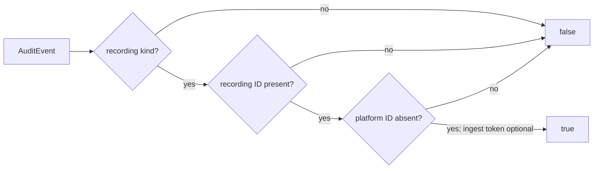
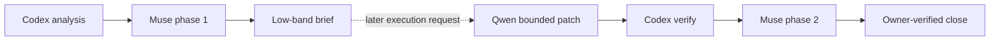

# X26-T3c-b2 — Recording correlation predicate

## Decision

`X26-T3c-b2 | analyzed, not started | RRI 16 Low | Effort S | no HITL approval checkpoint`

| Routing | Resolved value |
|---|---|
| Orchestrator | Codex, primary agent |
| Codex recommendation | Keep Codex as orchestrator; use `qwen3.8:27b-mlx` for the eligible bounded patch. If that Low route becomes unusable, an ADR-039 `human-select` receipt is required before cloud takeover; current operational fallback is `gpt-5.6-luna` at `low` (`gpt-5.6-terra` at `low` only if Luna is unavailable). |
| Claude Code recommendation | Keep the model already running the Claude session, thinking off; the same eligible bounded patch routes to `qwen3.8:27b-mlx`. |
| Primary implementation route | Local Qwen Developer, one-file `before-after` replacement; Codex validates and applies only the allowed diff. |
| Phase-1 reviewer | `muse-glimmer:30b-q4_K_M`; fallback `gemma4:26b-a4b-it-qat` then D14 under the ADR-039 selection checkpoint. |
| Penalties | None. |
| Main RRI drivers | One `crates/domain` file; contained internal contract; strong focused tests; exact matrix-approved behavior. |

Low-band work normally proceeds without a human approval card. This artifact is
being presented because the owner explicitly requested analysis and presentation;
implementation is outside that request and has not started.

## Scope and acceptance

- **Objective:** add `AuditEvent::has_valid_recording_correlation(&self) -> bool`
  and focused unit tests for the recording-family shape approved by
  `docs/audit/x26-t3c-correlation-contract.md`.
- **In scope:** only `crates/domain/src/audit.rs`, including its unit-test module.
  The current uncommitted `X26-T3c-b1` predicate and tests are preserved.
- **True shape:** one of the six recording event kinds,
  `recording_session_id=Some`, `platform_ingest_session_id=None`; `ingest_token`
  is deliberately unconstrained so both `None` and `Some` are valid.
- **False shape:** any non-recording kind, a missing recording-session ID, or a
  platform-ingest session ID on a recording event.
- **Out of scope:** constructors, ingestion/platform/no-correlation predicates,
  persistence, migrations, audit emission, and every path outside
  `crates/domain/src/audit.rs`.
- **HP-1:** `AuditEvent::new_recording` is accepted both before and after an
  ingest token is allocated.
- **EC-1:** a recording event without `recording_session_id` is rejected; the
  malformed platform-ID combination is also rejected.
- **Scope guard:** a non-recording event is rejected even if its fields are
  manually shaped like a recording event.
- **Complexity:** planned raw CC is 5: the `matches!` decision plus the two
  correlation-field conditions stay within the ledger's CC ≤5 criterion.
- **Verification:** `cargo fmt --check` and
  `cargo test -p dubbridge-domain audit`; closure additionally requires the
  Low-band phase-2 review, unit coverage certification, owner final
  verification, and status-document synchronization.
- **Evidence/status:** exact RRI report, local precheck and review artifacts,
  Qwen result JSON if execution is later authorized, focused test output, this
  task ledger, the `X26-T3c` parent, plan, and roadmap where materially changed.

## Planned implementation boundary

The helper will whitelist exactly:

- `RecordingSessionCreated`
- `RecordingRejectedMissingRights`
- `RecordingCaptureStarted`
- `RecordingRecorded`
- `RecordingFailed`
- `RecordingBridgedToAsset`

Its field predicate is:

```text
recording kind
AND recording_session_id is present
AND platform_ingest_session_id is absent
```

There is intentionally no condition on `ingest_token`. That omission is the
approved combined-shape rule, not a missing validation branch.

## Agent workflow

| Phase | Responsible | Gate/output |
|---|---|---|
| Restart Ollama + local-stack precheck | Codex | New Ollama PID/listener plus production-profile warm probes for Muse and Qwen. |
| Analyze and scope | Codex | Contract, dirty-worktree overlap, RRI, exact one-file boundary, HP-1/EC-1. |
| Phase 1 review | `muse-glimmer:30b-q4_K_M` | Must PASS before presentation; fallback chain is Gemma then D14. |
| Implement | `qwen3.8:27b-mlx` with Codex orchestration | Not started. If later requested, use `before-after` mode because the target is 583 lines; preserve the existing b1 diff. |
| Verify and phase 2 review | Codex + Muse Glimmer Reviewer | Not started; focused tests and mandatory independent review precede closure. |
| Close | Codex + owner | Not started; coverage certification, owner verification, and status sync required. |

Task-analysis review: muse-glimmer
`docs/audit/local-delegation/x26-t3c-b2-phase1-review.json` - PASS

Muse passed the exact full card at the production profile
(`num_ctx=131072`, `num_predict=4096`, `think=false`); the restart,
warm-up, and review receipt are recorded in the linked artifact.

**Post-presentation update (2026-08-31):** the owner authorized
implementation. The helper and both focused tests were added exactly as
planned above, matching this card's boundary without deviation. A fresh
per-task Ollama restart (PID 88567 -> 11104) and warm probe preceded the
phase-2 review.

Code-solution review: muse-glimmer
`docs/audit/local-delegation/x26-t3c-b2-phase2-review.json` - PASS (0 findings)

`cargo fmt --check` and `cargo test -p dubbridge-domain audit` both pass
(14/14, including this task's two new tests).

## Diagrams





## Full RRI report

Canonical invocation:

```text
python3 scripts/rri.py --cc 5 --T 0 --A 0 --X 1 --D 2 --K 2 --P 2 --touches crates/domain/src/audit.rs --platform dubbridge
```

**Platform:** dubbridge

| Variable | Score | Evidence | Confidence |
|---|---|---|---|
| C cyclomatic | 0 | raw CC 5 -> score 0 (policy CC table) | High |
| F files | 0 | --touches -> 1 files | High |
| D domain | 2 | anchor rubric: crates/domain (—) -> floor 2 (agent 2 kept) | High |
| T coverage | 0 | agent-supplied | High |
| A ambiguity | 0 | agent-supplied | High |
| K coupling | 2 | anchor rubric: crates/domain (—) -> floor 2 (agent 2 kept) | High |
| P impact | 2 | anchor rubric: crates/domain (—) -> floor 2 (agent 2 kept) | High |
| X context | 1 | agent-supplied | High |

**Base value:** 100 x (weighted / 5) = 16
**Penalties applied:** none
**Final RRI:** 16 -> band Low (0-25) -> Effort S . Codex Local Qwen Developer via Ollama . Claude Local Qwen Developer via Ollama . thinking Off
**Gates for this band:** Local delegation: delegate to local Qwen Developer via Ollama; validate and apply only an in-scope diff; review against requirements; verify; report.
**Decomposition:** not triggered

## References

- `docs/tasks/tiger-style-adaptation.md` — `X26-T3c-b2` definition.
- `docs/audit/x26-t3c-correlation-contract.md` — authoritative family matrix.
- `docs/plan/tiger-style-adaptation.md` — sequence and boundary.
- `docs/playbooks/AGENT_WORKFLOW_GUIDE.md` — Low-band workflow and reviews.
- `docs/playbooks/LOW_RRI_LOCAL_MODEL_HANDOFF.md` — bounded patch protocol.
- `docs/policies/RRI_POLICY.md` and `docs/policies/HITL_AUTONOMY_POLICY.md` — scoring and autonomy.

## Execution boundary

No human approval checkpoint applies at RRI 16. The owner authorized
execution after presentation; implementation, phase-1, and phase-2 review
are complete. Coverage certification and owner final verification are
recorded in `docs/tasks/tiger-style-adaptation.md#x26-t3c-b2-recording-correlation-predicate`.
