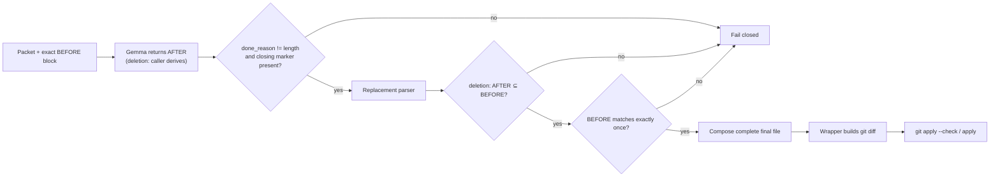

# Evaluation: Local Gemma delegation on large files

## Context

On 2026-06-21 a delegation was attempted to `gemma4:12b-it-q4_K_M` via Ollama
to remove a 3-line dead code block from
`apps/api/src/routes/workspace.rs` (1226 lines).

The current contract in `scripts/delegate-low-rri.py` requires Gemma to emit the
**complete file** as output inside a `=== FILE START === ... === FILE END ===` block.
This contract worked correctly for small files (~150 lines) but failed on every
attempt for this 1226-line file.

---

## Attempt log

### Attempt 0 — relevant section only (prior session)

- **Packet:** included only lines 418–455 with `// ... (rest of file unchanged)` markers
- **Result:** Gemma interpreted the truncation markers as permission to emit only that
  excerpt → produced a ~40-line file; the diff deleted the entire rest of the file
- **Failure mode:** scope violation — 1210-line diff, not applied

### Attempt 1 — full file, num_predict=4096, num_ctx=16384

- **Input tokens:** ~10637 (instructions + full file)
- **Output tokens needed:** ~10236 (full file regenerated)
- **Total required:** ~20873
- **Result:** Gemma generated 4025 tokens and stopped before `=== FILE END ===`
- **Error:** `invalid tagged response: missing file end marker`

### Attempt 2 — full file, num_predict=8192, num_ctx=16384

- **Change:** added `--num-predict` flag to the script, raised to 8192
- **Result:** Gemma generated 4339 tokens and stopped
- **Observation:** Ollama silently capped output at ~4096 tokens because
  `num_ctx=16384` leaves insufficient headroom for output after the input is loaded

### Attempt 3 — full file, num_predict=8192, num_ctx=32768

- **Change:** raised `num_ctx` to 32768 to free output headroom
- **Result:** Gemma generated 8088 tokens and stopped before `=== FILE END ===`
- **Observation:** Ollama respected `num_predict=8192` this time, but the full file
  requires ~10236 output tokens — still insufficient

---

## Diagnosis

### Primary failure mode: truncated-but-valid response (silent corruption)

The dangerous failure is **not** the clean one. Attempts 1–3 stopped before
`=== FILE END ===` and failed loudly (`missing file end marker` → nothing applied).
That is the *safe* outcome.

The recorded artifact `result_workspace_dead_if.json` from the `workspace.rs` run
shows the failure that actually matters. Gemma emitted a response that was
**well-formed and truncated at the same time**:

```
status: patch                       # valid
files: 1 (modify)                   # contents = 1029 chars for a 1226-line file
unified_diff: 1210 lines  →  −1188 / +2
```

That response passed `parse_tagged_response`, passed
`validate_delegation_payload`, passed `enforce_scope`, and produced a diff that
**applies cleanly with `git apply`** — deleting ~97% of the file (kept only the
first 4 lines of the function, dropped everything after). Every existing defense
in `scripts/delegate-low-rri.py` was satisfied.

Root cause of the silent corruption: `stream_chat` only inspects
`chunk.get("done")`; it never inspects `done_reason`, so it cannot distinguish
"the model emitted the closing marker" from "Ollama hit `num_predict` and cut the
stream mid-file". A response truncated by the token limit but cut after the model
happened to emit a marker-shaped line is indistinguishable from a complete one.

This is the same scope-violation pathology as Attempt 0, but it slips through
**all** current validation. Any large-file strategy — including the recommended
one below — must defend against it explicitly; it is not a historical footnote.

### Underlying physical ceiling

The "full file as output" contract has a hard physical ceiling that creates the
pressure leading to truncation:

```
required_tokens = input_tokens (instructions + file in packet)
                + output_tokens (complete file regenerated)
```

For `gemma4:12b-it-q4_K_M` on this hardware:
- Practical `num_ctx` ceiling: ~32768 tokens
- Effective `num_predict` ceiling: ~8192 tokens (GPU/CPU memory after model load)
- **Viable file threshold:** files whose output fits in 8192 tokens → approximately **≤ 400 lines**

### Comparison table

| File | Lines | Input tokens | Output tokens | Total | Viable |
|---|---|---|---|---|---|
| `notifications.rs` | 148 | ~1800 | ~1168 | ~2968 | ✅ |
| `notification_repo.rs` | 408 | ~2200 | ~3264 | ~5464 | ✅ (tight) |
| `workspace.rs` | 1226 | ~10637 | ~10236 | ~20873 | ❌ |

### Why raising parameters does not help

- `num_ctx` governs total shared space (input + output combined)
- `num_predict` caps output independently, but is itself bounded by memory available
  after loading the 12b q4 weights (~4 GB)
- `workspace.rs` needs ~11000 output tokens → requires a larger model (32b+) or
  lower quantization (fp16), neither of which runs on this hardware

---

## Candidate strategies

### A — Upgrade model
Use a larger model (32b+) or lower quantization. Not available on current hardware.
**Viability: LOW.**

### B — Unified diff as output
Gemma emits a unified diff instead of the full file. Minimal output.
Risk: small models struggle to produce syntactically correct diffs (hunk headers,
line counts). Requires strict validation.
**Viability: MEDIUM.**

### C — File chunking + merge
The orchestrator extracts a ~300-line window around the target change, passes it
as the "file" to Gemma, and merges the result back into the original.
Same contract, applied to the chunk. Output needed: ~2500 tokens. Works with
the current model.
**Viability: HIGH.** Requires split/merge logic in the script or orchestrator.

### D — BEFORE/AFTER block contract (recommended)
The orchestrator supplies the exact fragment to replace (BEFORE). The replacement
(AFTER) is provided as follows, **split by intent**:

- **Deletion** (the actual `workspace.rs` case): the caller derives AFTER from
  BEFORE by removing the marked lines. **Gemma generates nothing** — no generation
  risk at all. This covers the most common Low-RRI large-file edit.
- **Replacement** (BEFORE → different AFTER): Gemma emits only the AFTER block.
  Output is proportional to the change size, not the file size (~20 tokens for a
  small edit).

The orchestrator then performs a literal find-and-replace on the original file.

**Truncation defense (mandatory).** Because AFTER can itself be truncated by the
token limit — the exact pathology that corrupted `workspace.rs` — `before-after`
mode must: (a) require an explicit closing marker for the AFTER block and reject
the response if it is absent; (b) reject any response where `done_reason ==
"length"`; and (c) for deletions, validate that AFTER is a line-subset of BEFORE.
**Viability: HIGH.** Requires a new mode in the script, exact-match validation,
and the truncation defense above (which also benefits `full-file` mode).

### E — Two-pass: locate then edit
- Pass 1: Gemma returns only the line range of the block to change
- Pass 2: Gemma emits only the replacement block
Two roundtrips but minimal output in both.
**Viability: HIGH.** Slower, but handles larger changes than D.

---

## Recommendation

**Implement strategy D** as an additional mode in `scripts/delegate-low-rri.py`:

```
--mode full-file      # current default; use for files ≤ 400 lines
--mode before-after   # new; use for files > 400 lines
```

In `before-after` mode:
- The packet includes the exact BEFORE block (not the full file)
- For a **deletion**, the caller derives AFTER from BEFORE (Gemma generates
  nothing); for a **replacement**, Gemma emits only the AFTER block
- The script performs `file_content.replace(before, after, 1)` on the original file
- If BEFORE does not match exactly once → validation error, nothing is applied
- If the response was cut by the token limit (`done_reason == "length"`) or the
  AFTER block has no closing marker → validation error, nothing is applied

### Truncation defense (applies to both modes)

This is the fix for the silent-corruption root cause, independent of D, and it is
~3 lines in `stream_chat`:

- record `done_reason` from the final stream chunk;
- if `done_reason == "length"`, fail closed in **any** mode before building a diff
  — a length-capped response can never be a complete file or a complete AFTER block.

Without this, `full-file` mode remains vulnerable to the same `−1188 / +2`
corruption that `result_workspace_dead_if.json` records.

### Automatic mode selection rule (orchestrator/playbook, NOT the wrapper)

The wrapper does **not** auto-select mode (see "Proposed CLI shape" below — it
fails closed if `--mode before-after` is missing its required inputs). Mode
selection is an orchestrator decision documented in the playbook:

```
estimated_file_tokens = len(file_content) // 4
if estimated_file_tokens > 3000:   # ~400 lines
    mode = before-after
else:
    mode = full-file
```

### Why D over C

- No split/merge logic needed — simpler to implement and audit
- Output scales with change size, not chunk size
- Fails cleanly if BEFORE does not match exactly — no silent corruption

### Main risk of D

Whitespace sensitivity: if the model normalizes indentation, the BEFORE match fails.
Mitigation: strip trailing whitespace from both sides before comparison, and require
that the BEFORE block be copied literally from the current file in the packet.

---

## Implementation proposal

### Proposed task

- **Task ID:** `large-file-delegation-before-after`
- **Task title:** Add before-after delegation mode for files over 400 lines
- **Status:** Proposed
- **Effort:** L
- **Complexity:** RRI not yet computed — re-run `rri.py` per
  `docs/playbooks/AGENT_WORKFLOW_GUIDE.md` (the authoritative source for RRI) and
  present the band before implementation. The earlier "RRI 64 / Complex" figure
  was an estimate; whatever the recomputed band, any score ≥ 26 triggers the
  mandatory Reflection passes + explicit approval wait-state **before** code
  changes start. Do not begin implementation on the estimate.
- **Recommended capability tier:** Premium for Codex and Claude Code; resolve
  concrete model IDs at task-presentation time according to
  `docs/playbooks/AGENT_WORKFLOW_GUIDE.md`.
- **Objective:** Make local Gemma delegation safe for large files by avoiding
  complete-file regeneration when a small, exact replacement is sufficient.
- **Context:** This task fixes the failure mode documented in this evaluation and
  updates the Low-RRI local delegation workflow so large files use an output size
  proportional to the actual edit, not to the target file size.

### Scope

Included:
- add `--mode full-file|before-after` to `scripts/delegate-low-rri.py`;
- keep `full-file` as the default mode for backward compatibility;
- **capture `done_reason` in `stream_chat` and fail closed on `"length"` in both
  modes** (the root-cause fix for silent truncation corruption);
- add a `before-after` response contract with a mandatory closing marker; for
  replacement, Gemma returns the AFTER block; for deletion, the caller derives
  AFTER from BEFORE and the model generates nothing;
- make the wrapper combine the current file, caller-provided BEFORE block, and
  the AFTER block into complete final file contents via a single literal
  `replace(before, after, 1)`;
- reuse the existing scope enforcement, file-action validation, git diff
  construction, `git apply --check`, and optional apply flow after replacement;
- add unit tests for the parser, exact-match replacement, ambiguous replacement,
  missing replacement, truncated AFTER (missing closing marker /
  `done_reason == "length"`), deletion line-subset enforcement, dry-run payload,
  and CLI mode handling;
- add the `workspace.rs` dead-code removal as an end-to-end regression test
  asserting a 3-line diff (never the `−1188 / +2` destruction);
- update the policy, workflow guide, Low-RRI handoff playbook, and local guidance
  so large-file delegation no longer instructs Gemma to emit complete files.

Excluded:
- asking Gemma to emit unified diffs;
- automatic fuzzy matching for BEFORE blocks;
- model upgrades or cloud routing changes;
- broad multi-file or structure-heavy delegation.

### Proposed CLI shape

```bash
scripts/delegate-low-rri.py packet.md \
  --mode before-after \
  --target-path apps/api/src/routes/workspace.rs \
  --before-file /tmp/workspace-before.txt \
  --allow-path apps/api/src/routes/workspace.rs \
  --apply \
  --out result.json
```

The `--before-file` content must be copied from the current target file. The
wrapper must verify that this content occurs exactly once in the current file
before building a diff.

### Proposed `before-after` response contract

```text
STATUS: PATCH|NO_PATCH|BLOCKED
SUMMARY: <short implementation summary>
TEST: <optional verification command>
RISK: <optional risk note>
=== REPLACEMENT START ===
PATH: <repo-relative path>
--- AFTER ---
<replacement block only>
=== REPLACEMENT END ===
```

For `before-after` mode, response validation must reject:
- extra text outside the permitted tagged sections;
- missing replacement markers (including a missing `=== REPLACEMENT END ===`
  closing marker, which signals a truncated AFTER block);
- a response cut by the token limit (`done_reason == "length"`);
- a returned `PATH` different from `--target-path`;
- a `PATH` outside `--allow-path`;
- multiple replacement blocks in one response;
- `STATUS: PATCH` without an AFTER block (replacement mode);
- an AFTER block that is not a line-subset of BEFORE (deletion mode).

### Replacement algorithm

```python
original = read_text(target_path)
before = read_text(before_file)

if gemma_done_reason == "length":
    fail_closed("response cut by token limit; AFTER block may be truncated")

if deletion:
    # Caller derives AFTER; the model generates nothing.
    after = parse_after_block(gemma_response)  # still required, but must be ⊆ BEFORE
    if not is_line_subset(after, before):
        fail_closed("deletion AFTER block is not a line-subset of BEFORE")
else:
    after = parse_after_block(gemma_response)  # replacement: model-generated

if original.count(before) != 1:
    fail_closed("BEFORE block must match exactly once")

final_contents = original.replace(before, after, 1)
files = [{
    "path": target_path,
    "action": "modify",
    "contents": final_contents,
}]

enforce_scope(files, allow_path)
validate_file_actions(files, repo_root)
diff = build_diff(files, repo_root)
apply_diff(diff, repo_root)  # only when --apply is set
```

### Automatic mode selection guidance (orchestrator-owned)

Mode selection is **not** a wrapper responsibility. The orchestrator (per the
playbook) chooses `before-after` when the target file is too large for full-file
regeneration:

```python
estimated_file_tokens = len(file_content) // 4
if estimated_file_tokens > 3000:   # approximately 400 lines
    mode = "before-after"
else:
    mode = "full-file"
```

The wrapper's only responsibility here is to **fail closed** if `--mode
before-after` is selected without `--target-path` or `--before-file`. It never
infers the mode itself. This rule belongs in the playbook
(`LOW_RRI_LOCAL_MODEL_HANDOFF.md`), not in the script.

### Acceptance criteria

- `full-file` mode preserves the existing tagged file contract and behavior.
- `before-after` mode applies a valid exact single-block replacement and produces
  a normal wrapper-built unified diff.
- `before-after` mode rejects missing, duplicated, or ambiguous BEFORE matches
  before building any diff.
- `before-after` mode rejects malformed replacement responses and out-of-scope
  paths before building any diff.
- Both modes reject any response cut by the token limit (`done_reason ==
  "length"`) before building any diff — this is the defense against the
  truncated-but-valid corruption recorded in `result_workspace_dead_if.json`.
- `before-after` mode rejects an AFTER block with no closing marker (truncated),
  and in deletion mode rejects an AFTER block that is not a line-subset of BEFORE.
- The `workspace.rs` dead-code removal is exercised end-to-end as the acceptance
  case: it is represented and applied without requiring Gemma to emit the
  complete 1226-line file, and the resulting diff touches only the 3 dead lines
  (not the `−1188 / +2` destruction of the original failed run).
- `python3 -m unittest scripts/delegate_low_rri_test.py` passes.
- `python3 -m py_compile scripts/delegate-low-rri.py scripts/delegate_low_rri_test.py`
  passes.
- `make qa-docs` passes after policy/playbook updates.

### Happy paths considered

- **HP-1:** A large target file contains the exact BEFORE block once; Gemma
  returns a valid AFTER block; the wrapper constructs complete final file contents,
  builds a narrow diff, and applies it when requested.
- **HP-2:** A small target file continues to use `full-file` mode; existing tagged
  file parsing and git-owned diff construction remain unchanged.

### Edge cases considered

- **EC-1:** The BEFORE block does not occur in the target file; the wrapper fails
  closed before diff construction.
- **EC-2:** The BEFORE block occurs more than once; the wrapper fails closed to
  avoid editing the wrong occurrence.
- **EC-3:** Gemma returns extra text, missing markers, multiple replacement
  blocks, or a mismatched path; the parser rejects the response.
- **EC-4:** The returned path is outside `--allow-path`; scope enforcement rejects
  the response before diff construction.
- **EC-5:** Gemma's AFTER block is truncated by the token limit
  (`done_reason == "length"` and/or missing `=== REPLACEMENT END ===`); the
  wrapper fails closed before diff construction. This is the regression guard for
  the `workspace.rs` silent-corruption failure.
- **EC-6:** In deletion mode the AFTER block contains lines not present in BEFORE
  (the model added or altered content instead of only removing); the wrapper fails
  closed.

### Diagram



### Approval note

Because the proposed implementation changes an orchestration script and the
governing Low-RRI delegation contract, the task should be handled through the
normal plan, task, RRI, and approval flow before code changes start.

---

## Open items

- [ ] Re-run `rri.py` for this task and present the band; if ≥ 26, run the
      mandatory Reflection passes and obtain explicit approval **before** any code
      change (the prior "RRI 64" was an estimate, not a computed score)
- [ ] Approve strategy D / `before-after` mode as the implementation direction
- [ ] Land the `done_reason == "length"` fail-closed guard in `stream_chat`
      (root-cause fix; benefits `full-file` mode independently of D)
- [ ] Implement `before-after` mode in `scripts/delegate-low-rri.py`, with the
      deletion-derives-AFTER path and the closing-marker / line-subset checks
- [ ] Add the `workspace.rs` end-to-end regression test (3-line diff, not
      `−1188 / +2`)
- [ ] Update `docs/playbooks/LOW_RRI_LOCAL_MODEL_HANDOFF.md` with the
      orchestrator-owned mode-selection rule (it lives in the playbook, not the wrapper)
- [ ] Update `docs/policies/RRI_POLICY.md`, `docs/playbooks/AGENT_WORKFLOW_GUIDE.md`,
      `docs/policies/HITL_AUTONOMY_POLICY.md`, and `docs/gemma-local-improve.md`
      so the active contract documents `before-after` mode for large files
