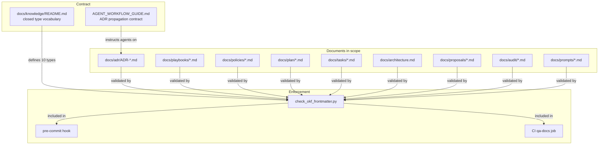

# OKF Knowledge Vocabulary

Canonical `type` vocabulary for DubBridge's Open Knowledge Format (OKF) adoption.
Governed by [ADR-033](../adr/ADR-033-open-knowledge-format-adoption.md).

`type` is the only required frontmatter field. The vocabulary is **closed**: any
value not listed below is a validator error.

## Closed `type` vocabulary

| `type` | Location pattern | Notes |
|---|---|---|
| `ADR` | `docs/adr/ADR-*.md` | Must include `status:` mirroring the prose `- **Status:**` line. |
| `Playbook` | `docs/playbooks/*.md` | May include `governs:` listing governed scopes. |
| `Policy` | `docs/policies/*.md` | May include `governs:` listing governed scopes. |
| `Plan` | `docs/plan/*.md` (except `roadmap.md`) | Should include `status:`, `slice:`, `governed_by:`. |
| `Roadmap` | `docs/plan/roadmap.md` (singleton) | Singleton; no `slice:` field. |
| `TaskList` | `docs/tasks/*.md` | Should include `status:`, `slice:`, `plan:`, `governed_by:`. |
| `Architecture` | `docs/architecture.md` (singleton) | Singleton. |
| `Proposal` | `docs/proposals/*.md` | May include `status:`. |
| `Audit` | `docs/audit/*.md` | May include `date:`. |
| `Prompt` | `docs/prompts/*.md` | May include `governs:`. |

## System overview



## Out-of-scope paths (validator skips these)

- `docs/daily/*` — ephemeral daily notes
- `*/TEMPLATE.md` — template files
- Pure index READMEs (e.g. `docs/adr/README.md`, `docs/knowledge/README.md`)
- `.feature` BDD files — non-Markdown, deferred (see ADR-033 §OKF-X1)

## Frontmatter schema

```yaml
---
type: <value from closed vocabulary>        # required
title: <human-readable title>               # recommended
description: <one-line summary>             # recommended
status: <Proposed|Accepted|Superseded|...>  # required for ADR; recommended for Plan/TaskList
# ADR-specific
supersedes: [ADR-NNN, ...]                  # when this ADR replaces another
superseded_by: ADR-NNN                      # when this ADR is replaced
# Plan / TaskList
slice: S-NNN
plan: docs/plan/s-nnn-....md
governed_by: [ADR-NNN, ...]                 # must resolve to existing docs/adr/ADR-*.md files
# Playbook / Policy / Prompt
governs: <scope description>
---
```

Unknown keys are tolerated by consumers (per OKF v0.1 spec). Producers must not
use keys that contradict the schema above.

## Examples

### ADR

```yaml
---
type: ADR
title: "ADR-006: PostgreSQL for metadata, object storage for binary artifacts"
status: Accepted
---
```

### Plan

```yaml
---
type: Plan
title: "S-080: Object storage switchover"
status: closed
slice: S-080
governed_by: [ADR-006]
---
```

### TaskList

```yaml
---
type: TaskList
title: "Tasks: S-080 — Object storage switchover"
status: closed
slice: S-080
plan: docs/plan/s-080-object-storage-switchover.md
governed_by: [ADR-006]
---
```

### Playbook

```yaml
---
type: Playbook
title: "Agent Workflow Guide"
governs: "all agent-facing workflow decisions in the repository"
---
```

### Policy

```yaml
---
type: Policy
title: "RRI Policy"
governs: "task complexity scoring and model selection"
---
```

### Roadmap

```yaml
---
type: Roadmap
title: "DubBridge Platform Roadmap"
---
```

### Architecture

```yaml
---
type: Architecture
title: "DubBridge System Architecture"
---
```

### Proposal

```yaml
---
type: Proposal
title: "OKF Knowledge Format Adoption"
status: Proposed
---
```

### Audit

```yaml
---
type: Audit
title: "S-080 post-implementation audit"
date: 2026-06-11
---
```

### Prompt

```yaml
---
type: Prompt
title: "Review reflection prompt"
governs: "OKF-T1 reflection passes"
---
```
