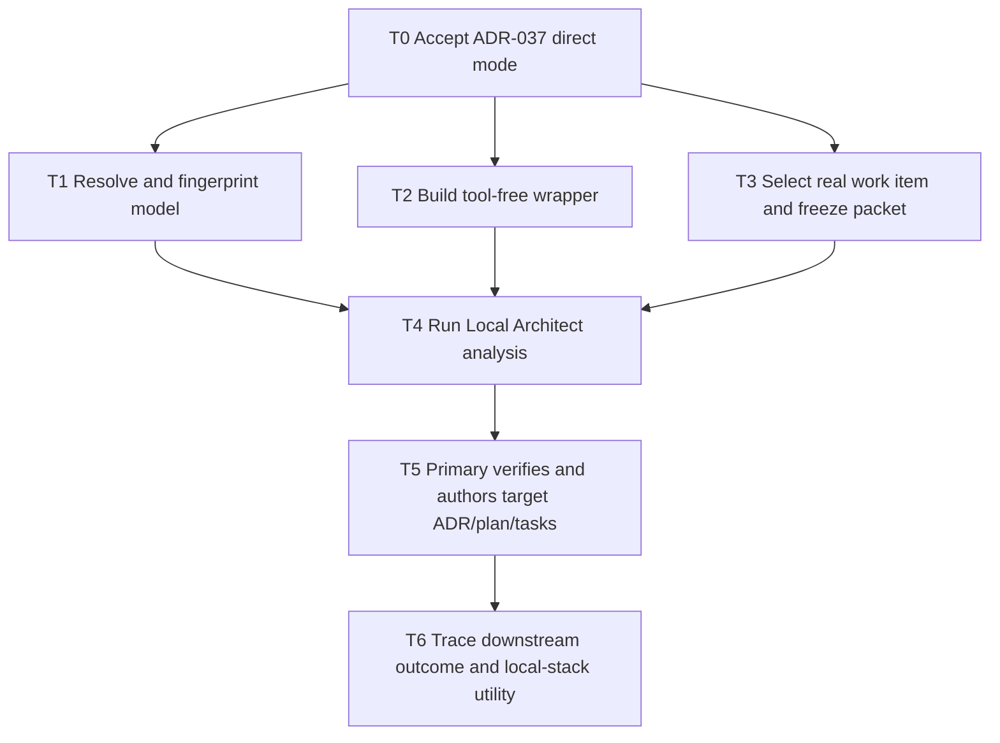

# Plan: ADR-037 Local Architect / Complex Analyst Direct Project Use

## Objective

Introduce `qwen3.6:27b-q4_K_M` directly into real DubBridge planning work as a
read-only Local Architect / Complex Analyst. The role is evaluated through actual
project utility, not through an offline pilot corpus, and it never receives
implementation, review, approval, or canonical-document authority.

The default first real work item is `S-140` because `S-130` is complete locally and
`S-140` is the next natural consumer in the roadmap. The owner may select a different
eligible roadmap item before the context packet is frozen.

## Current state

- ADR-036 assigns `qwen3.6:35b-a3b` to Moderate-band implementation and
  `gemma4:26b-a4b-it-qat` to local review/challenge duties.
- The requested ADR-037 binding, `qwen3.6:27b-q4_K_M`, is now installed locally
  with digest `a50eda8ed977ab48a12431878896b27ffd5cef552c17af3317d9623b939a7f1e`
  after T1 on 2026-07-19.
- The one-shot wrapper from T2 is now implemented locally in
  `scripts/local-architect/run_analysis.py` with focused unit coverage and a
  passing Gemma phase-2 review on 2026-07-20.
- ADR-037 is accepted only as an advisory pre-planning lane. It does not alter RRI,
  reviewer routing, owner authority, application runtime, or crate boundaries.
- Direct project use was chosen by the owner over a historical/offline pilot.

## Scope

### Included

- Exact model-resolution, installation, and fingerprint evidence for the requested
  binding, after a separately approved task.
- A narrow, one-shot, tool-free invocation wrapper that consumes a frozen project
  packet and emits one structured analysis artifact.
- Selection and freezing of one real project work item with explicit questions,
  non-goals, constraints, and repository revision/hash.
- Primary-agent reconciliation of the advisory artifact into the target work item's
  normal ADR, plan, and task files.
- Per-use operational evidence: accepted/rejected recommendations, critical
  omissions, invented facts, runtime, and planning utility.

### Excluded

- Offline blind corpus, synthetic pilot, shadow-mode phase, or promotion gate.
- Source-code implementation by Qwen3.6-27B.
- Code-solution review or task-analysis review by Qwen3.6-27B.
- Automatic edits by the model to ADRs, plans, tasks, source, tests, configuration,
  policies, or ledgers.
- Automatic activation from RRI or replacement of existing reviewer routing.
- Direct use of production secrets, live production data, or unredacted sensitive
  context.

## Design decisions

1. **Direct real-work evaluation.** Every invocation is tied to a real work item ID,
   a bounded objective, and a frozen repository snapshot.
2. **One-shot, tool-free surface.** The runner sends a prebuilt packet to Ollama and
   writes only the requested analysis artifact. It exposes no shell, worktree, git,
   network, repository-edit, or review tools to the model.
3. **Primary-agent reconciliation.** The primary agent verifies every repository fact
   and decides which recommendations become canonical plans/tasks. The advisory
   artifact is preserved but never treated as approval.
4. **No silent substitution.** The Local Architect label may only refer to
   `qwen3.6:27b-q4_K_M` with recorded digest and runtime metadata. Any different
   model binding requires a recorded amendment or an explicitly labeled comparison
   lane.
5. **Medium-task decomposition.** Resolution, wrapper implementation, packet
   construction, model execution, and outcome tracing are split into bounded tasks
   suitable for `RRI 26-40` Medium agents where possible.
6. **Circuit breaker over promotion.** A critical invented repo fact, controlling-ADR
   conflict, authority claim, or materially unsafe recommendation invalidates that
   artifact and disables the consultative lane until the issue is recorded and a
   bounded correction/retest is approved.

## Direct workflow

## Medium-agent execution protocol

Every Medium agent receives:

- one task excerpt from `docs/tasks/adr037-local-architect-direct-project.md`;
- the exact RRI output recomputed at presentation time;
- fixed inputs, allowed paths, repository revision, and stop conditions;
- named evidence outputs and status artifacts to synchronize;
- a prohibition on starting the next task without a separate presentation.

Every Medium agent must:

1. verify dependencies are complete;
2. recompute RRI and follow the workflow guide approval/review route;
3. execute only the named work item, model, packet, or allowed files;
4. preserve raw outputs and runtime evidence before interpretation;
5. label observations separately from recommendations;
6. stop on unresolved model identity, invalid packet hash, RRI `41+`, boundary
   breach, or critical hallucination;
7. never approve architecture, review code officially, edit canonical target docs
   from the model output, or start downstream implementation.

## Operational evaluation criteria

Each direct use records:

- exact model tag, digest, prompt version, runtime parameters, context size, and
  generation statistics;
- packet revision/hash and included evidence list;
- critical constraints recovered, missed, or contradicted;
- invented repository facts or unsupported external claims;
- recommendations accepted, partially accepted, or rejected by the primary agent;
- planning usefulness and time cost;
- downstream outcome after the first relevant implementation/review milestone.

The consultative lane remains healthy only while artifacts have zero critical
invented repo facts, zero controlling-ADR conflicts, no authority claims, and useful
bounded contributions to real planning. A healthy artifact normally recovers at
least 90% of critical constraints and completes a typical 16K analysis within about
20 minutes with median decode near or above 6 tok/s, but these are operating targets,
not promotion gates.

## Planned affected files

- `docs/adr/ADR-037-qwen36-27b-local-architect-complex-analyst.md`
- `docs/adr/README.md`
- `docs/plan/adr037-local-architect-direct-project.md`
- `docs/tasks/adr037-local-architect-direct-project.md`
- `scripts/local-architect/run_analysis.py` (planned T2)
- `scripts/local-architect/run_analysis_test.py` (planned T2)
- `docs/evaluations/adr037-direct-project-report.md` (planned T1/T4-T6)
- `.agent/local-architect/adr037/<work-item-id>/` (raw local artifacts; planned)
- target work-item ADR/plan/tasks selected in T3/T5, defaulting to `S-140`

No application runtime or crate file is in scope for T0. Later target-work-item files
are governed by their own RRI, plan, task, and review gates.

## Verification

- Documentation changes: deterministic doc checks and `make qa-docs` where available.
- Wrapper task: focused Python unit tests, then the standard development closure
  gates for the recomputed band.
- Model-resolution task: exact tag/digest match, one-large-model residency evidence,
  smoke transcript, and unload confirmation.
- Direct analysis task: packet hash match, provenance-complete artifact, runtime
  evidence, and primary-agent fact verification before any canonical target edit.
- Outcome trace: report accepted/rejected recommendations against later official
  implementation/review evidence without acting as a code reviewer.

## Status synchronization

Each task updates its own ledger entry and the matching report section. T5 updates
the target work item's canonical ADR/plan/tasks only through the normal DubBridge
workflow. T6 updates the ADR-037 operational report and this ledger. The product
roadmap and `docs/architecture.md` are reviewed for constraints but unchanged unless
the selected target work item independently requires an update.

## Related documents

- `docs/tasks/adr037-local-architect-direct-project.md`
- `docs/adr/ADR-037-qwen36-27b-local-architect-complex-analyst.md`
- `docs/adr/ADR-036-local-first-agentic-implementation-band.md`
- `docs/adr/ADR-034-gemma-process-audit-and-reviewer-reconciliation.md`
- `docs/playbooks/AGENT_WORKFLOW_GUIDE.md`
- `docs/policies/RRI_POLICY.md`
- `docs/policies/HITL_AUTONOMY_POLICY.md`
- `docs/plan/roadmap.md`
