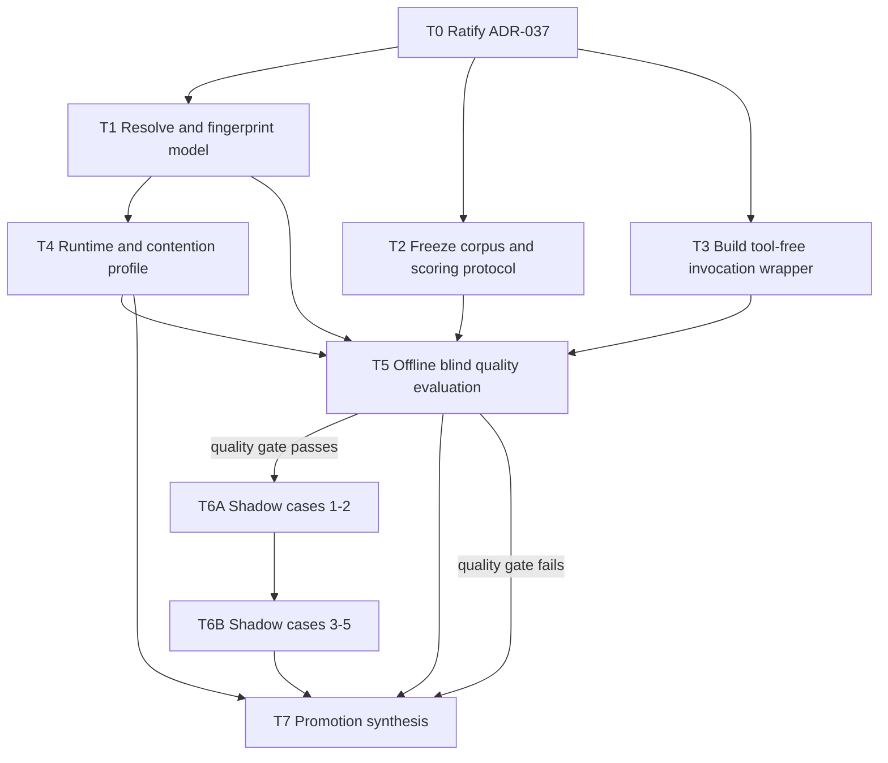

# Plan: ADR-037 Local Architect / Complex Analyst Pilot

## Objective

Determine whether `qwen3.6:27b-q4_K_M` adds enough architecture and complex-analysis
value on the 32 GB local machine to justify an optional, read-only pre-planning role.
The pilot measures the model itself and its effect on the full local workflow without
granting it implementation, review, approval, or canonical-document authority.

## Current state

- ADR-036 operates `qwen3.6:35b-a3b` as the Moderate-band local implementer and
  `gemma4:26b-a4b-it-qat` as the local reviewer/challenger.
- Existing `scripts/local-bench/` utilities measure inference, residency, and
  contention; they should be reused before adding new measurement code.
- The target Qwen3.6-27B binding is not present in the 2026-07-19 `ollama list`
  inventory, so no quality, memory, or speed claim is yet accepted.
- The historical ADR-036 16-card corpus was retired as promotion/comparison
  evidence. ADR-037 therefore uses new pre-decision snapshots and never relabels the
  retired corpus as valid evidence.

## Scope

### Included

- ADR ratification and exact model-binding verification.
- Runtime measurements at bounded context sizes and under normal machine contention.
- A narrow, one-shot, tool-free invocation wrapper that consumes an immutable packet
  and emits a structured analysis artifact.
- A frozen blind corpus of 12–15 complex-analysis cases.
- Offline baseline comparison and five shadow-mode real cases.
- A final `GO | RETEST | NO-GO` report against ADR-037's gates.

### Excluded

- Source-code implementation by Qwen3.6-27B.
- Code-solution review or task-analysis review by Qwen3.6-27B.
- Automatic edits to ADRs, plans, tasks, source, tests, or configuration.
- Automatic activation from RRI or replacement of existing reviewer routing.
- Direct use of production secrets, live production data, or unredacted business
  context.
- Modification of application runtime or crate boundaries.

## Design decisions

1. **One-shot, tool-free surface.** The runner sends a prebuilt packet to Ollama and
   writes only the explicitly requested result artifact. It exposes no shell,
   filesystem-edit, worktree, git, or network tools to the model.
2. **Frozen evidence before scoring.** Case inputs, expected constraints, critical
   failure conditions, and scoring anchors are frozen and hashed before any candidate
   output is opened.
3. **Blind comparison.** Evaluators see normalized artifacts labeled by random lane
   ID, not model name. Candidate lanes are Qwen3.6-27B, Qwen3.6-35B-A3B, and a
   primary-agent/reference lane. Cloud output is a benchmark reference, not a new
   authority gate.
4. **Separate ability from stack utility.** Offline cases measure artifact quality;
   shadow cases measure whether the artifact reduces planning time or changes useful
   decisions in the actual Qwen-implementer/Gemma-reviewer stack.
5. **Medium-task decomposition.** Evidence work is split into bounded RRI 26–40
   cards. Medium agents execute exactly one card and emit named artifacts. The final
   promotion decision remains RRI 41+ and belongs to the primary agent and human.
6. **No silent remediation.** A missing model, invalid artifact, timeout, swap event,
   unblinded case, or evaluator conflict is preserved as evidence. The task stops or
   emits `RETEST`; it does not replace the model or repair the answer invisibly.

## Medium-agent execution protocol

Every Medium agent receives:

- one task excerpt from `docs/tasks/adr037-local-architect-pilot.md`;
- the exact RRI output recomputed at presentation time;
- fixed allowed paths and a repository/snapshot revision;
- only the inputs named by the task, normally capped at 16K tokens;
- exact commands or rubric operations;
- evidence paths and status artifacts to synchronize;
- a stop condition that forbids starting the next task.

Every Medium agent must:

1. verify its dependencies are marked complete;
2. restate missing prerequisites without broad repo exploration;
3. execute only the named lane/cases or allowed files;
4. preserve raw outputs before normalization or scoring;
5. label observations separately from recommendations;
6. update the task ledger and named report section in the same workflow pass;
7. stop on a boundary breach, unresolved model identity, invalid manifest hash,
   critical hallucination, or RRI recomputation above 40;
8. never promote ADR-037 or treat a Local Architect result as approval.

## Evaluation dataset

Create 12–15 cases from repository history at revisions before the relevant decision
was encoded. The corpus must include at least:

- 3 architecture/boundary cases;
- 2 security, permission, or sensitive-data cases;
- 2 migration, consistency, recovery, or concurrency cases;
- 2 complex defect/causal-analysis cases;
- 2 agent-workflow or orchestration cases;
- 1 deliberately simple case where the correct result is “do not invoke the Local
  Architect”; and
- enough additional cases to reach the frozen total without duplicating one outcome.

Each case records the source revision, permitted files/excerpts, known decision or
post-hoc evidence, critical constraints, automatic-failure conditions, and redaction
status. Cases whose reference answer is already visible in the supplied snapshot are
invalid.

## Measurement and comparison matrix

| Lane | Purpose | Tools | Authority |
|---|---|---|---|
| Qwen3.6-27B | candidate Local Architect | none | advisory only |
| Qwen3.6-35B-A3B | local speed/quality baseline | none | comparison only |
| Primary/reference | quality ceiling and adjudication aid | normal read-only analysis | benchmark reference |
| Gemma 4 26B | existing official reviewer after later implementation | existing reviewer path | unchanged; not an architect candidate in this pilot |

Runtime measurement is repeated five times after a warm-up at 8K and 16K, plus one
24K operating-ceiling run and one 32K stress run. Record prefill/decode throughput,
TTFT proxy, end-to-end wall time, peak process memory, system swap delta, load/unload
time, failures, and thermal/contention observations. Only one large model may be
resident.

## Dependencies

`T6A` and `T6B` are split to keep each shadow batch in the Moderate band. A failed
offline quality gate skips both and routes directly to `T7` for a `NO-GO` or
`RETEST` decision.

## Planned affected files

- `docs/adr/ADR-037-qwen36-27b-local-architect-complex-analyst.md`
- `docs/adr/README.md`
- `docs/plan/adr037-local-architect-pilot.md`
- `docs/tasks/adr037-local-architect-pilot.md`
- `scripts/local-architect/run_analysis.py` (planned T3)
- `scripts/local-architect/run_analysis_test.py` (planned T3)
- `docs/evaluations/adr037-case-manifest.md` (planned T2)
- `docs/evaluations/adr037-local-architect-report.md` (planned T1/T4–T7)
- `.agent/local-architect/adr037/` (raw, local, non-canonical artifacts; planned)

No application runtime or crate file is in scope.

## Verification

- Documentation changes: `make qa-docs`.
- Wrapper task: focused Python unit tests, then the standard development closure
  gates for the recomputed band.
- Runtime artifacts: JSON/schema validation, exact model tag/digest match, five-run
  completeness, and one-large-model residency evidence.
- Quality artifacts: manifest-hash match, blind lane mapping retained separately,
  two-evaluator coverage for critical cases, and automatic-failure scan.
- Final report: every ADR-037 promotion and rollback field populated with raw-source
  references or explicitly marked `UNKNOWN`.

## Status synchronization

Each task updates its own entry in the task ledger and the matching report section.
T7 additionally synchronizes ADR-037 status/prose/frontmatter, the ADR index, this
plan, and any workflow/policy file only if the human explicitly approves promotion.
The product roadmap and `docs/architecture.md` are reviewed but unchanged because
this pilot adds no product slice, runtime surface, or crate boundary.

## Related documents

- `docs/tasks/adr037-local-architect-pilot.md`
- `docs/adr/ADR-037-qwen36-27b-local-architect-complex-analyst.md`
- `docs/adr/ADR-036-local-first-agentic-implementation-band.md`
- `docs/adr/ADR-034-gemma-process-audit-and-reviewer-reconciliation.md`
- `docs/playbooks/AGENT_WORKFLOW_GUIDE.md`
- `docs/policies/RRI_POLICY.md`
- `docs/policies/HITL_AUTONOMY_POLICY.md`

