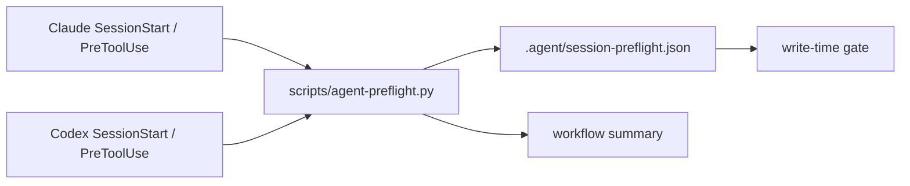

# Plan: Agent Session Preflight Gate

> **Status:** Closed
> **Tasks ledger:** `docs/tasks/agent-session-preflight-gate.md`

## Objective

Reduce workflow misses when Codex or Claude Code starts in a fresh window by
turning the repository startup contract into a small executable preflight and a
write-time gate.

The goal is not to replace `AGENT_WORKFLOW_GUIDE.md`; it is to make the first
session interaction load a compact summary and make file edits fail fast when
the agent has not acknowledged the workflow requirements.

## Affected files

- `scripts/agent-preflight.py`
- `scripts/agent_preflight_test.py`
- `.claude/settings.json`
- `.gitignore`
- `/Users/matias/.codex/config.toml`
- `docs/plan/agent-session-preflight-gate.md`
- `docs/tasks/agent-session-preflight-gate.md`

## Design decisions

### D1 — One shared preflight script

Claude and Codex should call the same repository script so the contract is
maintained in one place. The script prints a compact startup summary and records
a session-local sentinel under `.agent/`.

### D2 — Fail fast before edits

The write-time hook should reject edit/write tools when the sentinel is missing
or when the current session has not run the required preflight. This changes the
current reminder-only hook into an enforceable gate.

### D3 — Keep the bootstrap compact

The injected context should name only the operational rules a fresh model is most
likely to miss: workflow authority, plan/task/RRI order, approval threshold,
mobile `DESIGN.md`, and development closure review.

### D4 — Do not encode task-specific approval

The preflight can prove that the session loaded the workflow, but it cannot prove
that a later task has valid RRI or approval. It should therefore block only the
missing-session-preflight case and print the per-task checks the agent must
perform before editing.

## Module dependencies

## Verification

- `python3 -m unittest scripts/agent_preflight_test.py`
- `python3 scripts/agent-preflight.py --print-summary`
- `python3 scripts/agent-preflight.py --check`
- `python3 scripts/check_okf_frontmatter.py docs/plan/agent-session-preflight-gate.md docs/tasks/agent-session-preflight-gate.md`
