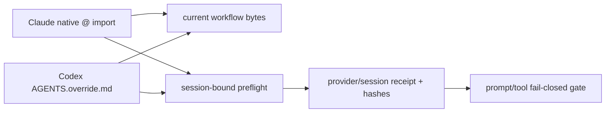

# Plan: Agent Session Preflight Gate

> **Status:** Active — hardening reopened 2026-07-26
> **Tasks ledger:** `docs/tasks/agent-session-preflight-gate.md`

## Objective

Reduce workflow misses when Codex or Claude Code starts in a fresh window by
turning the repository startup contract into a small executable preflight and a
write-time gate.

The goal is not to replace `AGENT_WORKFLOW_GUIDE.md`; it is to make every
Codex/Claude session load the current workflow bytes through its native
instruction mechanism, record session-bound evidence, and fail closed when the
evidence is absent or stale.

## Affected files

- `scripts/agent-preflight.py`
- `scripts/agent_preflight_test.py`
- `.claude/settings.json`
- `.codex/config.toml`
- `AGENTS.override.md`
- `CLAUDE.md`
- `.gitignore`
- `/Users/matias/.codex/config.toml`
- `docs/plan/agent-session-preflight-gate.md`
- `docs/tasks/agent-session-preflight-gate.md`

## Design decisions

### D1 — One shared preflight script

Claude and Codex should call the same repository script so the contract is
maintained in one place. The script prints a compact startup summary and records
a session-local sentinel under `.agent/`.

### D2 — Fail fast before edits

The write-time hook should reject edit/write tools when the sentinel is missing
or when the current session has not run the required preflight. This changes the
current reminder-only hook into an enforceable gate.

### D3 — Keep the bootstrap compact

The injected context should name only the operational rules a fresh model is most
likely to miss: workflow authority, plan/task/RRI order, approval threshold,
mobile `DESIGN.md`, and development closure review.

### D4 — Do not encode task-specific approval

The preflight can prove that the session loaded the workflow, but it cannot prove
that a later task has valid RRI or approval. It should therefore block only the
missing-session-preflight case and print the per-task checks the agent must
perform before editing.

### D5 — Bind evidence to the provider session

Receipts live below `.agent/session-preflight/<provider>/` and are keyed by a
SHA-256 digest of provider, session id, and actor id. A receipt records the raw
session id inside ignored runtime state, the repository root, lifecycle event,
native instruction source, and the SHA-256/byte count of every required source.
Manual diagnostic commands never create an authorizing receipt.

### D6 — Use native instruction loading for the full document

Claude imports `docs/playbooks/AGENT_WORKFLOW_GUIDE.md` from `CLAUDE.md` and
records `InstructionsLoaded` evidence. Codex loads a generated
`AGENTS.override.md` containing `AGENTS.md` followed by the authoritative
workflow guide; project configuration raises `project_doc_max_bytes` above the
generated bundle size. Startup hook output remains a compact attestation rather
than attempting to carry the 68 KiB guide.

### D7 — State the enforcement boundary honestly

Repository and user hooks certify normal trusted sessions. Literal
non-bypassability requires administrator-managed Codex/Claude policy plus a
controlled launcher that prevents customization-bypass flags. The audit report
must distinguish those two levels and may not claim semantic comprehension.

### D8 — Split hardening into closure-sized subtasks

The reopened hardening work should not continue as three large umbrella tasks.
It is decomposed into receipt core, provider wiring, and certification
workstreams with closure-sized subtasks so each step can emit evidence, fail
independently, and hand off cleanly.

## Module dependencies

```mermaid
flowchart LR
    C["Claude native @ import"] --> W["current workflow bytes"]
    X["Codex AGENTS.override.md"] --> W
    C --> P["session-bound preflight"]
    X --> P
    P --> S["provider/session receipt + hashes"]
    S --> G["prompt/tool fail-closed gate"]
```

## Refined hardening sequence

```mermaid
flowchart LR
    T3["T3 baseline verified"] --> A1["T4a1 receipt schema + source manifest"]
    A1 --> A2["T4a2 atomic publish + invalidation"]
    A2 --> A3["T4a3 CLI + hook adapters"]
    A3 --> A4["T4a4 race/permission tests"]
    A4 --> B1["T4b1 Claude native load wiring"]
    B1 --> B2["T4b2 Codex native bundle + gates"]
    B2 --> B3["T4b3 portable pathing + legacy-hook cleanup"]
    B3 --> C1["T4c1 fresh-session smoke harness"]
    C1 --> C2["T4c2 audit coverage report"]
    C2 --> C3["T4c3 admin boundary + blocker handoff"]
```

### Why this split

- `T4a1-T4a4` isolate receipt correctness from provider configuration churn.
- `T4b1-T4b3` separate Claude wiring, Codex wiring, and path/duplicate-hook cleanup.
- `T4c1-T4c3` keep runtime certification, audit math, and admin-boundary reporting distinct.

## Verification

- `python3 -m unittest scripts/agent_preflight_test.py`
- `python3 scripts/agent-preflight.py verify-bootstrap`
- `python3 scripts/agent-preflight.py audit`
- `python3 scripts/check_okf_frontmatter.py docs/plan/agent-session-preflight-gate.md docs/tasks/agent-session-preflight-gate.md`

## Current state

- `T0-T3` remain complete.
- `T4` is now decomposed into `T4a1-T4c3` in the linked ledger.
- `T4a1` is complete: v2 receipt payload/validator, identity derivation, and
  source-manifest hashing landed in `scripts/agent-preflight.py` (memory-only,
  no disk publish). Reached via ADR-038 direct-cloud escalation after the
  single bounded local attempt hit `budget_exhausted`; see the ledger's
  closure evidence for the full gate trace and Gemma Reviewer pass.
- `T4a2` is complete: atomic `publish_v2_receipt` (temp-write -> fsync ->
  `os.replace`, pre-publish invalidation, 0700/0600 permissions) landed.
  ADR-038 downgraded Qwen27's `GO_LOCAL` to `CLOUD_REQUIRED` (fail-closed
  authorization boundary, ADR-038 §6); Claude implemented directly. See the
  ledger's closure evidence.
- `T4a3` is complete: the v2 receipt engine is now exposed through `load`,
  `check`, `hook-load`, and `hook-gate` CLI verbs plus Claude/Codex hook
  adapters, sharing one validation core with T4a1/T4a2, with the exit-code
  contract (0/1/2) and stdout/stderr separation specified in the ledger.
  Qwen27 recommended `CLOUD_REQUIRED` (same §6 authorization-boundary
  exclusion as T4a2, reinforced by an undocumented hook-payload-shape
  unknown); the primary independently confirmed it, and Claude implemented
  directly. Legacy `--mark`/`--check` remain diagnostics-only and cannot
  satisfy any v2 gate. See the ledger's closure evidence for the full gate
  trace, 3-pass Reflection log, and unit coverage certification (56/56
  passing, 93% line coverage on the touched file).
- `T4a4` is complete: five deterministic tests (`AgentPreflightRacePermissionTest`)
  lock the v2 receipt engine against concurrent loaders, a check-vs-replace
  race, and permission denial, with no production-code changes needed. ADR-038
  again routed `CLOUD_REQUIRED` (same §6 fail-closed-invariant exclusion as
  T4a2/T4a3); Claude implemented directly. See the ledger's closure evidence
  for the gate trace, Gemma Reviewer log (one out-of-scope platform finding,
  disposition `reviewed_no_change`), and unit coverage certification (61/61
  passing, 93% line coverage).
- `T4b1` is complete: `.claude/settings.json`'s `SessionStart`/`PreToolUse`
  hooks now call the v2 `hook-load`/`hook-gate` verbs instead of the legacy
  sentinel, and `CLAUDE.md` natively `@import`s the workflow guide and
  autonomy policy so the receipt's `native_instruction` hash attests to real
  loaded bytes. ADR-038 routed `CLOUD_REQUIRED` (this is the first task in the
  chain to change the *live* authorization mechanism itself, not just build or
  test the engine behind it); Claude implemented directly. Implementation
  surfaced and fixed one genuine defect in the frozen T4a3 engine: `hook-gate`
  was running real `PreToolUse` payloads (whose `hook_event_name` is the hook
  type itself, e.g. `"PreToolUse"`) through the same lifecycle-event validator
  used by `hook-load`, which would have failed closed on every real gate check
  with a malformed-input error instead of evaluating the receipt. Fixed with a
  gate-specific identity extractor that does not lifecycle-validate. `fork` was
  added to the `SessionStart` matcher (a documented Claude Code v2.1.214+
  value); `subagent` has no dedicated hook event in the current Claude Code
  version and is left honestly unmapped rather than claimed as covered. See
  the ledger's closure evidence for the gate trace, fixture evidence across
  all five mapped lifecycle events plus EC-1 denials, Gemma Reviewer log (two
  non-blocking, self-disposed findings with line-citation errors), and unit
  coverage certification (66/66 passing, 93% line coverage).
- `T4b2` is complete: `AGENTS.override.md` (79,101 bytes, byte-exact
  concatenation of `AGENTS.md` + `docs/playbooks/AGENT_WORKFLOW_GUIDE.md`)
  now exists, `/Users/matias/.codex/config.toml`'s `SessionStart`/
  `PreToolUse` hooks call the v2 `hook-load`/`hook-gate` verbs instead of
  the legacy sentinel (mirroring T4b1's Claude wiring), and
  `project_doc_max_bytes = 131072` covers the bundle with headroom. ADR-038
  routed `CLOUD_REQUIRED` (same live-authorization-boundary exclusion as
  T4a2-T4b1, reinforced by the shared-config and new-artifact risk
  factors); Claude implemented directly. Implementation surfaced and fixed
  a second instance of the T4b1-class defect: `adapt_codex_hook_payload`
  and `codex_gate_response` (T4a3) assumed a wrong Codex hook payload/
  response shape (`event`/`{"decision","reason"}`), corrected via static
  inspection of the installed Codex CLI binary to the real
  `hook_event_name`/`hookSpecificOutput` shape (field-identical to
  Claude's). Two Codex-specific limitations were found and documented
  rather than fixed: Codex's own project-doc loader truncates silently on
  overflow instead of failing closed, and changing a hook's command body
  invalidates its `trusted_hash`, requiring one-time interactive re-trust
  on next real Codex session start. See the ledger's closure evidence for
  the full gate trace, fixture evidence across all four mapped lifecycle
  events plus EC-1 denials, peer review (qwen3.6:27b-q4_K_M, 0 blocking
  findings), and unit coverage certification (69/69 passing, 93% line
  coverage).
- The next intended start point is `T4b3` (portable path resolution and
  duplicate-hook cleanup), which removes the hard-coded
  `/Users/matias/.codex/config.toml` absolute-path assumption and audits
  for competing user-level hooks.
