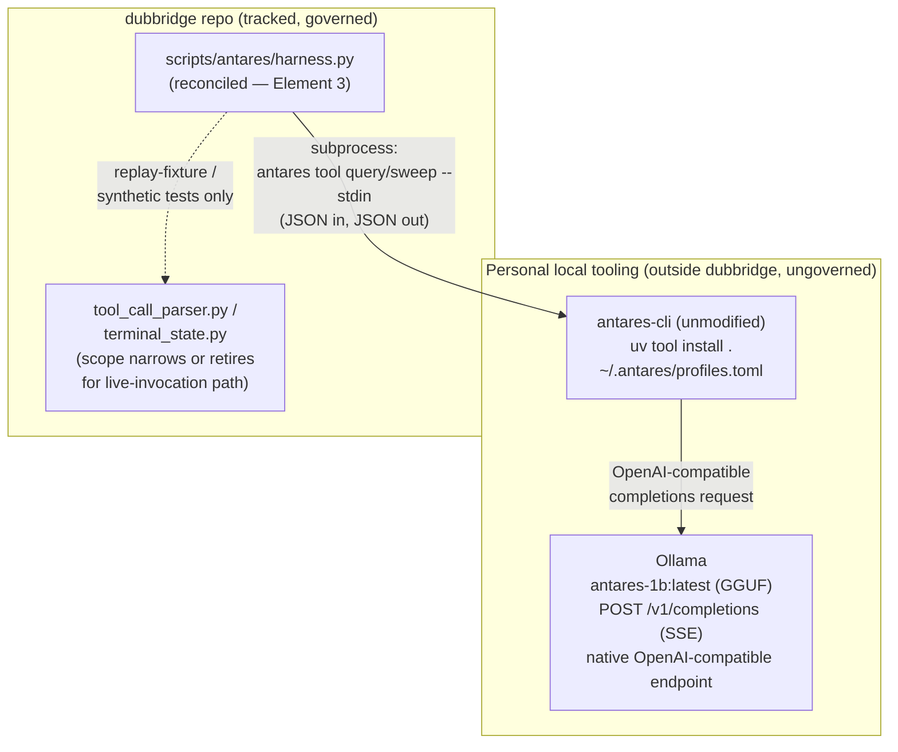
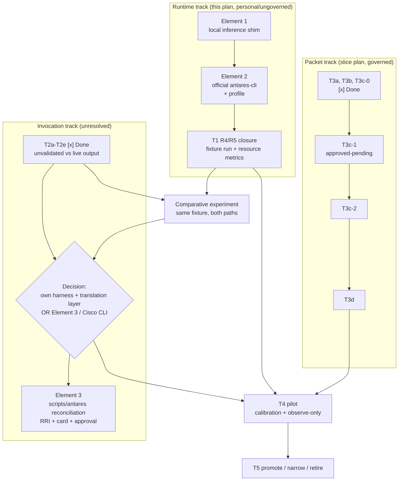

# Plan: Antares Local Runtime Adoption

## Objective

Get a real, working local Antares invocation path by adopting Cisco's own
official `antares-cli` reference implementation against a small local
inference shim, instead of continuing to hand-build a wire-format parser
against a model output shape that was never observed
(`scripts/antares/tool_call_parser.py`, T2a docstring). Define what stays
outside the tracked repository (personal, reusable tooling) versus what
becomes tracked, governed follow-on work inside `scripts/antares/*`.

This plan does not itself authorize any edit to a tracked path. It is
pre-implementation context per `docs/playbooks/AGENT_WORKFLOW_GUIDE.md` Step 2
and is written under the "drafting plans... no code execution" allowance in
`docs/policies/HITL_AUTONOMY_POLICY.md`. Any edit to `scripts/antares/*`
still requires its own RRI computation, task card, and — per its band —
explicit approval before implementation.

## Background

`docs/tasks/antares-security-specialist-advisor.md` T1 (runtime preflight)
recorded a `BLOCKED` technical result on 2026-07-29 (gated Hugging Face
access, `401 GatedRepo`) with an owner waiver to proceed. Its documented
recovery plan (R1-R5) marked R1 (human HF access) "not agent-solvable."

During this session:

- R1 was resolved: gated access to `fdtn-ai/antares-1b` was confirmed
  (`401` -> `200`) using a user-supplied, since-superseded Hugging Face
  token. **The token that was used is exposed in this conversation's
  history and must be treated as compromised regardless of later
  revocation.**
- R2 was resolved: a disposable Python 3.12 venv
  (`.antares-runtime/venv/`, gitignored) with `torch 2.13.0`,
  `transformers 5.14.1`, `safetensors 0.8.0`, `accelerate 1.14.0`,
  `huggingface_hub 1.26.0` confirmed Apple Silicon MPS availability
  (`torch.backends.mps.is_available() -> True`).
- R3 substantially advanced: the pinned revision
  (`10417eb35641b32e7141157db19c76eb545193b6`) was downloaded to
  `.antares-runtime/model/` (3.4G) and a SHA-256 manifest of the 8
  top-level artifact files was generated
  (`.antares-runtime/manifest-sha256.txt`). No externally published
  second-source digest has been cross-checked yet — this remains a minor
  open gap, not a blocker.
- An unplanned but decisive discovery: the model repository ships Cisco's
  own official reference CLI at `assets/antares-cli.zip`
  (`.antares-runtime/antares-cli-reference/` once unzipped, gitignored).
  It is a complete, tested, Apache-2.0-licensed Python package
  (`pyproject.toml`: `name = "antares-cli"`, console script
  `antares = "antares_cli.main:app"`), not a fragment.

### Wire-format ground truth (falsifies the current internal-schema docstring)

`scripts/antares/tool_call_parser.py` documents an internal normalized
schema, `{"tool": <name>, "payload": {...}}`, and says explicitly that "no
observed Antares transcript exists to pin an exact wire shape" and that
"whatever harness invokes Antares for real (T2c) is responsible for
translating the model's actual `<tool_call>` output into this internal
schema." That translation was never written. Cisco's reference parser is
that ground truth:

- `agent/streaming.py::_tool_call_arguments()` reads `args` or `arguments`
  — never `payload`.
- Tool name comes from `tool` or `name` (`agent/streaming.py`), normalized
  via `re.sub(r"[\s-]+", "_", tool_name.strip().lower())`.
- Wrapping tags are `<tool_call>`, `<done>`, `<answer>`
  (`_WRAPPED_OPEN_TAGS`), plus `<think>` framing stripped before parsing.
- The real tool set is `terminal` (argv-based; `bash` is an accepted
  alias — `agent/contracts.py`), `read_file`, `submit_vulnerable_files`
  (argument `ranked_files`, aliases `files`/`file_paths`), and
  `submit_no_vulnerability_found` (`agent/model_adapter.py:179-244`, the
  literal tool schema sent to the model).
- The full prompt contract — `<tool_call>{"name": ..., "arguments": ...}</tool_call>`
  — is built once in `agent/model_adapter.py::_build_antares_investigation_prompt()`.

### Why "adopt the CLI" beats "fix the parser"

`antares-cli` is not just a parser reference. It already includes the full
agent loop (`agent/loop.py`), tool execution sandbox (`tools/shell_exec.py`,
snapshot isolation described in its `README.md`), CWE selection
(bundled MITRE CWE 4.20), and — critically — a stable **JSON automation
interface**: `antares tool query --stdin` / `antares tool sweep --stdin`
take a JSON request on stdin and print a JSON result on stdout (exit `0`
completed, `1` completed-with-findings-and-`--fail-on-findings`, `2`
invocation/operational failure). Driving scans through that interface means
`scripts/antares/*` never has to parse a raw `<tool_call>` stream itself —
Cisco owns and maintains that parsing.

Licensing is clean for unmodified use: CLI source is Apache-2.0
(`LICENSE`); the only third-party content is a bundled MITRE CWE snapshot
under MITRE's free-use-with-attribution terms, already reproduced in the
package's own `THIRD_PARTY_NOTICES.md`. No obligation beyond preserving
that notice file, which ships inside the package unmodified.

## Design decisions

1. **Do not fork or hand-edit `antares_cli`.** Use it as an unmodified
   dependency. Lower maintenance burden, and Cisco's implementation is
   already tested (`tests/unit/*`, 25+ files including
   `test_streaming_parser.py`, `test_agent_contracts.py`,
   `test_read_only_commands_allowed.py`/`_blocked.py`).
2. **Local inference is served by Ollama, not a hand-built shim.**
   `antares_cli.inference.backend.InferenceBackend` is an open abstract
   interface (`stream_generate(messages) -> Iterator[str]`), but
   `core/runtime.py::_resolve_backend` only wires `"remote"`
   (`RemoteInferenceBackend`, an OpenAI-compatible HTTP client —
   `inference/remote.py`). An earlier iteration of this plan stood up a
   small FastAPI/uvicorn shim to speak that same `POST /v1/completions`
   contract. That shim was deleted once verification showed Ollama already
   exposes a native, OpenAI-compatible `POST /v1/completions` SSE endpoint
   matching `RemoteInferenceBackend`'s wire contract exactly — zero custom
   code needed. The model is served as a GGUF conversion of the pinned
   `antares-1b` checkpoint: `convert_hf_to_gguf.py` (`ggml-org/llama.cpp`,
   upstream PR #13550 "Granite Four") explicitly registers
   `GraniteMoeHybridForCausalLM`; because every one of antares-1b's 40
   layers is typed `"attention"` (zero real Mamba/SSM layers), conversion
   falls back to a standard, already-supported `GRANITE_MOE`/`GRANITE` GGUF
   architecture rather than a novel path. `ollama create antares-1b -f
   Modelfile` imports the resulting GGUF as `antares-1b:latest`.
3. **No chat-template logic needed, regardless of backend.**
   `RemoteInferenceBackend._completions_generate`
   (`inference/remote.py:209-229`) renders the full prompt client-side via
   `antares_cli.inference.granite.apply_granite_chat_template(messages)`
   and sends it as a single `"prompt"` string to `/v1/completions`. Ollama
   only needs to tokenize that already-templated string and generate —
   exactly what raw (non-chat) `/v1/completions` means, and exactly why the
   CLI's own `README.md` warns "chat completions are not equivalent." This
   holds identically whether the backend is the retired shim or Ollama.
4. **Governance boundary: satisfied by explicit task revision, not
   avoided.** T1's recovery plan forbids substituting vLLM/SGLang/Ollama/
   Docker Model Runner for the authorized Transformers+PyTorch route
   without "an explicit task revision with new provenance and RRI"
   (`docs/tasks/antares-security-specialist-advisor.md`, R1-R5 table and
   surrounding prose). An earlier version of this decision claimed the
   FastAPI+Transformers+MPS shim avoided triggering that clause by staying
   off Ollama. That claim no longer holds: this plan now runs on Ollama.
   The clause is satisfied instead by
   `docs/tasks/antares-security-specialist-advisor.md` § "T1 task revision
   (2026-08-05): Ollama/GGUF runtime proposal", approved 2026-08-05, which
   recorded the new provenance and computed RRI 34 (Moderate) before this
   plan was updated to reflect the Ollama-backed implementation as adopted.
   The original R2 Transformers+PyTorch route remains documented as a valid
   alternative; it is not superseded, only no longer the sole authorized path.
5. **Repository boundary.** The GGUF model, Ollama import, and CLI
   install/profile are personal, generically reusable local host state with
   nothing dubbridge-specific in them (Ollama would serve any GGUF-
   compatible model behind an OpenAI-completions endpoint; the CLI is
   Cisco's own, unmodified). They are not added to this repository and
   carry no tracked-repo governance obligation. Only the `scripts/antares/*`
   consumer side (Element 3 below) is tracked and governed.

## Architecture



## Element 1 — Ollama-served GGUF runtime (personal tooling, not tracked) — implemented

- The pinned `fdtn-ai/antares-1b` checkpoint (revision
  `10417eb35641b32e7141157db19c76eb545193b6`, manifest-verified per R3) was
  converted to GGUF via `convert_hf_to_gguf.py` from a shallow clone of
  `ggml-org/llama.cpp`: 3.67GB bf16, 363 tensors. Source inspection of
  `conversion/granite.py` confirmed `GraniteMoeHybridForCausalLM` is
  explicitly registered and — because antares-1b has zero real Mamba/SSM
  layers — falls back to a standard Granite GGUF architecture, not a novel
  conversion path.
- Imported into Ollama: `Modelfile` (`FROM ./antares-1b.gguf`) +
  `ollama create antares-1b -f Modelfile` → `antares-1b:latest`, confirmed
  via `ollama list`.
- Ollama's native `POST /v1/completions` SSE endpoint matches
  `RemoteInferenceBackend`'s expected wire contract
  (`data: {"choices":[{"text": "<delta>"}]}\n\n`, terminated by
  `data: [DONE]`) with zero custom translation code — this is what replaced
  the earlier FastAPI/uvicorn shim, which has been deleted.
- Lives in the user's own tool space (`~/tools/antares-local-infer/`), not
  in this repository.

## Element 2 — Official `antares-cli`, unmodified (personal tooling, not tracked) — implemented

- Installed: `uv tool install .` from `.antares-runtime/antares-cli-reference/`.
- Configured `~/.antares/profiles.toml`:
  ```toml
  [profiles.antares-local]
  display_name = "Antares 1B (local via Ollama)"
  model = "antares-1b"
  backend = "remote"
  endpoint = "http://127.0.0.1:11434/v1/completions"
  context_window = 16384
  remote_timeout_seconds = 300

  [profiles.antares-local.generation]
  max_tokens = 4096
  temperature = 0.3
  top_p = 1.0
  frequency_penalty = 0.3
  stop_tokens = ["<|end_of_text|>", "<|start_of_role|>"]
  use_completions_api = true
  ```
  (values mirror `inference/defaults.py`; profile name is `antares-local`,
  endpoint is Ollama's default port `11434` — not the earlier plan draft's
  `local-antares`/`8000`, which named the now-deleted shim).
- Validated: `antares models list` correctly shows the `antares-local`
  profile. A live `antares tool query --stdin` run against
  `/Users/matias/dubbridge/crates/auth` with `CWE-287` completed end-to-end
  in ~11.8s with 0 generation errors and returned a genuine finding
  (`Improper Authentication`, `src/issuer.rs`). This is ad hoc validation,
  not T1's required fixed R4/R5 representative fixture.

## Element 3 — `scripts/antares/*` reconciliation (tracked, governed — not started)

Scope for a future task card, not implemented by this plan:

- Change `harness.py`'s invocation model from "consume a live model
  tool-call stream directly" to "invoke `antares tool query --stdin` /
  `antares tool sweep --stdin` as a subprocess and consume its JSON
  result." This is an architecture-level change to security-relevant code.
- Decide the resulting scope of `tool_call_parser.py` /
  `terminal_state.py`: likely narrows to serving the existing
  replay-fixture/synthetic-test path (`replay_fixtures.py`,
  `harness_test.py`) rather than any live-invocation code path, since
  Cisco's CLI now owns real wire-format parsing end to end. Do not delete
  either module silently — this is a scope decision that belongs in the
  task card, not an implicit side effect.
- This will need `scripts/rri.py` scoring, a `docs/tasks/*` entry (or an
  amendment to the existing antares task ledger), and explicit human
  approval before implementation per its resulting band — almost
  certainly Med-high or higher given it is a cross-file architecture
  decision on security-relevant parsing code (arch_decision penalty is
  likely to apply, per the T3c-1 precedent in
  `docs/audit/antares-t3c-1-rri.md`).

## What's needed beyond the two elements

1. ~~**Close T1's R4/R5.**~~ **Done 2026-08-05.** Ran T1's fixed
   representative fixture through the real pipeline (Element 1 + 2) as two
   `apps/`+`crates/`-scoped invocations and recorded cold-start latency, RSS,
   swap, and terminal results into
   `docs/evaluations/antares-runtime-preflight.md` /
   `antares-runtime-preflight.json` (`r4_r5_ollama_run_2026_08_05`).
   Result: `PASS` on all five thresholds (per-command latency supported by
   indirect evidence — the CLI does not emit per-tool-call timings; see the
   evidence file's caveat). Full record also cross-referenced from
   `docs/tasks/antares-security-specialist-advisor.md` § "T1 R4/R5 execution
   record — Ollama runtime (2026-08-05)".
2. **Credential hygiene (open, owner-owned).** Revoke/rotate the Hugging
   Face token pasted in this session's chat history — already the user's
   stated intent, not yet confirmed done. Any future token must be
   supplied via environment variable, never pasted in a conversation.
3. **Provenance gap.** The SHA-256 manifest in
   `.antares-runtime/manifest-sha256.txt` only proves the downloaded bytes
   are internally consistent; there is no externally published
   second-source digest to cross-check transport integrity against.
   Low priority, not a blocker to using the artifact locally.
4. **Lifecycle script.** A small launcher (start the shim in the
   background, healthcheck `GET`/`POST` before invoking `antares`, stop
   on exit) — again personal tooling, not a tracked deliverable.
5. **Model choice for routine use.** Default to `antares-1b` (already
   downloaded and MPS-verified) over `antares-350m`; revisit only if
   latency on routine scans becomes a problem.

## Orchestration and cross-plan dependencies

This plan and `docs/plan/antares-security-specialist-advisor.md` are not
independent tracks. This section is the single place where their sequencing
is reconciled; neither plan's own task order is authoritative for the other.

### Blocking finding: the wire-format translation layer was never written

Verified 2026-08-05 by direct inspection of `scripts/antares/*.py`:

- No module handles `<tool_call>` tags, the `name`/`arguments` fields, or a
  model output stream. The only occurrence of "arguments" in the package is
  inside `tool_call_parser.py`'s own docstring, describing the layer that
  was supposed to exist.
- The harness entrypoint is `harness.py::dispatch_tool_call(raw_json,
  session)` -> `parse_tool_call(raw_json)`, which already expects the
  internal `{"tool": ..., "payload": ...}` schema.
- `replay_fixtures.py::_msg()` builds exactly that internal schema, so the
  entire T2e corpus — and therefore every test that exercised the composed
  harness — validated against the assumed schema, never against real model
  output.
- T2a assigned the translation layer to T2c
  (`tool_call_parser.py` docstring). T2c was decomposed into T2c-1 (single
  subprocess lifecycle and isolation) and T2c-2 (aggregate budgets and
  teardown). Neither subtask's objective includes wire-format translation,
  and neither implemented it.

T2a's own Reflection Pass 1 flagged the discrepancy and Pass 2 resolved it
by reasoning that the observed `{"function": {"name": ..., "arguments":
...}}` shape was the local runner's generic function-calling envelope rather
than Antares' own protocol. That reasoning is now falsified: Cisco's
reference implementation reads `args`/`arguments` and `tool`/`name` inside
`<tool_call>` tags (`agent/streaming.py`, `agent/model_adapter.py`), so
`payload` was never the real key.

**Consequence for sequencing:** the five completed Med-high T2 subtasks are
not defective, but they are unvalidated against live model output *by
construction*, and the one field the internal schema pins is wrong. Any
further work layered on the T2 invocation path inherits that exposure until
either a translation layer is written or Element 3 replaces the path
outright.

### Dependency graph across both plans



Two things the graph makes explicit that neither plan stated alone:

1. **T4 has two broken prerequisites, not one.** It needs a working runtime
   (T1 was owner-waived, not solved — R4/R5 remain open) *and* a resolved
   invocation path. Continuing the packet track alone never unblocks it.
2. **The packet track is invocation-independent.** Computing a deterministic
   dependency/manifest closure over a snapshot is required whether Antares is
   driven by our own harness or by `antares tool query --stdin`. T3c-1,
   T3c-2, and T3d therefore survive the Element 3 decision intact and are not
   at risk from it. `packet_schema.py` and `cwe_watchlist.py` likewise.

### Proposed sequence

| Phase | Work | Why here | Gate |
|---|---|---|---|
| A | Elements 1 + 2 | Zero governance cost (personal tooling, outside the repo); closes the only hard-blocked prerequisite with no progress; produces the first live model contact in the slice's history | none — no approval required |
| B | Comparative experiment: same fixture through the existing harness and through `antares tool query --stdin` | Converts the Element 3 decision from speculation into measurement. The existing harness needs a translation layer first, which is itself the measurement of what adopting the CLI would save | none — read-only evaluation, artifacts only |
| C | T3c-1 -> T3c-2 -> T3d | Invocation-independent; already scored, phase-1 reviewed, and handoff-ready. Runs in parallel with A/B without colliding | explicit approval per task (T3c-1 is RRI 55 Med-high) |
| D | Element 3 (or an explicit decision to keep the own-harness path plus a translation-layer task) | Only defensible with Phase B evidence in hand. Its task card must decide explicitly what happens to the five completed T2 subtasks — narrow to test-only, retire, or retain as the invocation path | RRI + task card + approval; likely 56+ therefore decomposition |
| E | T4 pilot, then T5 | Unblocked only once A, C, and D have all landed | existing slice gates |

**Recommended ordering:** A before C, even though C is more execution-ready.
Each additional Med-high layer built on the T2 invocation path increases the
cost of a Phase D decision that retires it. The cost of inverting the order
is roughly one session of delay; the cost of not inverting it is continued
accumulation on an unvalidated base.

**Honest counter-argument:** C survives Phase D regardless, so running A and
C in parallel loses nothing structurally. Prefer parallel execution if slice
momentum matters more than sequencing cleanliness.

### Decision points

| Decision | Resolved by | Currently blocked on |
|---|---|---|
| Does the existing T2 harness work against real Antares output? | Phase B, after a translation layer is written or the gap is confirmed fatal | Elements 1 + 2 |
| Adopt Cisco's CLI (Element 3) or keep the own-harness path? | Phase D task card, citing Phase B evidence | Phase B |
| Do `tool_call_parser.py` / `terminal_state.py` narrow to test-only scope, retire, or stay? | Phase D task card's own Reflection and review — not decided by this plan | Phase D |
| Is local `antares-1b` fast enough on this host for routine use? | T1 R5 metrics (cold start, latency, peak RSS, swap growth) | Elements 1 + 2 |

### Approval boundary

- **Elements 1 + 2 (Phase A):** no approval required. Personal, reusable
  tooling outside this repository, nothing tracked, no governed path touched.
- **Phase B:** no approval required. Read-only comparative evaluation that
  emits artifacts; it changes no tracked code.
- **T3c-1 and successors (Phase C):** explicit human approval per task, per
  their RRI bands. T3c-1's card and phase-1 evidence are already prepared —
  `docs/tasks/handoff-antares-t3c-1-2026-08-03.md`.
- **Element 3 (Phase D):** `scripts/rri.py` scoring, a task ledger entry, and
  explicit approval before any implementation.

## Open decisions

- Exact target location for the personal shim + CLI install (not this
  repo) — user's call, not blocking any dubbridge-tracked work.
- Whether `tool_call_parser.py`/`terminal_state.py` narrow to test-only
  scope or are retired outright once Element 3 lands — defer to that
  task's own Reflection/review, not decided here.

## Related documents

- `docs/tasks/antares-security-specialist-advisor.md` (T1 recovery plan
  R1-R5; T2a wire-format docstring this plan falsifies)
- `docs/plan/antares-security-specialist-advisor.md`
- `docs/playbooks/AGENT_WORKFLOW_GUIDE.md`
- `docs/policies/HITL_AUTONOMY_POLICY.md`
- `docs/audit/antares-t3c-1-rri.md` (RRI precedent for `arch_decision`
  penalty on `scripts/antares/*` changes)

## Sources

- `assets/antares-cli.zip` inside `fdtn-ai/antares-1b` revision
  `10417eb35641b32e7141157db19c76eb545193b6` (Hugging Face, gated repo).
- Local extraction: `.antares-runtime/antares-cli-reference/` (gitignored;
  `LICENSE`, `THIRD_PARTY_NOTICES.md`, `pyproject.toml`, `README.md`,
  `src/antares_cli/agent/{contracts,streaming,model_adapter,loop}.py`,
  `src/antares_cli/inference/{backend,remote,defaults,profiles}.py` read
  in full during this session.
