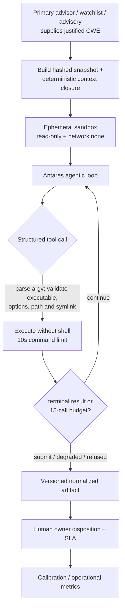

# Plan: Antares Bounded Vulnerability-Localization Advisor

## Revision note (2026-07-29)

This plan was **materially rewritten** after verifying what Antares actually is.
The previous revision was written before the model's documentation was consulted
and assumed the model itself could perform threat modeling, produce security
rationale, recommend tests, and propose RRI inputs. **Antares does none of those
things.** The corrected design keeps those responsibilities with the primary agent
or human security specialist and uses Antares only as a bounded localization
sub-tool.

Superseded assumptions are recorded in § Corrections against the previous revision
so the change is auditable rather than silent.

## Verified model facts

All facts below come from Cisco Foundation AI's release material and the
`fdtn-ai/antares-1b` model card, verified 2026-07-29. They are the binding
constraints for this slice.

| Property | Value |
|---|---|
| Publisher | Cisco Foundation AI |
| Released | 2026-07-21 |
| Variants | `antares-350m`, `antares-1b` (`antares-3b` announced) |
| Weights | Open, `fdtn-ai/antares-350m` / `fdtn-ai/antares-1b` on Hugging Face |
| License | Apache 2.0 |
| Base | IBM Granite 4.0 checkpoints, decoder-only transformer |
| Context | 128K tokens |
| Access | Public model page with manually reviewed, contact-sharing file access |
| Serving | vLLM, SGLang, Docker Model Runner; third-party quantizations are listed |
| Knowledge cutoff | 2025-04-10 |

**Capability, stated precisely:** Antares performs *repository-level vulnerability
localization*. Given a **CWE identifier plus a generic category description**, it
navigates a repository snapshot and returns a **ranked list of files** likely to
contain that weakness class, together with the terminal exploration trace that
produced the answer.

**It is an agentic terminal loop, not a single-shot prompt.** It emits
`<think>` reasoning blocks and `<tool_call>` JSON structures invoking a `terminal`
tool, consumes `<tool_response>` messages appended to its context, is bounded to
**15 terminal commands**, and terminates by calling either
`submit_vulnerable_files` or `submit_no_vulnerability_found`.

**Documented limitations (model card):**

- Cannot generate exploitation proofs or vulnerability explanations.
- Not for general-purpose chat or instruction following.
- No standalone safety evaluation; sandboxed deployment only.
- Degrades on repositories larger than ~10MB under the 15-command budget.
- Weak on semantically-defined classes, explicitly **CWE-732** (incorrect
  permission assignment), **CWE-667** (improper locking), **CWE-401** (memory
  leak).

**Measured accuracy (Cisco's Vulnerability Localization Benchmark — 500 tasks,
290 repositories, 147 CWE categories, 6 ecosystems, 78% CVE-backed):**

| Model | File F1 |
|---|---|
| GPT-5.5 (xhigh) | 0.229 |
| Antares-3B | 0.223 |
| **Antares-1B** | **0.209** |
| GLM-5.2 (753B) | 0.186 |
| Antares-350M | 0.135 |
| Gemini 2.5 Flash | 0.102 |

Two conclusions follow, and both shape this plan:

1. Antares-1B is competitive with much larger models on Cisco's benchmark, but the
   benchmark does not establish local runtime cost or operational value for this
   repository.
2. File F1 `0.209` is a macro-average of task-level scores and indicates
   substantial localization uncertainty. It does **not** establish a per-output
   failure probability. Antares is triage assistance, not a source of verdicts.

## Repository fit

| Constraint | dubbridge measurement | Verdict |
|---|---|---|
| Ecosystem coverage | Benchmark covers npm, pip, Maven, Go, **Rust**, Composer | Fit |
| Repo size vs 10MB budget | 13MB tracked total; **3.5MB code-only**; **1.6MB** for `crates/` + `apps/` | Fit with scoped packets |
| Runtime | push-review uses self-hosted macOS ARM64; model access/runtime proof is absent | **Unverified - preflight required** |
| Code egress | Planned local endpoint; no source egress if T1 proves that route | Conditional |
| **CWE-732 weakness** | ADR-008 fail-closed rights gate is precisely a permission-assignment invariant | **Adverse — see Risks** |

The last row is the most important fit finding in this plan. The single most
safety-critical weakness class in this repository is one of the classes Antares is
documented to handle worst. This does not disqualify the model, but it does mean
the lane must not be sold internally as covering the rights gate.

## Objective

Evaluate Antares as a **CWE-directed, advisory-only, observe-first** localization
tool embedded at three bounded touchpoints: refinement over the existing baseline,
post-implementation analysis over the candidate snapshot, and post-CI monitoring.

The containing security-advisor workflow owns threat modeling, CWE selection,
security rationale, recommended tests, remediation, and human disposition. Antares
only returns candidate files and exploration evidence. It never computes RRI,
replaces the reviewer of record, blocks CI, or gates closure.

## Scope

### Included

- A sandboxed agentic harness implementing the model's terminal-tool contract.
- A CWE-source binding from a primary-advisor/human hypothesis, a justified
  watchlist, or a mapped advisory.
- Optional refinement and post-implementation touchpoints when a justified CWE is
  already available.
- Integration into the existing `push-review` post-CI advisory surface.
- A durable, normalized artifact per run with mandatory human disposition.
- Ground-truth calibration plus an observe-only operational pilot.
- A promote / narrow / retire decision driven by that pilot evidence.

### Excluded

- **Any** role in computing, proposing, or influencing RRI.
- **Any** role in the band-routed reviewer chain or closure gates.
- Asking Antares to choose a CWE, threat-model a task, explain a vulnerability,
  recommend tests, or propose remediation.
- Blocking CI, push, merge, or task completion on Antares output.
- Autonomous remediation or patch generation.
- Replacing `cargo deny`, secret scanning, SAST, or human review.
- Full-repository always-on scanning on every push.

## Design decisions

1. **Localizer, not reviewer.** Antares answers "given CWE-X, which files most
   plausibly contain it?" It is never asked "is this code secure?", never asked to
   explain a finding, and never asked to recommend a fix or a test.
2. **Bounded workflow touchpoints.** Refinement scans the existing baseline,
   post-implementation scans the candidate snapshot, and post-CI observes completed
   pipeline revisions. Every touchpoint is optional and non-gating.
3. **Externally justified CWE input.** The CWE never comes from Antares. A primary
   agent/human security hypothesis, a curated watchlist, or a mapped advisory must
   provide it (§ The CWE-source problem).
4. **Context-complete scoped packets.** Changed paths are expanded with a
   deterministic dependency/import, manifest, and governing-security-boundary
   closure. The packet records every omission and stays within the size budget.
5. **Sandbox is mandatory, not optional.** The model issues shell commands and
   carries no standalone safety evaluation. The harness executes commands in a
   read-only, network-denied sandbox with an explicit command allowlist.
6. **Mandatory human disposition.** Every emitted candidate requires one of
   `accepted-now`, `accepted-follow-up`, `rejected`, `needs-human-security-review`.
   An undisposed artifact is an open item, not a closed one.
7. **Observe-only until proven.** Given macro-average File F1 `0.209`, approved
   evaluation produces artifacts and metrics only until local evidence justifies
   an operating mode.
8. **Honest capability documentation.** Repository docs must describe only what
   the model does. Claiming threat-surface analysis, security rationale, or test
   recommendation would be documenting a capability that does not exist.
9. **Preflight before build.** Gated model access, the exact artifact/runtime, and
   macOS ARM64 resource behavior must be proven before harness implementation.
10. **Truth before precision claims.** Calibration uses patch-derived ground truth;
    operational acceptance/rejection is reported as disposition, not correctness.

## The CWE-source problem

Antares **requires** a CWE identifier as input. Nothing in the current repository
produces one automatically, and this was entirely unaddressed in the first plan
revision. Three sources are viable, and they answer different questions:

**Source A — advisory-driven (`cargo deny` / RUSTSEC).** `make qa-deny` already
surfaces RUSTSEC advisories, which carry CVE/GHSA aliases; CVE records map to CWE
via NVD. Chain: `cargo deny` → RUSTSEC advisory → CVE alias → NVD CWE → packet.

There is a real semantic caveat here that must not be glossed over: RUSTSEC
advisories describe defects in **third-party dependencies**, whereas Antares
localizes weaknesses in the **snapshot it is given**. Pointing it at dubbridge's
own code with a dependency's CWE asks a different question — "does this weakness
class also appear in our code?" That is a legitimate and useful question, and
Cisco explicitly names advisory-driven investigation as a use case, but it is not
dependency reachability analysis and must never be reported as such.

**Source B — curated CWE watchlist.** A small, explicitly maintained list of
weakness classes relevant to this codebase's actual threat surface — rights/consent
enforcement, auth and scope handling, storage key construction, playback grant
issuance, and owner-authorized platform connectors. Each entry is justified against
a real repository boundary, not copied from a generic top-25 list.

**Source C — task-specific security hypothesis.** During refinement, the primary
agent or a human security specialist may identify a concrete CWE that materially
relates to the task. Antares may localize that CWE in the existing baseline and,
after implementation, in the candidate snapshot. The hypothesis, author, and
rationale are inputs; Antares may not invent or broaden them.

**Decision:** implement Sources B and C first. Source B supports deterministic
post-CI observation; Source C preserves the original refinement/review intent
without pretending Antares is the security specialist. Source A is a follow-on
once the harness is proven, and its dependency-vs-own-code caveat must be recorded
in the artifact itself.

CWE-732 is deliberately **excluded** from the initial watchlist despite its
relevance, because it is a documented weak class for this model; including it would
generate exactly the noise most likely to discredit the lane. It may be revisited
if Antares-3B measurably improves there.

## Harness requirements

This is the substantive engineering of the slice and was missing entirely from the
previous revision.

Non-negotiable harness properties:

- **No shell execution.** Parse tool-call JSON into argv and invoke the executable
  directly. Reject redirects, pipelines, control operators, substitutions,
  environment assignments, and shell metacharacters.
- **Executable and option allowlist.** Read-only navigation only (`grep`, `find`,
  `cat`, `ls`, `head`, `tail`, `wc`), with per-command option rules. Dangerous
  actions such as `find -exec` are invalid even though `find` is allowed.
- **Path containment.** Canonicalize every path operand after symlink resolution;
  absolute paths, `..`, and links outside the mounted snapshot are refused.
- **Ephemeral isolation.** Network disabled, read-only root and repository mounts,
  credentials removed, privileges dropped, and sandbox destroyed after each run.
- **Hard 15-command budget** with explicit degraded termination when exhausted.
- **Resource bounds.** Ten-second per-command timeout, total wall timeout, 2 CPUs,
  4GB RAM, PID cap, and bounded stdout/stderr/model output.
- **Deterministic replay** from a stored transcript for test fixtures.

## Corrected output contract

Derived from what the model emits, not from what would be convenient. Fields are
marked by origin so no reader mistakes a harness-computed value for a model claim.

| Field | Origin | Notes |
|---|---|---|
| `schema_version`, `artifact_id`, `run_id` | harness | versioned identity |
| `commit_sha`, `snapshot_hash`, `packet_hash` | harness | exact input binding |
| `touchpoint`, `trigger`, `started_at`, `finished_at` | harness | invocation provenance |
| `model_id`, `model_revision`, `quantization`, `model_digest` | harness | pinned model provenance |
| `runtime_version`, `harness_version`, `watchlist_version` | harness | component provenance |
| `cwe`, `cwe_description`, `cwe_source`, `hypothesis_author` | **input** | never inferred by Antares |
| `scope`, `context_closure`, `omissions` | harness | exact included/excluded paths |
| `candidates[].path`, `candidates[].rank`, `candidates[].path_validated` | **model/harness** | ranked file plus containment validation |
| `exploration_trace_ref`, `trace_redaction` | model/harness | external retained trace; no raw committed trace |
| `result` | model/harness | `vulnerable_files` \| `no_vulnerability_found` \| `degraded` \| `skipped` |
| `termination` | model/harness | submission states plus `budget_exhausted`, `command_timeout`, `wall_timeout`, `sandbox_violation`, `malformed_tool_call`, `output_limit`, `runtime_unavailable`, `model_error` |
| `commands_used`, `resource_usage` | harness | budget and measured cost |
| `disposition`, `disposition_reason`, `disposition_actor`, `disposition_at` | **human** | auditable triage state |
| `follow_up_task`, `dedup_key`, `sla_due_at` | workflow | operational consumption |

Fields removed from the previous revision because the model cannot produce them:
`line`/`span` (the model and its metric are file-level), `summary`,
`threat_surface`, `recommended_tests`, `confidence`, and `rri_input_proposal`.

## Corrections against the previous revision

| Previous assumption | Verified reality | Consequence |
|---|---|---|
| Antares finds unknown vulnerabilities from a diff or concern | Requires a CWE as **input**; localizes a known class | CWE-source binding added as a first-class task |
| Antares itself is the refinement security specialist | Cannot threat-model or choose a justified CWE | Primary advisor owns the hypothesis; Antares may localize against the existing baseline |
| Antares can act as post-implementation reviewer | Output is file-level triage with substantial uncertainty | It may scan the candidate snapshot but never becomes reviewer of record or a closure gate |
| Emits `cwe`, `summary`, `confidence`, `recommended_tests`, `rri_input_proposal` | Emits ranked file paths and an exploration trace | Output contract rewritten |
| Line-level or span-level findings | File-level | `line`/`span` removed |
| A wrapper script suffices | Agentic terminal loop, 15-command budget, sandbox required | Harness became the largest task in the slice |
| Operational acceptance/rejection measures precision | Human disposition is not ground truth | Add patch-derived calibration before operational pilot claims |
| Model is ready on the existing runner | Hugging Face access is gated and local ARM64 performance is unproven | Runtime/access preflight precedes harness work |

## Implementation phases

### Phase 1 - Runtime and access preflight

Acquire and pin an approved model artifact, prove the local endpoint contract on
the self-hosted macOS ARM64 runner, and record latency and resource use. Failure
stops the slice before harness investment.

Phase 1 must define its runtime fixture before acquisition or inference starts:
one repository-snapshot packet over the current `HEAD`, scoped to the tracked
`apps/` + `crates/` tree only, with an explicitly supplied CWE identifier and
generic category description recorded as preflight input. The fixture exists only
to prove runtime compatibility and bounded terminal behavior; it is not the
initial production watchlist. On Apple Silicon, the evidence must include both
peak RSS and swap growth so unified-memory pressure is measured directly rather
than inferred.

Technical status on 2026-07-29: `BLOCKED`. The host initially returned Hugging
Face `GatedRepo` for `fdtn-ai/antares-1b` without local credentials, and the
subsequent authenticated local run did not produce a proven, within-threshold
runtime path on macOS ARM64. See
`docs/evaluations/antares-runtime-preflight.md`.

Owner disposition on 2026-07-29: explicit waiver to treat Phase 1 as sufficient
to proceed. Phase 2 may start, but the slice must carry forward that local
`antares-1b` runtime remains unproven on this host and must not be cited as a
validated operating path.

#### T1 recovery runbook

T1 was approved and executed on 2026-07-29, but it stopped before acquisition
and inference. The recovery is a bounded rerun of T1, not a new model-selection
exercise:

1. **Clear the external access gate.** An account owner must accept the gated
   Hugging Face conditions for the selected official artifact and make a short-
   lived token available to the execution environment. The token must remain in
   the process environment or credential helper and must never enter the repo,
   task packet, command transcript, or evaluation JSON. The `350m` variant is not
   a bypass: it was probed on 2026-07-29 and returned the same `GatedRepo` error.
2. **Prepare one disposable runtime.** Use a temporary Python environment on
   the existing macOS ARM64 host and install the exact compatible versions of
   `torch`, `transformers`, `huggingface_hub`, `safetensors`, `accelerate`, and
   `psutil`. The primary route is the official Transformers loading path because
   the host is Apple Silicon; `vllm`, `sglang`, Ollama, Docker Model Runner, and
   third-party quantizations are fallback candidates only after a separately
   approved task change. No fallback may be substituted silently.
3. **Acquire and lock provenance.** Resolve a commit revision for
   `fdtn-ai/antares-1b`, download it with the authenticated client, generate a
   per-file SHA-256 manifest, record the Apache-2.0 license, runtime versions,
   selected device backend, and endpoint contract, then verify the manifest
   before loading weights. Partial downloads, revision drift, or digest mismatch
   fail closed.
4. **Run the fixed fixture.** Execute the already-approved `HEAD` snapshot over
   tracked `apps/` and `crates/`, with `CWE-20` / `Improper Input Validation`.
   Use a read-only snapshot and the bounded terminal policy; do not turn this
   fixture into a production watchlist or infer a security finding from its
   result.
5. **Measure and decide.** Capture cold start, each terminal-command latency,
   total latency, peak RSS, and swap growth. T1 passes only when the existing
   thresholds are met and the terminal state is `vulnerable_files` or
   `no_vulnerability_found` with exit code `0`. Otherwise retain `BLOCKED`,
   record the exact failed gate, and do not start T2.

The only irreducible dependency is step 1: repository access approval and a
credential supplied by an authorized account owner. Steps 2–5 are owned by the
agent and can be executed immediately after that gate is cleared. If access is
not granted, the decision is to pause or retire the Antares slice; importing a
community conversion would change the artifact, provenance, and risk profile and
therefore requires a new approved task rather than an unblock workaround.

### Phase 2 - Harness and artifact contract

Build the argv-only, resource-bounded, ephemeral sandbox loop and versioned output
schema with deterministic replay for every terminal state.

Phase-2 decomposition approved on 2026-07-29 after pre-execution RRI evidence for
the monolithic T2 measured `86 -> Very high`, which triggers mandatory
decomposition. Execution order is now:

1. `T2a` - tool-call parser and terminal-state contract.
2. `T2b` - command allowlist and canonical path containment.
3. `T2c` - ephemeral sandbox runner and resource enforcement.
4. `T2d` - versioned artifact schema and redacted trace contract.
5. `T2e` - replay fixtures and integrated harness verification.

The decomposition keeps each control surface independently reviewable and avoids
presenting one umbrella harness task whose combined parser/policy/runtime/schema
scope would immediately re-trigger the `RRI 56+` gate.

### Phase 3 - CWE and packet binding

Implement task-hypothesis and watchlist inputs plus deterministic context closure,
scope hashing, exclusions, and oversize handling.

### Phase 4 - Calibration and observe-only pilot

First evaluate known pre-fix and patched snapshots against ground truth. Then run
bounded refinement, candidate-snapshot, and post-CI touchpoints while measuring
operational triage value without changing any workflow gate.

### Phase 5 - Promote, narrow, or retire

Make an explicit threshold-by-threshold decision citing calibration and operational
evidence separately.

## Planned affected files

- `docs/plan/antares-security-specialist-advisor.md`
- `docs/tasks/antares-security-specialist-advisor.md`
- `docs/playbooks/AGENT_WORKFLOW_GUIDE.md` — charter correction (capability
  over-claim; see task ledger T0a)
- `docs/policies/HITL_AUTONOMY_POLICY.md` — same correction
- `docs/audit/antares-t0a-rri.md` — T0a execution evidence
- `docs/evaluations/antares-runtime-preflight.md` — runtime feasibility gate
- `docs/audit/antares-t2-rri.md` — T2 decomposition evidence
- `scripts/antares/` — harness, sandbox, schema, watchlist, tests
- `.github/workflows/push-review.yml` — optional lane attachment in Phase 4
- `.gitignore` — excludes raw `logs/antares/` evidence
- `logs/antares/` — uncommitted, retention-bounded raw artifact root

`docs/policies/RRI_POLICY.md` is **not** affected. The previous revision deferred
an "Antares → canonical RRI reconciliation contract" to a later task; that contract
is now cancelled outright, because Antares does not propose RRI inputs.

## Verification strategy

- Preflight: pinned model/runtime provenance plus measured macOS ARM64 cold start,
  peak RSS, swap growth, command latencies, total latency, exact representative
  packet input, and successful terminal result.
- Harness: parser, option policy, no-shell execution, path/symlink containment,
  resource limits, every termination state, and deterministic replay fixtures.
- Packet builder: fixture tests for CWE provenance, dependency/context closure,
  exclusions, hashing, oversize handling, and no-CWE skip behavior.
- Calibration: known vulnerable snapshots with patch-derived file labels plus
  paired patched snapshots; report task-level precision/recall/F1 and true-negative
  behavior separately.
- Pilot: replay proves advisory-only operation; operational report covers volume,
  dispositions, SLA backlog, deduplication, triage time, follow-up conversion,
  runtime, and resource cost without calling rejection a false positive.

## Risks

| Risk | Mitigation |
|---|---|
| Aggregate File F1 `0.209` does not predict local usefulness | Ground-truth calibration plus observe-only pilot and explicit retirement path |
| **CWE-732 weakness overlaps ADR-008's core invariant** | Excluded from the initial watchlist; the lane is never described as covering the rights gate |
| Sandbox escape via model-issued shell commands | No shell, argv/option policy, canonical containment, ephemeral isolation, resource bounds, and regression tests |
| Gated weights or incompatible ARM64 runtime | Fail-closed preflight with pinned digest; no silent substitute |
| Changed-file scope hides required context | Deterministic dependency/import and governing-boundary closure with explicit omissions |
| Triage cost or backlog exceeds value | Named owner, SLA, deduplication, follow-up linkage, and measured triage time |
| Raw traces leak source or secrets into Git | `logs/antares/` ignored, traces redacted and retention-bounded, summaries sanitized |
| Advisory-driven runs misread as reachability analysis | Source A deferred; caveat recorded in the artifact when adopted |
| Capability over-claim in repository docs | T0a corrects the existing charter text before any implementation |

## Gap-to-control matrix

| Review gap | Planned control | Task |
|---|---|---|
| Canonical capability over-claim | CWE-directed charter and specialist/model responsibility split | T0a |
| Refinement/review intent removed wholesale | Optional baseline and candidate-snapshot localization with no gate authority | T0a, T3, T4 |
| Sandbox underspecified | No-shell argv policy, option validation, containment, isolation, limits, teardown | T2 |
| Pilot lacks truth | Pre-fix patch-derived labels and paired patched snapshots | T4 |
| File F1 interpreted as per-output probability | Macro-average wording and uncertainty reporting | T0a, T4 |
| Runtime assumed available | Access, digest, endpoint, ARM64 memory/latency preflight | T1 |
| Artifact lacks provenance and terminal states | Versioned schema, hashes, model/component provenance, full enums | T2 |
| Findings lack operational owner | Owner, SLA, queue, dedup, retention, redaction, follow-up task link | T4 |
| Changed paths lose repository context | Deterministic context closure and explicit omissions | T3 |
| Unsupported comparison/cost claims | Official-source-only benchmark statements and direct URLs | T0a |
| T0 RRI/Effort mismatch | Execution RRI 31 maps to Effort M | T0a |

## Status synchronization

- The plan and task ledger are the canonical planning artifacts for this slice.
- T0a completed on 2026-07-29: the workflow guide and HITL charter now use the
  corrected capability and authority boundary, and the design gaps are assigned to
  explicit future tasks.
- T1 runtime/model-access preflight was approved and executed on 2026-07-29.
  Its technical evidence remains blocked, but the owner explicitly waived the
  gate and authorized the slice to continue. The recovery runbook above remains
  the reference if a later task needs a proven local `antares-1b` runtime.
- T2 was re-scored on 2026-07-29 at `RRI 86 -> Very high` and was therefore
  decomposed, with explicit user approval, into `T2a` through `T2e`. `T3` and
  `T4` now depend on `T2e`, the first integrated harness checkpoint.
- T2a completed on 2026-07-29 at execution RRI 45 (Med-high). ADR-038 routing
  ran in full: Qwen27 refinement (`GO_LOCAL`), a concurring primary route
  receipt, and a `GO_LOCAL` gate decision. The one bounded `qwen3.6:35b-a3b`
  local attempt exhausted its 8-turn budget without success (reconnaissance
  only, including a hallucinated non-existent path, never reaching
  `write_file`/`finish`) and escalated per the zero-repair-attempt Med-high
  rule. The primary agent implemented `scripts/antares/tool_call_parser.py`
  and `scripts/antares/terminal_state.py` directly against the same approved
  card; `qwen3.6:27b-q4_K_M` code-solution review returned `PASS` with no
  findings.
- T2b completed on 2026-07-30 at execution RRI 50 (Med-high). By explicit
  user instruction, this session routes all Med-high implementations
  directly to cloud (Claude Code) until further notice, bypassing the
  ADR-038 Qwen27-refinement/local-attempt gate for this and any subsequent
  Med-high task in the session; band-routed review, 3 Reflection passes, and
  the human approval gate ran unchanged. The primary agent implemented
  `scripts/antares/command_policy.py` and
  `scripts/antares/path_containment.py` directly, extending
  `scripts/antares/terminal_state.py` with six new T2b terminal-state kinds;
  `qwen3.6:27b-q4_K_M` code-solution review returned `PASS` with no findings
  (one retry was needed after a first-attempt Ollama timeout). `T2c` is now
  open, depending on `T2b`.
- T2c was scored at presentation time on 2026-07-30 at `RRI 56 -> Complex`,
  triggering the unconditional `RRI >= 56` decomposition gate before any
  implementation could be approved. It was split into `T2c-1` (sandbox
  process execution and isolation, RRI 49 Med-high) and `T2c-2` (resource
  budget, wall-timeout, and teardown enforcement, RRI 51 Med-high), each
  within the split target of `RRI <= 55` and `A <= 1`. Full rationale and
  both subtask computations: `docs/audit/antares-t2c-rri.md`. `T2d`'s
  dependency was updated from `T2c` to `T2c-2` accordingly.
- `T2c-1` was implemented under the session-scoped cloud-routing override
  (Med-high implementations routed directly to Claude Code cloud rather than
  the ADR-038 local-first gate). Phase-1 task-analysis review
  (`qwen3.6:27b-q4_K_M`) passed with two MINOR findings folded into the task
  text before implementation. During Reflection, network isolation was
  upgraded from a stripped-environment assumption to a real, empirically
  verified `sandbox-exec` deny-network profile on macOS (fails closed to
  `SANDBOX_RUNTIME_UNAVAILABLE` on any platform without a proven mechanism),
  and a timeout process-group-kill defect (a grandchild forked under the
  isolation wrapper could survive a timeout) was found and fixed with a live
  test proving no descendant survives. Phase-2 code-solution review needed
  the Gemma fallback (`qwen3.6:27b-q4_K_M` timed out, then returned an empty
  response on the mandatory retry) and passed with no findings:
  `docs/audit/gemma-evidence/antares-t2c-1-phase2.json`. Owner (Matias Kruk)
  recorded final verification 2026-07-30; status is `[x] Done`. `T2c-2`
  (resource budget, wall-timeout, teardown) is the next open task, depending
  on `T2c-1`.
- A defect in `scripts/local-architect/run_analysis.py` (missing `num_ctx`,
  causing schema-heavy `med-high-refinement-v1` responses to truncate) was
  found and fixed while executing T2a (RRI 22, Low band). This affects any
  future Med-high task using the ADR-038 refinement profile, not only T2a.
- `T2c-2` (resource budget, wall-timeout, teardown) was implemented under the
  same session-scoped cloud-routing override as `T2c-1`. During Reflection,
  empirical testing on the macOS/Darwin implementation host surfaced two
  platform-specific defects, both pre-existing platform limitations rather
  than composition bugs: `RLIMIT_AS` cannot be set at all on Darwin, and
  `RLIMIT_NPROC` there is scoped to the entire UID system-wide rather than the
  sandboxed command's own process tree, so no cap value is both a real
  per-command bound and compatible with an ordinary shell pipeline. Per owner
  decision (two options presented; Option 1 selected), `_resource_limits_available()`
  now unconditionally fails the whole session closed to
  `SANDBOX_RUNTIME_UNAVAILABLE` on Darwin rather than enforce a partial/fake
  cap set. A `PermissionError` gap in `_verify_teardown`'s stale-pgid handling
  was also found and fixed. Phase-2 code-solution review needed a session-scoped
  routing substitution: `qwen3.6:27b-q4_K_M` timed out twice against a
  contended local Ollama instance (another process was independently confirmed
  consuming it), so per explicit one-session owner override the review was
  routed to an isolated cloud subagent instead of local Gemma, preserving the
  D14 context-isolation contract. That review returned `FINDINGS` (2 BLOCKING,
  3 MAJOR, 3 MINOR — a discarded teardown-verification result, an unbounded
  blocking read reachable when a grandchild process outlives its parent, an
  unguarded kill-fallback exception path, a fragile float-comparison outcome
  discriminator, and weaker test coverage/assertions on several of the above).
  All 8 were independently verified against the code before being fixed, and a
  re-review of the same isolated agent against the fixed code returned `PASS`.
  Owner (Matias Kruk) explicitly waived personal test-by-test final
  verification rather than performing it (`AskUserQuestion`, 2026-07-30);
  status is `[x] Done (owner-waived, 2026-07-30)`, distinct from a genuine
  owner-verified closure. `T2d` (versioned artifact schema and redacted trace
  contract) is now unblocked, depending on `T2c-2`.
- No roadmap update is required until T5 retains a production operating mode.

## Related documents

- `docs/tasks/antares-security-specialist-advisor.md`
- `docs/playbooks/AGENT_WORKFLOW_GUIDE.md`
- `docs/policies/HITL_AUTONOMY_POLICY.md`
- `docs/plan/gemma-push-reviewer-role.md`
- `.github/workflows/push-review.yml`
- `scripts/gemma-push-review.py`
- `docs/adr/ADR-008-rights-ledger-fail-closed-precondition.md`

## Sources

Verified 2026-07-29. These pages are mutable; T1 must pin the selected model
revision and digest rather than treating this list as runtime provenance.

- Cisco Blogs - <https://blogs.cisco.com/ai/introducing-antares-the-most-efficient-open-weight-ai-models-for-vulnerability-localization>
- Official model card - <https://huggingface.co/fdtn-ai/antares-1b>
- Official benchmark and methodology - <https://cisco-foundation-ai.github.io/vulnerability-localization-benchmark/>
