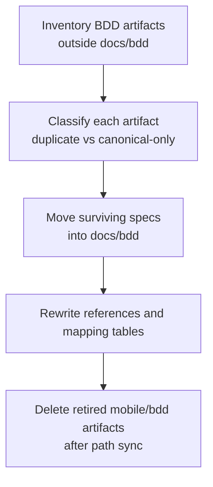

# Plan: BDD Home Consolidation to `docs/bdd`

> **Status:** Complete. Authored and closed 2026-06-21.
> **Tasks ledger:** `docs/tasks/bdd-home-consolidation.md`.

## Purpose

The repository currently stores BDD artifacts in two homes: `docs/bdd/` and
`mobile/bdd/`. This split was introduced intentionally by the historical mobile
BDD backfill, but it now conflicts with the current owner directive that all BDD
artifacts must live only under `docs/bdd/`.

This plan consolidates the repository onto a single canonical BDD home without
changing the scenario content itself unless duplicate cleanup requires it.

## Objective

- Inventory every BDD artifact currently outside `docs/bdd/`.
- Determine whether each out-of-home artifact is duplicated, missing from
  `docs/bdd/`, or uniquely referenced.
- Move the canonical artifacts into `docs/bdd/`, remove true duplicates, and
  rewrite repository references so `docs/bdd/` becomes the only valid BDD home.

## Scope decisions

| Decision | Choice |
|---|---|
| Canonical BDD home | `docs/bdd/` only |
| Duplicate handling | Keep one canonical copy only; remove byte-for-byte or behaviorally duplicate out-of-home copies after reference sync |
| Scenario content | Preserve existing scenarios and IDs unless a move requires a path-only adjustment |
| Mobile BDD index | Retire `mobile/bdd/README.md` by folding its mapping duties into `docs/bdd/README.md` |

## Affected components

| Layer | Path | Expected change |
|---|---|---|
| BDD | `mobile/bdd/*.feature` | Move into `docs/bdd/` if canonical and missing there; delete old copies after sync |
| BDD | `mobile/bdd/README.md` | Retire after its mapping content is migrated or superseded |
| BDD | `docs/bdd/README.md` | Expand so it indexes the moved mobile specs too |
| Plans / tasks | historical slice docs that reference `mobile/bdd/*` | Rewrite references to `docs/bdd/*` and align the canonical-home statement |

## Design decisions

### D1 — Single-home rule overrides the historical split

The existing "mobile-only BDD lives in `mobile/bdd/`" convention is no longer the
active repository rule for this cleanup. Historical documentation must be updated
to describe the new single-home rule instead of preserving the old split.

### D2 — Preserve behavioral artifacts; change location first

This work is a location and reference consolidation task. A moved `.feature` file
keeps its scenario IDs and behavioral text unless an exact duplicate already
exists in `docs/bdd/`.

### D3 — Reference integrity is part of the move

The consolidation is not complete until repository references, mapping tables,
and historical notes point to the surviving `docs/bdd/` paths only.

## Dependency flow

## Governing documents

- `AGENTS.md`
- `README_AGENT_ORDER.md`
- `docs/playbooks/AGENT_WORKFLOW_GUIDE.md`
- `docs/policies/HITL_AUTONOMY_POLICY.md`
- `docs/policies/RRI_POLICY.md`
- `docs/plan/roadmap.md`
- `docs/plan/mobile-bdd-backfill-s050-s055.md`
- `docs/tasks/mobile-bdd-backfill-s050-s055.md`

## Completion record

- Moved the surviving mobile BDD specs into the canonical `docs/bdd/` home:
  `s-050-mobile-client.feature`, `s-055-maestro-suite.feature`, and
  `s-060-mobile-asset-lifecycle.feature`.
- Rebuilt `docs/bdd/README.md` as the canonical BDD index with convention notes
  and mapping rows for the consolidated mobile slices plus the existing `S-120`,
  `S-125`, and `S-200` entries.
- Rewrote historical references from `mobile/bdd/*` to `docs/bdd/*` in the
  affected slice plans and ledgers.
- Retired the old `mobile/bdd/README.md` after its mapping role was absorbed into
  `docs/bdd/README.md`.
