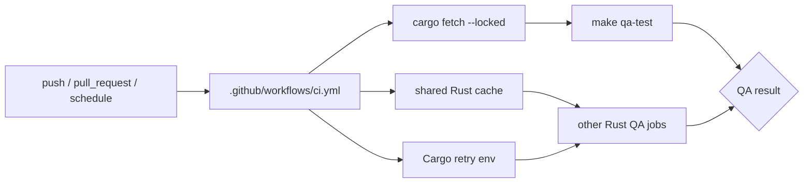

# Plan: CI Network Hardening

> **Status:** Done (2026-06-19).
> **Roadmap phase:** Cross-cutting operational hardening for repository CI. This
> is a reliability follow-up, not a product slice.
> **Tasks ledger:** `docs/tasks/ci-network-hardening.md`.

## Objective

Reduce GitHub Actions flakiness caused by transient Cargo/crates.io network
failures without weakening any existing QA gates.

## Context

The `ci` workflow currently runs multiple Rust jobs from a cold runner state.
The latest failed run (`27814184328`, `2026-06-19`) did not expose a workspace
regression; it failed in the `test` job while downloading `syn` from
`crates.io` with `curl [56] Recv failure: Connection reset by peer`.

This plan keeps the QA contract intact and hardens only the workflow mechanics:
dependency reuse, conservative retry behavior, and explicit prefetching where it
improves signal.

## Scope

### Included

- Add Rust dependency/build caching to the GitHub Actions jobs that compile,
  test, or install Cargo tooling.
- Add conservative Cargo network retry configuration at the workflow level.
- Add an explicit dependency prefetch step before workspace tests.
- Keep the fix scoped to `.github/workflows/ci.yml` plus the plan/task docs.

### Excluded

- Changing `Makefile` QA commands or relaxing any gate.
- Modifying coverage thresholds, lint rules, or test scope.
- Introducing new third-party runtime dependencies to the product codebase.
- Reworking the overall CI topology or merging jobs for speed optimization.

## Affected Files

- `.github/workflows/ci.yml`
- `docs/plan/ci-network-hardening.md`
- `docs/tasks/ci-network-hardening.md`

## Design Decisions

- Prefer workflow-only hardening so the repository's local QA contract remains
  unchanged.
- Use shared Rust cache/reuse patterns for jobs that compile or install Cargo
  tools.
- Use conservative Cargo retry settings to absorb short-lived upstream resets
  while still failing visibly on persistent dependency resolution problems.
- Prefetch dependencies before `make qa-test` so the workflow distinguishes
  dependency-resolution failure from workspace test failure.
- Preserve existing job names, QA commands, and pass/fail semantics.

## Module Dependencies

## Verification Strategy

- Validate workflow YAML after editing.
- Inspect the resulting workflow diff to confirm all existing QA commands remain
  unchanged.
- Run the repository docs consistency gate because a new plan/task ledger is
  being added.
- If feasible without pushing, dry-check shell snippets introduced in workflow
  steps for syntax correctness.

## Current Outcome

- `CIH-T1` is complete: the Rust GitHub Actions jobs now use `Swatinem/rust-cache@v2`
  where they compile, test, or install Cargo tooling.
- The workflow now sets `CARGO_NET_RETRY=5` at the workflow level so short-lived
  registry resets do not fail fast on the first network error.
- The `test` job now runs `cargo fetch --locked` before `make qa-test`, which
  separates dependency-resolution failures from workspace test failures.
- Existing QA commands, job names, and gate semantics were preserved unchanged.
