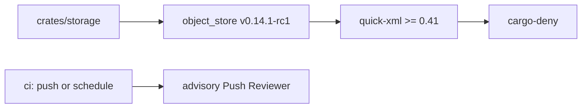

# Plan: CI security dependency and scheduled push review

> **Status:** Completed 2026-07-12. Both tasks passed scoped verification and the
> mandatory D14 fallback review after Gemma returned no usable parseable passes.

## Objective

Remove `RUSTSEC-2026-0194` and `RUSTSEC-2026-0195` from the locked dependency
graph, preserve the ADR-006 storage boundary, and make the advisory Push Reviewer
consume completed scheduled CI runs as well as push runs.

## Affected files

- `Cargo.toml`, `Cargo.lock`, and `deny.toml`
- `crates/storage/src/s3.rs` only if the upstream API requires adaptation
- `.github/workflows/push-review.yml`
- `scripts/gemma_push_ops_test.py`
- `docs/tasks/ci-security-quick-xml.md`

## Design decisions

1. Pin the official Apache `object_store` `v0.14.1-rc1` tag only after verifying
   that it resolves to commit `c7316d29face118e7409eead0cda098f38589428`.
   This is the smallest currently available upstream reference that admits the
   patched `quick-xml >=0.41.0`; replacing it with stable `0.14.1` is a separate
   follow-up after publication.
2. Allow only the official Apache repository in cargo-deny's source policy. Do
   not suppress either RustSec advisory.
3. Preserve `StorageAdapter` behavior and adapt only proven upstream API changes.
4. Run Push Reviewer for source events `push` and `schedule`. Other source events,
   including `pull_request`, remain excluded. The review remains self-hosted and
   advisory.

## Dependencies and boundaries

The runtime storage ownership and key-layout rules remain governed by ADR-006.
The Push Reviewer remains separate from primary CI authority under the Agent
Workflow Guide.

## Verification

- `cargo test -p dubbridge-storage --all-features`
- `cargo check --workspace --all-targets --all-features`
- `make qa-deny`
- `python3 scripts/gemma_push_ops_test.py`
- collect-only replay of GitHub run `29141325673`
