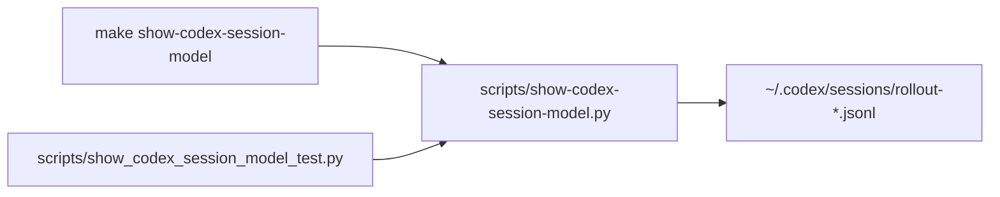

# Plan: Codex Session Model Workflow Helper

> **Status:** Complete 2026-07-19. The helper script, `Makefile` target, and
> focused unit tests are in place and verified locally.
> **Tasks ledger:** `docs/tasks/codex-session-model-workflow-helper.md`

## Purpose

The repository workflow already relies on local helper scripts and `Makefile`
targets for recurring operator tasks. Inspecting the effective Codex runtime
model currently requires re-running an ad hoc inline Python snippet from chat.

This plan makes that lookup a versioned workflow utility so the effective model
and reasoning level can be inspected from the repo with one stable command.

## Objective

Add a workflow helper that reads the newest Codex session rollout file, extracts
the last `turn_context`, and prints the effective model plus reasoning effort.

## Scope

### Included

- A versioned Python script under `scripts/`.
- A `Makefile` target that runs the helper from the repo root.
- Focused unit tests covering the happy path and no-session edge case.

### Excluded

- Any change to the RRI policy, agent workflow authority, or CI enforcement.
- Any mutation of Codex session files.
- Any broader telemetry or session-history reporting.

## Design decisions

### D1 — Keep the helper read-only

The helper only reads rollout JSONL files from the Codex sessions directory and
prints a concise summary. It never writes back into `~/.codex`.

### D2 — Preserve the user's proven lookup shape

The output keeps the same three operator-facing lines as the ad hoc snippet:
session path, effective model, and reasoning effort.

### D3 — Make tests filesystem-local

Unit tests use temporary directories instead of the real `~/.codex/sessions`
tree so they remain deterministic and safe.

## Affected files

| Layer | Path | Change |
|---|---|---|
| Workflow helper | `scripts/show-codex-session-model.py` | new utility script |
| Verification | `scripts/show_codex_session_model_test.py` | new focused tests |
| Workflow entrypoint | `Makefile` | new convenience target |

## Module dependencies

