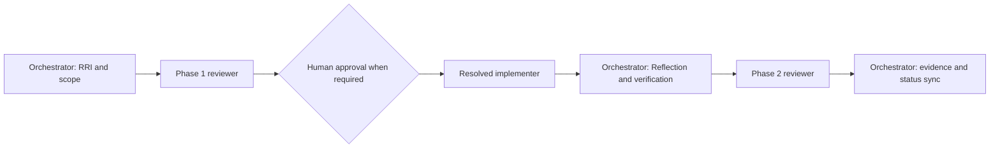

# Plan: Compact Approval Task Card v2

> **Status:** Complete 2026-07-26. The compact card contract, canonical reviewer
> routing, synchronized summaries/policies, and reusable template are in place.
> **Tasks ledger:** `docs/tasks/compact-approval-task-card.md`

## Purpose

Make approval cards shorter and more operational by centering the decision on
RRI, scope, agent routing, gates, and compact diagrams. Keep the task ledger and
RRI artifact as the auditable detail sources instead of repeating them in chat.

## Objective

Define one compact approval-card contract, make every involved agent visible by
phase, and remove contradictory reviewer-routing summaries.

## Scope

### Included

- The authoritative task-presentation contract.
- RRI presentation rules for a compact summary plus linked full evidence.
- RRI-resolved phase ownership and fallback chains.
- Shared `AGENTS.md` and `CLAUDE.md` summaries.
- HITL/RRI policy consistency and the portable workflow proposal.
- A reusable Markdown template.

### Excluded

- Changes to the RRI formula, band boundaries, or human-approval thresholds.
- Changes to local-agent, reviewer, or D14 runtime implementations.
- Retrofitting historical task cards.
- Automated linting of card length or structure.

## Design decisions

1. The approval card is a compact projection; the task ledger and RRI artifact
   remain the source of detailed evidence.
2. A resolved workflow table names the actual orchestrator, reviewers,
   implementer, human gate, fallbacks, and closure owner for the task.
3. RRI 26-55 uses the latest operative reviewer route:
   `qwen3.6:27b-q4_K_M -> Gemma -> D14 -> BLOCKED`.
4. Development cards use at most two diagrams: agent workflow and technical
   scope. Non-development cards use only diagrams that aid approval.
5. Reflection remains mandatory but is summarized in the workflow row; the
   detailed log remains a closure artifact.

## Affected files

- `docs/playbooks/AGENT_WORKFLOW_GUIDE.md`
- `AGENTS.md`
- `CLAUDE.md`
- `docs/policies/RRI_POLICY.md`
- `docs/policies/HITL_AUTONOMY_POLICY.md`
- `docs/proposals/portable-agent-workflow.md`
- `docs/templates/compact-approval-task-card.md`
- this plan and its task ledger

## Workflow

## Verification

- Search canonical docs for stale reviewer-band language.
- Run `make qa-docs`.
- Review the template against the authoritative compact-card contract.
