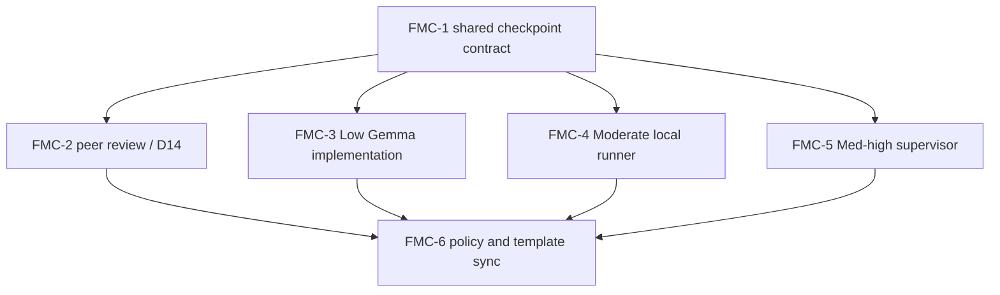

# Plan: Human-selected Fallback Model Checkpoint

## Objective

Add one fail-closed, hash-bound human selection checkpoint before D14 review or
cloud implementation begins after a local failure, while preserving all existing
RRI, HITL, reviewer independence, repair-budget, and scope gates.

## Aggregate RRI and decomposition

The unsplit package was measured with `scripts/rri.py` across 20 intended files.
It scored **RRI 89 -> Very high -> Effort XL** with `arch_decision` and
`many_files` penalties. Direct implementation is prohibited. ADR-039 fixes the
decision and the task ledger decomposes delivery into independently reviewable
subtasks, each at RRI 55 or below; documentation propagation is split separately.

## Design decisions

1. One `fallback-selection-v1` schema covers both `d14` and
   `cloud-implementer` roles.
2. `human-select` is the default; `preauthorized` requires a complete selection.
3. Packet SHA-256 and receipt SHA-256 bind authorization to exact evidence.
4. A checkpoint authorizes but never invokes a model.
5. **Owner routing directive (2026-08-09):** all remaining development tasks in
   this plan use a cloud-primary implementation route until the plan is complete.
   Do not invoke a local implementation agent for FMC-4 or FMC-5. This changes
   only the authoring route; it does not change the runtime fallback semantics,
   independent-review chain, HITL gate, or evidence requirements.
5. Model recommendations are derived from RRI, role, and trigger cause; humans may
   choose another available model, subject to the D14 Balanced floor and any
   higher-band policy gate.
6. Exit status distinguishes a human-selection pause from ordinary fallback or
   execution failure.

## Affected modules and dependencies

## Verification strategy

- Unit-test schema validation, recommendations, packet hashing, authorization,
  stale-packet rejection, and exit semantics.
- Extend each integration script's existing unit suite for awaiting and
  preauthorized routes.
- Run `make qa-docs`, `git diff --check`, and the focused Python test suites.
- Run the band-resolved phase-2 reviewer for every development subtask before
  closure; docs/ADR/policy subtasks remain exempt where the workflow says so.

## Non-goals

- No automatic D14 or cloud-model spawning.
- No cryptographic proof of a human's real-world identity.
- No RRI band, repair-budget, reviewer-chain, or application-runtime change.
- No commit, push, or external action.

## Related documents

- `docs/adr/ADR-039-human-selected-fallback-model-checkpoint.md`
- `docs/tasks/fallback-model-checkpoint.md`
- `docs/playbooks/AGENT_WORKFLOW_GUIDE.md`
- `docs/policies/RRI_POLICY.md`
- `docs/policies/HITL_AUTONOMY_POLICY.md`
- `docs/adr/ADR-036-local-first-agentic-implementation-band.md`
- `docs/adr/ADR-038-med-high-architect-refined-single-attempt.md`
