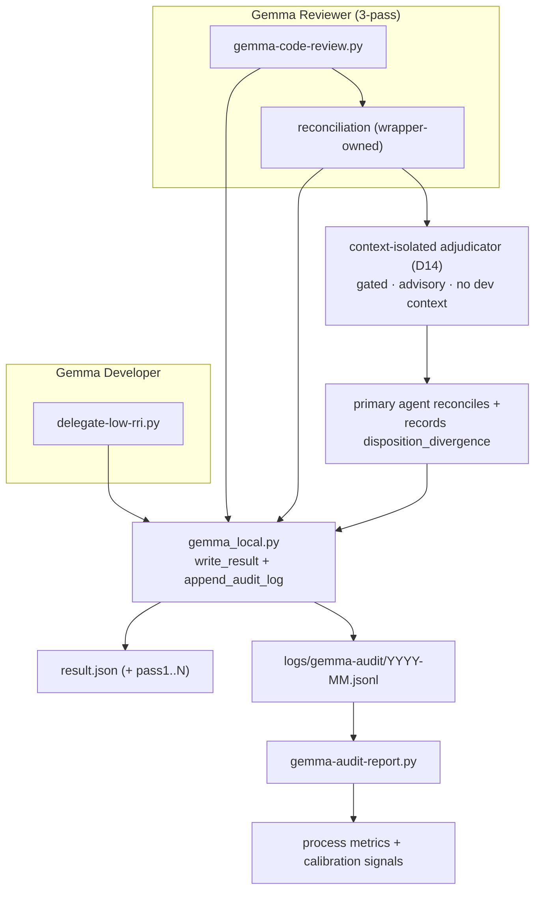
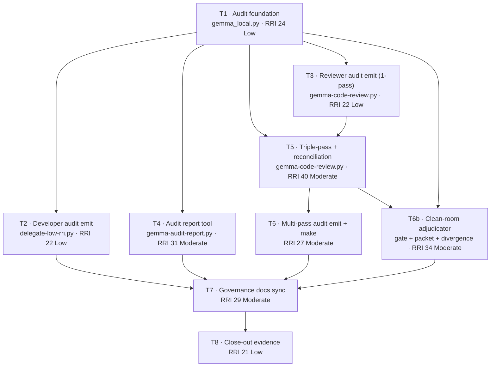

# Plan: Gemma Process Audit + Reviewer Triple-Pass

> **Status:** Done — all tasks T0b–T8 complete.
> **Tasks ledger:** `docs/tasks/gemma-audit-and-triple-pass.md`
> **Governing ADR:** `docs/adr/ADR-034-gemma-process-audit-and-reviewer-reconciliation.md`
> (Proposed; ratified to Accepted by task T0b on slice approval).
> **Supersedes:** `docs/plan/gemma-reviewer-triple-pass.md` (folded into this slice).
> **Related prior slice:** `docs/plan/low-medium-gemma-code-review-role.md`

## Objective

Give the two local-Gemma processes — **Gemma Developer** (patch delegation, Low
0–25) and **Gemma Reviewer** (code review, Low/Moderate 0–40) — an auditable
record of their inputs, outputs, and decision variables, and upgrade the Reviewer
from a single advisory pass to a **three-pass reconciliation** that surfaces
disagreement instead of collapsing it.

The slice has two coupled goals:

1. **Audit/telemetry** — every Developer and Reviewer invocation appends one
   structured record to an append-only log, and a report tool turns that log into
   process metrics and calibration signals (truncation rate, escalation rate,
   destructive-diff detection, finding-quality rate, inter-pass disagreement).
2. **Triple-pass Reviewer** — the Reviewer runs three independent passes, a
   deterministic wrapper-owned step reconciles them, and the aggregate makes
   consensus, disagreement, and likely false positives explicit.

Both roles remain **review-/patch-only and advisory**: nothing here lets Gemma
approve tasks, certify coverage, or replace the primary agent's Reflection cycle.

## Why one slice

The two pieces share one seam: the shared helper `scripts/gemma_local.py` that
both wrappers call to write results. Instrumenting that seam once (audit
foundation) lets both roles emit without drift, and lets the triple-pass emit its
new per-pass disagreement metrics into the **same** schema instead of a second,
divergent one. Building audit first and triple-pass second avoids instrumenting
the reviewer twice. Hence a single slice with an explicit dependency order.

## Scope

### Included

- append-only audit log written through `scripts/gemma_local.py` for **both**
  roles, with a forward-compatible schema that already carries optional
  triple-pass fields;
- `scripts/gemma-audit-report.py` read-only analysis tool + `make qa-gemma-audit`;
- three-pass Reviewer execution in `scripts/gemma-code-review.py` with a
  deterministic, wrapper-owned reconciliation step;
- per-pass artifacts plus one aggregate artifact, with a quorum/partial-failure
  rule that preserves the existing HITL "absence never blocks" guarantee;
- governance-doc updates (workflow guide, HITL policy, RRI policy, Low-RRI
  handoff, local-Gemma summary) including a redefined Reviewer evidence block;
- tests, fixtures, and close-out evidence.

### Excluded

- changing approval boundaries, RRI bands, or autonomy gates;
- letting either Gemma role write/approve/auto-fix outside its existing contract;
- making remote/GitHub-hosted CI depend on Ollama;
- changing Gemma Developer **delegation** semantics (Developer only gains audit
  emission, not new behavior);
- logging file contents or full packet bodies (size + privacy);
- semantic/LLM-based finding matching (reconciliation is deterministic only).

## Design decisions

These decisions resolve the gaps found in the prior triple-pass-only plan.

### D1 — Audit log: append-only JSONL, one record per invocation

Path `logs/gemma-audit/YYYY-MM.jsonl`; one JSON object per line per wrapper
invocation. Local telemetry only — added to `.gitignore`, never committed, never
required by remote CI. Rotated by month via the filename.

### D2 — Audit is emitted by the shared helper, not each wrapper

`append_audit_log()` lives in `scripts/gemma_local.py` and is called from the
same place that already writes `result.json`. Both roles therefore emit through
one code path and cannot drift. Wrapper-specific fields are passed in; the helper
owns file IO, atomicity, and secret redaction (per `HITL_AUTONOMY_POLICY.md`).

### D3 — Schema: automatic fields always; orchestrator fields optional

Fields the wrapper can compute itself (role, outcome, `done_reason`, mode,
file/diff sizes, scope violations, apply result, elapsed) are always present.
Fields only the orchestrator knows (`task_id`, `rri`, `band`, `attempt`,
`disposition`) are optional and default to `null`; a record with nulls is still
valid and still useful. Base schema:

```json
{
  "ts": "ISO-8601 UTC", "role": "developer|reviewer",
  "task_id": null, "rri": null, "band": null, "attempt": null,
  "outcome": "PATCH|NO_PATCH|PASS|FINDINGS|BLOCKED|REJECT",
  "done_reason": "stop|length|...", "mode": "full-file|before-after|n/a",
  "file_lines": null, "file_tokens_est": null, "packet_tokens_est": null,
  "response_tokens": null, "elapsed_s": 0.0, "escalated": false,
  "system_prompt": "...", "user_prompt": "..."
}
```

Developer adds: `diff_added`, `diff_removed`, `scope_violations`, `apply_result`,
`verify_ok`. Reviewer adds: `findings_count`, `findings_by_severity`,
`out_of_scope`, `dispositions`, `disposition_divergence` (D14, orchestrator-
supplied), and (triple-pass) the pass-level fields in D12.

### D4 — Report tool: read-only, deterministic, threshold-driven

`scripts/gemma-audit-report.py` consumes the JSONL and emits per-role metrics.
Anomaly thresholds (calibration signals, not gates):

| Signal | Trigger | Indicates |
|---|---|---|
| truncation rate | `done_reason == length` > 0% | unsafe output sizing |
| escalation rate | `escalated` > 20% | packets too ambitious |
| destructive diff | `diff_removed >> diff_added` on `PATCH` | silent corruption risk |
| out-of-scope findings | `out_of_scope` > 10% of findings | reviewer drift |
| dismissed-major rate | `dismissed` > 50% of `major` findings | low finding quality |
| inter-pass disagreement | consensus < 50% of findings | unstable review |

### D5 — Triple-pass: N sequential passes, default 3

Flag `--passes N` (default 3), env `DUBBRIDGE_REVIEW_PASSES`. Passes run
**sequentially** — Ollama is single-GPU on the target hardware; parallel passes
contend and provide no wall-time win. `--passes 1` reproduces today's exact
single-pass behavior (no reconciliation overhead); the triple-pass is a strict
superset, which is also the migration/rollback path.

### D6 — Quorum and partial-failure (preserves the HITL guarantee)

A pass "succeeds" if it returns `PASS` or `FINDINGS`; it "fails" if it returns
`BLOCKED`, times out, or is malformed.

- **≥2 of 3 passes succeed** → produce the aggregate. If exactly 2/3 succeeded,
  set `degraded: true`. Exit 0.
- **<2 passes succeed** → no aggregate; exit non-zero (operational failure). The
  agent records `BLOCKED` evidence and runs its normal Reflection cycle — exactly
  the existing "Ollama unavailable" path. No new gate is opened, preserving
  `HITL_AUTONOMY_POLICY.md`.

### D7 — Exit-code contract (extends the single-pass D6 of the prior slice)

- Exit `0`: quorum met (aggregate written), whether `PASS`, `FINDINGS`, or
  `degraded`.
- Exit non-zero: quorum not met, or total operational failure (Ollama down).
- A single pass with `done_reason == "length"` (truncation) **fails that pass**
  per the `large-file-delegation-2026-06-21` truncation defense; it only fails the
  run if it breaks quorum.

### D8 — Reconciliation: deterministic, wrapper-owned

Python logic in the wrapper compares the successful passes' finding sets. Finding
identity and classes:

| Class | Rule |
|---|---|
| `consensus` | present in ≥2 passes (exact `(path, line, severity)`) |
| `pass-specific` | present in exactly 1 pass |
| `severity-inconsistent` | same `(path, line)`, differing `severity` across passes |
| `location-inconsistent` | same `path`, `line` within ±3, clustered as candidate-same |
| `likely-false-positive` | `pass-specific` **and** `out-of-scope` (path not in the reviewed diff's changed-set) |

The model never owns reconciliation; the wrapper does, so the contrast step is
inspectable and unit-testable. `±3` and "≥2 = consensus" are fixed constants
documented here, not heuristics the model invents.

### D9 — Artifact naming (backward compatible)

Given `--out result.json`, per-pass artifacts are derived as
`result.pass1.json … result.passN.json`, and the **aggregate is written at the
base `--out` path**. Existing callers that read `result.json` therefore find the
aggregate where they already expect it. Optional `--pass-artifact-dir` overrides
the per-pass location.

### D10 — Latency budget

Expected wall time ≈ `passes × per-pass` (~12–30 s/pass on current hardware →
~36–90 s for 3 passes). Per-pass idle/wall timeouts are unchanged; an overall cap
= `passes × per-pass-wall` bounds the run. A pass that exceeds its wall counts as
a failed pass for quorum (D6), it does not hang the run.

### D11 — Reviewer evidence block becomes multi-pass aware

The `### Gemma Reviewer evidence` block in `AGENT_WORKFLOW_GUIDE.md` is redefined
to report: passes run, quorum result, aggregate status, consensus vs.
disagreement counts, `degraded` flag, and the per-pass + aggregate artifact paths.
`--passes 1` collapses to the current single-line form for backward compatibility.

### D12 — Triple-pass feeds the audit schema

The Reviewer emits one **aggregate** audit record plus the pass-level fields:
`passes_run`, `passes_succeeded`, `degraded`, `consensus_count`,
`pass_specific_count`, `severity_inconsistent_count`, `likely_false_positive_count`.
The report tool (D4) surfaces inter-pass disagreement as a calibration signal.

### D13 — Unchanged invariants

Read-only/advisory authority, RRI bands, autonomy gates, the docs-only/
config-only/migration-only exclusions, and the "no Ollama in remote CI" rule are
all unchanged.

### D14 — Disposition adjudicated context-isolated, not by the implementer

Gemma's three passes are already uncontaminated; the contamination is in the
**agent-side disposition** — today the same primary agent that wrote the code
decides which findings to accept, with only *simulated* detachment
(`AGENT_WORKFLOW_GUIDE.md:492`, "as if reviewing someone else's code"). That bias
also corrupts the `dismissed-*` audit signals D4 introduces.

When a deterministic trigger fires — **consensus** `blocking`/`major` findings,
slice band ≥ Med-high, or inter-pass disagreement — the disposition is adjudicated
by a **context-isolated reviewer** (fresh subagent or fresh session) fed *only*
the final diff, the acceptance criteria, and the reconciled findings — never the
development transcript/chain-of-thought. A deterministic packet builder enforces
that isolation; the trigger gate bounds the cold-start cost (it does not fire for
Low / 3-of-3 `PASS` / no-consensus cases).

Authority is unchanged: the adjudicator is **advisory** like Gemma; the primary
agent stays orchestrator of record and owns the close (`HITL_AUTONOMY_POLICY.md`).
Its only new obligation is to reconcile its disposition against the adjudicator's
and record `disposition_divergence` — a new optional audit field (orchestrator-
supplied, like `dispositions`) that measures implementer bias directly and closes
the loop with the D4 report.

## Architecture



## Affected files

| Layer | Path | Change |
|---|---|---|
| Shared helper | `scripts/gemma_local.py` | `append_audit_log`, schema, redaction |
| Shared helper test | `scripts/gemma_local_test.py` | schema/atomicity/redaction tests |
| Developer | `scripts/delegate-low-rri.py` | populate developer audit fields |
| Developer test | `scripts/delegate_low_rri_test.py` | audit-emission tests |
| Reviewer | `scripts/gemma-code-review.py` | audit emit + N-pass + reconciliation |
| Reviewer test | `scripts/gemma_code_review_test.py` | parser/aggregation/quorum tests |
| Report | `scripts/gemma-audit-report.py` (new) | read-only report tool |
| Report test | `scripts/gemma_audit_report_test.py` (new) | metrics/threshold tests |
| Adjudicator | `scripts/adjudicator-packet.py` (new) | isolation packet builder + trigger gate |
| Adjudicator test | `scripts/adjudicator_packet_test.py` (new) | isolation/trigger/divergence tests |
| Build | `Makefile` | `qa-gemma-audit`; update `qa-gemma-review` outputs |
| Ignore | `.gitignore` | ignore `logs/gemma-audit/` |
| Workflow docs | `docs/playbooks/AGENT_WORKFLOW_GUIDE.md` | evidence block, multi-pass |
| Policy | `docs/policies/HITL_AUTONOMY_POLICY.md` | quorum / partial availability |
| Policy | `docs/policies/RRI_POLICY.md` | evidence-block reference |
| Playbook | `docs/playbooks/LOW_RRI_LOCAL_MODEL_HANDOFF.md` | audit + review-split note |
| Local docs | `docs/gemma-local-improve.md` | active contract summary |
| ADR | `docs/adr/ADR-034-...reconciliation.md` (new) | decision record (T0b) |
| ADR index | `docs/adr/README.md` | index row + status sync |
| Superseded | `docs/plan/gemma-reviewer-triple-pass.md` | superseded banner |

## Phases and dependencies



**Phase A — Audit telemetry foundation:** T1 → (T2, T3, T4 parallel).
**Phase B — Triple-pass reconciliation:** T3 → T5 → T6; T5 → T6b (adjudicator).
**Phase C — Governance & close-out:** (T2, T4, T6, T6b) → T7 → T8.

**Critical path:** T1 → T3 → T5 → T6b → T7 → T8.
**Parallelizable after T1:** T2 and T4.
**Same-file serialization:** `gemma-code-review.py` is touched by T3, T5, T6 — they
must run in that order to avoid conflicting edits.

## Execution strategy (how this slice is implemented)

This is an **execution constraint for building this slice**, not part of its
product design (D1–D14) and not a governance change. It exists because this slice
modifies the Gemma pipeline itself — the in-flux tooling must not be used to build
or judge its own changes, and review must be contamination-free.

- **Low-band tasks (T1, T2, T3, T8):** implemented by the **primary agent
  directly**, not delegated to Gemma Developer. `RRI_POLICY.md` already permits
  "primary agent" as the Low-band path; for this slice it is mandatory.
- **Code review of every task:** performed by a **clean-room subagent
  uncontaminated by the parent context** — spawned fresh, fed only the diff and the
  task's acceptance criteria, never the development transcript — not by Gemma
  Reviewer. This applies the D14 isolation principle to the slice's own execution.
- **Existing Gemma scripts, policies, and the closed `low-medium-gemma-code-review-role`
  slice are not touched.** This strategy is temporary and scoped to implementing
  this plan; it changes nothing in the repo's standing Gemma model.
- The product design (audit log, triple-pass, reconciliation, adjudicator) is the
  deliverable and is unaffected by this note.

## Verification

- `python3 -m unittest scripts.gemma_local_test scripts.gemma_code_review_test`
- `python3 -m unittest scripts/delegate_low_rri_test.py`
- `python3 -m unittest scripts/gemma_audit_report_test.py`
- `make qa-docs`
- one local dry-run / live reviewer invocation proving: three pass artifacts +
  one aggregate at the `--out` path; reconciliation fields present;
  disagreements surfaced not hidden; one audit record appended per pass + aggregate.

## Open approval items

- [ ] Approve the slice band (**Med-high** — bundles a new telemetry subsystem +
      a reviewer contract change; arch decision) and the gate it triggers (plan +
      acceptance criteria + approval before code, thinking On).
- [ ] Approve ADR-034 (Proposed → Accepted on slice approval via T0b).
- [ ] Approve the audit schema (D2/D3) and the no-file-contents/no-packet-body rule.
- [ ] Approve the quorum/partial-failure rule (D6) as HITL-preserving.
- [ ] Approve the reconciliation classes and constants (D8: ±3, ≥2 = consensus).
- [ ] Approve the context-isolated adjudicator (D14): trigger conditions, advisory
      authority, and the `disposition_divergence` audit field.
- [ ] Approve superseding `docs/plan/gemma-reviewer-triple-pass.md`.
