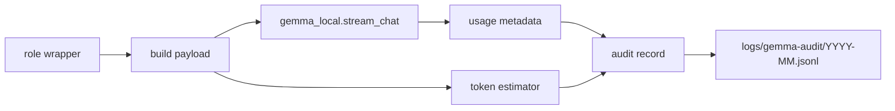

# Plan: Gemma Audit Token Metrics

> **Status:** Done - follow-up implemented and documented.
> **Tasks ledger:** `docs/tasks/gemma-audit-token-metrics.md`
> **Related slices:** `docs/plan/gemma-audit-and-triple-pass.md`,
> `docs/plan/gemma-push-reviewer-role.md`
> **Related ADR:** `docs/adr/ADR-034-gemma-process-audit-and-reviewer-reconciliation.md`

## Objective

Fill the existing audit-log token fields with meaningful values for future
Gemma invocations, so `logs/gemma-audit/YYYY-MM.jsonl` can answer "how many
tokens did we use" without changing the advisory authority or workflow gates of
Gemma Developer, Gemma Reviewer, or Gemma Push Reviewer.

This follow-up is intentionally narrow: it improves audit telemetry fidelity.
It does not introduce a new Gemma role, change approval boundaries, alter the
response contracts, or backfill historical records.

## Why This Follow-up Exists

The current audit schema already reserves:

- `file_tokens_est`
- `packet_tokens_est`
- `response_tokens`

Those fields were documented in the audit slice and carried forward into the
push-reviewer slice, but the live wrappers currently leave them `null` or omit
them entirely. As a result, the monthly JSONL history cannot answer token-usage
questions even though the schema suggests that it can.

This follow-up closes that gap with the smallest viable scope:

- persist real response-token counts when Ollama exposes them;
- persist deterministic prompt-size estimates where only local estimation is
  available;
- preserve `null` only where the value is genuinely unavailable or unstable.

## Scope

### Included

- extend the shared Gemma transport/helper so wrappers can receive usage
  metadata from the Ollama response stream;
- define the persistence contract for `response_tokens`,
  `packet_tokens_est`, and `file_tokens_est`;
- wire those values into:
  - `scripts/delegate-low-rri.py`
  - `scripts/gemma-code-review.py`
  - `scripts/gemma-push-review.py`
- add or update unit tests for usage metadata present / absent cases;
- optionally surface the newly populated fields in the read-only audit report
  tool if that work stays isolated and low-risk.

### Excluded

- backfilling old `logs/gemma-audit/*.jsonl` files;
- redefining ADR-034 or changing the audit-log storage location;
- changing approval gates, review authority, or RRI routing;
- inventing "real" token counts when Ollama does not expose them;
- adding remote CI requirements on Ollama;
- changing prompt content purely to optimize token counts.

## Design Decisions

### D1 - Measured and estimated token fields remain distinct

`response_tokens` means the model's generated-token count when the transport can
read a real usage value from Ollama's final response metadata. It must not be
estimated from string length or stream chunk count.

`packet_tokens_est` and `file_tokens_est` remain local estimates, not ground
truth. Their purpose is comparative telemetry, not billing accuracy.

### D2 - Shared helper owns usage extraction

Usage extraction belongs in `scripts/gemma_local.py`, alongside the existing
transport and audit helper responsibilities. The wrappers should consume a
stable helper return shape instead of each re-parsing the Ollama stream.

This keeps the three Gemma roles from drifting on token semantics.

### D3 - Response tokens come only from Ollama metadata

If the final streamed object includes usage counters such as `eval_count` or an
equivalent response-token field, the helper returns it and the wrapper writes
it to `response_tokens`.

If Ollama does not expose a reliable response counter for a run, the wrapper
must write `null`, not a guessed number.

### D4 - Packet estimates are deterministic and local

`packet_tokens_est` should be computed from the exact serialized prompt payload
that the wrapper sends to the model, using one deterministic estimation method
shared across roles.

The estimate should be stable for the same payload and must not depend on
stderr progress output, wall-clock timing, or historical logs.

### D5 - File estimates are role-specific and conservative

`file_tokens_est` should be populated only where the wrapper has a stable,
well-scoped file or file-snippet input that is meaningfully distinct from the
overall packet.

If a role's packet structure does not make that distinction stable or useful,
the field remains `null` and that choice is documented in code/tests.

### D6 - Historical compatibility is preserved

Existing JSONL records with `null` token fields remain valid. The report tool
must tolerate mixed historical data: older rows without measurements and newer
rows with populated measurements.

## Architecture

## Affected Files

| Layer | Path | Planned change |
|---|---|---|
| Shared helper | `scripts/gemma_local.py` | usage extraction + deterministic token-estimate helper |
| Developer wrapper | `scripts/delegate-low-rri.py` | persist token telemetry |
| Reviewer wrapper | `scripts/gemma-code-review.py` | persist token telemetry |
| Push Reviewer | `scripts/gemma-push-review.py` | persist token telemetry |
| Report tool | `scripts/gemma-audit-report.py` | optional reporting of new fields |
| Tests | `scripts/gemma_local_test.py` | helper/usage tests |
| Tests | `scripts/delegate_low_rri_test.py` | developer audit-field tests |
| Tests | `scripts/gemma_code_review_test.py` | reviewer audit-field tests |
| Tests | `scripts/gemma_push_review_test.py` | push-reviewer audit-field tests |
| Tests | `scripts/gemma_audit_report_test.py` | optional report-tool assertions |

## Verification Strategy

- `make qa-docs`
- `python3 -m unittest scripts.gemma_local_test`
- `python3 -m unittest scripts.delegate_low_rri_test`
- `python3 -m unittest scripts.gemma_code_review_test`
- `python3 -m unittest scripts.gemma_push_review_test`
- `python3 -m unittest scripts.gemma_audit_report_test`

If the report-tool follow-up remains optional and is not implemented in the same
change, the final command may be omitted for T1 and reserved for T2.

## Risks And Boundaries

- Ollama stream metadata may differ by model/runtime version; the helper must
  fail soft when usage fields are absent.
- A naive estimator can look more precise than it is; naming and tests must
  keep "estimated" and "measured" semantics explicit.
- Push Reviewer writes one aggregate audit row per run, so token telemetry must
  represent that aggregate invocation path and not pretend to be pass-level data
  unless the design is explicitly extended later.

## Out Of Scope Follow-ups

- pass-level token telemetry for every reviewer/push-reviewer quorum pass;
- historical backfill or migration of existing JSONL files;
- dashboards, charts, or CI gates based on token usage;
- optimization work that changes packet shapes to reduce cost;
- workflow evaluation of whether the local Gemma triple-quorum review currently
  invoked through `make qa-docs` should instead live under `make qa-local` so
  docs validation stays deterministic and non-Ollama-dependent by default.

## T3 Evaluation Outcome

The workflow evaluation was completed as documentation only.

### Current state

- `make qa-docs` currently invokes `make qa-gemma-review` before the
  deterministic docs checks.
- `make qa-local` currently aggregates Rust correctness checks
  (`qa-fmt`, `qa-lint`, `qa-test`, `qa-check`).
- `make qa-ci` currently includes both `qa-local` and `qa-docs`.

### Recommendation

Do not keep the local Gemma triple-quorum review under `qa-docs`; that mixes a
local Ollama-dependent advisory review with a target that otherwise acts as the
deterministic docs/documentation contract.

Do not move it directly to `qa-local` without a second change to the aggregate
target contract, because `qa-local` is currently part of `qa-ci`. A direct move
would shift the same Ollama dependency into the broader local/CI aggregate
instead of isolating it.

The preferred future implementation is:

1. keep deterministic docs checks under `qa-docs`;
2. keep Rust correctness checks under `qa-local`;
3. move the Gemma quorum into a dedicated explicit local-only target, or move
   it into `qa-local` only together with a deliberate `qa-ci` contract change
   that preserves non-Ollama CI by default.

### Affected contracts

- `Makefile` target ownership for `qa-docs`, `qa-local`, `qa-ci`, and
  `qa-gemma-review`
- `docs/playbooks/AGENT_WORKFLOW_GUIDE.md` command references and closure
  guidance if the make-target wiring changes
- `docs/policies/HITL_AUTONOMY_POLICY.md` only if the wording around required
  local review invocation paths needs to name a different wrapper target

No command or workflow wiring change is approved by this evaluation alone.
