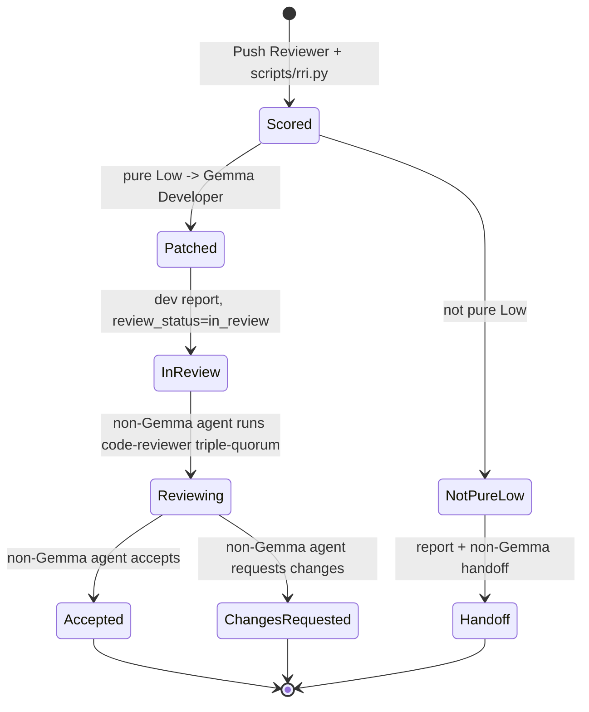
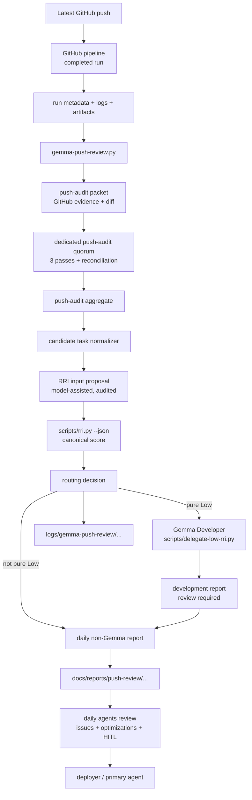

# Plan: Gemma Push Reviewer Role

> **Status:** Proposed - audit-review ready, not approved for implementation.
> **Tasks ledger:** `docs/tasks/gemma-push-reviewer-role.md`
> **Related precedent:** `docs/adr/ADR-034-gemma-process-audit-and-reviewer-reconciliation.md`
> **Related playbooks:** `docs/playbooks/AGENT_WORKFLOW_GUIDE.md`,
> `docs/playbooks/LOW_RRI_LOCAL_MODEL_HANDOFF.md`
> **Revision:** r2 (2026-06-25) - adds D11 model-call configuration, the Model
> Invocation Contract, D12 log-budget/redaction, D6a two-quorum-stages, D13 audit
> trail, and the `in_review` development lifecycle; see "Revision r2 Change Log".
> Changed sections are marked "(added r2)".

## Objective

Add a **Gemma Push Reviewer** role that audits the latest GitHub push **after the
GitHub pipeline has executed**, collects the available run metadata, job status,
logs, annotations, and artifacts, then triages any findings into auditable
candidate tasks. It computes each candidate's RRI through the canonical
`scripts/rri.py` calculator, dispatches pure Low eligible incidents to the
existing Gemma Developer role, and produces daily-ready reports that downstream
agents can inspect before applying, reviewing, deferring, or escalating work.

This is a separate role from **Gemma Reviewer** code review. It has its own
push-audit prompt, parser, result schema, and quorum. It may dispatch to the
existing **Gemma Developer** role only for pure Low simple patch incidents. It
does not replace the primary agent, the deployer, human approval gates, the
post-development review decision, or the RRI calculator.

## Why This Slice

Daily agents need a push-scoped audit artifact that answers:

- what changed in the latest GitHub push;
- what happened in GitHub after that push: pipeline status, failed jobs, failed
  steps, annotations, and available logs/artifacts;
- whether Gemma found actionable risks or improvements;
- what canonical RRI each finding maps to;
- which pure Low findings were delegated to Gemma Developer;
- which delegated patches still need post-development review;
- which findings were not handled because they are not pure Low, exceed
  Low/Moderate scope, or need approval;
- what evidence should be carried into the daily ledger.

This slice creates a dedicated push-audit role. ADR-034 is used only as a
precedent for local Gemma audit logging, quorum thinking, and advisory authority;
the code-review role and its wrapper are not reused as the Push Reviewer.

## Scope

### Included

- `scripts/gemma-push-review.py`, a new orchestration wrapper that:
  - resolves the latest completed GitHub push pipeline run;
  - downloads or records available workflow metadata, job logs, annotations, and
    artifacts;
  - builds a push-audit packet from the GitHub evidence bundle and push diff;
  - runs a dedicated push-audit triple quorum;
  - converts push-audit findings into candidate tasks;
  - invokes `scripts/rri.py --json` for every candidate;
  - invokes `scripts/delegate-low-rri.py` only for pure Low simple patch
    incidents;
  - writes a post-development report for every delegated patch;
  - writes local JSON artifacts plus a daily-readable Markdown summary.
- Unit tests for range resolution, packet construction, RRI command building,
  artifact schema, and degraded/quorum handling.
- A `make qa-gemma-push-review` target for local audit runs and replay/debug.
- A self-hosted GitHub Actions workflow triggered automatically after the
  primary pipeline completes, where Ollama is available.
- Daily integration guidance so agents review push-review reports during opening
  and close.
- Governance documentation that states the role's authority and RRI source of
  truth.

### Excluded

- Letting Push Reviewer directly apply patches outside the existing Gemma
  Developer delegation path, approve tasks, or mark work complete.
- Letting Gemma produce final RRI values without `scripts/rri.py`.
- Dispatching anything other than pure Low simple code/test patch incidents to
  Gemma Developer.
- Reusing `scripts/gemma-code-review.py` or the Gemma Reviewer code-review
  response contract for push audits.
- Treating pre-push or local-only git state as the primary source of truth.
- Making GitHub-hosted CI depend on Ollama.
- Committing raw local prompt logs from `logs/gemma-audit/`.
- Auto-fixing Med-high, Complex, High, or Very high findings.
- Changing the existing Gemma Reviewer code-review role.

## Design Decisions

### D0 - Source of Truth Is Post-Pipeline GitHub State

Push Reviewer starts from GitHub's record of the latest push after the pipeline
has completed. It must collect the run summary before model analysis starts:

- workflow run ID, URL, event, branch, head SHA, run attempt, status, and
  conclusion;
- associated before/after SHAs when available from the push event payload;
- check-run/job names, statuses, conclusions, durations, and failed steps;
- annotations and failure summaries exposed by GitHub;
- downloaded logs for failed jobs and optionally all jobs;
- workflow artifacts when available and relevant.

If the latest run is still queued or in progress, Push Reviewer writes a
`pipeline_pending` report and stops. It must not analyze an incomplete pipeline
as if it had passed or failed.

### D1 - Push Reviewer Is an Audit/Dispatch Orchestrator, Not an Approver

Gemma Push Reviewer may create findings, candidate task records, and dispatch
pure Low eligible incidents to the existing Gemma Developer delegation path. It
may not directly write product code, approve a patch, certify coverage, or close
a daily issue. The primary agent, deployer, or explicitly assigned non-Gemma
agent remains orchestrator of record for final acceptance.

### D1a - Push Reviewer Is Not Gemma Reviewer

The Push Reviewer does not use `scripts/gemma-code-review.py`, the code-review
finding schema, or the task-completion Gemma Reviewer evidence block. It may
reuse shared transport/audit helpers such as `scripts/gemma_local.py`, but its
domain is push audit: "what did this GitHub push introduce, what should the
daily/deployer roles inspect, what is the canonical RRI of each candidate, and
which pure Low incidents can be delegated to Gemma Developer?"

### D2 - `scripts/rri.py` Is the Only Final RRI Authority

For each finding, the wrapper must call `scripts/rri.py --json`. The final report
must label only that output as `canonical_rri`.

Gemma may suggest subjective inputs that the wrapper cannot measure directly
(`D`, `T`, `A`, `K`, `P`, `X`, candidate penalties, and evidence), but those
suggestions are recorded as `rri_input_proposal`, not as the final score. The
wrapper owns validation, path floors, low-confidence flags, and invocation of the
RRI calculator.

### D3 - Findings Become Candidate Tasks, Not Immediate Fixes

Each push-audit finding is normalized into a candidate task record:

```json
{
  "finding_id": "push-<short-sha>-F001",
  "source": "gemma-push-reviewer",
  "path": "repo/relative/path",
  "line": 123,
  "severity": "blocking|major|minor|nit",
  "summary": "short issue title",
  "suggestion": "fix direction",
  "rri_input_proposal": {},
  "canonical_rri": {},
  "routing": "gemma-developer-dispatch|daily-non-gemma-review|observe|dismiss-candidate"
}
```

### D4 - Pure Low Is Required Before Gemma Developer Dispatch

A finding is **pure Low** only when all of the following are true:

- `scripts/rri.py --json` returns final RRI in the Low band (0-25);
- the candidate is a simple code or test patch with narrow allowed paths;
- the candidate is not docs, plan, task-ledger, ADR, policy, workflow, or broad
  editorial work;
- the candidate does not touch auth, security, rights-ledger, schema, ownership,
  or other high-impact paths;
- the RRI output has no active penalties;
- the Push Reviewer can construct a concrete Low-RRI handoff packet with exact
  acceptance criteria, allowed paths, current file snippets, and stop conditions.

Only pure Low candidates may be dispatched to Gemma Developer through
`scripts/delegate-low-rri.py`. Low but not pure candidates are reported for a
non-Gemma agent to handle.

### D5 - Routing Uses the Canonical RRI Band

The wrapper maps `canonical_rri.band.label` to an action:

| RRI band | Routing |
|---|---|
| Pure Low (0-25 + eligibility gates) | `gemma-developer-dispatch` |
| Low but not pure | `daily-non-gemma-review` |
| Moderate (26-40) | `daily-non-gemma-review`; HITL before implementation |
| Med-high (41-55) | `daily-non-gemma-review`; explicit acceptance criteria before approval |
| Complex (56-70) | `daily-non-gemma-review`; decompose before implementation |
| High+ (71+) | `daily-non-gemma-review`; design/risk work before implementation |

The deployer may leave findings unapplied when routing is not pure Low. The
report must make that visible so daily agents can verify whether the item was
properly deferred or accidentally skipped.

### D6 - Gemma Developer Output Requires a Separate Development Report

When a pure Low candidate is dispatched, the Push Reviewer must write a
development report containing:

- the canonical RRI result used to justify dispatch;
- the Gemma Developer packet path and allowed path set;
- the `scripts/delegate-low-rri.py` result artifact;
- files changed and apply result;
- verification commands suggested or run;
- whether a repair cycle was needed;
- a `post_development_review_required` flag;
- an explicit `review_status` that starts at `in_review` (added r2).

The Push Reviewer must not decide that the patch is accepted. It hands the
development report off in `in_review` state and stops.

**Post-development review is a separate, non-Gemma-monitored stage (added r2).**
A non-Gemma agent owns the review of the Gemma Developer patch. Under the current
workflow it runs that patch through the Gemma code-reviewer triple-quorum
(`scripts/gemma-code-review.py`, `--passes 3` + `reconcile`) or the required
fallback when policy applies; the non-Gemma agent **orchestrates and monitors**
that quorum and records the outcome. This is the one place the code-reviewer role
is invoked in this slice, and it is invoked by the non-Gemma agent, not by the
Push Reviewer - so the D1a boundary holds. Self-review is allowed only for exempt
work or where the governing workflow permits it. The candidate stays `in_review`
until the non-Gemma agent moves it to `accepted` or `changes_requested`.

### D6a - Two Distinct Quorum Stages (added r2)

This slice uses a triple-pass quorum in two different stages; they must not be
conflated:

1. **Push-audit quorum** - run by the Push Reviewer over the GitHub evidence
   packet, with its own prompt/parser/schema (D11, Model Invocation Contract).
   It is **three independent Gemma passes**: the `gemma-push-review.py` wrapper
   issues N sequential local Gemma generations, **each with a fresh context**, and
   reconciles them by consensus. Reflexion is **per-pass** (`think=true`), never a
   shared reflexive context across passes. There is no Claude/Codex agent or
   subagent in this loop. It reuses the transport and the `reconcile` mechanism,
   but is not the code-reviewer role.
2. **Post-development review quorum** - run only for a dispatched Gemma Developer
   patch, using the Gemma code-reviewer role, orchestrated and monitored by the
   non-Gemma agent (D6). Here a non-Gemma agent (Claude, Codex, ...) drives a
   subagent plus the Gemma passes. The Push Reviewer never runs this stage.

Stage 1 produces findings to score and route. Stage 2 reviews code that Gemma
Developer already wrote. The non-Gemma agent owns stage 2.

The concept (triple pass + reconcile) is analogous, but the orchestration differs
and must not be copied across. Stage 1 is **autonomous Gemma-only** - wrapper-driven,
no higher-level LLM agent - reached through the make target or the post-pipeline
workflow. Stage 2 lives **inside a non-Gemma agent session** that spawns a
subagent around the Gemma passes. Implementations must not add a Claude/Codex
orchestration layer to stage 1, and must not reduce stage 2 to a bare wrapper
call without its owning non-Gemma agent.

Dispatched-candidate lifecycle (ownership split shown by the actor on each edge):



### D7 - Local Logs and Reviewable Reports Are Separate

ADR-034 keeps `logs/gemma-audit/YYYY-MM.jsonl` local and git-ignored. This slice
adds separate artifacts:

- local raw artifacts: `logs/gemma-push-review/YYYY-MM-DD/<short-sha>/`;
- local delegated development artifacts:
  `logs/gemma-push-review/YYYY-MM-DD/<short-sha>/developer/`;
- optional daily-readable summaries: `docs/reports/push-review/YYYY-MM-DD-<short-sha>.md`;
- optional GitHub Actions artifact upload for self-hosted runner execution.

The Markdown summary must not embed full raw prompts or target file bodies.

### D8 - Post-Pipeline GitHub Resolution Has Two Modes

1. **GitHub workflow_run mode:** a self-hosted workflow runs after the primary
   pipeline completes. It receives the completed workflow run ID, head SHA,
   branch, conclusion, and URL from `workflow_run`. It then downloads available
   logs/artifacts and builds the evidence bundle.
2. **Local daily mode:** an agent runs the wrapper with an explicit GitHub run ID
   or lets it resolve the newest completed push run through the GitHub CLI/API
   (`gh run list`, `gh run view`, `gh run download`, or equivalent connector
   calls). If no completed run is available, the wrapper writes a
   `pipeline_pending` or `pipeline_unavailable` report and stops.

Local mode may accept explicit `--before` / `--after` values for replay, but that
is a fallback for reconstructing the diff. It is not the primary source of truth.

### D9 - Quorum Failure Falls Back to a Push-Audit Fallback Packet

If fewer than two push-audit passes succeed, the Push Reviewer records
`quorum_failed: true` and writes the partial findings plus push metadata into a
fallback packet. A future implementation may reuse or generalize
`scripts/adjudicator-packet.py`, but it must not feed the code-review
adjudicator schema without an explicit compatibility layer. The fallback remains
advisory and must be reconciled by the primary agent.

### D10 - Daily Agents Consume Reports, Not Raw Model Output

Daily opening and close should inspect the newest push-review summary. The daily
ledger should record:

- blocking or major findings in `## 4. Issues ledger`;
- non-blocking improvement signals in `## 5. Optimizaciones y mejoras`;
- Moderate+ implementation requests in `## 6. Decisiones pendientes (HITL gate)`;
- findings deferred by the deployer due to complexity as explicit open items;
- pure Low delegated development reports still in `in_review`, awaiting the
  non-Gemma-monitored code-reviewer triple-quorum (D6).

### D11 - Model Call Configuration (added r2)

Earlier revisions named a "dedicated push-audit triple quorum" without stating
how the model is actually invoked. This decision closes that gap so the wrapper
is buildable without re-deriving transport conventions.

Transport is reused from `scripts/gemma_local.py`: `ensure_model_available`,
`build_chat_payload`, and `stream_chat`. The Push Reviewer owns only its system
prompt, parser, and quorum, exactly as `scripts/gemma-code-review.py` owns its
own contract.

The wrapper exposes the same model-call surface as the code-review role, under a
dedicated env namespace with documented fallbacks:

| CLI flag | Primary env override | Fallback chain | Default |
|---|---|---|---|
| `--host` | `OLLAMA_HOST` | - | `http://localhost:11434` |
| `--model` | `DUBBRIDGE_PUSH_REVIEW_MODEL` | `DUBBRIDGE_LOW_RRI_MODEL` | `gemma_local.DEFAULT_MODEL` |
| `--passes` | `DUBBRIDGE_PUSH_REVIEW_PASSES` | - | `3` |
| `--num-ctx` | `DUBBRIDGE_PUSH_REVIEW_NUM_CTX` | `DUBBRIDGE_LOW_RRI_NUM_CTX` | `32768` |
| `--num-predict` | `DUBBRIDGE_PUSH_REVIEW_NUM_PREDICT` | `DUBBRIDGE_LOW_RRI_NUM_PREDICT` | `gemma_local.DEFAULT_NUM_PREDICT` |
| `--temperature` | `DUBBRIDGE_PUSH_REVIEW_TEMPERATURE` | `DUBBRIDGE_LOW_RRI_TEMPERATURE` | `0.1` |
| `--think` / `--no-think` | `DUBBRIDGE_PUSH_REVIEW_THINK` | `DUBBRIDGE_LOW_RRI_THINK` | `true` |
| `--idle-timeout` | `DUBBRIDGE_PUSH_REVIEW_IDLE_TIMEOUT_SECONDS` | `DUBBRIDGE_LOW_RRI_IDLE_TIMEOUT_SECONDS` | `gemma_local` default |
| `--max-wall` | `DUBBRIDGE_PUSH_REVIEW_MAX_WALL_SECONDS` | `DUBBRIDGE_LOW_RRI_MAX_WALL_SECONDS` | `gemma_local` default |

`--num-ctx` defaults higher than the code-review role because push packets carry
CI log evidence; D12 defines the log budget that keeps the packet inside this
window. `--dry-run` prints the assembled payload and emits no audit record;
`--passes 1` runs a single pass with no reconciliation block, matching the
code-review wrapper.

Quorum reconciliation reuses the deterministic classifier already proven in
`scripts/gemma-code-review.py` (`reconcile`: consensus / severity-inconsistent /
location-inconsistent / pass-specific / likely-false-positive). To stop a second
copy from drifting, the reconciler is promoted into a shared module
(`scripts/gemma_local.py` or a sibling helper) and imported by both roles. The
Push Reviewer must not invent a parallel reconciliation algorithm.

The three passes are **independent generations, not reflexive self-refinement in
one context**. Each pass uses a fresh context with the same packet, so the
samples are uncorrelated and `reconcile` can promote only cross-pass consensus
findings while demoting single-pass ones to `likely_false_positive` - this is the
variance-reduction ("less drift") goal stated for the role. Reflexion lives
**within** each pass via `think=true` (per-pass depth), never **across** passes in
a shared context: a shared reflexive chain anchors on its first answer and leaves
`reconcile` a single output with nothing to compare, defeating the purpose. The
default is 3 passes; `--passes 1` is the cost-saving escape hatch and explicitly
trades away the anti-drift guarantee.

### D12 - Log Budget and Secret Redaction (added r2)

CI evidence is unbounded: failed-job logs can exceed the model context window and
can contain secrets echoed by build steps. Two rules apply before any packet
reaches the model or any committed Markdown:

- **Budget:** failed-job logs are tail-bounded to a configured byte cap
  (`DUBBRIDGE_PUSH_REVIEW_LOG_TAIL_BYTES`, default sized to fit `--num-ctx`).
  When a log is trimmed, the packet records `logs_truncated: true` and keeps the
  failing tail, not the head.
- **Redaction:** all collected log/annotation text passes the `gemma_local`
  secret pattern (extended from audit-log redaction to packet redaction) before
  it enters the packet, the raw artifacts, or the Markdown summary. Redaction
  failures degrade to `pipeline_evidence_partial: true` rather than forwarding
  unredacted text.

### D13 - Audit Trail (added r2)

The push-audit invocation writes ADR-034 audit records exactly like the existing
Gemma roles (`role: "reviewer"`, `role: "developer"`). The Push Reviewer adds
`role: "push-reviewer"` and appends one record per run via
`gemma_local.append_audit_log` to `logs/gemma-audit/YYYY-MM.jsonl` (local,
git-ignored, secret-redacted). The record extends the shared schema with push
context and quorum stats:

- `role: "push-reviewer"`, `outcome` (PASS/FINDINGS/BLOCKED), `elapsed_s`;
- GitHub context: `run_id`, `head_sha`, `branch`, `conclusion`;
- quorum: `passes_run`, `passes_succeeded`, `degraded`, `consensus_count`,
  `likely_false_positive_count`;
- `candidates_count` and routing counts (dispatched / deferred / needs-HITL);
- `system_prompt` and `user_prompt` (raw, local-only).

The audit-log `role` uses the short convention (`push-reviewer`, matching
`reviewer` and `developer`); this is intentionally distinct from the report
artifact's top-level `role` field, which keeps the longer `gemma-push-reviewer`
form (Artifact Schema). One aggregate record is written per run after
reconciliation, not one per pass, matching the code-review wrapper.

**Correlation.** Each candidate's `finding_id` (`push-<short-sha>-F###`) doubles
as the audit `task_id`. When the Push Reviewer dispatches a pure Low candidate, it
passes that id to `scripts/delegate-low-rri.py --task-id`, so the developer's own
`role: "developer"` record threads back to the originating push-audit finding. The
post-development review (D6a stage 2) reuses the same id when the non-Gemma agent
runs the code-reviewer, so one push short-sha reconstructs the full trail:
audit -> RRI -> dispatch -> review.

`scripts/rri.py` is deterministic and not a model call, so it does not write to
the Gemma audit log; canonical RRI evidence lives in the report artifacts (D2,
Artifact Schema), not the audit trail. `--dry-run` and `--collect-only` emit no
audit record because no model invocation occurs.

## Architecture



## Data Flow

1. Resolve the latest completed GitHub push pipeline run.
2. Collect run metadata, job status, annotations, logs, and artifacts.
3. Resolve before/after SHAs and build the push diff from GitHub-backed state.
4. Build a push-audit packet from the evidence bundle and diff.
5. Run the dedicated push-audit triple quorum.
6. If quorum succeeds, normalize reconciled findings.
7. If quorum fails, emit a blocked report and prepare fallback adjudicator input.
8. For each candidate, prepare measured RRI inputs.
9. Run `scripts/rri.py --json`.
10. Classify pure Low eligibility from canonical RRI and delegation gates.
11. Dispatch pure Low candidates to Gemma Developer.
12. Write a development report for every delegated patch.
13. Route all non-pure-Low candidates to daily non-Gemma review.
14. Write raw JSON plus Markdown summary, and append the per-run
    `role: "push-reviewer"` audit record (D13).
15. Daily agents review the summary, verify delegated development reports, and
    confirm non-Low incidents were properly deferred.

## Model Invocation Contract (added r2)

The push-audit role uses its own tagged-text response contract, parsed by a
dedicated parser. It is intentionally close to the code-review contract so the
shared reconciler applies, but it adds an advisory RRI hint and never permits
patch-like output.

System prompt shape (one pass):

```text
STATUS: PASS|FINDINGS|BLOCKED
SUMMARY: short push-audit summary
=== FINDING START ===
PATH: repo/relative/path.ext
LINE: 123
SEVERITY: blocking|major|minor|nit
DETAIL: concrete risk introduced by this push or surfaced by the pipeline
SUGGESTION: concise fix direction
RRI_HINT: D=1 T=2 A=1 K=1 P=1 X=2 cc=6
=== FINDING END ===
```

Contract rules:

- Exactly one STATUS value: PASS, FINDINGS, or BLOCKED.
- PASS carries no finding blocks; FINDINGS carries one or more; BLOCKED only when
  the packet is not auditable.
- `RRI_HINT` is advisory and is stored verbatim as `rri_input_proposal`. It is
  never treated as a score; canonical RRI always comes from `scripts/rri.py` (D2).
- No markdown fences, no JSON, no diff, no patch, no file bodies. Patch-like
  output is rejected exactly as in the code-review parser.
- The parser is a dedicated function and is not imported from
  `scripts/gemma-code-review.py`, preserving the D1a separation.

## Artifact Schema

Top-level raw artifact:

```json
{
  "role": "gemma-push-reviewer",
  "schema_version": 1,
  "repo": "owner/name",
  "branch": "main",
  "before": "<sha>",
  "after": "<sha>",
  "pipeline": {
    "workflow_name": "ci",
    "run_id": 123456,
    "run_attempt": 1,
    "event": "push",
    "status": "completed",
    "conclusion": "success|failure|cancelled|timed_out",
    "url": "https://github.com/owner/repo/actions/runs/123456",
    "jobs": [],
    "annotations_count": 0,
    "log_paths": [],
    "artifact_paths": []
  },
  "audit": {
    "passes_run": 3,
    "passes_succeeded": 3,
    "quorum": "met",
    "degraded": false,
    "aggregate_path": "..."
  },
  "candidates": [],
  "developer_dispatch": {
    "attempted_count": 0,
    "succeeded_count": 0,
    "blocked_count": 0,
    "development_reports": []
  },
  "post_development_review": {
    "required_count": 0,
    "in_review_count": 0,
    "pending_count": 0
  },
  "deployer_followup": {
    "pure_low_dispatched_count": 0,
    "deferred_due_complexity_count": 0,
    "needs_hitl_count": 0
  }
}
```

Candidate artifact:

```json
{
  "finding_id": "push-abcdef1-F001",
  "gemma_finding": {
    "path": "scripts/example.py",
    "line": 42,
    "severity": "major",
    "detail": "risk statement",
    "suggestion": "fix direction",
    "reconciliation_class": "consensus"
  },
  "rri_input_proposal": {
    "touches": ["scripts/example.py"],
    "cc": 6,
    "D": 1,
    "K": 1,
    "P": 1,
    "T": 2,
    "A": 1,
    "X": 1,
    "penalties": [],
    "confidence": "medium",
    "evidence": "why these inputs were selected"
  },
  "canonical_rri": {
    "source": "scripts/rri.py --json",
    "final": 24,
    "band": {"label": "Low"},
    "raw": {}
  },
  "pure_low_eligible": true,
  "routing": "gemma-developer-dispatch",
  "developer_dispatch": {
    "status": "not_started|patched|blocked|failed",
    "result_path": "logs/gemma-push-review/.../developer/F001-result.json",
    "development_report_path": "logs/gemma-push-review/.../developer/F001-development.json",
    "post_development_review_required": true,
    "review_status": "in_review|accepted|changes_requested",
    "review_method": "gemma-code-review-triple-quorum",
    "review_orchestrator": "non-gemma-agent"
  }
}
```

## Governance Invariants

- Gemma Push Reviewer is not a final acceptance authority.
- Final RRI is invalid unless it comes from `scripts/rri.py`.
- Only pure Low findings may be delegated to Gemma Developer.
- Gemma Developer output is never self-approved by the Push Reviewer.
- Moderate+ findings require the normal approval workflow before implementation.
- Complex+ findings must be decomposed before implementation.
- The role does not run as a pre-push gate and does not replace branch
  protection or CI.
- Model analysis starts only after GitHub pipeline metadata has been collected,
  or a pending/unavailable report has been written.
- Missing Ollama, missing model, or quorum failure never makes the review silently
  disappear; it produces an explicit blocked/degraded report.
- Raw prompt logs stay local and git-ignored.
- Code-review artifacts and Push Reviewer artifacts remain separate.
- Every real push-audit run writes a `role: "push-reviewer"` ADR-034 audit
  record, and every dispatched developer call carries the same
  `push-<sha>-F###` task_id, so the trail is reconstructable (D13).

## Affected Files

| Layer | Path | Change |
|---|---|---|
| Wrapper | `scripts/gemma-push-review.py` | new push-review orchestration role |
| Tests | `scripts/gemma_push_review_test.py` | new unit tests |
| Shared Gemma helper | `scripts/gemma_local.py` | reuse transport/audit helpers; host the promoted reconciler (D11) and packet redaction (D12); no code-review semantics |
| Gemma Developer | `scripts/delegate-low-rri.py` | invoked for pure Low candidates; no contract change expected |
| RRI | `scripts/rri.py` | reused as final score authority; no behavioral change expected |
| Build | `Makefile` | add `qa-gemma-push-review` |
| GitHub workflow | `.github/workflows/push-review.yml` | self-hosted `workflow_run` after primary CI |
| Reports | `docs/reports/push-review/` | Markdown summaries for daily review |
| Docs | `docs/gemma-local-improve.md` | active role summary |
| Workflow docs | `docs/playbooks/AGENT_WORKFLOW_GUIDE.md` | daily consumption and authority boundary |
| Daily docs | `docs/daily/README.md`, `docs/daily/TEMPLATE.md` | report review convention |

## Slice RRI

Computed with:

```bash
python3 scripts/rri.py \
  --touches scripts/gemma-push-review.py \
  --touches scripts/gemma_push_review_test.py \
  --touches Makefile \
  --touches docs/playbooks/AGENT_WORKFLOW_GUIDE.md \
  --touches docs/daily/TEMPLATE.md \
  --cc 28 --D 4 --K 4 --P 2 --T 2 --A 1 --X 4 \
  --penalty arch_decision
```

Result:

| Variable | Score | Evidence | Confidence |
|---|---|---|---|
| C cyclomatic | 3 | raw CC 28 -> score 3 | High |
| F files | 2 | 5 primary files | High |
| D domain | 4 | agent orchestration / local model workflow | High |
| T coverage | 2 | new wrapper with focused Python tests | High |
| A ambiguity | 1 | proposed plan and task ledger define scope | High |
| K coupling | 4 | GitHub Actions/API logs, Gemma wrapper, RRI, daily docs | High |
| P impact | 2 | advisory developer workflow impact | High |
| X context | 4 | GitHub pipeline, logs/artifacts, scripts, policies, daily | High |

**Base value:** 54  
**Penalty:** `arch_decision` (+12)  
**Final RRI:** 66 -> Complex (56-70) -> Effort L -> Premium tier -> thinking On

Because the slice is Complex, implementation must proceed only after plan review
and approval, and only through the decomposed tasks in the task ledger.

> r2 note: the RRI inputs above pre-date the T1B model-invocation task and the
> D11/D12 additions. Recompute the slice RRI before implementation; the band is
> expected to stay Complex but `K`/`X` may rise.

## Verification Strategy

- `python3 -m unittest scripts/gemma_push_review_test.py`
- `python3 -m unittest scripts.gemma_local_test scripts.delegate_low_rri_test scripts.rri_test`
- `make qa-rri`
- `make qa-docs`
- `make qa-gemma-push-review DUBBRIDGE_PUSH_REVIEW_DRY_RUN=1`
- one live local run against an explicit completed GitHub Actions run ID,
  recorded in
  `docs/evaluations/gemma-push-reviewer-live-test.md`

## Revision r2 Change Log

Changes in this revision are marked "(added r2)" at their headings:

- Added **D11 - Model Call Configuration**: the CLI/env model-call surface,
  defaults, and the decision to reuse `gemma_local` transport plus the
  code-review reconciler.
- Added **D12 - Log Budget and Secret Redaction**.
- Added **## Model Invocation Contract** with the push-audit response shape and
  the advisory `RRI_HINT`.
- Added five approval items (D11 config, response contract, shared reconciler,
  D12, D13) and an RRI-recompute note.
- Clarified the post-development review lifecycle: added **D6a - Two Distinct
  Quorum Stages**, an explicit `in_review` `review_status` in the candidate
  schema, and made D6 state that the non-Gemma agent (not the Push Reviewer)
  orchestrates and monitors the code-reviewer triple-quorum over the Gemma
  Developer patch.
- Added **D13 - Audit Trail**: the `role: "push-reviewer"` ADR-034 record, its
  push-context and quorum fields, and the `push-<sha>-F###` task_id correlation
  forwarded to `delegate-low-rri.py` and reused by the stage-2 review. Closes the
  gap where the audit trail for the new role was referenced but not specified.
- Recorded the pass-mechanism and orchestration decision: the stage-1 push-audit
  is **3 independent Gemma passes** (fresh context each) reconciled by consensus,
  with per-pass `think=true`, **not** reflexive single-context refinement and
  **no** Claude/Codex agent/subagent in the loop (D6a, D11). Stage 1 is
  Gemma-only/wrapper-driven; the subagent-plus-Gemma pattern belongs to stage 2.
- Task ledger: inserted **T1B - Push-audit model invocation and quorum** between
  T1 (collector/packet) and T2 (RRI scoring). The triple quorum itself is not new
  - it is the proven Gemma code-reviewer strategy (`scripts/gemma-code-review.py`,
  `--passes 3` + `reconcile`, ADR-034 quorum precedent). What was underspecified
  was the invocation: it appeared only in Data Flow step 5 and in T1's guard
  criteria ("no Gemma invocation in pending/unavailable states"), with no task
  carrying explicit positive scope, a prompt contract, or a model-call config
  surface. T1B gives the invocation an owning task; D11 and the Model Invocation
  Contract give it config and a contract.

## Open Approval Items

- [ ] Approve the role authority boundary: audit/dispatch only, no direct
      auto-approval.
- [ ] Approve the separation from Gemma Reviewer/code-review semantics.
- [ ] Approve pure Low dispatch to the existing Gemma Developer role.
- [ ] Approve the required development report before any post-patch review.
- [ ] Approve GitHub pipeline metadata/log collection as the Push Reviewer input
      boundary.
- [ ] Approve `scripts/rri.py` as the only final RRI source in push-review reports.
- [ ] Approve local raw artifacts plus optional committed Markdown summaries.
- [ ] Approve automatic self-hosted `workflow_run` integration, with no
      GitHub-hosted Ollama dependency.
- [ ] Approve daily agent responsibility to review deferred complexity findings.
- [ ] Approve the model-call configuration surface and `DUBBRIDGE_PUSH_REVIEW_*`
      env namespace (D11).
- [ ] Approve the push-audit response contract and its dedicated parser, separate
      from the code-review parser.
- [ ] Approve promoting the deterministic quorum reconciler into a shared module
      reused by both Gemma roles.
- [ ] Approve the CI-log byte budget and packet-level secret redaction (D12).
- [ ] Approve the `role: "push-reviewer"` audit-trail record and the
      `push-<sha>-F###` task_id correlation across dispatch and review (D13).
