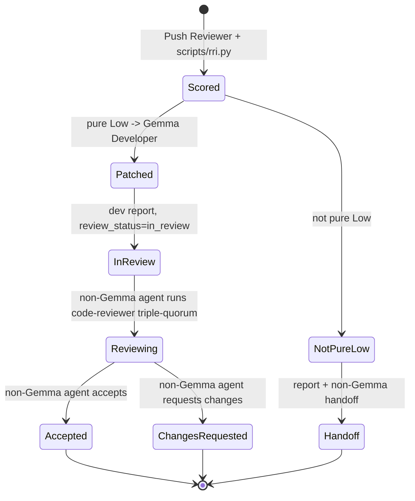
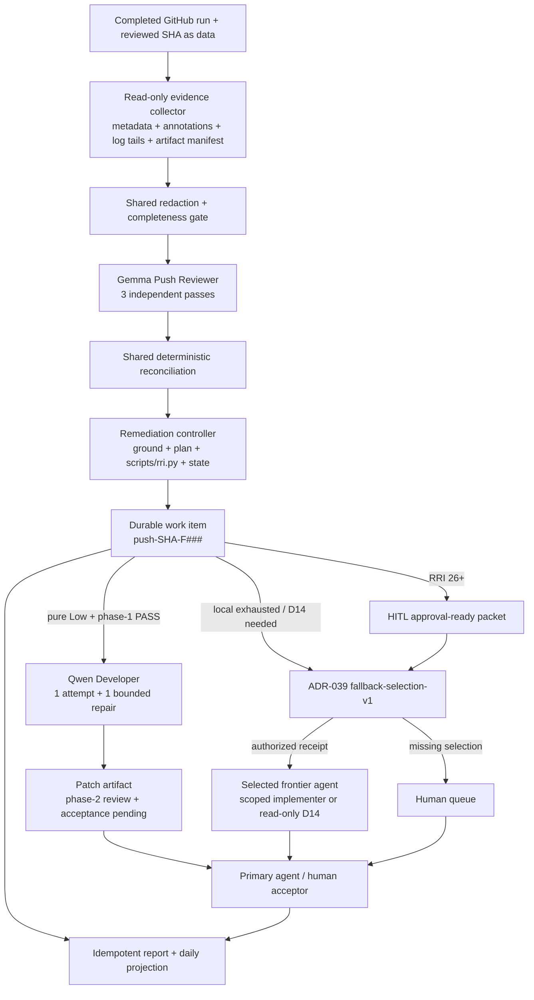

# Plan: Gemma Push Reviewer Role

> **Status:** Baseline implemented with material gaps; remediation r5 proposed,
> not approved for implementation.
> **Tasks ledger:** `docs/tasks/gemma-push-reviewer-role.md`
> **Related precedent:** `docs/adr/ADR-034-gemma-process-audit-and-reviewer-reconciliation.md`
> **Proposed decision:**
> `docs/adr/ADR-042-push-review-remediation-controller-and-escalation-lifecycle.md`
> **Related playbooks:** `docs/playbooks/AGENT_WORKFLOW_GUIDE.md`,
> `docs/playbooks/LOW_RRI_LOCAL_MODEL_HANDOFF.md`
> **Revision:** r5 (2026-08-24) - reconciles the shipped baseline with the
> implementation audit, introduces the remediation controller, durable work-item
> lifecycle, bounded Low fix lane, frontier/human handoff, and trusted publisher.

## Objective

Repair and complete the existing **Gemma Push Reviewer layer** so it can audit
the latest GitHub push **after the GitHub pipeline has executed**, evaluate a
complete evidence packet through a real multi-pass quorum, and turn supported
findings into durable, auditable remediation work items.

The layer must be able to plan a bounded fix, compute canonical RRI through
`scripts/rri.py`, produce a reviewed patch artifact for eligible pure Low work,
or hand the exact approved packet to a selected frontier agent or human. It must
never let the evaluator approve its own plan or patch, silently invoke cloud
work, write unreviewed fixes to the reviewed branch, or lose unresolved items at
daily rollover.

This is a separate role from **Gemma Reviewer** code review. It has its own
push-audit prompt, parser, result schema, and quorum. It may dispatch to the
existing **Gemma Developer** role only for pure Low simple patch incidents. It
does not replace the primary agent, the deployer, human approval gates, the
post-development review decision, or the RRI calculator.

The r5 design also makes an implementation boundary explicit: **Gemma Push
Reviewer is only the evaluator**. Deterministic repository code owns evidence
validation, RRI invocation, planning/state transitions, and routing; Qwen or an
explicitly selected frontier agent owns patch authorship; the primary agent or
human owner owns approval, acceptance, and closure.

## Current Implementation Verdict (2026-08-24)

The baseline is present in `scripts/gemma-push-review.py`, its tests, the
self-hosted workflow, committed reports, and daily integration. Therefore the
old `proposed / not implemented` status was false. The baseline is **not ready to
close**, because the audit found these material gaps:

1. **Quorum is simulated, not executed.** Runtime performs one generation,
   exposes no `--passes` surface, and hard-codes `passes_run: 1`,
   `passes_succeeded: 1`, `quorum: met`.
2. **Evidence is incomplete or invisible to the model.** Annotation collection
   returns no annotation text; failed logs are duplicated per job without the D12
   tail budget; artifact downloads are absent; the packet carries paths/counts
   rather than the evidence text required to support a finding.
3. **RRI planning is not fail-closed.** Missing proposal values default to zero,
   malformed values can terminate the audit, and confidence/provenance are not
   enforced before canonical scoring.
4. **Findings can disappear.** `observe` findings are excluded from rendered
   candidates; blocked audits and non-Low rows are not durable open items; live
   reports can say `findings` while rendering no actionable row.
5. **Local dispatch has a dead end.** It has no bounded repair, labels a no-patch
   failure `in_review`, and leaves later agents with non-durable local paths.
6. **Audit and validation evidence are overstated.** Audit records omit failed
   invocations and quorum detail; historical reports show only one-pass runs;
   T7 did not validate 3/3, degraded 2/3, or quorum failure.
7. **The workflow trust boundary is too broad.** A reviewed branch SHA can
   supply executable repository code to a write-capable self-hosted job;
   publication is vulnerable to rerun duplication and branch races.
8. **Status documents and tests drifted.** T1-T7 were marked Done while the plan
   and roadmap stayed unapproved; the ops test currently fails because it makes
   a workflow-global `continue-on-error` assertion that an unrelated Antares step
   now violates.

T1, T1B, T2, T3, T4, T5, and T7 are reopened by r5. Their historical completion
evidence is retained, but it is no longer sufficient closure evidence. T8 is
superseded by the decomposed r5 remediation tasks; T9 was superseded by the
completed LRPC-3 prompt-canonicalization work.

## Why This Slice

Daily agents need a push-scoped audit artifact that answers:

- what changed in the latest GitHub push;
- what happened in GitHub after that push: pipeline status, failed jobs, failed
  steps, annotations, and available logs/artifacts;
- whether Gemma found actionable risks or improvements;
- what canonical RRI each finding maps to;
- which pure Low findings were delegated to Gemma Developer;
- which delegated patches still need post-development review;
- which findings were not handled because they are not pure Low, exceed
  Low/Moderate scope, or need approval;
- what evidence should be carried into the daily ledger.

This slice creates a dedicated push-audit role. ADR-034 is used only as a
precedent for local Gemma audit logging, quorum thinking, and advisory authority;
the code-review role and its wrapper are not reused as the Push Reviewer.

## Scope

### Included

- `scripts/gemma-push-review.py`, a new orchestration wrapper that:
  - resolves the latest completed GitHub push pipeline run;
  - downloads or records available workflow metadata, job logs, annotations, and
    artifacts;
  - builds a push-audit packet from the GitHub evidence bundle and push diff;
  - runs a dedicated push-audit triple quorum;
  - converts push-audit findings into candidate tasks;
  - invokes `scripts/rri.py --json` for every candidate;
  - invokes `scripts/delegate-low-rri.py` only for pure Low simple patch
    incidents;
  - writes a post-development report for every delegated patch;
  - writes local JSON artifacts plus a daily-readable Markdown summary.
- Unit tests for range resolution, packet construction, RRI command building,
  artifact schema, and degraded/quorum handling.
- A `make qa-gemma-push-review` target for local audit runs and replay/debug.
- A self-hosted GitHub Actions workflow triggered automatically after the
  primary pipeline completes, where Ollama is available.
- Daily integration guidance so agents review push-review reports during opening
  and close.
- Governance documentation that states the role's authority and RRI source of
  truth.
- A deterministic remediation controller that validates evidence/RRI inputs,
  creates approval-ready candidate plans, and persists one work item per finding
  or whole-audit blocker.
- A bounded pure-Low lane with phase-1 packet review, one diagnosable repair
  attempt, patch-artifact output, phase-2 review handoff, and explicit
  no-patch/patch-ready states.
- A frontier/human handoff that carries the exact plan/evidence packet, preserves
  the RRI 26+ HITL gate, and requires an ADR-039 `fallback-selection-v1` receipt
  before D14 or a cloud implementer is invoked.
- Trusted-base workflow execution, read/write job separation, least privilege,
  deterministic report/work-item keys, and idempotent publication.

### Excluded

- Letting Push Reviewer directly apply patches outside the existing Gemma
  Developer delegation path, approve tasks, or mark work complete.
- Letting Gemma produce final RRI values without `scripts/rri.py`.
- Dispatching anything other than pure Low simple code/test patch incidents to
  Gemma Developer.
- Reusing `scripts/gemma-code-review.py` or the Gemma Reviewer code-review
  response contract for push audits.
- Treating pre-push or local-only git state as the primary source of truth.
- Making GitHub-hosted CI depend on Ollama.
- Committing raw local prompt logs from `logs/gemma-audit/`.
- Auto-fixing Med-high, Complex, High, or Very high findings.
- Changing the existing Gemma Reviewer code-review role.
- Letting the Push Reviewer approve its own candidate plan, review its own patch,
  or close a remediation work item.
- Directly committing a generated patch to `main` from the push-audit job.
- Invoking a frontier implementer without both the RRI/HITL approval evidence and
  a packet-bound ADR-039 fallback-selection receipt.
- Treating missing evidence, invalid RRI inputs, a blocked model response, or a
  single diagnostic pass as a normal successful audit.
- Executing repository scripts from an arbitrary reviewed branch/SHA with a
  write-capable token on the self-hosted runner.

## Design Decisions

### D0 - Source of Truth Is Post-Pipeline GitHub State

Push Reviewer starts from GitHub's record of the latest push after the pipeline
has completed. It must collect the run summary before model analysis starts:

- workflow run ID, URL, event, branch, head SHA, run attempt, status, and
  conclusion;
- associated before/after SHAs when available from the push event payload;
- check-run/job names, statuses, conclusions, durations, and failed steps;
- annotations and failure summaries exposed by GitHub;
- downloaded logs for failed jobs and optionally all jobs;
- workflow artifacts when available and relevant.

If the latest run is still queued or in progress, Push Reviewer writes a
`pipeline_pending` report and stops. It must not analyze an incomplete pipeline
as if it had passed or failed.

### D1 - Push Reviewer Is an Audit/Dispatch Orchestrator, Not an Approver

Gemma Push Reviewer may create findings, candidate task records, and dispatch
pure Low eligible incidents to the existing Gemma Developer delegation path. It
may not directly write product code, approve a patch, certify coverage, or close
a daily issue. The primary agent, deployer, or explicitly assigned non-Gemma
agent remains orchestrator of record for final acceptance.

### D1a - Push Reviewer Is Not Gemma Reviewer

The Push Reviewer does not use `scripts/gemma-code-review.py`, the code-review
finding schema, or the task-completion Gemma Reviewer evidence block. It may
reuse shared transport/audit helpers such as `scripts/gemma_local.py`, but its
domain is push audit: "what did this GitHub push introduce, what should the
daily/deployer roles inspect, what is the canonical RRI of each candidate, and
which pure Low incidents can be delegated to Gemma Developer?"

### D2 - `scripts/rri.py` Is the Only Final RRI Authority

For each finding, the wrapper must call `scripts/rri.py --json`. The final report
must label only that output as `canonical_rri`.

Gemma may suggest subjective inputs that the wrapper cannot measure directly
(`D`, `T`, `A`, `K`, `P`, `X`, candidate penalties, and evidence), but those
suggestions are recorded as `rri_input_proposal`, not as the final score. The
wrapper owns validation, path floors, low-confidence flags, and invocation of the
RRI calculator.

### D3 - Findings Become Candidate Tasks, Not Immediate Fixes

Each push-audit finding is normalized into a candidate task record:

```json
{
  "finding_id": "push-<short-sha>-F001",
  "source": "gemma-push-reviewer",
  "path": "repo/relative/path",
  "line": 123,
  "severity": "blocking|major|minor|nit",
  "summary": "short issue title",
  "suggestion": "fix direction",
  "rri_input_proposal": {},
  "canonical_rri": {},
  "routing": "gemma-developer-dispatch|daily-non-gemma-review|observe|dismiss-candidate"
}
```

### D4 - Pure Low Is Required Before Gemma Developer Dispatch

A finding is **pure Low** only when all of the following are true:

- `scripts/rri.py --json` returns final RRI in the Low band (0-25);
- the candidate is a simple code or test patch with narrow allowed paths;
- the candidate is not docs, plan, task-ledger, ADR, policy, workflow, or broad
  editorial work;
- the candidate does not touch auth, security, rights-ledger, schema, ownership,
  or other high-impact paths;
- the RRI output has no active penalties;
- the Push Reviewer can construct a concrete Low-RRI handoff packet with exact
  acceptance criteria, allowed paths, current file snippets, and stop conditions.

Only pure Low candidates may be dispatched to Gemma Developer through
`scripts/delegate-low-rri.py`. Low but not pure candidates are reported for a
non-Gemma agent to handle.

### D5 - Routing Uses the Canonical RRI Band

The wrapper maps `canonical_rri.band.label` to an action:

| RRI band | Routing |
|---|---|
| Pure Low (0-25 + eligibility gates) | `gemma-developer-dispatch` |
| Low but not pure | `daily-non-gemma-review` |
| Moderate (26-40) | `daily-non-gemma-review`; HITL before implementation |
| Med-high (41-55) | `daily-non-gemma-review`; explicit acceptance criteria before approval |
| Complex (56-70) | `daily-non-gemma-review`; decompose before implementation |
| High+ (71+) | `daily-non-gemma-review`; design/risk work before implementation |

The deployer may leave findings unapplied when routing is not pure Low. The
report must make that visible so daily agents can verify whether the item was
properly deferred or accidentally skipped.

### D6 - Gemma Developer Output Requires a Separate Development Report

When a pure Low candidate is dispatched, the Push Reviewer must write a
development report containing:

- the canonical RRI result used to justify dispatch;
- the Gemma Developer packet path and allowed path set;
- the `scripts/delegate-low-rri.py` result artifact;
- files changed and apply result;
- verification commands suggested or run;
- whether a repair cycle was needed;
- a `post_development_review_required` flag;
- an explicit `review_status` that starts at `in_review` (added r2).

The Push Reviewer must not decide that the patch is accepted. It hands the
development report off in `in_review` state and stops.

**Post-development review is a separate, non-Gemma-monitored stage (added r2).**
A non-Gemma agent owns the review of the Gemma Developer patch. Under the current
workflow it runs that patch through the Gemma code-reviewer triple-quorum
(`scripts/gemma-code-review.py`, `--passes 3` + `reconcile`) or the required
fallback when policy applies; the non-Gemma agent **orchestrates and monitors**
that quorum and records the outcome. This is the one place the code-reviewer role
is invoked in this slice, and it is invoked by the non-Gemma agent, not by the
Push Reviewer - so the D1a boundary holds. Self-review is allowed only for exempt
work or where the governing workflow permits it. The candidate stays `in_review`
until the non-Gemma agent moves it to `accepted` or `changes_requested`.

### D6a - Two Distinct Quorum Stages (added r2)

This slice uses a triple-pass quorum in two different stages; they must not be
conflated:

1. **Push-audit quorum** - run by the Push Reviewer over the GitHub evidence
   packet, with its own prompt/parser/schema (D11, Model Invocation Contract).
   It is **three independent Gemma passes**: the `gemma-push-review.py` wrapper
   issues N sequential local Gemma generations, **each with a fresh context**, and
   reconciles them by consensus. Reflexion is **per-pass** (`think=true`), never a
   shared reflexive context across passes. There is no Claude/Codex agent or
   subagent in this loop. It reuses the transport and the `reconcile` mechanism,
   but is not the code-reviewer role.
2. **Post-development review quorum** - run only for a dispatched Gemma Developer
   patch, using the Gemma code-reviewer role, orchestrated and monitored by the
   non-Gemma agent (D6). Here a non-Gemma agent (Claude, Codex, ...) drives a
   subagent plus the Gemma passes. The Push Reviewer never runs this stage.

Stage 1 produces findings to score and route. Stage 2 reviews code that Gemma
Developer already wrote. The non-Gemma agent owns stage 2.

The concept (triple pass + reconcile) is analogous, but the orchestration differs
and must not be copied across. Stage 1 is **autonomous Gemma-only** - wrapper-driven,
no higher-level LLM agent - reached through the make target or the post-pipeline
workflow. Stage 2 lives **inside a non-Gemma agent session** that spawns a
subagent around the Gemma passes. Implementations must not add a Claude/Codex
orchestration layer to stage 1, and must not reduce stage 2 to a bare wrapper
call without its owning non-Gemma agent.

Dispatched-candidate lifecycle (ownership split shown by the actor on each edge):


```mermaid
stateDiagram-v2
    [*] --> Scored: Push Reviewer + scripts/rri.py
    Scored --> NotPureLow: not pure Low
    Scored --> Patched: pure Low -> Gemma Developer
    NotPureLow --> Handoff: report + non-Gemma handoff
    Patched --> InReview: dev report, review_status=in_review
    InReview --> Reviewing: non-Gemma agent runs code-reviewer triple-quorum
    Reviewing --> Accepted: non-Gemma agent accepts
    Reviewing --> ChangesRequested: non-Gemma agent requests changes
    Accepted --> [*]
    ChangesRequested --> [*]
    Handoff --> [*]
```

### D7 - Local Logs and Reviewable Reports Are Separate

ADR-034 keeps `logs/gemma-audit/YYYY-MM.jsonl` local and git-ignored. This slice
adds separate artifacts:

- local raw artifacts: `logs/gemma-push-review/YYYY-MM-DD/<short-sha>/`;
- local delegated development artifacts:
  `logs/gemma-push-review/YYYY-MM-DD/<short-sha>/developer/`;
- optional daily-readable summaries: `docs/reports/push-review/YYYY-MM-DD-<short-sha>.md`;
- optional GitHub Actions artifact upload for self-hosted runner execution.

The Markdown summary must not embed full raw prompts or target file bodies.

### D8 - Post-Pipeline GitHub Resolution Has Two Modes

1. **GitHub workflow_run mode:** a self-hosted workflow runs after the primary
   pipeline completes. It receives the completed workflow run ID, head SHA,
   branch, conclusion, and URL from `workflow_run`. It then downloads available
   logs/artifacts and builds the evidence bundle.
2. **Local daily mode:** an agent runs the wrapper with an explicit GitHub run ID
   or lets it resolve the newest completed push run through the GitHub CLI/API
   (`gh run list`, `gh run view`, `gh run download`, or equivalent connector
   calls). If no completed run is available, the wrapper writes a
   `pipeline_pending` or `pipeline_unavailable` report and stops.

Local mode may accept explicit `--before` / `--after` values for replay, but that
is a fallback for reconstructing the diff. It is not the primary source of truth.

### D9 - Quorum Failure Falls Back to a Push-Audit Fallback Packet

If fewer than two push-audit passes succeed, the Push Reviewer records
`quorum_failed: true` and writes the partial findings plus push metadata into a
fallback packet. A future implementation may reuse or generalize
`scripts/adjudicator-packet.py`, but it must not feed the code-review
adjudicator schema without an explicit compatibility layer. The fallback remains
advisory and must be reconciled by the primary agent.

### D10 - Daily Agents Consume Reports, Not Raw Model Output

Daily opening and close should inspect the newest push-review summary. The daily
ledger should record:

- blocking or major findings in `## 4. Issues ledger`;
- non-blocking improvement signals in `## 5. Optimizaciones y mejoras`;
- Moderate+ implementation requests in `## 6. Decisiones pendientes (HITL gate)`;
- findings deferred by the deployer due to complexity as explicit open items;
- pure Low delegated development reports still in `in_review`, awaiting the
  non-Gemma-monitored code-reviewer triple-quorum (D6).

### D11 - Model Call Configuration (added r2)

Earlier revisions named a "dedicated push-audit triple quorum" without stating
how the model is actually invoked. This decision closes that gap so the wrapper
is buildable without re-deriving transport conventions.

Transport is reused from `scripts/gemma_local.py`: `ensure_model_available`,
`build_chat_payload`, and `stream_chat`. The Push Reviewer owns only its system
prompt, parser, and quorum, exactly as `scripts/gemma-code-review.py` owns its
own contract.

The wrapper exposes the same model-call surface as the code-review role, under a
dedicated env namespace with documented fallbacks:

| CLI flag | Primary env override | Fallback chain | Default |
|---|---|---|---|
| `--host` | `OLLAMA_HOST` | - | `http://localhost:11434` |
| `--model` | `DUBBRIDGE_PUSH_REVIEW_MODEL` | `DUBBRIDGE_LOW_RRI_MODEL` | `gemma_local.DEFAULT_MODEL` |
| `--passes` | `DUBBRIDGE_PUSH_REVIEW_PASSES` | - | `3` |
| `--num-ctx` | `DUBBRIDGE_PUSH_REVIEW_NUM_CTX` | `DUBBRIDGE_LOW_RRI_NUM_CTX` | `32768` |
| `--num-predict` | `DUBBRIDGE_PUSH_REVIEW_NUM_PREDICT` | `DUBBRIDGE_LOW_RRI_NUM_PREDICT` | `gemma_local.DEFAULT_NUM_PREDICT` |
| `--temperature` | `DUBBRIDGE_PUSH_REVIEW_TEMPERATURE` | `DUBBRIDGE_LOW_RRI_TEMPERATURE` | `0.1` |
| `--think` / `--no-think` | `DUBBRIDGE_PUSH_REVIEW_THINK` | `DUBBRIDGE_LOW_RRI_THINK` | `true` |
| `--idle-timeout` | `DUBBRIDGE_PUSH_REVIEW_IDLE_TIMEOUT_SECONDS` | `DUBBRIDGE_LOW_RRI_IDLE_TIMEOUT_SECONDS` | `gemma_local` default |
| `--max-wall` | `DUBBRIDGE_PUSH_REVIEW_MAX_WALL_SECONDS` | `DUBBRIDGE_LOW_RRI_MAX_WALL_SECONDS` | `gemma_local` default |

`--num-ctx` defaults higher than the code-review role because push packets carry
CI log evidence; D12 defines the log budget that keeps the packet inside this
window. `--dry-run` prints the assembled payload and emits no audit record;
`--passes 1` runs a single pass with no reconciliation block, matching the
code-review wrapper.

Quorum reconciliation reuses the deterministic classifier already proven in
`scripts/gemma-code-review.py` (`reconcile`: consensus / severity-inconsistent /
location-inconsistent / pass-specific / likely-false-positive). To stop a second
copy from drifting, the reconciler is promoted into a shared module
(`scripts/gemma_local.py` or a sibling helper) and imported by both roles. The
Push Reviewer must not invent a parallel reconciliation algorithm.

The three passes are **independent generations, not reflexive self-refinement in
one context**. Each pass uses a fresh context with the same packet, so the
samples are uncorrelated and `reconcile` can promote only cross-pass consensus
findings while demoting single-pass ones to `likely_false_positive` - this is the
variance-reduction ("less drift") goal stated for the role. Reflexion lives
**within** each pass via `think=true` (per-pass depth), never **across** passes in
a shared context: a shared reflexive chain anchors on its first answer and leaves
`reconcile` a single output with nothing to compare, defeating the purpose. The
default is 3 passes; `--passes 1` is the cost-saving escape hatch and explicitly
trades away the anti-drift guarantee.

### D12 - Log Budget and Secret Redaction (added r2)

CI evidence is unbounded: failed-job logs can exceed the model context window and
can contain secrets echoed by build steps. Two rules apply before any packet
reaches the model or any committed Markdown:

- **Budget:** failed-job logs are tail-bounded to a configured byte cap
  (`DUBBRIDGE_PUSH_REVIEW_LOG_TAIL_BYTES`, default sized to fit `--num-ctx`).
  When a log is trimmed, the packet records `logs_truncated: true` and keeps the
  failing tail, not the head.
- **Redaction:** all collected log/annotation text passes the `gemma_local`
  secret pattern (extended from audit-log redaction to packet redaction) before
  it enters the packet, the raw artifacts, or the Markdown summary. Redaction
  failures degrade to `pipeline_evidence_partial: true` rather than forwarding
  unredacted text.

### D13 - Audit Trail (added r2)

The push-audit invocation writes ADR-034 audit records exactly like the existing
Gemma roles (`role: "reviewer"`, `role: "developer"`). The Push Reviewer adds
`role: "push-reviewer"` and appends one record per run via
`gemma_local.append_audit_log` to `logs/gemma-audit/YYYY-MM.jsonl` (local,
git-ignored, secret-redacted). The record extends the shared schema with push
context and quorum stats:

- `role: "push-reviewer"`, `outcome` (PASS/FINDINGS/BLOCKED), `elapsed_s`;
- GitHub context: `run_id`, `head_sha`, `branch`, `conclusion`;
- quorum: `passes_run`, `passes_succeeded`, `degraded`, `consensus_count`,
  `likely_false_positive_count`;
- `candidates_count` and routing counts (dispatched / deferred / needs-HITL);
- `system_prompt` and `user_prompt` (raw, local-only).

The audit-log `role` uses the short convention (`push-reviewer`, matching
`reviewer` and `developer`); this is intentionally distinct from the report
artifact's top-level `role` field, which keeps the longer `gemma-push-reviewer`
form (Artifact Schema). One aggregate record is written per run after
reconciliation, not one per pass, matching the code-review wrapper.

**Correlation.** Each candidate's `finding_id` (`push-<short-sha>-F###`) doubles
as the audit `task_id`. When the Push Reviewer dispatches a pure Low candidate, it
passes that id to `scripts/delegate-low-rri.py --task-id`, so the developer's own
`role: "developer"` record threads back to the originating push-audit finding. The
post-development review (D6a stage 2) reuses the same id when the non-Gemma agent
runs the code-reviewer, so one push short-sha reconstructs the full trail:
audit -> RRI -> dispatch -> review.

`scripts/rri.py` is deterministic and not a model call, so it does not write to
the Gemma audit log; canonical RRI evidence lives in the report artifacts (D2,
Artifact Schema), not the audit trail. `--dry-run` and `--collect-only` emit no
audit record because no model invocation occurs.

### D14 - Evidence Completeness Is a Typed Gate (added r5)

The controller records completeness separately for run metadata, jobs, step
summaries, annotations, failed-log tails, artifacts, and diff. Counts and paths
do not substitute for the model-visible redacted text needed to support a
finding. Each class is `complete`, `partial`, `unavailable`, or `not_applicable`,
with truncation and redaction metadata.

Missing required evidence cannot produce a normal `PASS`. The audit becomes
`evidence_partial` or `blocked`, and a durable work item is emitted when a human
or agent must recover evidence or evaluate the run manually. Secret-redaction is
shared and applied before model use, local persistence, or committed Markdown.

### D15 - Candidate Planning and RRI Validation Are Controller-Owned (added r5)

After grounding, the controller creates a candidate plan with evidence
references, bounded acceptance criteria, `HP-#`/`EC-#` examples, allowed paths,
verification intent, and stop conditions. The model may propose these values;
the controller validates them before they become executable input.

Every RRI input is typed, range-checked, and labeled with provenance and
confidence. Objective values are measured. Missing, malformed, or unsupported
values route the item to `needs_planning`/`awaiting_human`; they never default to
zero. Only `scripts/rri.py --json` produces `canonical_rri`.

### D16 - Durable Remediation Work-Item State (added r5)

Every grounded finding, ungrounded observation needing disposition, or
whole-audit blocker receives one deterministic work-item artifact under a
committed report-owned namespace. Reports and daily rows are projections of that
state, not the source of truth. Reruns update the same key idempotently.

Minimum invariants:

- `in_review`/`patch_ready` requires a patch path and digest;
- no-patch failures use `blocked` or `needs_retry`;
- unresolved items carry forward across daily rollover;
- `closed` and `dismissed` require actor, timestamp, reason, and evidence;
- every attempt, review receipt, approval, fallback selection, and disposition
  remains reconstructable from `push-<sha>-F###`.

### D17 - Pure-Low Implementation Is Bounded (added r5)

Pure Low remains the only automatic implementation lane. Before the first
delegation and before any materially revised repair packet, the Low-band phase-1
review chain must return `PASS`. The controller permits one initial Qwen
Developer attempt and at most one evidence-backed repair for a diagnosable
failure. Scope/editorial/security/high-impact refusals are hard stops, not repair
candidates.

The lane produces a patch artifact in an isolated/disposable worktree and then
routes it to phase-2 review and primary-agent/human acceptance. It does not
commit or push the patch from the audit workflow, and it cannot close the item.

### D18 - Frontier/Human Handoff Is Approval- and Receipt-Bound (added r5)

Low work that cannot remain local and every RRI 26+ item receives a complete
handoff packet. RRI 26+ stays `awaiting_approval` until the normal Compact
Approval Task Card/HITL gate is satisfied. If D14 or a frontier implementer is
needed, the controller emits the ADR-039 `fallback-selection-v1` artifact bound
to the exact packet.

An unattended run may proceed only with complete matching `preauthorized`
selection fields. Otherwise it stops at `awaiting_fallback_selection` and
surfaces the packet to a human. D14 stays read-only; selection of D14 never
authorizes cloud implementation.

### D19 - Trusted Workflow and Idempotent Publisher (added r5)

The reviewed SHA is data. A write-capable publisher executes controller code
from the trusted default branch only. Read-only audit/patch generation is split
from publication, privileges are minimized per job, arbitrary branch/PR SHAs are
excluded from the write route, and third-party Actions are pinned to immutable
revisions.

Report/work-item keys are deterministic. Publication uses a concurrency group,
detects already-published items, and handles a moving default branch without
overwriting unrelated work or producing duplicate daily rows.

### D20 - Acceptance and Closure Stay External to the Evaluator (added r5)

The evaluator may report `PASS` for the push audit, but only the acceptor can
close a remediation work item. Closure requires the band's phase-2 review,
verification, required coverage/reflection evidence, disposition of every model
finding, and synchronization of plan/task/roadmap/daily status artifacts.

The final validation must exercise 3/3 quorum, degraded 2/3, quorum failure,
evidence partial, successful and failed local dispatch, one bounded repair,
Moderate+ approval handoff, missing fallback selection, idempotent rerun, and an
untrusted-branch workflow event.

## Architecture


```mermaid
flowchart TD
    GH["Completed GitHub run + reviewed SHA as data"] --> COL["Read-only evidence collector\nmetadata + annotations + log tails + artifact manifest"]
    COL --> RED["Shared redaction + completeness gate"]
    RED --> EVAL["Gemma Push Reviewer\n3 independent passes"]
    EVAL --> REC["Shared deterministic reconciliation"]
    REC --> CTRL["Remediation controller\nground + plan + scripts/rri.py + state"]
    CTRL --> ITEM["Durable work item\npush-SHA-F###"]
    ITEM -->|pure Low + phase-1 PASS| LOCAL["Qwen Developer\n1 attempt + 1 bounded repair"]
    LOCAL --> PATCH["Patch artifact\nphase-2 review + acceptance pending"]
    ITEM -->|RRI 26+| APPROVAL["HITL approval-ready packet"]
    ITEM -->|local exhausted / D14 needed| SELECT["ADR-039 fallback-selection-v1"]
    APPROVAL --> SELECT
    SELECT -->|authorized receipt| FRONTIER["Selected frontier agent\nscoped implementer or read-only D14"]
    SELECT -->|missing selection| HUMAN["Human queue"]
    PATCH --> ACCEPT["Primary agent / human acceptor"]
    FRONTIER --> ACCEPT
    HUMAN --> ACCEPT
    ITEM --> DAILY["Idempotent report + daily projection"]
    ACCEPT --> DAILY
```

## Data Flow

1. Resolve an allow-listed completed GitHub run; treat its SHA as evidence data.
2. Collect metadata, jobs, annotations, budgeted failed-log tails, artifact
   manifest/content where allowed, and the GitHub-backed diff.
3. Redact all text and emit the per-class evidence-completeness matrix.
4. Build one bounded push-audit packet containing the evidence the model must
   evaluate, not only paths/counts.
5. Run three fresh-context passes and reconcile every usable/failed pass.
6. Emit a durable whole-audit blocker if evidence or quorum is insufficient.
7. Ground each finding/observation and create a stable `push-<sha>-F###` item.
8. Build the bounded candidate plan and validate RRI inputs/provenance.
9. Invoke `scripts/rri.py --json`; route invalid/uncertain input to planning or
   human review, never to a zero-filled Low score.
10. Persist the work item before any implementation or escalation side effect.
11. For pure Low: phase-1 review -> Qwen attempt -> optional one repair -> patch
    artifact -> phase-2 review/acceptance handoff.
12. For RRI 26+: emit the approval-ready packet and wait for HITL approval.
13. For a frontier/D14 route: emit and validate the packet-bound ADR-039 receipt;
    invoke only the selected role/effort after authorization.
14. Project all non-terminal state into the Markdown report and daily ledger.
15. Publish idempotently from trusted default-branch controller code, append the
    audit record for success or failure, and preserve unresolved items until an
    acceptor records disposition.

## Model Invocation Contract (added r2)

The push-audit role uses its own tagged-text response contract, parsed by a
dedicated parser. It is intentionally close to the code-review contract so the
shared reconciler applies, but it adds an advisory RRI hint and never permits
patch-like output.

System prompt shape (one pass):

```text
STATUS: PASS|FINDINGS|BLOCKED
SUMMARY: short push-audit summary
=== FINDING START ===
PATH: repo/relative/path.ext
LINE: 123
SEVERITY: blocking|major|minor|nit
DETAIL: concrete risk introduced by this push or surfaced by the pipeline
SUGGESTION: concise fix direction
RRI_HINT: D=1 T=2 A=1 K=1 P=1 X=2 cc=6
=== FINDING END ===
```

Contract rules:

- Exactly one STATUS value: PASS, FINDINGS, or BLOCKED.
- PASS carries no finding blocks; FINDINGS carries one or more; BLOCKED only when
  the packet is not auditable.
- `RRI_HINT` is advisory and is stored verbatim as `rri_input_proposal`. It is
  never treated as a score; canonical RRI always comes from `scripts/rri.py` (D2).
- No markdown fences, no JSON, no diff, no patch, no file bodies. Patch-like
  output is rejected exactly as in the code-review parser.
- The parser is a dedicated function and is not imported from
  `scripts/gemma-code-review.py`, preserving the D1a separation.

## Artifact Schema

Top-level raw artifact:

```json
{
  "role": "gemma-push-reviewer",
  "schema_version": 1,
  "repo": "owner/name",
  "branch": "main",
  "before": "<sha>",
  "after": "<sha>",
  "pipeline": {
    "workflow_name": "ci",
    "run_id": 123456,
    "run_attempt": 1,
    "event": "push",
    "status": "completed",
    "conclusion": "success|failure|cancelled|timed_out",
    "url": "https://github.com/owner/repo/actions/runs/123456",
    "jobs": [],
    "annotations_count": 0,
    "log_paths": [],
    "artifact_paths": []
  },
  "audit": {
    "passes_run": 3,
    "passes_succeeded": 3,
    "quorum": "met",
    "degraded": false,
    "mode": "normal_quorum",
    "evidence_completeness": {},
    "aggregate_path": "..."
  },
  "candidates": [],
  "developer_dispatch": {
    "attempted_count": 0,
    "succeeded_count": 0,
    "blocked_count": 0,
    "development_reports": []
  },
  "post_development_review": {
    "required_count": 0,
    "in_review_count": 0,
    "pending_count": 0
  },
  "deployer_followup": {
    "pure_low_dispatched_count": 0,
    "deferred_due_complexity_count": 0,
    "needs_hitl_count": 0
  }
}
```

Candidate artifact:

```json
{
  "finding_id": "push-abcdef1-F001",
  "gemma_finding": {
    "path": "scripts/example.py",
    "line": 42,
    "severity": "major",
    "detail": "risk statement",
    "suggestion": "fix direction",
    "reconciliation_class": "consensus"
  },
  "rri_input_proposal": {
    "touches": ["scripts/example.py"],
    "cc": 6,
    "D": 1,
    "K": 1,
    "P": 1,
    "T": 2,
    "A": 1,
    "X": 1,
    "penalties": [],
    "confidence": "medium",
    "evidence": "why these inputs were selected"
  },
  "canonical_rri": {
    "source": "scripts/rri.py --json",
    "final": 24,
    "band": {"label": "Low"},
    "raw": {}
  },
  "planning": {
    "acceptance_criteria": [],
    "happy_paths": [],
    "edge_cases": [],
    "allowed_paths": ["scripts/example.py"],
    "verification_intent": [],
    "stop_conditions": []
  },
  "work_item": {
    "state": "scored",
    "attempts": [],
    "approval_receipt": null,
    "fallback_selection_receipt": null,
    "disposition": null
  },
  "pure_low_eligible": true,
  "routing": "gemma-developer-dispatch",
  "developer_dispatch": {
    "status": "not_started|patched|blocked|failed",
    "result_path": "logs/gemma-push-review/.../developer/F001-result.json",
    "development_report_path": "logs/gemma-push-review/.../developer/F001-development.json",
    "post_development_review_required": true,
    "review_status": "not_applicable|in_review|accepted|changes_requested",
    "patch_digest": null,
    "review_method": "gemma-code-review-triple-quorum",
    "review_orchestrator": "non-gemma-agent"
  }
}
```

The full work-item schema is versioned separately from the report aggregate.
`in_review` is invalid while `patch_digest` is null. Whole-audit blockers use the
same lifecycle but omit candidate path/RRI fields that cannot be established;
they remain durable and route to evidence recovery or human evaluation.

## Governance Invariants

- Gemma Push Reviewer is not a final acceptance authority.
- Final RRI is invalid unless it comes from `scripts/rri.py`.
- Only pure Low findings may be delegated to Gemma Developer.
- Gemma Developer output is never self-approved by the Push Reviewer.
- Moderate+ findings require the normal approval workflow before implementation.
- Complex+ findings must be decomposed before implementation.
- The role does not run as a pre-push gate and does not replace branch
  protection or CI.
- Model analysis starts only after GitHub pipeline metadata has been collected,
  or a pending/unavailable report has been written.
- Missing Ollama, missing model, or quorum failure never makes the review silently
  disappear; it produces an explicit blocked/degraded report.
- A normal push audit requires at least two usable independent passes; a one-pass
  diagnostic cannot report normal quorum.
- Missing or invalid RRI inputs never default to zero or enter the pure-Low lane.
- Every actionable observation and whole-audit blocker has a durable non-terminal
  work item until an acceptor records disposition.
- `in_review` is reserved for an existing patch with a recorded digest.
- Every delegation packet receives the band's phase-1 review; every patch remains
  subject to phase-2 review and acceptor-owned closure.
- RRI 26+ implementation requires HITL approval, and frontier/D14 invocation
  requires a matching ADR-039 selection receipt.
- The reviewed SHA is never executed as controller code by a write-capable
  self-hosted publisher.
- Raw prompt logs stay local and git-ignored.
- Code-review artifacts and Push Reviewer artifacts remain separate.
- Every real push-audit run writes a `role: "push-reviewer"` ADR-034 audit
  record, and every dispatched developer call carries the same
  `push-<sha>-F###` task_id, so the trail is reconstructable (D13).

## Affected Files

| Layer | Path | Change |
|---|---|---|
| Wrapper | `scripts/gemma-push-review.py` | new push-review orchestration role |
| Tests | `scripts/gemma_push_review_test.py` | new unit tests |
| Shared Gemma helper | `scripts/gemma_local.py` | reuse transport/audit helpers; host the promoted reconciler (D11) and packet redaction (D12); no code-review semantics |
| Gemma Developer | `scripts/delegate-low-rri.py` | invoked for pure Low candidates; no contract change expected |
| RRI | `scripts/rri.py` | reused as final score authority; no behavioral change expected |
| Build | `Makefile` | add `qa-gemma-push-review` |
| GitHub workflow | `.github/workflows/push-review.yml` | self-hosted `workflow_run` after primary CI |
| Reports | `docs/reports/push-review/` | Markdown summaries for daily review |
| Durable work items | `docs/reports/push-review/items/` | one idempotent, versioned state artifact per finding/blocker |
| Fallback selection | `scripts/fallback_selection.py` | reused for packet-bound D14/frontier authorization; no new selection protocol |
| Publisher | `scripts/push_review_commit.py` | trusted-base, idempotent publication and concurrency recovery |
| Publisher tests | `scripts/push_review_commit_test.py`, `scripts/gemma_push_ops_test.py` | trust-boundary, rerun, and race regression coverage |
| Docs | `docs/gemma-local-improve.md` | active role summary |
| Workflow docs | `docs/playbooks/AGENT_WORKFLOW_GUIDE.md` | daily consumption and authority boundary |
| Daily docs | `docs/daily/README.md`, `docs/daily/TEMPLATE.md` | report review convention |

## Slice RRI

The original baseline was scored RRI 66. The r5 remediation program is rescored
against the actual cross-cutting scope:

```bash
python3 scripts/rri.py \
  --cc 40 --T 2 --A 1 --X 4 --D 4 --K 4 --P 4 \
  --touches scripts/gemma-push-review.py \
  --touches scripts/gemma_push_review_test.py \
  --touches scripts/gemma_local.py \
  --touches scripts/gemma-code-review.py \
  --touches scripts/push_review_commit.py \
  --touches .github/workflows/push-review.yml \
  --touches docs/daily/README.md \
  --touches docs/playbooks/AGENT_WORKFLOW_GUIDE.md \
  --penalty arch_decision --penalty auth_security
```

Result:

| Variable | Score | Evidence | Confidence |
|---|---|---|---|
| C cyclomatic | 4 | estimated aggregate raw CC 40 | High |
| F files | 3 | 8 primary files | High |
| D domain | 4 | model/workflow and escalation orchestration | High |
| T coverage | 2 | focused tests exist but omit the live contracts | High |
| A ambiguity | 1 | r5 plan and decomposed ledger bound the work | High |
| K coupling | 4 | GitHub, Ollama, RRI, local developer, fallback and daily state | High |
| P impact | 4 | self-hosted permissions, write publication and agent authorization | High |
| X context | 4 | several workflow/script/policy/report surfaces | High |

**Base value:** 64

**Penalties:** `arch_decision` (+12), `auth_security` (+10), automatic
`complex_and_domain` (+10)

**Final RRI:** 96 -> Very high (86-100) -> Effort XL -> Premium tier -> thinking On

No single RRI-96 implementation is permitted. ADR-042 must be accepted first,
then the work proceeds only through the individually scored T12-T19 tasks in the
ledger. Each RRI 26+ task requires its own Compact Approval Task Card v2,
phase-1 review, explicit approval, implementation route, phase-2 review, and
closure evidence. The documentation-only r5 rebaseline is T10 and does not
authorize any runtime change.

## Verification Strategy

- `python3 -m unittest scripts/gemma_push_review_test.py`
- `python3 -m unittest scripts.gemma_local_test scripts.delegate_low_rri_test scripts.rri_test`
- `make qa-rri`
- `make qa-docs`
- `make qa-gemma-push-review DUBBRIDGE_PUSH_REVIEW_DRY_RUN=1`
- one live local run against an explicit completed GitHub Actions run ID,
  recorded in
  `docs/evaluations/gemma-push-reviewer-live-test.md`
- contract scenarios: 3/3 quorum, degraded 2/3, fewer-than-two blocked,
  single-pass diagnostic labeling, partial evidence, invalid RRI proposal,
  observe-finding persistence, successful/failed/repaired local dispatch,
  Moderate+ approval wait, missing/authorized fallback selection, idempotent
  publisher rerun, branch allow-list, and publication race recovery.
- security fixtures proving log/annotation/artifact secrets are redacted before
  the packet, local durable item, or committed report is written.

## Revision r2 Change Log

Changes in this revision are marked "(added r2)" at their headings:

- Added **D11 - Model Call Configuration**: the CLI/env model-call surface,
  defaults, and the decision to reuse `gemma_local` transport plus the
  code-review reconciler.
- Added **D12 - Log Budget and Secret Redaction**.
- Added **## Model Invocation Contract** with the push-audit response shape and
  the advisory `RRI_HINT`.
- Added five approval items (D11 config, response contract, shared reconciler,
  D12, D13) and an RRI-recompute note.
- Clarified the post-development review lifecycle: added **D6a - Two Distinct
  Quorum Stages**, an explicit `in_review` `review_status` in the candidate
  schema, and made D6 state that the non-Gemma agent (not the Push Reviewer)
  orchestrates and monitors the code-reviewer triple-quorum over the Gemma
  Developer patch.
- Added **D13 - Audit Trail**: the `role: "push-reviewer"` ADR-034 record, its
  push-context and quorum fields, and the `push-<sha>-F###` task_id correlation
  forwarded to `delegate-low-rri.py` and reused by the stage-2 review. Closes the
  gap where the audit trail for the new role was referenced but not specified.
- Recorded the pass-mechanism and orchestration decision: the stage-1 push-audit
  is **3 independent Gemma passes** (fresh context each) reconciled by consensus,
  with per-pass `think=true`, **not** reflexive single-context refinement and
  **no** Claude/Codex agent/subagent in the loop (D6a, D11). Stage 1 is
  Gemma-only/wrapper-driven; the subagent-plus-Gemma pattern belongs to stage 2.
- Task ledger: inserted **T1B - Push-audit model invocation and quorum** between
  T1 (collector/packet) and T2 (RRI scoring). The triple quorum itself is not new
  - it is the proven Gemma code-reviewer strategy (`scripts/gemma-code-review.py`,
  `--passes 3` + `reconcile`, ADR-034 quorum precedent). What was underspecified
  was the invocation: it appeared only in Data Flow step 5 and in T1's guard
  criteria ("no Gemma invocation in pending/unavailable states"), with no task
  carrying explicit positive scope, a prompt contract, or a model-call config
  surface. T1B gives the invocation an owning task; D11 and the Model Invocation
  Contract give it config and a contract.

## Revision r3 Note (2026-08-17, superseded by r5 decomposition)

A functioning review of T3/T4 in production (`docs/reports/push-review/`,
`docs/daily/2026-08-15.md` through `2026-08-17.md`) found that findings
reach a markdown report and then dead-end: pure-Low dispatch failures get no
repair attempt and are mislabeled `review_status: "in_review"`, and
Moderate+/blocked findings depend on a manual daily "cierre" transcription
into the Issues ledger that is not happening (3/3 days checked show an empty
§5 Issues ledger despite open push-review rows). The diagnosis remains in
`docs/tasks/gemma-push-reviewer-role.md` § T8; r5 supersedes that single task
with T15-T17.

## Revision r4 Note (2026-08-19, superseded by completed LRPC-3)

Unrelated to push-review routing (r3/T8): while grounding a separate
discussion about canonicalizing local-role system prompts
(`docs/plan/local-role-prompt-canonicalization.md`), a direct read of
`scripts/gemma-code-review.py:188-204` found the **Gemma Reviewer /
Muse Glimmer Reviewer** role's hardcoded authority-boundary sentence has
drifted from its canonical source in `AGENT_WORKFLOW_GUIDE.md` — missing
"certify coverage" and paraphrasing "mark tasks complete" as "close tasks".
Filed here as the same failure class T8 diagnosed for push-review routing
(governance text silently drifting, unnoticed until a live-behavior read),
not because it touches push-review code — D1a's separation between the two
Gemma roles is otherwise unaffected. The diagnosis remains in § T9 for history;
completed LRPC-3 now extracts the canonical clause through
`scripts/local-agent/prompt_builder.py`, so the manual one-sentence task must not
be executed.

## Revision r5 Change Log (2026-08-24)

- Reconciled the plan with the shipped baseline and reopened T1, T1B, T2, T3,
  T4, T5, and T7 where runtime evidence does not meet their acceptance criteria.
- Added the audit verdict and D14-D20: typed evidence completeness, validated
  planning/RRI inputs, durable work-item state, bounded Low implementation,
  ADR-039 frontier/human handoff, trusted publisher, and acceptor-owned closure.
- Proposed ADR-042 because the aggregate remediation is RRI 96 and changes
  durable authority, state, and self-hosted trust boundaries.
- Replaced the report-only flow with evaluator -> deterministic controller ->
  local/frontier/human route -> independent review -> acceptor lifecycle.
- Superseded T8 with decomposed T13-T17 work and T9 with completed LRPC-3.
- Added explicit validation cases for real quorum, partial evidence, durable
  carry-forward, bounded repair, fallback selection, and workflow idempotency.

## Open Approval Items

The original list remained unchecked while the baseline was implemented, so it
is retained in git history as evidence of approval drift rather than treated as
retroactive authorization. r5 has these forward-looking decisions:

- [ ] Accept ADR-042's four-authority split and durable work-item lifecycle.
- [ ] Approve real three-pass evaluation plus the evidence completeness/redaction
      gate; one-pass mode remains diagnostic only.
- [ ] Approve the pure-Low lane: phase-1 review, one initial attempt, one bounded
      repair, patch artifact only, phase-2 review and external acceptance.
- [ ] Approve approval-ready Moderate+ handoffs and ADR-039-bound D14/frontier
      selection; no silent frontier invocation.
- [ ] Approve trusted-default-branch controller execution, read/write separation,
      least privilege, branch allow-list, and idempotent publication.
- [ ] Approve the decomposed T12-T19 remediation sequence. Each task still needs
      its own current RRI, phase-1 artifact, Compact Approval Task Card v2, and
      explicit execution approval.
