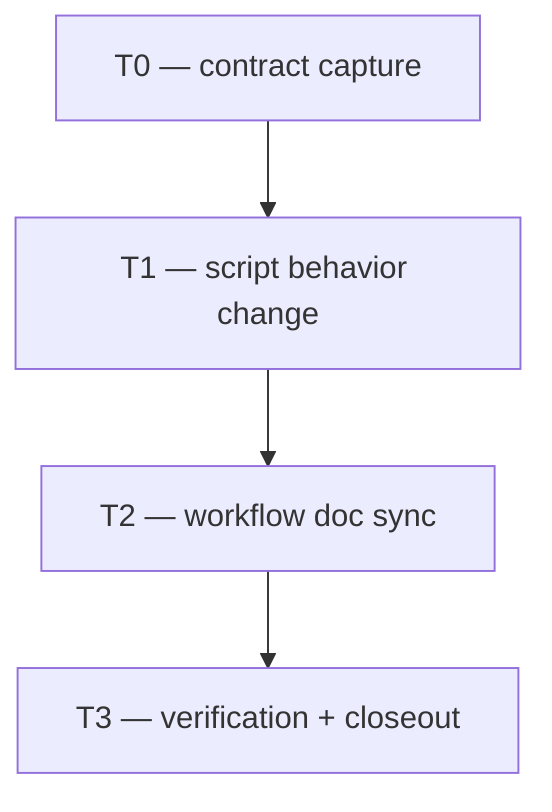

# Plan: Gemma local review consolidation and D14 fallback narrowing

> **Status:** Complete — T0/T1/T2/T3 done 2026-06-29. Deterministic docs checks
> pass; `make qa-docs` remains non-zero when Gemma reports advisory findings.
> **Tasks ledger:** `docs/tasks/gemma-review-discrepancy-triage.md`

## Purpose

The current Gemma Reviewer workflow runs multiple local passes, reconciles the
results, and escalates some disagreement patterns to the context-isolated D14
adjudicator. The desired adjustment is to keep the **local Gemma reviewer** as the
primary review mechanism, keep the **three-pass** default, and reduce expensive
subagent usage by turning disagreement buckets into a **single consolidated review
packet for the developer** instead of an automatic D14 trigger.

## Decision summary

- **D1:** Gemma Reviewer remains the primary local reviewer for Low/Moderate
  development tasks.
- **D2:** The configured multi-pass local review remains at **3 passes** by
  default.
- **D3:** All reconciled output from those passes is preserved and delivered as
  one developer-review package, including `consensus`, `pass_specific`,
  `location_inconsistent`, `severity_inconsistent`, and
  `likely_false_positive`.
- **D4:** Inter-pass disagreement no longer triggers D14 by itself.
- **D5:** The old quorum concept is removed as an escalation gate. If Gemma
  produces any usable consolidated review output from the configured passes, the
  workflow stays on the local-review path.
- **D6:** D14 remains as the fallback only when Gemma does not function
  correctly: unavailable model, transport failure, stall, invalid output, or no
  usable aggregate result.
- **D7:** The developer remains the final disposition owner. The consolidated
  Gemma packet becomes input to the task's `Reflection log` and reviewer evidence.

## Scope

### Included

- Workflow wording updates in `docs/playbooks/AGENT_WORKFLOW_GUIDE.md`.
- Any matching wording updates needed in
  `docs/policies/HITL_AUTONOMY_POLICY.md`.
- Trigger-logic changes in `scripts/adjudicator-packet.py`.
- Multi-pass aggregate behavior changes in `scripts/gemma-code-review.py`.
- Consolidated-review reporting changes in `scripts/parse-review-findings.py`.
- Supporting unit-test updates for the changed trigger/reporting behavior.

### Excluded

- Any product/runtime feature code outside the review workflow.
- Any change to the push-reviewer workflow unless the same utility code is
  directly reused.
- Any reduction from 3 passes to a smaller default.
- Any removal of Gemma Reviewer itself.

## Affected files

| Layer | Path | Change |
|---|---|---|
| Workflow guide | `docs/playbooks/AGENT_WORKFLOW_GUIDE.md` | Replace disagreement-triggered D14 rule with consolidated developer-review rule |
| Autonomy policy | `docs/policies/HITL_AUTONOMY_POLICY.md` | Sync fallback language if needed |
| Review producer | `scripts/gemma-code-review.py` | Remove quorum/degraded gating; emit aggregate when at least one pass is parseable |
| Trigger logic | `scripts/adjudicator-packet.py` | D14 only on Gemma failure / unusable output |
| Review output | `scripts/parse-review-findings.py` | Present one consolidated review packet for the developer |
| Tests | `scripts/gemma_code_review_test.py`, `scripts/adjudicator_packet_test.py`, `scripts/parse_review_findings_test.py` | Lock the new contract |
| Docs | this plan + task ledger | Record rationale, status, and follow-up work |

## Phased rollout

| Phase | Goal | Tasks |
|---|---|---|
| P0 | Record the clarified contract | T0 |
| P1 | Change the code path from disagreement-triggered adjudication to developer packet consolidation | T1 |
| P2 | Sync workflow wording and evidence format | T2 |
| P3 | Verification and closeout | T3 |

## Dependency flow

## Verification expectations

- `python3 scripts/adjudicator_packet_test.py`
- `python3 scripts/parse_review_findings_test.py`
- `python3 scripts/gemma_code_review_test.py`
- Any additional targeted script tests if shared behavior is reused elsewhere
- `make qa-docs` once the workflow wording and ledger are synchronized

## Operational intent for the next instance

The next implementation pass should treat this as a workflow/code task rather
than a product/UI task. Before any code changes are made, that instance should
recompute RRI for the first executable task, present it for approval if the band
requires it, and then implement one task at a time from the ledger below.
