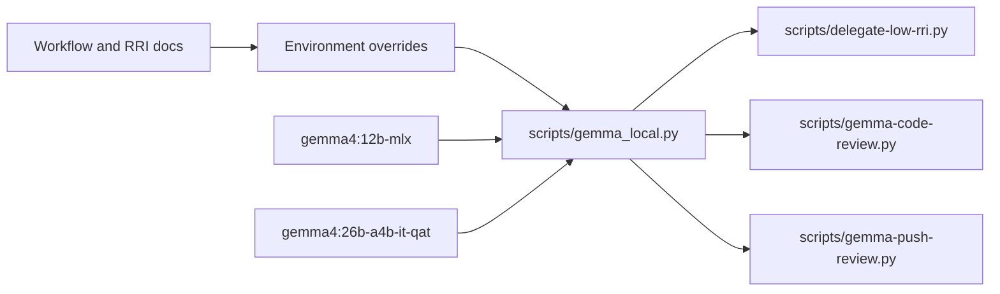

# Gemma 4 12B MLX Local Model Migration

## Objective

Evaluate Ollama's `gemma4:12b-mlx` model for DubBridge's local Gemma roles and
make it the primary repository default, with the previous default
`gemma4:26b-a4b-it-qat` retained as the automatic fallback when no explicit model
override is set.

## Affected files

- `scripts/gemma_local.py`
- `scripts/gemma_local_test.py`
- `scripts/delegate-low-rri.py`
- `scripts/delegate_low_rri_test.py`
- `scripts/gemma-code-review.py`
- `scripts/gemma_code_review_test.py`
- `scripts/gemma-push-review.py`
- `scripts/gemma_push_review_test.py`
- `docs/playbooks/AGENT_WORKFLOW_GUIDE.md`
- `docs/policies/RRI_POLICY.md`
- `docs/gemma-local-improve.md`
- `docs/tasks/gemma4-12b-mlx-local-model.md`

## Design decisions

- Keep all role-specific environment overrides unchanged:
  `DUBBRIDGE_REVIEW_MODEL`, `DUBBRIDGE_PUSH_REVIEW_MODEL`, and
  `DUBBRIDGE_LOW_RRI_MODEL` continue to override the repository default and are
  treated as strict explicit choices.
- Use `gemma4:12b-mlx` as the primary shared default when no override is set.
- Use `gemma4:26b-a4b-it-qat` as the automatic fallback only when the primary
  shared default is not installed locally.
- Preserve the existing transport, timeout, context, sampling, and tagged-block
  contracts unless evaluation finds a model-specific compatibility issue.
- Treat Ollama's model page as the external source of truth for availability,
  size, context window, and MLX tag metadata.

## Module dependencies

