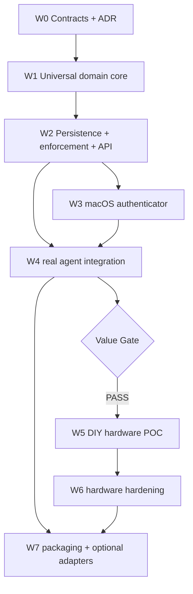

# Plan: Human Approval Authority

> **Status:** In progress (2026-09-13)
> **ADR:** `docs/adr/ADR-047-human-approval-authority.md`
> **Tasks:** `docs/tasks/haa-approval-authority.md`

## Objective

Add an authenticator-neutral Human Approval Authority (HAA) to Dubbridge so agentic or automated actions can require explicit, exact-action human authorization before execution. Preserve the current P2P `consent_gate` while HAA is developed and validated.

## Architectural rule

The software architecture is independent of human input technology. Apple Touch ID/Secure Enclave, a DIY fingerprint terminal, WebAuthn, or future security keys are adapters that produce `ApprovalEvidence`; they do not alter the core protocol or execution semantics.

## Scope

### Included

- Universal domain contracts, canonicalization, digests and lifecycle.
- PostgreSQL persistence and atomic/idempotent approval consumption.
- HAA API/service integration using existing Dubbridge infrastructure.
- Deterministic test authenticator for CI and end-to-end protocol coverage.
- macOS native authenticator source using Touch ID + Secure Enclave.
- One real agent/API workflow proving exact-action approval value.
- Hardware subplan source/protocol scaffolding only after the value gate.
- Security/recovery/manual-validation documentation for physical authenticators.

### Excluded from v0.1

- Replacing the existing P2P consent gate.
- Multi-approver quorum/delegation.
- Reusable blanket approvals.
- Raw biometric storage/processing in HAA.
- FIDO certification or legal qualified-signature claims.
- Wireless hardware transport.
- Custom PCB or production enclosure.

## Waves and dependencies

### W0 — Foundation

Freeze ADR-047, plan/task ledger, action-profile rules, protocol versioning and invariants.

### W1 — Universal core

Implement authenticator-neutral types and deterministic/domain-separated digests in `crates/domain`, plus lifecycle and behavioral tests. No Apple, fingerprint or hardware types are allowed in the domain.

### W2 — Persistence, service and enforcement

Add PostgreSQL repositories/schema, authenticator registry, challenge/evidence/receipt persistence and atomic `authorize_and_consume`. Add HAA API endpoints and deterministic test authenticator. Preserve `consent_gate` unchanged.

### W3 — Apple authenticator

Add a separate Swift helper using LocalAuthentication/Security/Secure Enclave. The helper verifies signed packages, renders trusted structured claims and returns evidence. Physical Touch ID verification is a manual owner gate; protocol behavior is covered in CI.

### W4 — Agent integration + value gate

Wire one real Dubbridge agent/API action through HAA using immutable preconditions and an enforcement point. Exercise request -> challenge -> approve -> atomic consume -> execute with deterministic CI evidence and self-review.

**Value Gate PASS requires:**
- exact-action changes fail closed;
- replay/double-consume fails closed;
- requester and audience are bound;
- existing consent behavior remains unaffected;
- tests/CI are green;
- the integration demonstrates useful HITL behavior without local-only dependencies.

Hardware W5/W6 MUST NOT start until this gate passes.

### W5 — DIY hardware POC subplan

Add firmware/protocol scaffolding for Seeed XIAO ESP32-S3 + FPC2534-class local-matching sensor + display + reject control over USB. The host is transport only; display/evidence are bound to HAA-signed challenge packages. Physical device validation remains manual.

### W6 — Hardware hardening

Document/prepare secure boot, signed firmware, flash/debug lockdown, device revocation/re-enrollment and optional ATECC608C-class key isolation. Do not claim the device is tamper-proof or certified.

### W7 — Packaging and optional adapters

Stabilize protocol docs, examples and optional integrations only after core behavior is proven. Future authenticators implement evidence adapters without changing the core.

## Verification strategy

- Unit tests: canonicalization/digest invariants, transitions, expiry, evidence normalization.
- Repository tests: persistence and atomic/idempotent consumption under concurrent attempts.
- API/contract tests: authentication, challenges, approval/rejection, replay/expiry/audience failures.
- Integration test: one real action using deterministic test authenticator.
- Static/source review: Swift helper and hardware firmware where physical resources are unavailable.
- Manual owner checklists: Touch ID/Secure Enclave and physical fingerprint terminal.

## Security gates

- Fail closed on malformed/non-canonical input, expired challenges, unknown authenticators and stale preconditions.
- Never log/store biometric material or secret private keys.
- All cryptographic payloads use explicit protocol/domain labels and version fields.
- Approval UI/device shows structured HAA-signed claims, not requester-authored prose.
- HAA signing/key configuration must fail closed outside tests; no development secret may silently reach production.
