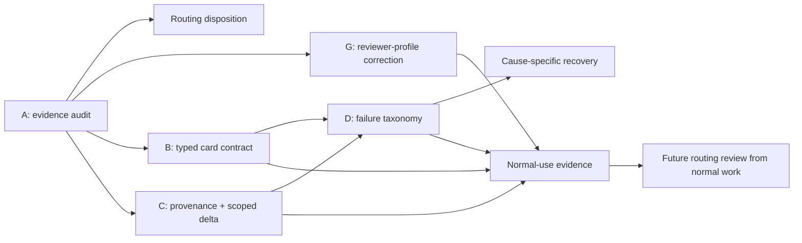

# Plan: Local-Execution Routing Decision and Evidence Hardening

> **Status:** Active — conceptual review and evidence audit completed
> 2026-09-14; implementation hardening remains unapproved.
> **Tasks ledger:** `docs/tasks/local-agent-packet-hardening.md`
> **Evidence report:**
> `docs/audit/local-execution-routing-evidence-2026-09-14.md`

## Outcome

This plan now answers the routing question that prompted the work. It is not
only a packet-hardening backlog.

The current evidence supports retaining the existing local routes for Low,
Moderate, and a `GO_LOCAL` RRI 41–45 task. It does **not** support extending
whole-task local authorship into RRI 46–55 or RRI 56+. Those bands retain
local decomposition, architecture, and review roles while cloud remains the
author of any inseparable above-Low implementation residue.

The host is already configured with Ollama Flash Attention and `q8_0` KV-cache
quantization. They should remain the local-runtime baseline because they reduce
long-context memory pressure, but they do not change the routing disposition:
they improve capacity, not task-card semantics, model judgment, or evidence
quality. The same review also finds that the current RRI 56+ `gpt-oss:20b`
`think=high` profile is not supported by the repository's real review history;
the evidence-backed replacement is `think=medium` with the existing 49K
context and a 10,240-token output budget. Changing that canonical governance
binding remains approval-gated.

This is a direct disposition, not a pilot proposal. A later expansion can be
considered from evidence produced by normal repository work after the shared
runner records trustworthy execution identity and failure attribution.

## Why the previous framing was insufficient

The first revision treated three `P2.T3c-S1b` artifacts as confirmed defects
and explicitly left the routing decision out of scope. That mixed two
different questions:

1. Can the local-agent pipeline construct, execute, and attest a trustworthy
   bounded session?
2. Which task bands can a specific local implementer author reliably?

The artifacts answer parts of the first question. They do not answer the
second:

- the post-ADR-045 audit contains only two runner records bound to Devstral;
  both are the same Moderate task and both ended before a model turn or test;
- the `P2.T3c-S1b` repair cards are RRI 25 Low and the authoritative audit log
  identifies their implementer as `qwen3.8:27b-mlx`, not Devstral;
- one `P2.T3c-S1b` transcript is only an `in_progress` checkpoint and cannot
  establish the session's terminal outcome;
- the scope contradiction cannot be replayed from the present card, which was
  modified after the transcript and is not hash-bound to it.

The evidence report preserves the exact findings and their limits.

## Evidence-based incident classification

### Confirmed packet-contract defect

`s1b-validation-repair-card.json` placed English acceptance statements in
`acceptance_tests`. The runner parsed them as executable argv and attempted to
launch `Validation`. The model's focused source edit, scope check, and Rust
formatting had already succeeded. This is a producer/schema defect: prose and
verification commands share one untyped field.

The correct systemic response is a versioned task-card contract with separate
descriptive acceptance criteria and structured executable commands. Command
validity must be structural and capability-checked; it must not depend on a
prose-detection heuristic or a small executable allow-list.

### Confirmed evidence-provenance defect; scope-check defect unproven

The stored source-repair transcript says `crates/p2p/src/lib.rs` was
out-of-scope, while the current card includes that exact path. The present
matcher accepts the path. The card's filesystem modification time is 18
seconds later than the transcript's, and neither artifact records a shared
card hash or a session-start state attestation.

Therefore the contradiction proves that the evidence is not immutable enough
to diagnose the run. It does not prove a path-normalization bug in
`scope_check.py`. The fix surface is the full chain — approved card, loaded
card, starting worktree state, session-owned changes, and terminal scope
result — not only `_is_allowed`.

### Confirmed structured-output fragility; recovery mechanism undecided

The tree-comparison checkpoint contains one full-response JSON decode failure
while the model was emitting a long Rust anchor. This proves a structured-
output transport failure. It does not prove repeated bounces or turn-budget
exhaustion because the stored artifact has status `in_progress` and contains
only one malformed event.

The runner currently collapses whole-response decode failures and argument
decode failures into the same generic `MalformedToolCall` path. It also omits
the response length and Ollama completion reason needed to distinguish
truncation from escaping or schema failure.

A forced `write_file` fallback is not accepted as the design. A separate
Low-band transcript shows why: after a formatting failure in another file,
the model rewrote that file wholesale and omitted an existing module export.
Full-file output also increases the JSON payload that failed in the first
place. Recovery will be selected only after the failure class is observable;
likely mechanisms include a smaller bounded edit operation or a safer
range/line-oriented edit contract.

## Routing disposition

| Parent RRI band | Implementation disposition | Rationale |
|---|---|---|
| 0–25 | `LOCAL_FIRST` | Keep the established Qwen route and bounded repair/decomposition rules. |
| 26–40 | `LOCAL_FIRST` | Keep the accepted Devstral route. Current post-migration data measures transport availability, not model quality, so it neither justifies removal nor expansion. |
| 41–45 | `CONDITIONAL_LOCAL_FIRST` | Keep the ADR-038 `GO_LOCAL` gate, hard exclusions, and Moderate repair budget. |
| 46–55 | `LOCAL_DECOMPOSITION_ONLY` | Keep whole-task local authorship closed; route coherent Low leaves locally and inseparable above-Low residue to the approved cloud fallback. |
| 56–70 | `LOCAL_ADVISORY_REVIEW_ONLY` | Keep decomposition mandatory and use local architecture/review roles; cloud authors approved implementation residue. |
| 71+ | `CLOUD_REQUIRED` | No local implementation expansion is supported by the available evidence. |

No ADR or policy amendment is required for this disposition because it
preserves the current routing boundaries. The report corrects the evidence
base used to discuss a future change.

## Reviewer-profile disposition

`gpt-oss:20b` remains a credible local reviewer, but `think=high` is not a
credible default for the current structured Complex-review packet:

- four recorded high-reasoning attempts across `P2.T3c-Integ` and `P2.T4b`
  ended with `done_reason: length` and empty visible content after consuming
  the configured output budget;
- the completed `P2.T3c-Integ` review used the same model and 49,152-token
  context with `think=medium` and `num_predict=10240`; it returned a parsed
  `PASS` with `done_reason: stop`;
- the comparison is operational rather than controlled — the successful run
  also followed an Ollama restart — but it is sufficient to reject `high` as
  the proven default. There is no completed high-reasoning verdict in the
  reviewed corpus to offset the repeated empty-output outcome.

Recommended RRI 56+ primary-review profile:

```text
model=gpt-oss:20b
num_ctx=49152
num_predict=10240
think=medium
temperature=1.0
top_p=1.0
```

This recommendation does not silently amend the workflow guide or RRI policy.
Those files currently bind `think=high`/`num_predict=8192`; changing a
governance-critical review invariant requires a separately approved policy
edit. Until then the discrepancy must be disclosed on any RRI 56+ review.

## Runtime-capacity disposition: Flash Attention and KV `q8_0`

The current Ollama 0.34.0 host is configured with:

```text
OLLAMA_FLASH_ATTENTION=1
OLLAMA_KV_CACHE_TYPE=q8_0
OLLAMA_MAX_LOADED_MODELS=1
```

This is the right baseline for the 32 GB machine and the repository's long-
context local roles:

- Flash Attention reduces the attention-memory growth of long contexts;
- `q8_0` roughly halves KV-cache memory relative to `f16`, with a much smaller
  quality risk than `q4_0`, and depends on Flash Attention being enabled;
- one loaded model at a time avoids residency competition between the 13–18 GB
  models used by the active reviewer and implementer routes.

The settings are configuration evidence, not proof that a specific completed
session used the optimized path: no model was loaded during this audit. The
precheck and normalized execution result must therefore record the effective
Flash Attention/KV mode, loaded model, context allocation, and memory/capacity
failure separately for every local invocation.

These optimizations can improve fit, time-to-first-token, and stability under
long context. They cannot repair an untyped task card, mutable provenance,
incorrect scope attribution, malformed tool JSON, or a reasoning profile that
spends the whole output budget before emitting its verdict. They are not an
evidence substitute and do not justify widening a routing band.

## Alternative local-implementer disposition

`qwen3-coder:30b` is the strongest not-currently-installed candidate by fit:
its published 30B-A3B variant has 3.3B active parameters, an approximately
19 GB Ollama artifact, 256K context, and an agentic coding/tool-use focus. It
should be the first replacement candidate considered during an ordinary,
already-approved bounded coding task after the evidence seam is trustworthy.

It is not installed or promoted now. Vendor characteristics do not establish
repository-specific quality, and the present Devstral record contains zero
assessable authoring outcomes. Swapping models before repairing attribution
would preserve the same evidentiary gap under a new name.

## Workstreams

### A. Evidence and decision — complete

- inventory normal local-implementer records after the ADR-045 merge;
- distinguish parent band from the band and model that actually executed;
- separate model-authorship failures from packet, runner, transport, resource,
  scope, verification, and evidence-provenance failures;
- evaluate the real `gpt-oss:20b` Complex-review profile;
- evaluate the configured Flash Attention and KV-cache baseline;
- select the best-fit not-installed coding candidate without promoting it;
- publish the routing and profile dispositions above.

### G. Complex-review profile correction — pending approval

Replace the canonical RRI 56+ `think=high`/`num_predict=8192` binding with the
recommended medium-reasoning profile, update the binding-history rationale,
and keep the same reviewer/fallback order. This is a governance-critical
policy change, so the evidence and recommendation may be published here but
the canonical guides must not be changed without explicit approval.

### B. Versioned task-card contract — pending approval

Introduce a versioned contract that separates:

- `acceptance_criteria`: descriptive, stable IDs and statements, never
  executed;
- `verification_commands`: structured argv plus the criterion IDs they prove;
- `allowed_paths`: the write capability;
- immutable task/card identity used by every downstream artifact.

Legacy cards need an explicit compatibility path. Compatibility must never
silently reinterpret prose as a command.

### C. Session provenance and scope attribution — pending approval

Bind every run to the loaded card hash, resolved execution/model, repository
base revision, and session-start worktree snapshot. Scope enforcement must
report changes attributable to that session, or fail closed when attribution
is impossible. A later edit to a card must be mechanically detectable when a
transcript is reviewed.

### D. Failure taxonomy and evidence-driven recovery — pending approval

Emit distinct error classes for transport timeout, full-response JSON decode,
tool-argument JSON decode, schema/tool errors, boundary violation, scope
failure, formatter failure, acceptance failure, and turn/repair exhaustion.
For model responses, retain bounded diagnostic facts such as response length,
completion reason, turn, configured output budget, and edit strategy.

Only after those classes exist should the runner choose a recovery. Recovery
must reduce the failing payload or operation ambiguity and preserve the
smallest writable surface; it must not infer an unknown target path or default
to rewriting a complete file.

### E. Normal-use evidence aggregation — pending approval

Extend the normalized execution seam so every ordinary local run emits one
queryable record containing:

- parent task ID/band and executable leaf ID/band;
- exact model tag and runtime preset;
- requested and effective Flash Attention/KV-cache mode, context allocation,
  loaded-model residency, and capacity telemetry available from Ollama;
- card hash and transcript/result references;
- whether the model authored a usable change;
- formatter, scope, and acceptance outcomes;
- normalized failure owner (`model`, `packet`, `runner`, `transport`,
  `resource`, `verification`, or `provenance`);
- repair/decomposition/cloud handoff outcome.

This replaces anecdotal ledger searches. It does not create a benchmark,
shadow run, A/B test, or separate pilot workload.

## Dependency order



The audit and current disposition are complete. The next development task is
the typed card contract because it closes the only fully confirmed packet
defect and supplies stable criterion/command identity to later evidence. The
reviewer-profile correction is a separate policy edit awaiting explicit
approval.

## Non-goals

- No synthetic pilot or model bake-off.
- No claim that `P2.T3c-S1b` measured Devstral or a Moderate/Med-high task.
- No executable-name or natural-language heuristic as the card contract.
- No automatic `write_file` fallback for malformed JSON.
- No policy expansion based on reviewer performance; authoring and reviewing
  are separate capabilities.
- No inference that runtime memory optimization corrects reasoning or packet
  quality.
- No model replacement based only on vendor specifications.
- No implementation before the task-specific workflow review and approval
  required by the repository.

## Completion conditions

The plan is complete when:

1. every new task card distinguishes criteria from executable verification;
2. every local result is bound to its immutable card, model, and start state;
3. scope and failure outcomes identify the responsible layer without forensic
   inference from filenames or mutable artifacts;
4. recovery behavior is cause-specific and regression-tested;
5. normal executions produce the evidence needed for a later routing decision;
6. the routing table above remains the operative disposition until an
   evidence-backed ADR explicitly changes it.

## Related

- `docs/tasks/local-agent-packet-hardening.md`
- `docs/audit/local-execution-routing-evidence-2026-09-14.md`
- `docs/adr/ADR-038-med-high-architect-refined-single-attempt.md`
- `docs/adr/ADR-045-devstral-local-implementer-binding.md`
- `docs/adr/ADR-046-local-model-reviewer-and-architect-rebinding.md`
- `docs/adr/ADR-047-software-factory-execution-normalization-seam.md`
- `docs/playbooks/AGENT_WORKFLOW_GUIDE.md`
- `docs/policies/HITL_AUTONOMY_POLICY.md`
- `docs/policies/RRI_POLICY.md`
