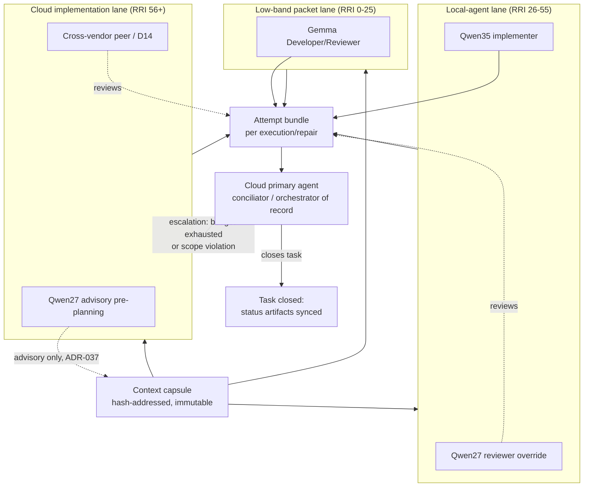

# Plan: Local-first / cloud-local handoff contract

## Objective

Document, as a single canonical reference, how work already moves between the
cloud primary agent and the local model roles across the three RRI handoff
lanes currently operative in this repository (Low 0–25, Moderate/Med-high
26–55, Complex+ 56+). This plan does not create a new role, a new band, or a
new authority — it consolidates the contract that `AGENT_WORKFLOW_GUIDE.md`,
`RRI_POLICY.md`, ADR-036, and ADR-037 already define, and adds the missing
piece: a named, versioned **context capsule** and **attempt bundle** schema so
that a handoff between lanes carries a consistent, auditable payload instead
of each lane inventing its own ad hoc packet shape.

## Why this plan exists

- The escalation packet (ADR-036 §7), the delegation packet
  (`RRI_POLICY.md` § Low RRI local delegation), and the ADR-037 project packet
  (`docs/tasks/adr037-local-architect-direct-project.md` T3) are three
  independently-designed payloads that carry overlapping information (task
  spec, RRI table, allowed paths, evidence, prior attempts) with no shared
  schema or shared name. This makes it hard to answer "what exactly moves
  from lane to lane" without re-reading three different documents.
- The conciliation step — the cloud primary agent reconciling a local
  implementer's diff, evidence, and review result before closure — is
  described piecemeal across `AGENT_WORKFLOW_GUIDE.md` (Per-task discipline),
  `RRI_POLICY.md` (Moderate/Med-high local-first handling), and ADR-036 §7.
  There is no single conciliator checklist an orchestrator can run through.
- This plan and its task ledger are themselves docs-only work
  (`RRI 20 → Low`, per the RRI computation below), so they do not change any
  gate, band boundary, or role authority. They describe the existing
  contract and propose the concrete schema/checklist artifacts named in the
  tasks below.

## Non-goals

- Does not introduce new actor names. "Low-band" and "local-agent lane"
  (and similar) are **handoff lanes**, not actors — the actors remain the
  ones enumerated in the Role inventory below.
- Does not change any RRI band boundary, reviewer routing, repair budget, or
  approval gate defined in `RRI_POLICY.md`, ADR-036, or ADR-037.
- Does not replace the escalation packet, delegation packet, or ADR-037
  project packet — the context capsule and attempt bundle schema (T1) are a
  **shared structural envelope** those existing packets can conform to, not
  a fourth competing packet type.

## RRI for this documentation package

```
python3 scripts/rri.py --touches docs/plan/local-first-cloud-local-handoff.md \
  --touches docs/tasks/local-first-cloud-local-handoff.md \
  --C 0 --D 0 --K 0 --P 0 --T 0 --A 1 --X 3 --penalty arch_decision
```

Result: **RRI 20 → Low (0–25) → Effort S**. Docs-only; no full human-approval
packet required per `RRI_POLICY.md` § Bands. `arch_decision` (+12) applied
because the plan touches the description of an existing architecture
decision's operative handoff mechanics (ADR-036/ADR-037), even though it
changes no code and no band boundary.

- `Task-analysis review: n/a` — plan/task-ledger-only work, exempt per
  `AGENT_WORKFLOW_GUIDE.md` § Per-task discipline.
- `Code-solution review: n/a` — no code changes in this plan or its ledger.

## Role inventory (preserved, not renamed)

| Role | Authority | Governing source |
|---|---|---|
| **Cloud primary agent** | Orchestrator of record; conciliator; user-facing owner; approval/review/escalation coordinator; the only role that closes a task | `AGENT_WORKFLOW_GUIDE.md`, ADR-036 §2 |
| **Gemma** (`gemma4:26b-a4b-it-qat`) | Low-band simple-patch developer (Gemma Developer) and reviewer/reviewer-fallback across bands where policy allows (Gemma Reviewer; Moderate/Med-high fallback) | `RRI_POLICY.md` § Low RRI local delegation, § Gemma Developer vs. Gemma Reviewer |
| **Qwen3.6-35B-A3B ("Qwen35")** | Local implementer for RRI 26–55 (Moderate + Med-high) inside a disposable worktree | ADR-036, `RRI_POLICY.md` § Moderate/Med-high local-first handling |
| **Qwen3.6-27B-q4_K_M ("Qwen27")** | Local Architect / Complex Analyst (advisory, ADR-037); phase-2 (and Med-high phase-1) reviewer override for RRI 26–55 | ADR-037, `RRI_POLICY.md` § Local pipeline phase-2 reviewer override |
| **D14** | Context-isolated adjudicator; final fallback reviewer in every band's chain | `AGENT_WORKFLOW_GUIDE.md` § Band-routed peer review, § Gemma Reviewer |

No role above is new. This plan does not add a "low" or "rest" actor — those
words describe **lanes** (routing paths through the existing roles), never a
person or model.

## Handoff lanes

| Lane | RRI range | Implementer path | Reviewer path (phase-1 / phase-2) | Cloud primary's role |
|---|---|---|---|---|
| **Low-band packet lane** | 0–25 | Direct primary-agent execution, or Gemma Developer for eligible simple code patches only | Gemma / Gemma Reviewer, D14 fallback | Applies and verifies the Gemma-returned diff; owns closure |
| **Local-agent lane** | 26–55 | Qwen35 in a disposable worktree via `run_local_task.py` | Moderate: Gemma (phase-1) / Qwen27 (phase-2); Med-high: Qwen27 both phases; D14 final fallback throughout | Presents for approval, reconciles the diff/evidence/review, owns repair-budget and escalation decisions, closes |
| **Cloud implementation lane** | 56+ | Cloud primary agent by default; optional Qwen27 advisory pre-planning per ADR-037 | Cross-vendor peer (`codex`/`claude`), D14 fallback | Plans, decomposes, implements or supervises implementation, closes |

These three rows are the same bands already defined in `RRI_POLICY.md` §
Bands; this table exists so a reader can see the lane shape in one place
instead of cross-referencing three documents.

## Context capsule and attempt bundle

Two structural concepts recur at every handoff boundary and are named here so
future packets (delegation packet, escalation packet, ADR-037 project packet,
or any future lane) can be described as "a context capsule plus N attempt
bundles" instead of redefining their shape from scratch.

### Context capsule

The **immutable, hash-addressed** description of what a lane is being asked
to do, frozen before any implementation attempt starts. It mirrors the
already-required content of the ADR-036 escalation packet and the ADR-037
project packet (T3), generalized:

- work item id, objective, non-goals, explicit questions;
- current behavior vs. required behavior;
- constraints and already-accepted decisions (ADRs, plan/task excerpts);
- allowed paths / scope boundary;
- acceptance criteria (`HP-#`/`EC-#` cases, verification commands);
- repository revision or snapshot identifier;
- input-manifest hash (SHA-256 over the frozen content).

A capsule is produced once by the cloud primary agent (or, for ADR-037
analysis, by the Medium analyst under primary supervision) and never mutated
in place — a materially changed scope is a new capsule, not an edit.

### Attempt bundle

The **per-attempt, appendable** record of one execution against a capsule:
implementer/reviewer identity, model tag/digest, start/end timestamps, tool
calls or transcript reference, diff (or advisory artifact) produced,
acceptance-test results, review verdict, and outcome (`success`,
`repair-needed`, `escalated`, `blocked`). Each repair attempt within a lane's
budget (2 for Moderate, 1 for Med-high, per `RRI_POLICY.md`) is its own
attempt bundle referencing the same capsule hash.

A lane handoff (e.g., Qwen35 exhausts its repair budget and escalates to the
cloud lane) ships the capsule plus the full ordered list of attempt bundles —
this is exactly the existing ADR-036 §7 escalation-packet content, restated
in capsule/bundle terms so it generalizes to the Low-band and Complex+ lanes
too.

## Cloud conciliator checklist (informal statement; formalized by T4)

Before the cloud primary agent closes any task whose implementation ran
through the local-agent lane, it reconciles:

1. the attempt bundle's diff against the capsule's allowed paths (scope);
2. the attempt bundle's acceptance-test results against the capsule's
   `HP-#`/`EC-#` cases (acceptance);
3. the phase-2 reviewer's verdict and disposition of every finding (review);
4. the repair-attempt count against the lane's budget, and whether escalation
   was required (budget/escalation);
5. the Reflection log required for RRI 26+ (reflection);
6. that every status artifact the task names as affected is synchronized
   before reporting completion (status sync).

T4 turns this into a named, checkable gate artifact; it is stated here only
so the plan is self-contained.

## Diagram



## Task dependency analysis

```text
T0 (this document contract) ──► T1 (capsule/bundle schema)
                                   │
                     ┌─────────────┼──────────────────┐
                     ▼             ▼                  ▼
                    T2            T3                 T5
              (local-agent   (low-band packet   (Local Architect
               bundle         metadata parity)   preplanning
               emission)                          capsule path)
                     │             │                  │
                     └──────┬──────┴──────────────────┘
                            ▼
                           T4 (cloud conciliator checklist/gate)
                            │
                            ▼
                           T6 (pilot and metrics)
                            │
                            ▼
                           T7 (policy sync / go-no-go)
```

- **T0** is this plan + ledger itself (docs-only, RRI 20).
- **T1** defines the capsule/bundle JSON schema referenced by every other
  task; nothing downstream can start until the schema is fixed.
- **T2, T3, T5** can proceed in parallel once T1 lands — they touch disjoint
  files (`run_local_task.py` emission vs. `delegate-low-rri.py` metadata vs.
  the ADR-037 wrapper's packet path) and share only the schema, not code.
- **T4** depends on all three producer tasks (T2/T3/T5) because the
  conciliator checklist must be able to read every lane's bundle shape.
- **T6** (pilot) depends on T4 being usable end-to-end.
- **T7** is the only task with an approval/go-no-go decision and depends on
  T6's metrics.

**Closure (2026-07-23):** T0–T5 landed (see the task ledger). T6 (pilot) and
T7 (policy sync / go-no-go) were marked `Won't-do` by explicit owner
decision: rather than run a separate formal pilot batch, the owner evaluates
the capsule/bundle/checklist tooling on the marcha as real Moderate/Med-high
tasks pass through the local-agent lane. Net effect: T1–T5's schema,
adapters, and conciliator checklist stay in the repo as opt-in tooling, not
promoted into `AGENT_WORKFLOW_GUIDE.md`/`RRI_POLICY.md` as a referenced
convention (T7's NO-GO path). This plan is closed; see
`docs/tasks/local-first-cloud-local-handoff.md` § Slice closure.

## Related documents

- `README_AGENT_ORDER.md`
- `docs/playbooks/AGENT_WORKFLOW_GUIDE.md`
- `docs/policies/RRI_POLICY.md`
- `docs/policies/HITL_AUTONOMY_POLICY.md`
- `docs/adr/ADR-036-local-first-agentic-implementation-band.md`
- `docs/adr/ADR-037-qwen36-27b-local-architect-complex-analyst.md`
- `docs/plan/local-agent-simple-editing.md`
- `docs/tasks/adr036-local-first-pilot.md`
- `docs/tasks/adr037-local-architect-direct-project.md`
- `docs/plan/roadmap.md`
