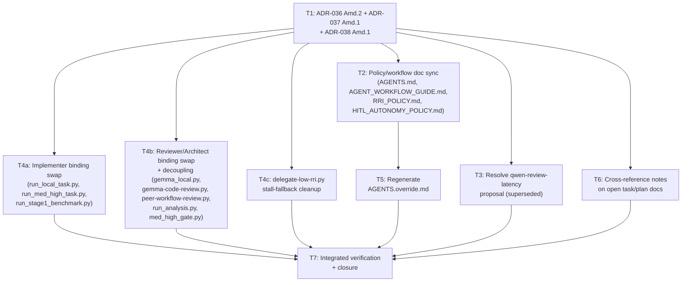

# Plan: Local Model Stack Restructure (2026-08)

## Objective

Restructure the local-model role bindings introduced by ADR-036/037/038:

1. **Local implementer** (RRI 26–40 local-first, and the RRI 41–55 ADR-038
   single bounded session) moves from `qwen3.6:35b-a3b` to
   `qwen3.6:27b-q4_K_M`.
2. **Local reviewer, Low band (0–25)** moves from `gemma4:26b-a4b-it-qat` to
   `muse-glimmer:30b-q4_K_M` (phase-1 advisory review and Gemma Reviewer's
   phase-2 N-pass role).
3. **Local reviewer, Moderate + Med-high (26–55)** reverts from
   `qwen3.6:27b-q4_K_M` (owner directive 2026-07-21) back to
   `gemma4:26b-a4b-it-qat` — a direct consequence of (1): qwen27 cannot
   review the band it now implements.
4. **Local Architect / Complex Analyst (ADR-037)** — the advisory
   architecture-synthesis role, including the ADR-038 Med-high
   `GO_LOCAL`/`CLOUD_REQUIRED` gate — moves from `qwen3.6:27b-q4_K_M` to
   `muse-glimmer:30b-q4_K_M`, for the same self-review-conflict reason.
5. `qwen3.6:35b-a3b` is removed from the local stack entirely.

Owner directive: 2026-08-11.

## Decisions log (owner-confirmed, this session)

| # | Question | Decision |
|---|---|---|
| D1 | Muse Glimmer scope | **Reversed from the initially recommended default.** Muse Glimmer replaces Gemma as reviewer only for the **Low band (0–25)**. The 26–55 band reviewer reverts to Gemma (not Muse Glimmer), because qwen27 vacates that seat to become the implementer. |
| D2 | ADR-037 Local Architect / Complex Analyst role | Moves to Muse Glimmer. |
| D3 | Reviewer fallback chain, Low band | `muse-glimmer → gemma → D14` (Gemma kept as an intermediate safety net even though it is no longer Low-band primary). |
| D4 | Qwen27-as-implementer vs. the documented ADR-036/038 rejection (dense, bandwidth-bound, ~7–10 tok/s on base M5 — "not practical as agentic implementers"; ADR-038 explicitly lists "Let Qwen27 implement: rejected") | **Proceed anyway**, recorded as a deliberate re-entry override in ADR-036 Amendment 2, not a silent contradiction. |

Not asked, carried forward as an explicit assumption — flagged for confirmation
at approval time, not decided unilaterally:

- **D5 (assumed):** the 26–55 fallback chain is `gemma → muse-glimmer → D14`
  (mirrors D3's pattern: primary reviewer falls back to the other reviewer
  model before D14). This was not literally asked; state it now for the
  human to correct before T1 lands if wrong.
- **D6 (assumed):** **Gemma Developer** (`scripts/delegate-low-rri.py`,
  patch-delegation for eligible simple RRI 0–25 code patches) is a distinct
  role from Gemma Reviewer and is **not** touched by this restructure — it
  stays bound to Gemma. Only the *reviewer* role moves to Muse Glimmer for
  Low band.

## Evidence gathered before drafting ADR amendments

- `muse-glimmer:30b-q4_K_M` is already pulled locally (`ollama list`,
  18 GB, confirmed present).
- Smoke-tested against the same production-parameter contract the
  `AGENT_WORKFLOW_GUIDE.md` §0 local-stack precheck uses
  (`think:false`, `num_predict:4096`, `num_ctx:131072`):
  - Bare PASS/findings JSON contract: `done_reason: stop`, valid JSON,
    exact schema match.
  - A review prompt with an injected bug (function named `add` that
    subtracts): `done_reason: stop`, valid JSON, correctly flagged
    `verdict: FINDINGS` with an accurate `major` finding describing the
    name/behavior mismatch.
  - This is a smoke test, not the full Stage-1-style benchmark ADR-036 ran
    for the original stack; it derisks the ADR amendment enough to proceed,
    but does not substitute for production observation once T1–T4 land (see
    T1's "Open questions" addition).

## Full reference inventory (from repo-wide reconnaissance)

A dedicated exploration pass mapped every file that names or configures the
current bindings. Full detail is folded into the task list below; summary:

- **ADRs owning the decision:** ADR-036 (local model stack, implementer +
  reviewer roles), ADR-037 (Local Architect / Complex Analyst = qwen27),
  ADR-038 (Med-high routing referencing both).
- **Policy/workflow docs propagating it:** `AGENTS.md`, `AGENT_WORKFLOW_GUIDE.md`,
  `RRI_POLICY.md`, `HITL_AUTONOMY_POLICY.md`. `AGENTS.override.md` is
  **generated** (`scripts/generate-agents-override.py`) from exactly those
  three source files (minus RRI_POLICY.md, which they link to) — never
  hand-edit it; regenerate after the sources change.
- **Scripts hardcoding bindings:** `scripts/gemma_local.py`
  (`DEFAULT_MODEL`/`DEFAULT_FALLBACK_MODEL`), `scripts/delegate-low-rri.py`
  (`DEFAULT_STALL_FALLBACK_MODEL`), `scripts/gemma-code-review.py` (review
  model resolution chain), `scripts/peer-workflow-review.py`
  (`DEFAULT_QWEN_REVIEW_MODEL`), `scripts/local-agent/run_local_task.py`
  (`MED_HIGH_REQUIRED_MODEL`, `DUBBRIDGE_LOCAL_AGENT_MODEL` default),
  `scripts/local-agent/run_med_high_task.py` (`MED_HIGH_RUNNER_MODEL`),
  `scripts/local-agent/med_high_gate.py` (`REQUIRED_MODEL_TAG`),
  `scripts/local-architect/run_analysis.py` (`--model-tag` default),
  `scripts/local-bench/run_stage1_benchmark.py` (benchmark default, low
  priority) — each with a paired `_test.py` asserting the constant.
- **Config/Makefile:** no hardcoded model tags outside scripts/docs; Makefile
  target names (`qa-gemma-review`, `GEMMA_EVIDENCE_DIR`, etc.) bake in
  "Gemma" as a role name even after Muse Glimmer becomes Low-band reviewer —
  **out of scope for this restructure** (cosmetic only, no behavior change;
  renaming is a separate, lower-priority cleanup).
- **Open/live docs citing the old bindings as forward guidance** (not closed
  historical record): `docs/tasks/adr036-local-first-pilot.md`,
  `docs/tasks/agent-session-preflight-gate.md`,
  `docs/tasks/antares-security-specialist-advisor.md`,
  `docs/tasks/agents-override-sync.md`,
  `docs/tasks/adr037-local-architect-direct-project.md` (task + plan).
- **Open proposal directly about the role being reverted:**
  `docs/proposals/qwen-review-latency-mitigation.md` (Proposed,
  2026-08-09) — argues for qwen27-as-26-55-reviewer's latency profile; needs
  explicit resolution (superseded/closed), not silent staleness.
- **Closed/Done task and plan docs** (e.g. `adr036-local-first-pilot.md`'s
  historical run logs, `med-high-local-refinement.md`) are **not** rewritten —
  they are point-in-time evidence of what model ran a given past task.

## Governing decision and approval

- ADR-036, ADR-037, and ADR-038 each require an amendment (not a full
  rewrite — see Amendment 1 in ADR-036 for the established pattern of
  retiring/reassigning a binding while keeping the ADR's core decision
  structure).
- **Aggregate RRI: 99 Very high** (`C3 F4 D3 T3 A3 K4 P2 X4`,
  `arch_decision` + `many_files` + `no_verification` penalties, computed
  across the full touched-file set — ADRs, policy docs, and scripts
  together). This mirrors ADR-038's own precedent (aggregate RRI 93) for a
  comparably cross-cutting routing change.
- Per RRI_POLICY.md, **RRI 86+ must not be implemented directly**: produce
  the ADR + risk analysis, then decompose into subtasks each scoring ≤ 55.
  The task ledger below is that decomposition; every subtask's RRI is
  independently computed with `scripts/rri.py`.
- **HITL approval required before any file is edited** (RRI > 25 at both the
  aggregate and every individual subtask level except T2/T3/T4c/T5/T6, which
  land in the Low band but are still presented here for transparency since
  they're part of one coordinated initiative).

## Scope

### In scope

- ADR-036, ADR-037, ADR-038 amendments recording the new bindings.
- `AGENTS.md`, `AGENT_WORKFLOW_GUIDE.md`, `RRI_POLICY.md`,
  `HITL_AUTONOMY_POLICY.md` propagation.
- `docs/proposals/qwen-review-latency-mitigation.md` resolution.
- The eight scripts (plus tests) listed above.
- `AGENTS.override.md` regeneration.
- Cross-reference notes on the open task/plan docs listed above (a short
  "superseded binding" pointer, not a rewrite of their historical content).

### Out of scope

- Renaming Makefile targets/variables (`qa-gemma-review`,
  `GEMMA_EVIDENCE_DIR`, etc.) — cosmetic, no behavioral drift, deferred.
- Rewriting closed/Done task and plan docs — they remain historical record.
- A full ADR-036-style Stage-1 benchmark of Muse Glimmer or Qwen27-as-
  implementer — the smoke test above is judged sufficient to proceed; a
  fuller production-evidence review is flagged as an open question inside
  T1, not blocking this restructure.
- `crates/` / Rust workspace — this initiative touches only the agent
  workflow surface (docs + Python scripts), never application runtime code.

## Design decisions

1. **Amend, don't replace, the three ADRs.** ADR-036 §1 already owns "the
   local model stack, role-based" table; Amendment 2 updates it in place,
   following the precedent Amendment 1 set. ADR-037's core decision (qwen27
   bound to the Local Architect / Complex Analyst role) is reversed by its
   own Amendment 1 — the role concept survives, only its binding changes,
   which is the same shape of change Amendment 1 made in ADR-036 (a role
   survives, a binding is retired/reassigned). ADR-037 stays **Accepted**,
   not **Superseded** — its decision to create a bounded advisory role
   independent of the reviewer/implementer roles is unaffected; only *which
   model* fills it changes.
2. **`gemma_local.py`'s `DEFAULT_MODEL` constant must not become
   Muse Glimmer.** It is currently shared by both Gemma Developer
   (patch delegation, stays Gemma per D6) and the Low-band reviewer chain
   (`DUBBRIDGE_REVIEW_MODEL → DUBBRIDGE_LOW_RRI_MODEL → gemma_local.DEFAULT_MODEL`).
   Repointing `DEFAULT_MODEL` itself would silently move Gemma Developer to
   Muse Glimmer too, which no decision authorizes. T4b introduces a
   decoupled reviewer-specific default (e.g. `DEFAULT_REVIEW_MODEL =
   "muse-glimmer:30b-q4_K_M"`) instead of reusing the shared constant.
3. **Reviewer-pairing rule (ADR-036 §5) stays satisfied.** Implementer
   (qwen27) and Low-band reviewer (Muse Glimmer) are different families;
   implementer (qwen27) and 26–55 reviewer (Gemma, reverted) are different
   families. No band has the implementer reviewing itself.
4. **No renumbering, no deletion.** Per the ADR change-propagation contract,
   an `Accepted` ADR is never deleted; every changed decision is an
   amendment with a dated section, exactly like ADR-036 Amendment 1.

## Module / file dependency order

## Follow-up and closure state

- **F1 — Muse Glimmer production observation (open, non-blocking):** on the
  first eligible real Med-high workload, capture the
  `med-high-refinement-v1` artifact and its route receipt for
  `muse-glimmer:30b-q4_K_M`; measure schema adherence and record the result
  in this plan and in the T7 execution record. The earlier smoke test is not
  a substitute for this observation.
- **T7 roll-up:** verification commands passed on 2026-08-12. The owner
  explicitly waived the historical T4a/T4b phase-1 ordering gap on the same
  date, so T7 is closed; the waiver is recorded in the task ledger's T7
  execution record.

## Related

- `docs/adr/ADR-036-local-first-agentic-implementation-band.md`
- `docs/adr/ADR-037-qwen36-27b-local-architect-complex-analyst.md`
- `docs/adr/ADR-038-med-high-architect-refined-single-attempt.md`
- `docs/tasks/local-model-stack-restructure-2026-08.md`
- `docs/plan/med-high-local-refinement.md` (decomposition precedent, aggregate
  RRI 93)
- `docs/policies/RRI_POLICY.md`, `docs/playbooks/AGENT_WORKFLOW_GUIDE.md`,
  `docs/policies/HITL_AUTONOMY_POLICY.md`
