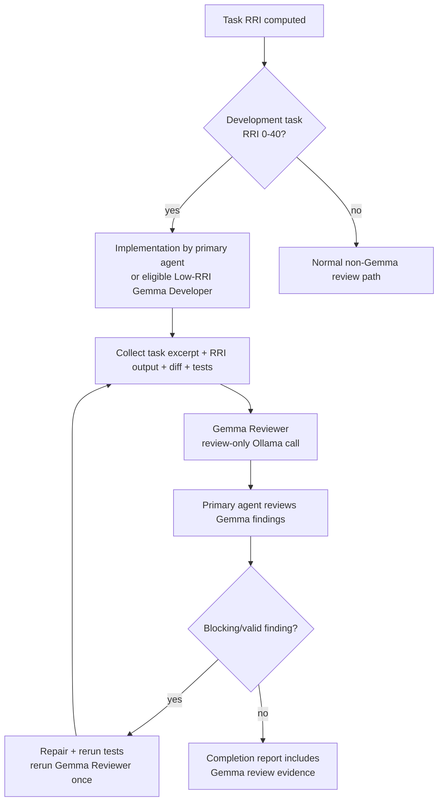

# Plan: Low/Moderate Gemma Code Review Role

## Objective

Add a dedicated local **Gemma Reviewer** role to the agent workflow so every code
review for Low and Moderate RRI development tasks receives a local model review
before the primary agent reports completion.

The role is review-only. It does not implement patches, approve its own work,
mark tasks complete, certify coverage, or replace the primary agent's final
responsibility.

## Scope

### Included

- define the Gemma Reviewer role, trigger, authority boundary, and failure modes;
- add a review-only Ollama wrapper or mode that consumes a task packet plus a
  unified diff and emits structured findings;
- add shared local Gemma/Ollama transport helpers so Gemma Developer and Gemma
  Reviewer use the same timeout, model, generation-option, and result-writing
  code;
- add parser and transport tests for the review-only contract and shared helper
  layer;
- update the workflow, RRI, HITL, and Low-RRI handoff docs so Low/Moderate code
  review includes Gemma Reviewer evidence;
- add local pipeline entry points for agents and maintainers to run the review
  gate consistently;
- document how Gemma Reviewer findings are recorded in task completion evidence.

### Excluded

- using Gemma Reviewer as the final approver;
- allowing Gemma Reviewer to write files, apply diffs, or certify task completion;
- making GitHub-hosted CI depend on a local Ollama model before a runner with the
  required model is explicitly available;
- changing RRI scoring bands or approval thresholds.

## Terminology

- **Low/Moderate code review** means a review for a development task whose
  computed RRI is in band Low (0-25) or Moderate (26-40).
- **Gemma Developer** is the existing Low-RRI implementation delegation path for
  eligible simple code patches.
- **Gemma Reviewer** is the new review-only role. It reads the task context and
  diff, then reports findings.
- **Primary agent** is Codex or Claude Code. It remains the orchestrator and
  owner of final review judgment.

## Affected Files

Expected implementation files:

- `scripts/gemma-code-review.py`
- `scripts/gemma_code_review_test.py`
- `scripts/gemma_local.py`
- `scripts/gemma_local_test.py`
- `scripts/delegate-low-rri.py` (refactor only, preserving CLI behavior)
- `scripts/delegate_low_rri_test.py` (regression coverage for the refactor)
- `Makefile`
- `.githooks/pre-push` or `scripts/hooks/pre-push` only if a local pre-push gate is
  adopted after the CLI exists

Expected governing docs:

- `docs/playbooks/AGENT_WORKFLOW_GUIDE.md`
- `docs/policies/RRI_POLICY.md`
- `docs/policies/HITL_AUTONOMY_POLICY.md`
- `docs/playbooks/LOW_RRI_LOCAL_MODEL_HANDOFF.md`
- `docs/gemma-local-improve.md`
- `docs/tasks/low-medium-gemma-code-review-role.md`

## Design Decisions

### D1 - Review-only role, not approval authority

Gemma Reviewer may produce findings, but the primary agent decides whether a
finding is valid, whether a repair is needed, and whether the task can be
reported complete. This preserves the existing rule that Gemma must not evaluate
or approve its own delegated work.

Consequence for tooling: a finding — including a `BLOCKING` one — must **never**
fail the review gate by itself. Auto-failing on a finding would make Gemma a
de-facto approver and violate this boundary. See D6 for the exit-code contract.

### D2 - Trigger on Low and Moderate development task reviews

The review role applies to development tasks in RRI bands 0-25 and 26-40. It does
not apply to docs-only, config-only, migration-only, ADR, plan, task-ledger, or
policy-only work unless a future task explicitly expands the scope.

### D3 - Use a separate review contract

Patch delegation uses tagged file blocks because it returns proposed file
contents. Code review should use a different tagged contract that contains only
findings. The model must never return a patch or replacement file body in review
mode.

Proposed response shape:

```text
STATUS: PASS
SUMMARY: short summary
=== FINDING START ===
PATH: repo/relative/path
LINE: integer line number
SEVERITY: blocking|major|minor|nit
DETAIL: concise issue description
SUGGESTION: concise remediation
=== FINDING END ===
```

Use exactly one status value: `PASS`, `FINDINGS`, or `BLOCKED`. `PASS` has no
finding blocks, `FINDINGS` has one or more finding blocks, and `BLOCKED` reports
that the packet is not reviewable.

### D4 - Fresh review packet for Gemma-authored Low-RRI patches

If a Low-RRI patch was implemented through Gemma Developer, Gemma Reviewer may
still run in a fresh review-only invocation because the new role is mandatory for
Low/Moderate code review. The result is advisory evidence only. The primary
agent must perform an independent review and must explicitly state that final
acceptance was not delegated to Gemma.

### D5 - Local first, CI later

The first pipeline integration should be local and agent-operated:

- `make qa-gemma-review` or equivalent wrapper target;
- optional hook integration only when `OLLAMA_HOST` and the configured model are
  available;
- no GitHub-hosted required job until an Ollama-capable runner is configured.

This avoids making remote CI fail because the local model is unavailable.

### D6 - Exit-code and authority contract

The wrapper and the `make` target separate **operational failure** from **review
outcome**, so review findings never act as an approval gate (D1):

- Exit `0`: the review ran and a result artifact was written, regardless of
  whether the status is `PASS` or `FINDINGS`. The primary agent reads the
  artifact and decides disposition.
- Exit non-zero: an **operational** failure only — Ollama/model unavailable,
  invalid/truncated tagged response, or `STATUS: BLOCKED` from the model.

The target must therefore "fail clearly" only on operational failure; it must not
fail because the model reported findings. This is what keeps the gate advisory.

### D7 - Relationship to the Reflection cycle

The workflow guide already mandates a primary-agent **Reflection cycle** as the
self-review step (`docs/playbooks/AGENT_WORKFLOW_GUIDE.md`). Gemma Reviewer is an
**external, advisory input to that cycle**, not a replacement for it. Ordering:

1. Implementation completes (primary agent or eligible Gemma Developer).
2. Gemma Reviewer runs (advisory findings).
3. The primary agent runs its Reflection cycle, treating Gemma findings as one
   input and recording its disposition in the existing `### Reflection log`.

Gemma Reviewer never adds a separate sign-off step; it feeds the existing one.

### D8 - Best-effort when Ollama is unavailable

Gemma Reviewer is **required-when-available**, not a hard completion gate. Absence
of a local Ollama/model must never block closing a Low/Moderate task: the agent
records `BLOCKED` review evidence, performs the normal primary-agent review, and
reports the skipped Gemma evidence. "Escalate" in this case means surfacing the
skipped evidence in the report — not opening a human approval gate that the band
does not otherwise require.

## Pipeline Shape



## Review Packet Inputs

**Packet ownership.** The primary agent assembles the review packet, the same way
it assembles a delegation packet today: the wrapper consumes a single pre-built
packet file (path or stdin) and does not gather the diff or task excerpt itself.
The `make` target (T3) is a thin convenience that builds the packet from the
current branch diff before invoking the wrapper; the wrapper stays input-only so
it remains testable in dry-run without git or Ollama.

The review packet should include only the context needed to review the diff:

- task ID, task title, task file path, and relevant task excerpt;
- RRI output and band;
- approved acceptance criteria;
- `HP-#` and `EC-#` behavioral examples for development tasks;
- unified diff under review;
- verification commands already run and their result;
- explicit review constraints:
  - find correctness, fail-closed, side-effect, and missing-test issues;
  - do not rewrite code;
  - do not approve the task;
  - do not request changes outside the task scope unless they are direct regressions.

## Review Evidence

Task completion records for Low/Moderate development tasks should include a
short `Gemma Reviewer evidence` block:

```md
### Gemma Reviewer evidence

- Model: `<resolved DUBBRIDGE_REVIEW_MODEL, else DUBBRIDGE_LOW_RRI_MODEL>`
- Command: `<exact command>`
- Status: `PASS|FINDINGS|BLOCKED`
- Primary-agent disposition: `<accepted findings / rejected false positives / repaired>`
- Result artifact: `<path to local result JSON or markdown, if persisted>`
```

## Failure Modes

- Ollama unavailable or model missing: record `BLOCKED`, run primary-agent review,
  and report the skipped Gemma evidence. This never blocks task completion (D8);
  it does not open a human approval gate the band would not otherwise require.
- Invalid tagged response: retry once with a smaller packet. A second invalid
  response escalates to primary-agent review plus explicit report of the skipped
  Gemma evidence.
- Findings outside task scope: the wrapper computes the changed-path set from the
  reviewed diff and deterministically labels any finding whose `PATH` is not in
  that set as `out-of-scope` (it does not drop it). The primary agent then keeps
  an out-of-scope finding only if it identifies a direct regression caused by the
  current diff. Semantic in-scope judgment stays with the primary agent; the
  wrapper only does the mechanical path-set check.
- Gemma Developer produced the patch: Gemma Reviewer evidence is advisory only;
  primary-agent independent review is mandatory.

## Verification Strategy

- Unit tests for response parsing and validation.
- Unit tests for model-unavailable and invalid-response paths.
- Dry-run CLI test that builds the packet and skips Ollama transport.
- Workflow docs check with `make qa-docs`.
- RRI script tests only if model-tier wording or band behavior changes.

## RRI For This Planning Artifact

Computed with:

```bash
python3 scripts/rri.py \
  --touches docs/plan/low-medium-gemma-code-review-role.md \
  --touches docs/tasks/low-medium-gemma-code-review-role.md \
  --C 0 --D 0 --K 0 --P 0 --T 1 --A 1 --X 2
```

Result: RRI 10 -> Low (0-25) -> Effort S. This planning work is not delegated to
Gemma because repository policy excludes plan and task-ledger edits from local
Gemma delegation.
