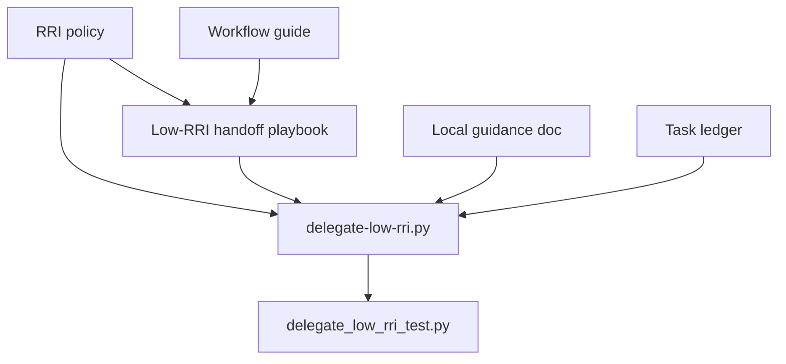

# Plan: Low-RRI Local Delegation Redesign

## Objective

Redesign the Low-RRI local-model delegation contract so the local model returns a
simple tagged text format with complete file contents instead of JSON. Preserve
the current safety architecture: the model never writes files or authors diffs;
the wrapper remains responsible for scope validation, deterministic diff
construction, patch application, and verification orchestration.

## Scope

### Included

- redesign the model response contract from JSON to tagged blocks;
- update `scripts/delegate-low-rri.py` to emit the new prompt contract and parse
  the tagged response format;
- harden parser and file-action validation for malformed, duplicate, and
  out-of-policy responses;
- update unit tests for the wrapper;
- align the governing docs so policy, workflow, playbook, and local guidance all
  describe the same Low-RRI interaction model;
- create and maintain the plan/task artifacts required by the repository
  workflow.

### Excluded

- changes to RRI scoring, autonomy gates, or approval policy semantics;
- new multi-step repair orchestration in code;
- changes to the wrapper CLI surface beyond the response protocol internals;
- cloud-model routing or vendor model selection changes.

## Affected files

- `scripts/delegate-low-rri.py`
- `scripts/delegate_low_rri_test.py`
- `docs/gemma-local-improve.md`
- `docs/policies/RRI_POLICY.md`
- `docs/playbooks/LOW_RRI_LOCAL_MODEL_HANDOFF.md`
- `docs/playbooks/AGENT_WORKFLOW_GUIDE.md`
- `docs/policies/HITL_AUTONOMY_POLICY.md`
- `docs/plan/low-rri-local-delegation-redesign.md`
- `docs/tasks/low-rri-local-delegation-redesign.md`

## Design decisions

### D1 — Use tagged text blocks instead of JSON

Small local models are more likely to corrupt JSON quoting, braces, or escaping
than to preserve a short line-oriented tagged format. The wrapper should parse a
strict text protocol with explicit file block boundaries and reject any extra
text.

### D2 — Keep complete file contents as the model output primitive

The current architecture is correct: the model should propose complete final file
contents, not partial patches or unified diffs. `git diff --no-index` and
`git apply` remain the deterministic mechanisms for framing and applying changes.

### D3 — Fail closed on malformed file actions

The wrapper should reject duplicate paths, missing required markers, extra text,
`modify` against a missing file, `create` against an existing file, and `delete`
with non-empty content. These failures are policy violations, not repairable
ambiguities.

### D4 — Keep one repository narrative

No repository document should simultaneously describe JSON output and tagged text
output as the active Low-RRI contract. The policy, workflow guide, playbook, and
local-audit guidance must point to one consistent protocol.

## Module dependency direction

