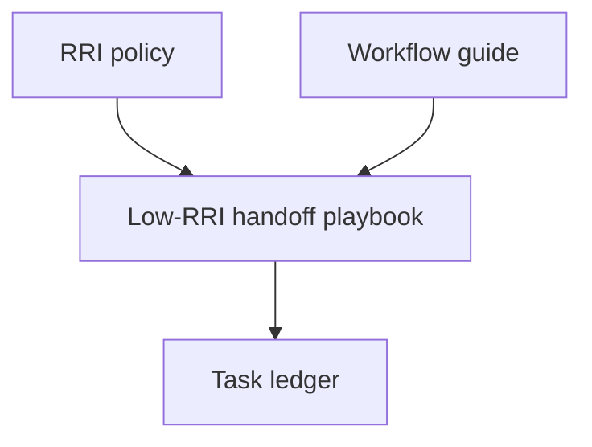

# Plan: Low-RRI Local Model Handoff

## Objective

Add a specific repository document that explains how Low-RRI work should be handed
off to local models: small scope, simple instructions, mandatory step-by-step
execution, and strict orchestrator review.

## Scope

### Included

- a new playbook for Low-RRI local-model handoff;
- a short link from the workflow guide;
- a short link from the RRI policy;
- a minimal plan/task pair so the change follows the repo workflow.

### Excluded

- changes to HITL policy semantics;
- changes to the RRI formula or gates;
- any runtime or tooling changes.

## Affected files

- `docs/playbooks/LOW_RRI_LOCAL_MODEL_HANDOFF.md`
- `docs/playbooks/AGENT_WORKFLOW_GUIDE.md`
- `docs/policies/RRI_POLICY.md`
- `docs/plan/low-rri-local-model-handoff.md`
- `docs/tasks/low-rri-local-model-handoff.md`

## Design decisions

### D1 — Put the operational protocol in its own playbook

The workflow guide and RRI policy already define the authority chain and the
delegation rules. The handoff protocol itself should live in a dedicated playbook
so it stays concrete and discoverable without expanding those documents into a long
procedural appendix.

### D2 — Favor narrow development or mechanical work

Local delegation is most reliable on pure development work and tightly scoped
mechanical edits. The playbook should say that explicitly and discourage broad
documentation rewrites or large ledger rewrites in one pass.

### D3 — Make step-by-step delegation mandatory

The document should codify the learned constraint: one objective, one narrow change,
one file or one tightly scoped unit at a time when possible.

## Module dependency direction

