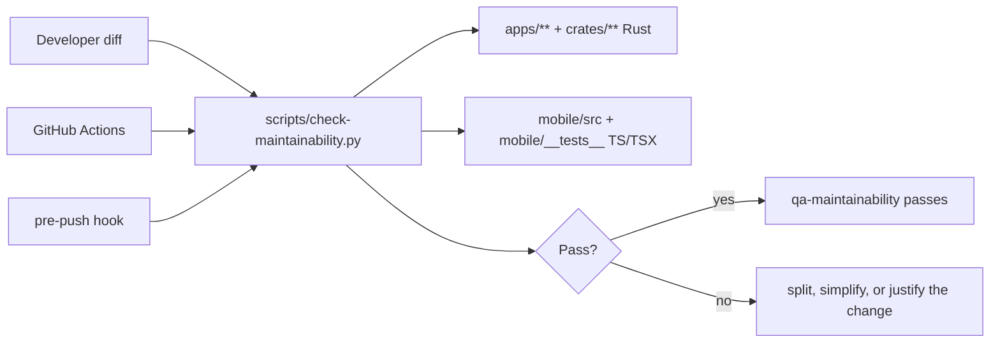

# Plan: Maintainability Quality Gate

## Objective

Add a deterministic quality gate that reduces generated-code bloat across the
Rust backend and React Native mobile app without introducing new third-party
tooling or blocking the existing codebase on historical large files.

## Context

The current backend QA path already enforces formatting, Clippy warnings, tests,
coverage, dependency policy, and documentation consistency. The mobile app has
typechecking and Jest tests, but no comparable maintainability gate. Both surfaces
can still accept large generated diffs that pass functional checks while adding
duplicated, bulky, speculative, or hard-to-review code.

This plan adds a diff-oriented maintainability check. The gate focuses on changed
code rather than requiring an immediate full-repo cleanup, so it prevents new
bloat while preserving the current baseline.

## Affected Files

- `scripts/check-maintainability.py`
- `scripts/check_maintainability_test.py`
- `Makefile`
- `.github/workflows/ci.yml`
- `scripts/hooks/pre-push`
- `docs/tasks/maintainability-quality-gate.md`

## Design Decisions

- Use a small Python script with only standard-library dependencies.
- Check backend Rust and mobile TypeScript/TSX paths in one repo-level gate.
- Evaluate changed files and added diff lines, not all historical code.
- Fail on common generated-code signals:
  - excessive added lines per file;
  - excessive added lines across the whole source/test diff;
  - too many changed source/test files in one diff;
  - large uninterrupted added code blocks;
  - repeated added lines;
  - declaration/import bursts in a single changed file;
  - generic generated-style identifier bursts;
  - long-line bursts that usually signal pasted bulk;
  - duplicated added normalized blocks;
  - generated-code markers in app source.
- Keep thresholds explicit and centralized in the script.
- Add unit tests for the gate itself so future threshold changes are deliberate.

## Module Dependencies

## Verification Strategy

- Unit-test the checker's diff parsing and failure conditions.
- Run the checker against a narrow explicit file set for deterministic local
  verification without consuming unrelated dirty worktree changes.
- Run syntax checks for the Python scripts.
- Preserve existing QA targets and add the new target to CI/pre-push without
  replacing existing Rust or mobile tests.

## Current Outcome

- `MQG-T1` is complete: `scripts/check-maintainability.py` now checks changed
  backend Rust and mobile TypeScript/TSX code for oversized added diffs,
  total diff budgets, file-count budgets, uninterrupted generated-like blocks,
  repeated added lines, declaration bursts, generic-name bursts, long-line
  bursts, duplicated added blocks, and generated-source markers.
- The gate is available through `make qa-maintainability`, runs in CI, and runs
  from the pre-push hook.
- Unit coverage for the gate lives in `scripts/check_maintainability_test.py`.
- `MQG-T2` is complete: base revision discovery now accepts only existing commit
  objects, so GitHub's all-zero new-branch `before` SHA falls back to a valid
  local base instead of reaching `git diff`.
